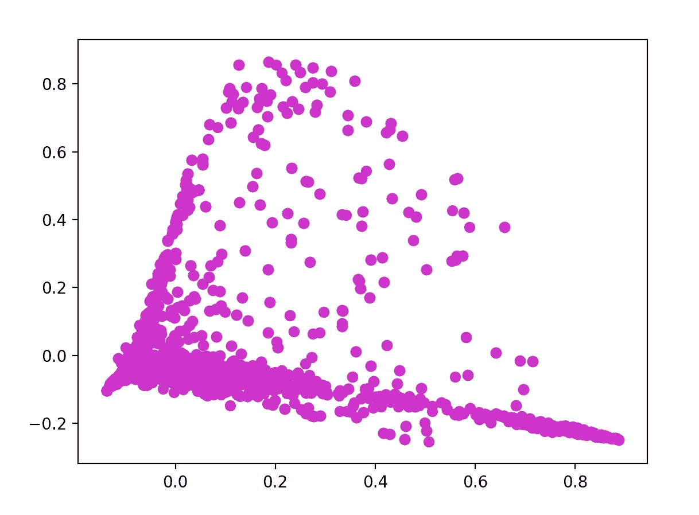
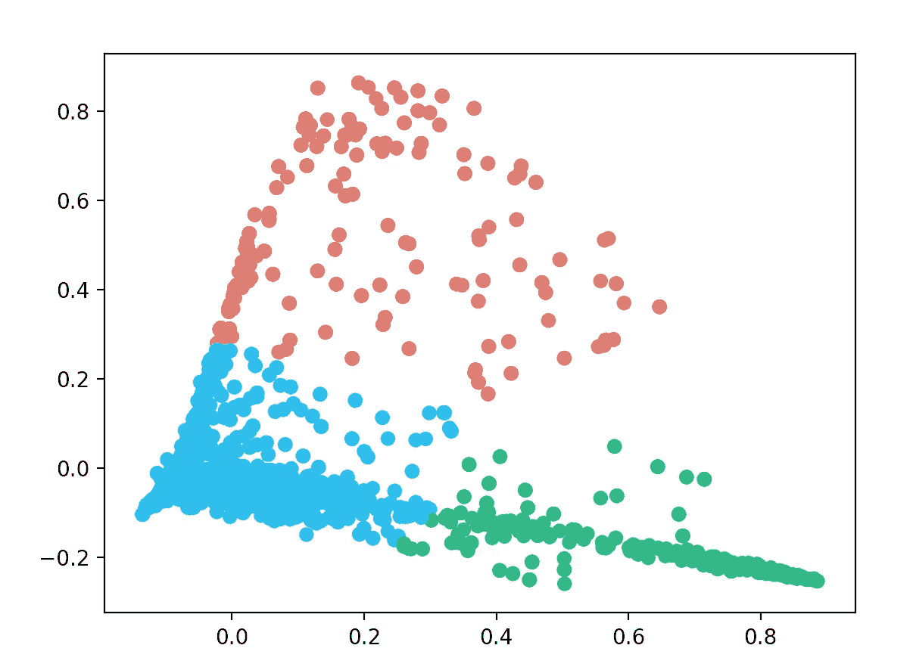
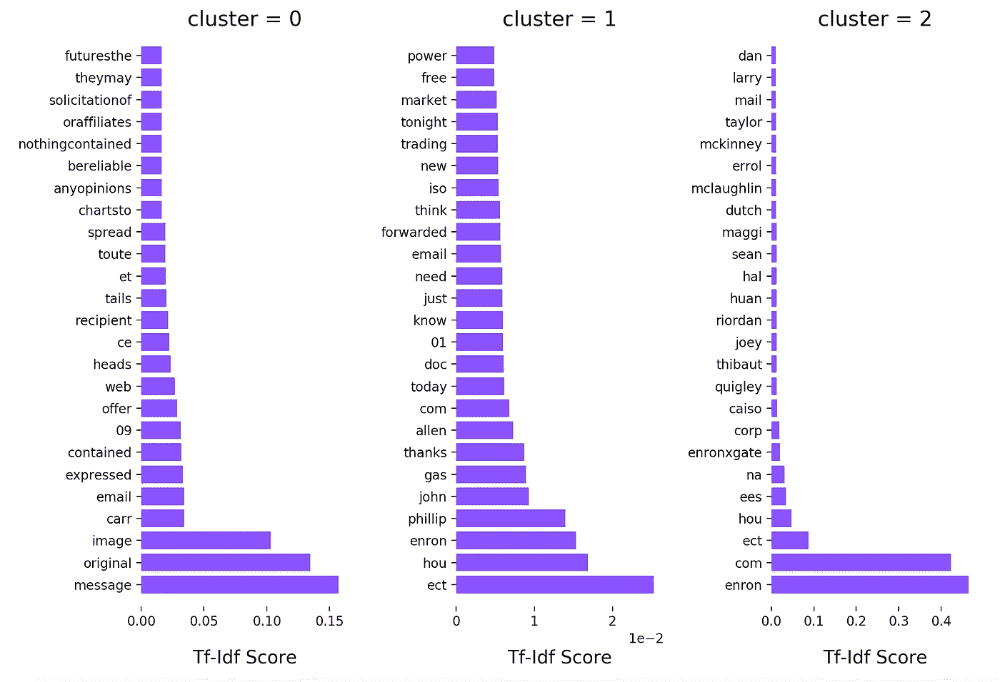

# 我如何使用机器学习对电子邮件进行分类，并将其转化为见解(第 1 部分)。

> 原文：<https://towardsdatascience.com/how-i-used-machine-learning-to-classify-emails-and-turn-them-into-insights-efed37c1e66?source=collection_archive---------0----------------------->

今天，我想知道如果我抓起一堆没有标签的电子邮件，把它们放在一个黑盒子里，然后让一台机器来处理它们，会发生什么。知道会发生什么吗？我没有。

我做的第一件事是寻找一个包含各种电子邮件的数据集。在查看了几个数据集之后，我想出了安然语料库。这个数据集有超过 500，000 封电子邮件是由安然公司的员工生成的，如果你问我的话，这足够了。

作为编程语言，我使用了 Python 及其强大的库:scikit-learn、pandas、numpy 和 matplotlib。

# 无监督机器学习

为了对未标记的邮件进行聚类，我使用了**无监督机器学习。**什么，怎么？是的，无监督的，因为我的训练数据只有输入，也称为特征，不包含结果。在有监督的机器学习中，我们处理输入及其已知的结果。在这种情况下，我想根据邮件正文对邮件进行分类，这绝对是一项无人监管的机器学习任务。

# 载入数据

我没有加载所有+500k 的电子邮件，而是将数据集分成几个文件，每个文件包含 10k 的电子邮件。相信我，你不会想在内存中加载完整的安然数据集并用它进行复杂的计算。

```
import pandas as pdemails = pd.read_csv('split_emails_1.csv')
print emails.shape # (10000, 3)
```

现在，我的数据集中有 10k 封电子邮件，分为 3 列(索引、message_id 和原始邮件)。在处理这些数据之前，我将原始消息解析成键值对。

这是一个原始电子邮件的例子。

> *消息-id:❤0965995.1075863688265.javamail.evans@thyme>
> 日期:2000 年 8 月 31 日星期四 04:17:00 -0700 (PDT)
> 发件人:*[*phillip.allen@enron.com*](mailto:phillip.allen@enron.com) *收件人:*[*greg.piper@enron.com*](mailto:greg.piper@enron.com) *主题:回复:你好
> mime-版本:1.0
> 内容-类型:文本/普通；charset = us-ascii
> Content-Transfer-Encoding:7 bit
> X-From:Phillip K Allen
> X-To:Greg Piper
> X-cc:
> X-bcc:
> X-Folder:\ Phillip _ Allen _ de c2000 \ Notes Folders \ ' sent mail
> X-Origin:Allen-P
> X-FileName:pallen . NSF*
> 
> *格雷格，*
> 
> 下周二或周四怎么样？
> 
> 菲利普

为了只处理发件人、收件人和邮件正文数据，我创建了一个函数，将这些数据提取到键值对中。

```
def parse_raw_message(raw_message):
    lines = raw_message.split('\n')
    email = {}
    message = ''
    keys_to_extract = ['from', 'to']
    for line in lines:
        if ':' not in line:
            message += line.strip()
            email['body'] = message
        else:
            pairs = line.split(':')
            key = pairs[0].lower()
            val = pairs[1].strip()
            if key in keys_to_extract:
                email[key] = val
    return emaildef parse_into_emails(messages):
    emails = [parse_raw_message(message) for message in messages]
    return {
        'body': map_to_list(emails, 'body'), 
        'to': map_to_list(emails, 'to'), 
        'from_': map_to_list(emails, 'from')
    }
```

运行该函数后，我创建了一个新的数据帧，如下所示:

```
email_df = pd.DataFrame(parse_into_emails(emails.message))index   body           from_             to
0       After some...  [phillip.allen@](mailto:phillip.allen@enron.com)..  [tim.belden@](mailto:tim.belden@enron.com)..
```

要 100%确定没有空列:

```
mail_df.drop(email_df.query(
    "body == '' | to == '' | from_ == ''"
).index, inplace=True)
```

# 使用 TF-IDF 分析文本

是**术语** ***频率的简称——逆文档频率*** 和是一种数字统计，旨在反映一个词对集合或语料库中的文档有多重要。我需要给机器输入一些它能理解的东西，机器不擅长处理文本，但它们会处理数字。这就是为什么我把邮件正文转换成一个文档术语矩阵:

```
vect = TfidfVectorizer(stop_words='english', max_df=0.50, min_df=2)
X = vect.fit_transform(email_df.body)
```

我做了一个快速的图表来显示这个矩阵。为此，我首先需要制作一个 DTM 的 2d 表示(文档术语矩阵)。

```
X_dense = X.todense()
coords = PCA(n_components=2).fit_transform(X_dense)plt.scatter(coords[:, 0], coords[:, 1], c='m')
plt.show()
```



做完这些后，我想找出那些邮件中最热门的关键词是什么。我创建这个函数的目的就是:

```
def top_tfidf_feats(row, features, top_n=20):
    topn_ids = np.argsort(row)[::-1][:top_n]
    top_feats = [(features[i], row[i]) for i in topn_ids]
    df = pd.DataFrame(top_feats, columns=['features', 'score'])
    return dfdef top_feats_in_doc(X, features, row_id, top_n=25):
    row = np.squeeze(X[row_id].toarray())
    return top_tfidf_feats(row, features, top_n)
```

在对一个文档运行这个函数之后，它得到了下面的结果。

```
features = vect.get_feature_names()
print top_feats_in_doc(X, features, 1, 10) features     score
0     meetings  0.383128
1         trip  0.324351
2          ski  0.280451
3     business  0.276205
4        takes  0.204126
5          try  0.161225
6    presenter  0.158455
7    stimulate  0.155878
8        quiet  0.148051
9       speaks  0.148051
10  productive  0.145076
11      honest  0.140225
12      flying  0.139182
13     desired  0.133885
14        boat  0.130366
15        golf  0.126318
16   traveling  0.125302
17         jet  0.124813
18  suggestion  0.124336
19     holding  0.120896
20    opinions  0.116045
21     prepare  0.112680
22     suggest  0.111434
23       round  0.108736
24      formal  0.106745
```

如果你查看相应的电子邮件，这一切都说得通。

> 出差去参加商务会议会让旅行变得无趣。尤其是如果你要准备一个演示的话。我建议在这里举行**商务**计划**会议**然后进行**旅行**没有任何正式的商务**会议**。我甚至会试着获得一些诚实的意见，看看是否需要或有必要进行一次旅行。就商业会议而言，我认为在不同的小组中尝试和激发讨论什么是可行的，什么是不可行的会更有成效。主持人发言，其他人安静地等着轮到自己，这种情况太常见了。如果以圆桌讨论的形式举行，会议可能会更好。我建议去奥斯汀。打高尔夫球，租一艘滑雪船和水上摩托。飞到某个地方太花时间了。

下一步是编写一个函数来获取所有电子邮件中的热门词汇。

```
def top_mean_feats(X, features,
 grp_ids=None, min_tfidf=0.1, top_n=25):
    if grp_ids:
        D = X[grp_ids].toarray()
    else:
        D = X.toarray()D[D < min_tfidf] = 0
    tfidf_means = np.mean(D, axis=0)
    return top_tfidf_feats(tfidf_means, features, top_n)
```

返回所有电子邮件中的热门词汇。

```
print top_mean_feats(X, features, top_n=10) features     score
0     enron  0.044036
1       com  0.033229
2       ect  0.027058
3       hou  0.017350
4   message  0.016722
5  original  0.014824
6   phillip  0.012118
7     image  0.009894
8       gas  0.009022
9      john  0.008551
```

到目前为止，我得到的很有趣，但我想看到更多，并找出机器还能从这组数据中学习到什么。

# 使用 k 均值聚类

KMeans 是机器学习中使用的一种流行的聚类算法，其中 K 代表聚类的数量。我创建了一个具有 3 个聚类和 100 次迭代的 KMeans 分类器。

```
n_clusters = 3
clf = KMeans(n_clusters=n_clusters, max_iter=100, init='k-means++', n_init=1)
labels = clf.fit_predict(X)
```

在训练分类器之后，它出现了以下 3 个集群。



因为我现在知道了机器将哪些电子邮件分配给了每个聚类，所以我能够编写一个函数来提取每个聚类的最高术语。

```
def top_feats_per_cluster(X, y, features, min_tfidf=0.1, top_n=25):
    dfs = [] labels = np.unique(y)
    for label in labels:
        ids = np.where(y==label) 
        feats_df = top_mean_feats(X, features, ids,    min_tfidf=min_tfidf, top_n=top_n)
        feats_df.label = label
        dfs.append(feats_df)
    return dfs
```

我没有打印出这些术语，而是找到了一个关于如何用 matlibplot 绘制这个图形的很好的例子。所以我复制了函数，做了一些调整，想出了这个情节:



我立刻注意到**集群 1** ，有奇怪的术语，如“后”和“等”。为了获得更多关于为什么像“后”和“等”这样的术语如此受欢迎的见解，我基本上需要获得整个数据集的更多见解，这意味着一种不同的方法..

要知道我是如何想出这种不同的方法以及我是如何发现新的有趣见解的，可以在 [**第二部分**](https://medium.com/@anthonydm/how-i-used-machine-learning-to-classify-emails-and-turn-them-into-insights-part-2-6a8f26477c86) **中阅读。**

[Github 上提供的代码](https://github.com/anthdm/ml-email-clustering)