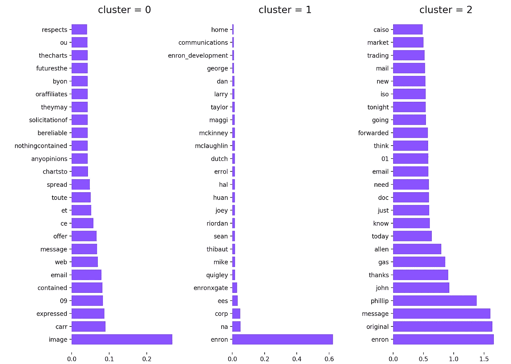
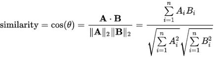

# 我如何使用机器学习对电子邮件进行分类，并将其转化为见解(第二部分)。

> 原文：<https://towardsdatascience.com/how-i-used-machine-learning-to-classify-emails-and-turn-them-into-insights-part-2-6a8f26477c86?source=collection_archive---------2----------------------->


自从我写了 [**第一部分**](/how-i-used-machine-learning-to-classify-emails-and-turn-them-into-insights-efed37c1e66) 已经有一段时间了，在过去一年的许多项目中，我找不到时间和精力来继续我离开的地方。在我写第 2 部分的时候，圣诞节越来越近了，这给了我一些空闲时间来继续我的研究。

在第 1 部分的最后一节中，我讨论了每个集群的热门术语，以及为什么这些奇怪的术语(例如，HOU 等，..)如此频繁地出现。为了找到答案，我检查了数据集中的一些电子邮件，看能否找到其中的一些。

```
Richard Burchfield
10/06/2000 06:59 AM
To: Phillip K Allen/HOU/ECT@ECT
cc: Beth Perlman/HOU/ECT@ECT 
Subject: Consolidated positions: Issues & To Do list
```

在浏览了数据集中的一些电子邮件后，很明显为什么这些词是热门词汇。它们几乎出现在每个“收件人”、“抄送”或“密件抄送”规则中。为了解决这个问题，我在 tfidf 矢量器中添加了一些自定义的停用词。因为停用词是一个冻结列表，所以我复制了一份，并将其传递给矢量器。

添加停用词后的聚类图。



当我看这个情节时，三件事很快浮现在我的脑海里。
1。第一个群集不包含令人兴奋的术语。
2。第二群集几乎单独由人名组成。
3。最后一组看起来非常有趣，绝对值得进一步研究

我对安然公司一无所知，但在看了最后一组之后，不可否认的是“菲利普”和“约翰”与该公司有一些重要的关系。

现在我对这些邮件是如何聚集在一起的有了一些了解，是时候让我的研究更进一步了。

# 查找相关电子邮件

在通过聚类算法发现了最流行的术语和最令人兴奋的电子邮件后，我正在寻找一种方式来进一步将与特定关键字相关的电子邮件分组。比如找到所有和工资或费用有关的邮件，安然因为某种原因卷入了丑闻，对吗？

首先想到要实现这一点的是**余弦相似度**。在数据挖掘领域中，一种用于测量聚类内聚力的常用技术。

> 余弦相似性是内积空间的两个非零向量之间的相似性的度量，它度量它们之间角度的余弦。0 的余弦为 1，其他任何角度都小于 1。



为了找到一封邮件和所有其他邮件的余弦距离，我只需要计算第一个向量与所有其他向量的点积，因为 tfidf 向量已经行规范化。为了得到第一个向量，我需要按行分割矩阵，得到一个只有一行的子矩阵。

```
# The vector of the first email.
vec_train[0:1]
```

幸运的是，scikit-learn 已经提供了成对度量(机器学习术语中的内核),既适用于向量集合的密集表示，也适用于向量集合的稀疏表示。在这种情况下，我需要一个点积，也就是线性核。

```
[ 1\.  0\.  0\. ...,  0\.  0\.  0.]
```

输出显示，数据集中第一个向量和第一封电子邮件之间的余弦相似度为 1，这很明显，因为这是完全相同的电子邮件。

我希望看到与我可以指定的“查询”(例如，特定的关键字或术语)相关的电子邮件，而不是查找彼此相关的电子邮件。
假设我想找到与最后一个集群中的一个顶级术语“Phillip”相关的所有电子邮件，例如，在这种情况下，我需要从查询(Phillip)中创建一个单独的向量，该向量将适合原始向量。

因此，为了找到匹配我的查询的前 10 封电子邮件，我使用了 argsort 和一些负数组切片(大多数相关的电子邮件具有较高的余弦相似值)

```
related_email_indices = cosine_sim.argsort()[:-10:-1]
print(related_email_indices)
```

要查看电子邮件，我只需通过返回的索引来查找它们。

```
# Print out the first result
first_email_index = related_email_indices[0]
print(email_df.body.as_matrix()[first_email_index])
```

哪些输出:

> 约翰，你这个星期还想聚一聚吗？菲利普

为了提高代码的可重用性，我创建了一个类，它可以快速查找我想要的任何术语或查询。

在那之后，我忍不住用更令人兴奋的关键词搜索邮件，比如工资或费用。我做了一个新的查询，找到 50 封与关键字**薪水**最相关的邮件。

```
ds = EmailDataset()
results = ds.query('salary', 100)# print out the first result.
print(ds.find_email_by_index(results[0]))
```

> 兰迪，你能给我发一份调度组每个人的工资和级别的明细表吗？加上你对任何需要改变的想法。(举帕蒂的例子)菲利普

对**费用的另一个查询，**显示第一个结果:

> yesIna RangelJohn，您认为我们是否需要在周五为您和 Maggi 派遣一名 IT 技术人员，以确保一切正常运行？如果我们这样做，我们将不得不支付他们的旅行费用。这将是有益的，而不是你必须在电话上与它的任何问题。让我知道。表示女名

# 摘要

在第一部分中，我使用了一种无监督聚类算法，让机器为我对电子邮件进行分组。在检查这些集群并发现一些有趣的见解后，我使用了一种更受监督的方法来对与特定关键字相关的电子邮件进行分组。

我可以使用很多更先进的技术来获得更深入的见解，但我在摆弄我所使用的那些技术时获得了很好的体验。
对于有兴趣对安然数据集进行更深入研究的人来说，[这篇论文](http://citeseerx.ist.psu.edu/viewdoc/download?doi=10.1.1.61.1645&rep=rep1&type=pdf)值得一看。

如果你和我一样喜欢这个系列，别忘了鼓掌。源代码可以在[我的 Github 页面](https://github.com/anthdm/ml-email-clustering)上找到。欢迎在下面留下评论或在 Twitter 上联系我。