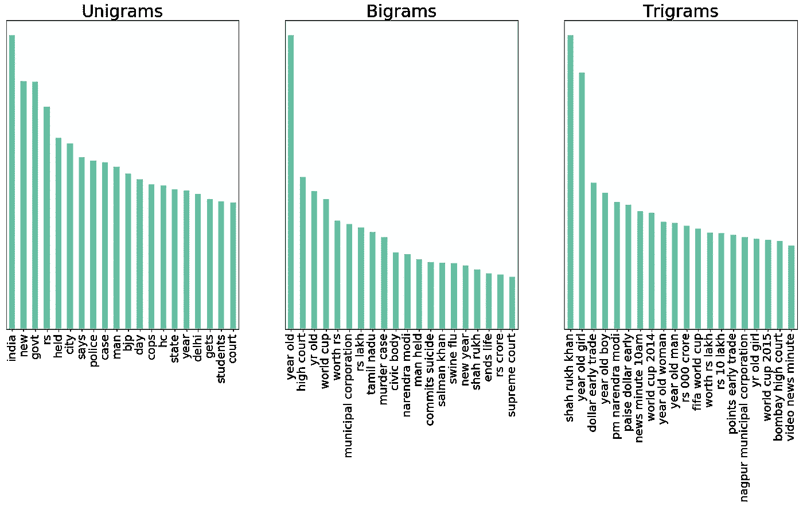
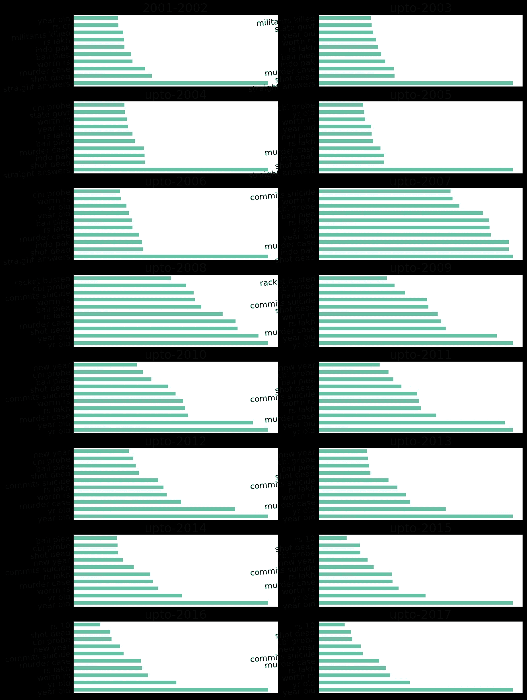
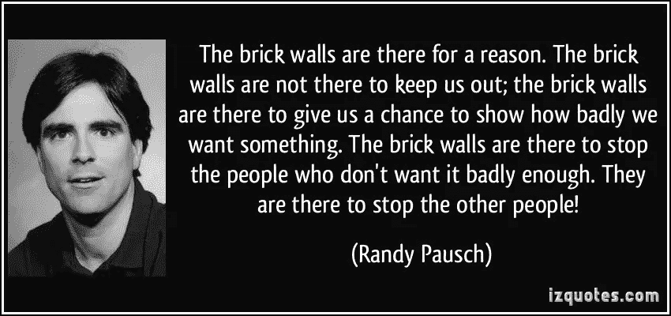
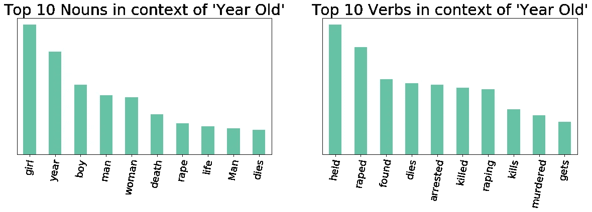

# 我如何使用自然语言处理从新闻标题中提取上下文

> 原文：<https://towardsdatascience.com/how-i-used-natural-language-processing-to-extract-context-from-news-headlines-df2cf5181ca6?source=collection_archive---------4----------------------->

最近，我在 ka ggle([https://www.kaggle.com/therohk/india-headlines-news-dataset](https://www.kaggle.com/therohk/india-headlines-news-dataset))偶然发现了一个非常惊人的数据集。这是一个难得的机会，你可以看到印度背景下的数据。这个数据是在一份名为《印度时报》的印度全国性日报上发表的大约 250 万条新闻标题。我想，如果我能分析这些数据并从这些数据中提取一些见解，那就太好了。因此，在一个晴朗的夜晚，我决定通宵从超过 250 万条新闻标题中搜集任何有趣的东西


Searching for insights!!!!

## 第 1 部分:了解数据

所以，我开始探索这个数据集。如果你有大量的文本，你想知道数据中存在什么样的趋势，你会怎么做？你从简单的词频开始！！！最后，我计算了最常见的单字母词、双字母词和三字母词，发现了一些真知灼见。下面是一个非常简单的记号频率的例子



## **第二部:碰壁**

从这个图像中，我可以很容易地看出沙鲁克·汗吸引了大量的头条新闻，而 BJP 作为一个政治团体设法与宝莱坞明星一起保持其显著的地位！！！！！到目前为止一切顺利。这是我的分析将要撞上**砖墙**的时候。


所以，我想，为什么不继续从不同的角度来创造频率图呢？因此，我认为，如果我能绘制出多年来常见二元符号的频率图，那将是一个好主意？本质上，我想找出 2001 年(这是有数据的第一年)最频繁的二元模型标记，然后找出 2002 年最频繁的二元模型标记，最后找出 2001 年和 2002 年常见的频繁标记。并继续累积这些代币。这是我结尾的情节:



Problem Plot !!!

这里可以看到历年来最频繁最常见的重名是***‘岁’***。但这意味着什么呢？它是在什么背景下使用的？可悲的是，频率图只能带我们到这里。他们大多**没有告知**关于**的上下文。这是我的砖墙！有一会儿，我想，现在是凌晨 2 点，让我去睡觉吧！！！！**


然后我想起了兰迪·波许



所以，我继续努力…最终我明白了…

## **第三部分:爬砖墙**

我不会撒谎，我想我睡了一会儿，梦见了我在高中的语法课。在给定的句子中，名词、动词或形容词传达了什么样的信息？报纸标题不是句子吗？

我接下来需要做的就是过滤掉所有出现单词“ ***岁*** ”的标题，然后找出哪些名词和动词与这个单词同时出现。但是你是怎么做到的呢？实现这一点的方法是为每个句子创建一个词性树。词性标注是一种标准的自然语言处理技术。所有的 NLP 实现都有这个特性。我选择了 spacy，这是我必须写的一小段代码:

```
index=data['headline_text'].str.match(r'(?=.*\byear\b)(?=.*\bold\b).*$')
texts=data['headline_text'].loc[index].tolist()
noun=[]
verb=[]
for doc **in** nlp.pipe(texts,n_threads=16,batch_size=10000):
    try:
        for c **in** doc:
            if c.pos_=="NOUN":
                noun.append(c.text)
            elif c.pos_=="VERB":
                verb.append(c.text)            
    except:
        noun.append("")
        verb.append("")
plt.subplot(1,2,1)
pd.Series(noun).value_counts().head(10).plot(kind="bar",figsize=(20,5))
plt.title("Top 10 Nouns in context of 'Year Old'",fontsize=30)
plt.xticks(size=20,rotation=80)
plt.yticks([])
plt.subplot(1,2,2)
pd.Series(verb).value_counts().head(10).plot(kind="bar",figsize=(20,5))

plt.title("Top 10 Verbs in context of 'Year Old'",fontsize=30)
plt.xticks(size=20,rotation=80)
plt.yticks([]
```

要创建此图:



看哪！！！我有与 token“岁”相关联的上下文。这个符号被用在报道暴力行为/犯罪的新闻标题中，这些暴力行为/犯罪也大多是针对妇女的。

为了确保我的结论是正确的，我查看了实际的新闻标题，其中提到了“**岁”**，这是我看到的-

```
['10-year-old girl missing',
 'Relative kills 9-year-old',
 '59-year-old widow murdered',
 'Spunky 60-year-old woman prevents burglary',
 "75-year-old woman done to death in B'lore",
 'Encroachments threaten 900-year-old temple',
 '3 nabbed for 5-year-old robbery',
 '25-year-old man electrocuted',
 '5-year-old boy run over',
 'Killers of 88-year-old woman arrested',
 '21-year-old held in theft case',
 "60-year-old gets two years' RI for rape attempt",
 'STRAIGHT ANSWERSBRSwati Aneja 13 year old schoolgirl on what I Day means to her',
 'Robbers stab 9-year-old',
 "Eight year old's brush with 'commissions'",
 'By Ganesha; what 81-year-old Deryck does BEST',
 'Six-year-old girl raped; murdered',
 'FBI woos 16-year-old indian author',
 'Six-year old raped murdered in Patiala cantonment',
 'FBI woos 16-year-old Indian author']
```

唷！！！那是一些工作。我继续研究这个数据集，寻找更多这样的故事。你可以在这个 **Kaggle 内核**[**https://www . ka ggle . com/gunvant/what-India-talks-about-a-visual-essay**](https://www.kaggle.com/gunnvant/what-india-talks-about-a-visual-essay)上查看我正在进行的工作

如果你喜欢这篇文章，别忘了鼓掌。另外，如果你在 Kaggle 上，如果你能投票支持我的内核就太好了