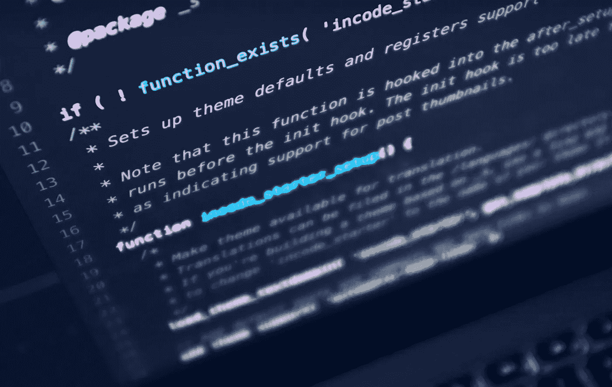
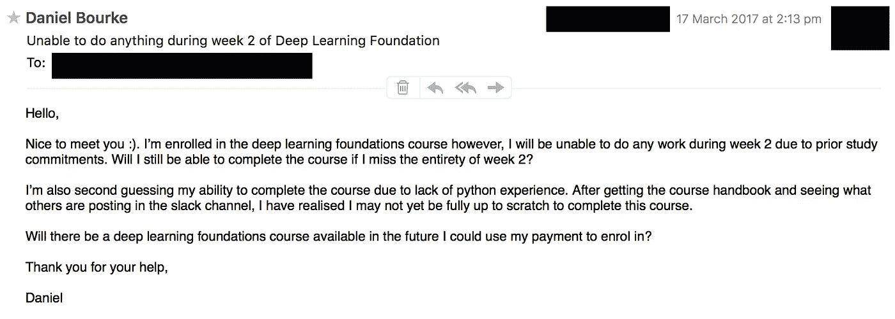
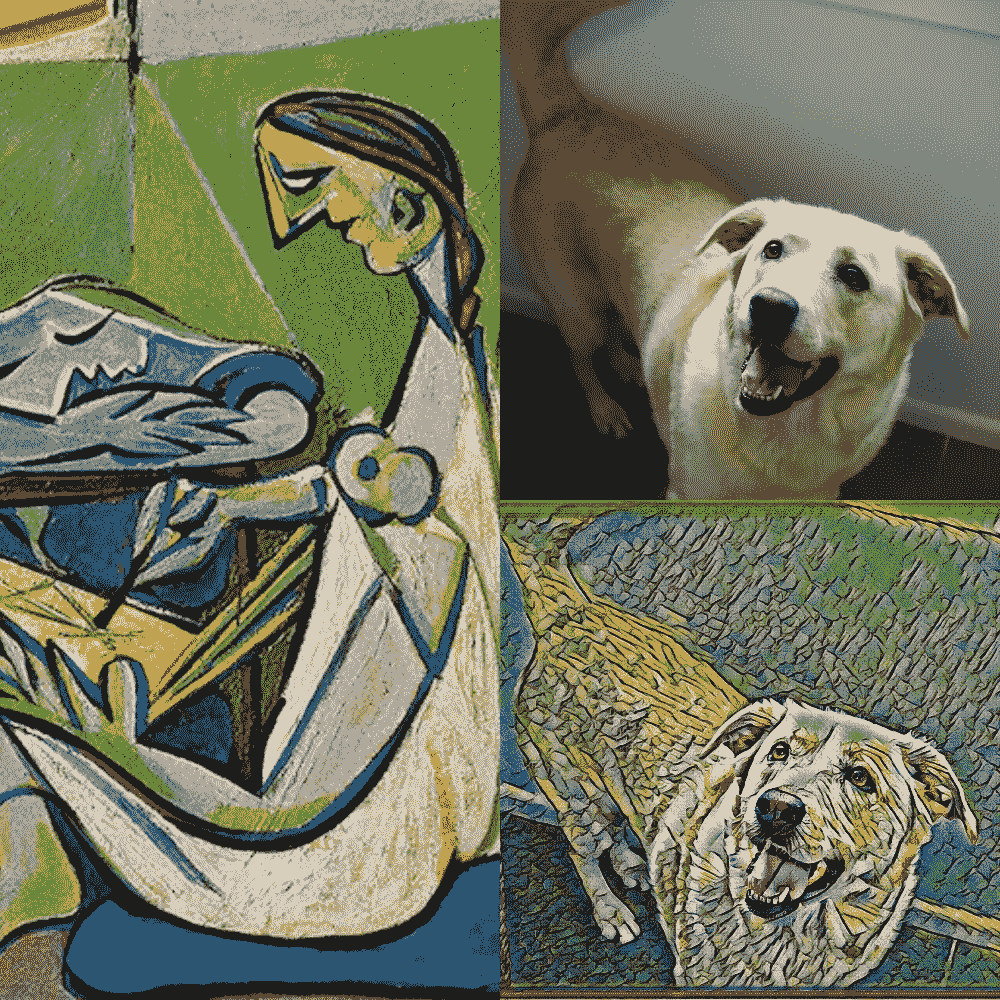
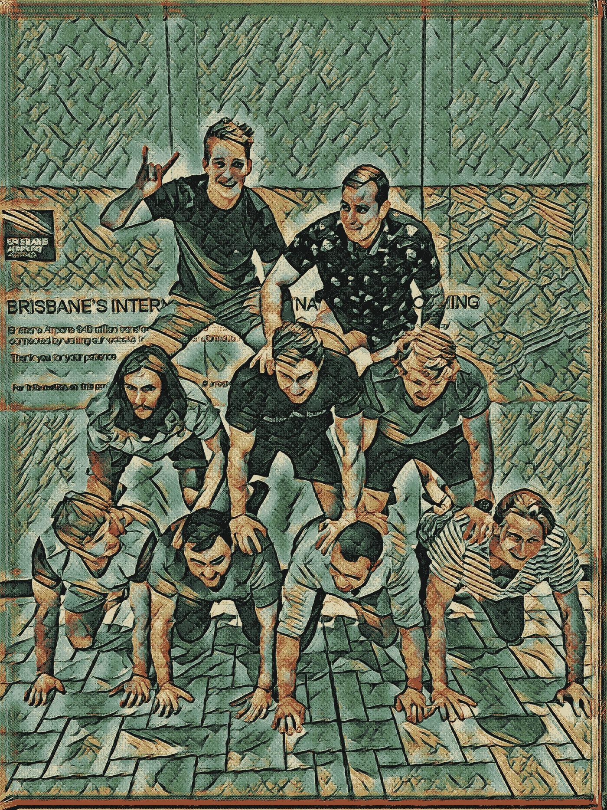
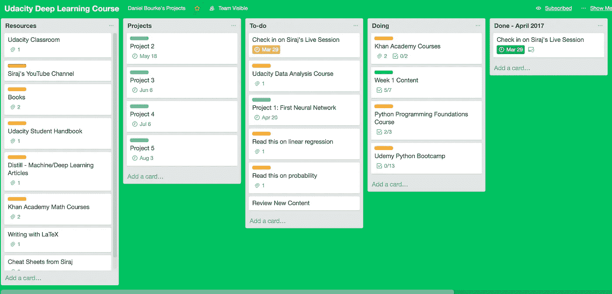

# 我如何学习深度学习—第一部分

> 原文：<https://towardsdatascience.com/how-im-learning-deep-learning-in-2017-part-1-632f4187ce4c?source=collection_archive---------0----------------------->

## 通过构建深度学习模型学习编程

By [Luca Bravo](https://unsplash.com/search/code?photo=XJXWbfSo2f0)

整个人工智能革命令我着迷。我想参与进来。我的搜索把我带到了 [Udacity](https://www.udacity.com/) 。一个漂亮的在线学习平台。我真的很喜欢网站的布局和颜色。我对此很感兴趣。

我注册了新课程通知，并发现了[深度学习基金会纳米学位](https://www.udacity.com/course/deep-learning-nanodegree-foundation--nd101)。

先决条件是基本的 Python 语法和一些微积分知识。当我第一次读这封邮件时，我从高中起就没有什么 python 经验(最少的整体编程经验)和少量微积分知识。

# 建设

我对涉足编程领域非常感兴趣。看了那么多 Medium、博客和互联网其他地方的文章，机器学习和深度学习最让我感兴趣。我决定开始准备这门课程。我在最后期限前有三个星期。

我开始通过多种方式学习 python，主要是通过我之前在 Udemy 上购买的 [Python Bootcamp](https://www.udemy.com/complete-python-bootcamp/learn/v4/overview) 课程。

最后期限很快就要到了。在我有 24 个小时来决定之前，我几乎没有通过 Python 中的方法和函数。

充满了对自己是否准备好的焦虑，我输入了我的信用卡信息并在 Udacity 上注册了 Nanodegree。我怀疑自己，我甚至发邮件给支持人员，说明我的担忧以及退款窗口何时结束。

The anxious email I sent to the Udacity support team.

我在怀疑自己。

我决定不选择退款。我想测试一下自己。我想，“最坏的情况会是什么？”。

学习 Python 很有趣。在我见过的所有语言中，Python 最快地征服了我。

除了 Udemy 课程，我还开设了 Udacity 的免费的 Python 编程基础课程。这两个人合作得很好。

课程开始日期的迅速临近是每天学习 Python 的巨大动力。在三周时间里，我从对 Python 一无所知到能够画出花朵，检查一段文字中的脏话，当然，还完成了经典的 FizzBuzz 算法挑战。

我甚至制作了一个 YouTube 视频，我试图解释我是如何使用 Python 来画花的。这确实有助于巩固我的学习。

所以经过三周的 Python 准备，我成功地从 mega noob 变成了 super noob。

课程结束两天了，我没有学任何数学。我从高中(7 年前)就有很强的数学背景，但从那以后就没怎么做过。我对数字很在行，所以比起编程，我对数学部分更有信心。

在课程开始前的一些公告中，我听到几次提到矩阵操作。Udacity 团队推荐使用[可汗学院](https://www.khanacademy.org/)来温习矩阵和向量。所以我开始看一些视频，练习[矩阵乘法](https://www.khanacademy.org/math/precalculus/precalc-matrices)，重新发现什么是向量。

# 第一天

我加入了深度学习基金会的 Slack 频道。介绍频道挤满了未读的信息。我开始滚动频道。

> “大家好，我是来自 SF 的 John，X 的软件工程师”*
> “大家好，我是来自伦敦的 Paul，X 的数据分析师”*

**这两个都是杜撰的名字。频道里的每个人都非常友好，乐于助人。*

焦虑程度上升。

我让自己陷入了什么？

我意识到，这不是我和其他同学之间的竞争。我们上这门课都是有原因的，最有可能是为了提高自己的技能，互相帮助，改变世界，而不是竞争。

有趣的是，我们很快就会把自己和他人进行比较。我是唯一这样做的人吗？

即使是比赛，Udacity 团队也竭尽全力警告我课程会很难，并给出了详细的先决条件。如果我因为不知所措而对开课感到焦虑，那是我的选择。

另一种认识。我身边有一些世界上最聪明的人。我现在有机会向这个领域的佼佼者学习，我怎么能不兴奋呢？

# 第一周

到第一周结束时，我已经学到了相当多的知识。我被介绍给了一些令人惊叹的 Udacity 深度学习团队。

我了解了深度学习的真正含义。是的，我在实际上不知道深度学习的正确定义的情况下，创办了深度学习基金会 Nanodegree。跟机器学习有关吧？

我知道了深度学习可以应用在哪里，我甚至利用一些预先制作的算法为我的狗设计了一张照片，就像[毕加索的 La Muse](http://www.pablo-ruiz-picasso.net/work-1906.php) 。

My dog Bella, recreated by my computer in the style of Picasso’s La Muse.

我用这种技术为朋友们设计了一系列不同的照片，他们都很喜欢。

My friends and I in a human pyramid, La Muse style.

我了解了线性和逻辑回归模型，以及它们如何作为神经网络的构建模块在机器学习中使用。

通过几个编程例子，我了解了 NumPy 和矩阵数学。在本周之前，我从未使用过 NumPy。关于 NumPy 的文档非常广泛，结合 Udacity 的课程，非常有用。

最后，我深入研究了逻辑回归和神经网络背后的思想。对我来说，这是一周中最困难的部分。有时我感到沮丧，因为我不明白发生了什么。为了克服这一点，我会把课文内容复习一遍。然后我会走开几分钟，只是想一想。然后，我会回来写下(在纸上)所有我不理解的部分，并在尝试挑战之前修改它们。

这种技术似乎很有效。

# 第二周

我错过了第二周的所有内容，因为我在家乡参加了麻省理工学院的训练营。

在线课程的美妙之处在于所有的信息在任何时候都是可以获取的。

# 下一步是什么？

第三周是本周。

在开始第三周之前，我将继续完成第一周和第二周的剩余内容，然后最终开始我的第一个项目。

我正在用[特雷罗](https://trello.com/b/tyHAvpcY)追踪我的进度，随时跟进，如果我松懈了就告诉我。

I’m using a modified Kanban technique to stay on top of things.

到这个月底，我将从零开始建立和训练我自己的神经网络。

我有许多工作要做。

我很害怕，但也很兴奋。

开始学习这门课程是我做过的最好的事情之一。我在学习如何编程的过程中获得了乐趣，同时也成为了我经常从外部观察的社区的一部分。

我已经学到了很多，但最重要的事情之一就是开始。很久以来，我一直想学习编程，我终于做到了。

如果你想开始学习如何编程，那就试试吧。网上有很多免费资源，都试试吧。找到最适合自己的。

我仍然不知道这是否最适合我，但目前为止我很喜欢它。

这篇文章是一个系列的一部分，这里是其余的。

*   第一部分:[新的开始。](/how-im-learning-deep-learning-in-2017-part-1-632f4187ce4c)
*   第二部分:[动态学习 Python。](/how-im-learning-deep-learning-in-2017-part-2-5cff7967a0e4)
*   第三部分:[广度太多，深度不够。](/how-im-learning-deep-learning-in-2017-part-3-343598d60032)
*   第四部分: [AI(营养)对 AI(智能)。](/how-im-learning-deep-learning-part-iv-d26753a4e1ed)
*   第五部分:[回归基础](/how-im-learning-deep-learning-part-v-df73a535dd9)。
*   额外:[我自创的 AI 硕士学位](http://mrdbourke.com/aimastersdegree)