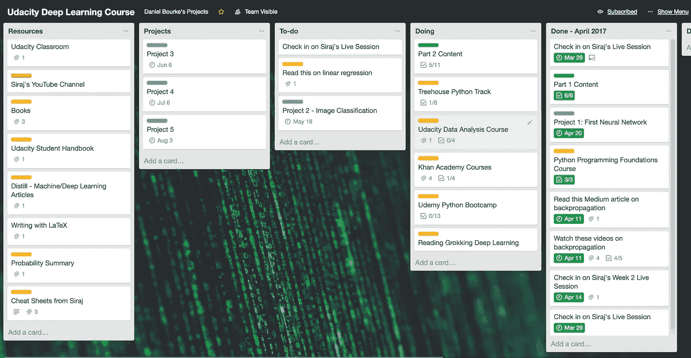
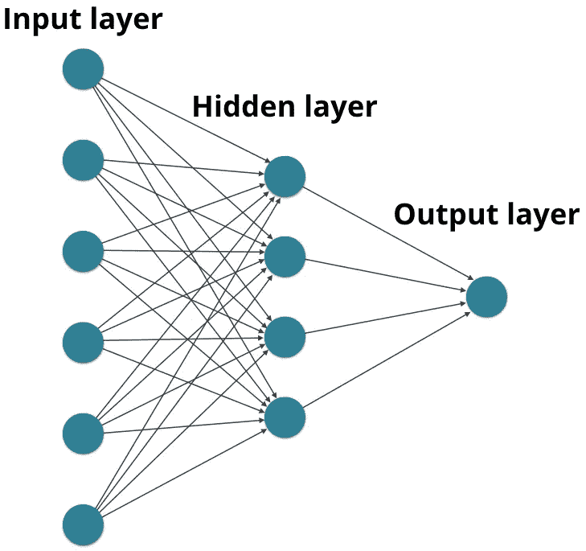
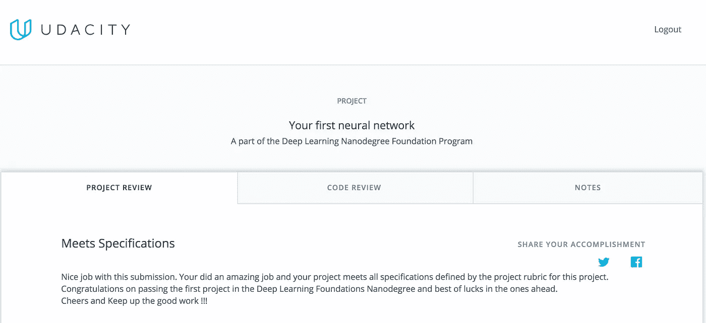

# 我如何学习深度学习—第二部分

> 原文：<https://towardsdatascience.com/how-im-learning-deep-learning-in-2017-part-2-5cff7967a0e4?source=collection_archive---------1----------------------->

## 动态学习 Python

# TL；速度三角形定位法(dead reckoning)

*   提交了我的第一个深度学习项目，我通过了！
*   开始学习[卷积神经网络](https://medium.com/@ageitgey/machine-learning-is-fun-part-3-deep-learning-and-convolutional-neural-networks-f40359318721)
*   了解了 [TensorFlow](https://www.tensorflow.org/) 和[情绪分析](https://www.youtube.com/watch?v=si8zZHkufRY)
*   回到基础，开始在树屋学习 [Python，在](http://referrals.trhou.se/danielbourke)[可汗学院](https://www.khanacademy.org/math/precalculus/)学习基础微积分
*   下个月:项目 2 和循环神经网络

[*第 1 部分*](https://medium.com/@MrDBourke/how-im-learning-deep-learning-in-2017-part-1-632f4187ce4c) 从我开始 [Udacity 深度学习基础
Nanodegree](https://www.udacity.com/course/deep-learning-nanodegree-foundation--nd101) ，以及通过 [Udacity 的 Python 编程入门](https://www.udacity.com/course/programming-foundations-with-python--ud036)开始学习 Python 开始。

那篇文章在第三周结束。我现在在第六周。

# 我是如何追踪的

How I’m using [Trello](https://trello.com/b/tyHAvpcY) to stay on top of things.

到目前为止，它一直具有挑战性，但惊人的支持渠道已经令人难以置信。

我遇到的大多数麻烦都是我自己造成的。这主要是因为我在编程和统计方面的背景知识很少。

我喜欢挑战。在 8 号球后面意味着我的学习已经是指数级的。我从对 Python 和微积分知识几乎一窍不通，到能在六周内写出部分神经网络。

这一切都来之不易。我每周至少花 20-30 个小时在这些技能上，但我还有很长的路要走。这么长时间是因为我在开始课程前缺乏必要的知识。

# 第三周

在 Udacity Slack 频道的大力帮助下，我成功完成了我的第一个项目。该项目包括训练我自己的神经网络来预测某一天的自行车共享用户数量。

看到模型在调整诸如迭代次数(模型尝试映射数据的次数)、学习速率(模型从训练数据中学习的速度)和隐藏节点的数量(输入数据在成为输出数据之前流经的算法数量)等参数时得到改善，真的很有趣。

Source: [Udacity](http://www.udacity.com)

上图显示了一个神经网络的示例。隐藏层也称为隐藏节点。在深度学习中，输入和输出之间可能有数百个，如果不是数千个这样的隐藏层，反过来创建了一个深度神经网络(深度学习由此得名)。

在等待我的项目被评分和继续深度学习基础 Nanodegree 的过程中，我决定继续学习 Udacity 提供的其他一些课程。

我完成了 Python 编程入门课程，开始了[数据分析入门](https://www.udacity.com/course/intro-to-data-analysis--ud170)课程。我在数据分析课程上没有取得多大进展，但这是我下个月的目标之一。

提交项目三天后，我收到了反馈。我通过了！我无法向你解释这有多令人满意。

Passing my first Deep Learning project! :D

在询问了课程的退款流程(见 [*第一部分*](https://medium.com/@MrDBourke/how-im-learning-deep-learning-in-2017-part-1-632f4187ce4c) )三周后，我已经完成了课程的第一个重要里程碑。

我做出了正确的选择，留下来。

向 Slack 频道大声呼喊，感谢他们所有的惊人帮助！

# **卷积神经网络**

在收到我的第一个项目的反馈后的几天，我开始了纳米级卷积神经网络的第二部分。

卷积神经网络能够识别图像中的对象。它们是强大的功能，例如脸书的照片自动标记功能。

为了更深入地了解[卷积神经网络](https://medium.com/@ageitgey/machine-learning-is-fun-part-3-deep-learning-and-convolutional-neural-networks-f40359318721)，我强烈推荐你阅读 [Adam Geitgey](https://medium.com/u/ba4c55e4aa3d?source=post_page-----5cff7967a0e4--------------------------------) 的文章。事实上，当你在的时候，看看他的整个[系列](https://medium.com/@ageitgey/machine-learning-is-fun-80ea3ec3c471)。

第 2 部分从 Siraj Raval 的一段视频开始，讲述如何为神经网络准备最好的数据。

Siraj 可能是我在 YouTube 上见过的最有趣的教练。即使你不喜欢 DL、ML 或 AI(你应该喜欢)，看他的视频也很有趣。

就像人类一样，当信号从噪音中被破译出来时，机器工作得最好。为神经网络准备数据包括移除数据边缘的所有绒毛，以便神经网络可以更有效地处理数据。

请记住，机器学习只能在数据中找到人类最终能够找到的模式，只是这样做要快得多。

(非常)简单的例子:

> 您想要了解特定学校中特定九年级班级的考试成绩趋势。
> 
> 您的初始数据集包含全国每所高中的结果。
> 
> 使用这个数据集来寻找特定类的趋势是不明智的。
> 
> 因此，为了准备数据，除了您想要测试的特定的 9 年级班级之外，您要删除每个班级和年级。

关于数据准备的更多信息，我推荐 Siraj 的这个视频:

# 第四周

本周我开始构建和学习 Miniflow，这是我自己的 TensorFlow 版本(稍后我将介绍 TensorFlow)。本课的目标是学习可微分图和反向传播。

这两个词都是行话，上课前对我来说毫无意义。

当我用最简单的术语定义它们时，我发现事情变得更容易了。

**可微图:**(从函数中)可以求出导数的图。用这个导数可以更容易的计算未来的事情。

**反向传播:**通过神经网络前后移动，计算每次输出和期望输出之间的误差。该误差然后被用于相应地调整网络，以更精确地计算期望的输出。

我在这门课的某些部分遇到了困难。我越来越沮丧。我休息了一下，决定吞下我的自我，我必须回到基础。

# 回归基础

如果你对一个概念有困难，回到基础，而不是试图推进。如果你继续让沉没成本谬误得逞，你最终可能会成功，但它可能弊大于利。我对在许多紧张的时间里努力完成目标感到内疚。我不想让这种事情在这门课上发生。

课堂上的数学是最困扰我的。不过，不要把我的麻烦当成害怕的理由，没多久我就被[可汗学院](http://khanacademy.org)可爱的人们带着熟悉起来。

我看了关于[偏导数](https://www.khanacademy.org/math/multivariable-calculus/multivariable-derivatives/partial-derivatives/v/partial-derivatives-introduction)、[梯度](https://www.khanacademy.org/math/multivariable-calculus/multivariable-derivatives/gradient-and-directional-derivatives/v/gradient)和[链式法则](https://www.khanacademy.org/math/ap-calculus-ab/product-quotient-chain-rules-ab/chain-rule-ab/v/chain-rule-introduction)的整个系列。在这之后，迷你流课程中的一切开始变得更有意义了。

在完成可汗学院的课程后，我不仅获得了更好的理解，学习过程也远没有那么令人沮丧。

本着返璞归真的精神，我买了几本关于 DL 的书。第一个是安德鲁·特拉斯克[的](https://twitter.com/iamtrask?ref_src=twsrc%5Egoogle%7Ctwcamp%5Eserp%7Ctwgr%5Eauthor)[探索深度学习](https://www.manning.com/books/grokking-deep-learning)。安德鲁是这门课程的讲师，也是牛津大学的博士生。

这本书的前半部分我已经看了大约 50%(后半部分还没有发行)，它已经开始巩固我已经学到的知识了。在稍微深入地挖掘神经网络的整体概念之前，它从 DL 的大概述开始。

我向任何希望开始学习深度学习的人推荐这一点。Trask 指出，如果你通过了高中数学考试，并且可以用 Python 编程，你就可以学习深度学习。我几乎没有勾选任何一个选项，这绝对对我有帮助。

在 Slack 频道的一次推荐后，我最近还购买了[自制神经网络](https://www.amazon.com.au/Make-Your-Own-Neural-Network-ebook/dp/B01EER4Z4G)。我还没有开始做这件事，但是我会在下个月的某个时候开始做。

## 计算机编程语言

当课程开始时，它说初级到中级 Python 知识是先决条件。我知道这个。问题是，除了 Udacity 上的 Python 基础课程，我什么都没有。

为了解决这个问题，我注册了 [Treehouse](http://referrals.trhou.se/danielbourke) 上的 Python Track。除了没有要求退款之外，这是迄今为止我在课程中做出的最好的决定。

突然间，我有了另一个知识来源。由于基础课程，我有一个小的基础，但现在知识正在复合。

树屋的社区就像 Udacity 一样，非常有帮助。事实上，我已经开始在树屋论坛上分享我自己对人们关于 Python 的问题的回答。

> 5 周从学生到老师？？

在 Treehouse 上学习更多关于 Python 的知识让我进一步了解了深度学习纳米学位基金会正在发生的事情。

我发现混合知识是一件非常强大的事情。在过去，我总是坚持不懈地学习新的东西，而不是复习已经学过的东西。

如果你太快地尝试一些超出你舒适区的事情，你会很快达到筋疲力尽的地步。

回归基础不仅提高了我的知识，更重要的是，给了我继续学习的信心。

# 第五周

接下来是情感分析。我看了特拉斯克和西拉杰的课。

情感分析包括使用神经网络来决定电影评论是正面还是负面。

我无法相信我正在编写代码来分析一篇文章中的单词，然后用这些代码来判断它的意思。

想到在你真正做一件事之前，你永远也做不了这件事，这很有趣。

Siraj 有另一个关于情感分析的很棒的视频，我会看它只是为了看看迷因。

接下来是[张量流](http://www.tensorflow.org)。我很努力地研究 TensorFlow。连 logo 看起来都很酷。

TensorFlow 是 Google Brain 开发的开源 DL 库。它几乎被用于所有的谷歌产品。它最初是为 ML 和 DL 研究设计的，但后来被用于各种其他用途。

TensorFlow 让我兴奋的是它是开源的。这意味着任何有想法和足够计算能力的人都可以像谷歌一样有效地使用同一个库来实现他们的想法。

我真的很激动，以后能更多的了解 TensorFlow。

# 第六周

这就是我现在的处境！

我玩得很开心。这些课程有时很难，但我不会有别的办法。

通常，最困难的任务也是最令人满意的。每当我完成一门课或一个我已经工作了几个小时的项目时，我都会有一种巨大的满足感。

我下个月的计划是什么？

我想花更多的时间在复习模式上。我学到了很多。

因为很多东西对我来说都是新的，我的直觉告诉我应该复习一下我所学的。

我将尝试使用抽认卡(通过 [Anki](https://apps.ankiweb.net/) )来帮助记忆 Python 语法和各种其他项目。

在我写第 3 部分的时候，我将已经完成了另一个项目，读了几本书，完成了更多的在线课程。

你可以通过查看我的 [Trello 板](https://trello.com/b/tyHAvpcY)来观察我在做什么。我会尽可能保持更新。

回到学习上来。

这篇文章是一个系列的一部分，这里是其余的。

*   第一部分:[新的开始。](/how-im-learning-deep-learning-in-2017-part-1-632f4187ce4c)
*   第二部分:[快速学习 Python。](/how-im-learning-deep-learning-in-2017-part-2-5cff7967a0e4)
*   第三部分:[广度太多，深度不够。](/how-im-learning-deep-learning-in-2017-part-3-343598d60032)
*   第四部分: [AI(营养)对 AI(智能)。](/how-im-learning-deep-learning-part-iv-d26753a4e1ed)
*   第五部分:[返璞归真](/how-im-learning-deep-learning-part-v-df73a535dd9)。
*   号外:[我自创的 AI 硕士学位](http://mrdbourke.com/aimastersdegree)