# 我如何学习深度学习——第三部分

> 原文：<https://towardsdatascience.com/how-im-learning-deep-learning-in-2017-part-3-343598d60032?source=collection_archive---------1----------------------->

## 我已经答应了太多的隐藏单位

在我们进入细节之前，这篇文章有很多细节，这里有一个 10 秒钟的总结:

*   📈通过 [Udacity 深度学习基础纳米学位](https://www.udacity.com/course/deep-learning-nanodegree-foundation--nd101)
*   🤓使用[特雷罗板](https://trello.com/b/tyHAvpcY)来跟踪我的学习
*   📚在[树屋](http://teamtreehouse.com)和[学习 Python《艰难之路》教材](https://learnpythonthehardway.org/book/)
*   ➗Learning 数学与[汗学院](http://khanacademy.org)
*   📝在这个[媒体系列](https://medium.com/series/my-100-days-of-code-bf23b507fc77)中每天写我的学习心得
*   每天⌚️studying 3-4 小时，使用[番茄工作法](https://en.wikipedia.org/wiki/Pomodoro_Technique)并用 [Toggl](http://toggl.com) 追踪时间
*   📽每周发布 [1 条 VLOG](https://www.youtube.com/channel/UCr8O8l5cCX85Oem1d18EezQ)总结我的日常学习
*   👀在 YouTube 上观看 Siraj 的所有视频

现在，让我们深入一下。

今年二月，我还没有写过一行 Python 代码。我一生都在接触科技，但从来没有接触过创造，只是把它用于消费。我想改变这一切。所以我决定开始学习编程，我在这个领域的短暂研究让我找到了 [Udacity](http://www.udacity.com) ，从这里我看了无数他们各种纳米学位项目的预告片，但最让我印象深刻的是[深度学习基金会纳米学位(DLFND)](https://www.udacity.com/course/deep-learning-nanodegree-foundation--nd101) 。

在开始询问退款政策之前的几天，我向 Udacity support 发送了一封电子邮件，现在我已经进入了该计划的最后一个模块(参见[第 1 部分](http://bit.ly/2p6I1ZP))。我很高兴我没有继续写那封邮件。

距离我上次更新只有两个月了，我已经学到了很多。我写这些更新主要是作为我自己反思的一种方法。过去，反思我所学到的东西是我的一个弱点。学习全新的东西是困难的，我发现回头回顾你做过的事情是提醒自己实际上已经走了多远的好方法。

与其他帖子一样，这不会完全是关于深度学习的，但 DLFND 已经成为我过去几个月研究的基础，从这一点上，我开始提升自己在其他领域的技能(Python、统计、代数)。

在这篇文章中，我将回顾一些事情，包括我目前的学习日程和自第 2 部分以来我所学内容的简要概述。

# 我目前的学习日程是怎样的？

正如在之前的帖子中提到的，我使用了一个 [Trello 板](https://trello.com/b/tyHAvpcY)作为我的主要规划工具。我把 DLFND 需要的所有东西以及我在纳米学位之外做的任何补充研究都写在了板上。

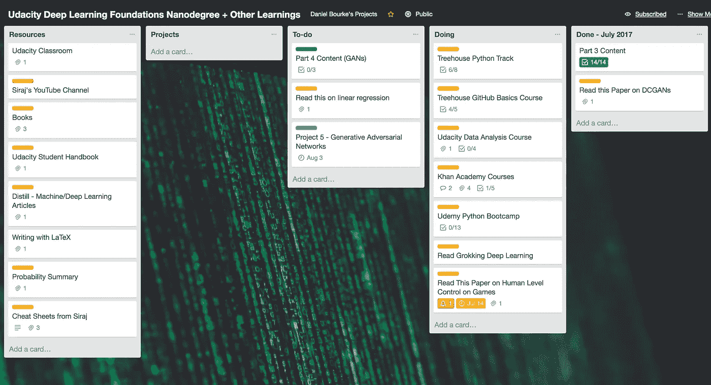

What the board looks like as of July 14 2017.

如果你愿意，你可以[看看公告板](https://trello.com/b/tyHAvpcY)，我已经公开发布了。

即使我已经完成了 DLFND，我也将保持 Trello 板的最新状态，我计划参加下一个课程(在未来的帖子中会有更多关于这方面的内容)。

每天早上，我起床后在白板上写下一系列目标。

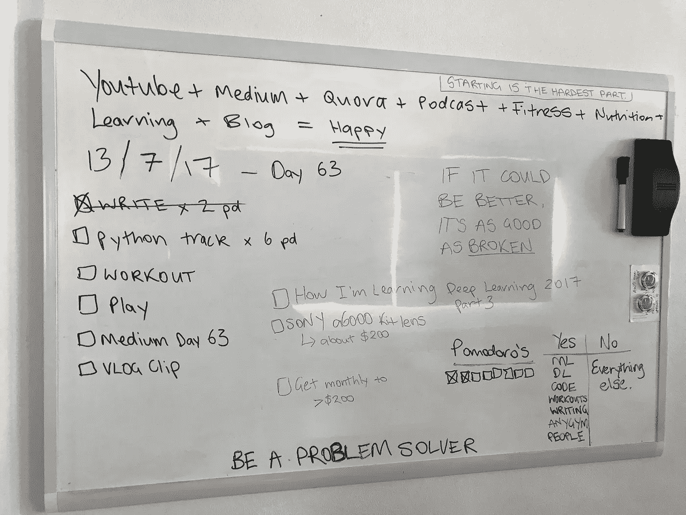

My personal assistant.

你可以把这块板子想象成有组织的混乱。上面散落着随机的激励性引语，我的“是和不是清单”，每天要做的事情(左手边黑色的)，有一天要做的事情(蓝色的复选框)，当然，我目前的幸福方程在顶部。

右下角的“是和不是”列表不断提醒我，哪些事情我想说是，哪些事情我想说不。DL 是深度学习，ML 是机器学习， [AnyGym](http://www.useanygym.com) 是我和一些朋友正在做的一个项目(稍后会详细介绍)，其余的应该不言自明。

经过几年的研究，我发现[番茄工作法](https://en.wikipedia.org/wiki/Pomodoro_Technique)最适合我。每天我的目标是完成至少 6 个 Pomodoro(25 分钟一组)的给定主题。例如，如果是以 Python 为主题的一天，我的目标是完成 6 个 Pomodoro(150 分钟)的无分心 Python 学习。这段时间的大部分将在午饭前完成(我在早上学得最好)。

我通常做三个 25 分钟的街区，然后有 30-45 分钟的休息时间，我会吃早餐或者出去散散步。休息过后，在我完成一天的学习之前，我将继续接下来的三个街区。

这种套路是在读了卡尔·纽波特的[深度作品后产生的。我发现，在 3 到 4 个小时集中精力、不受干扰的工作中，我能比在 6 到 8 个小时的持续干扰中完成更多的工作。](http://calnewport.com/books/deep-work/)

你可以说我在遵循达尔文式的常规。

> 晨间散步和早餐后，达尔文 8 点钟就在书房里，持续工作一个半小时。九点半，他会阅读早班邮件并写信。10:30，达尔文回到更严肃的工作中，有时搬到他的鸟舍、温室或其他几个进行实验的建筑中的一个。到了中午，他会宣布，“我完成了一天的工作，”然后开始在沙滩漫步，这是他在买下房子后不久铺设的一条路。(部分沙滩漫步穿过卢伯克家族租给达尔文的土地。)
> 
> 当他一个多小时后回来时，达尔文吃了午饭，回复了更多的信。三点钟时，他会去睡觉小睡一会儿；一个小时后，他会起床，绕着沙滩散步，然后回到书房，直到 5:30，他会和他的妻子艾玛以及他们的家人一起吃晚饭。在这个时间表上，他写了 19 本书，包括关于攀缘植物、藤壶和其他主题的技术书籍；有争议的人类起源；《物种起源》可能是科学史上最著名的一本书，这本书仍然影响着我们对自然和自身的看法。

# **我学到了什么？**

这个系列的[最后一部分](http://bit.ly/2tOHRLX)在 DLND 的第 6 周结束，我现在已经到第 16 周了。以下是我所学内容的简要总结。

# **第 7–10 周**

我花了一段时间，但我终于明白了一个事实，即深度学习需要大量的计算能力。我还了解到 GPU(图形处理单元)特别擅长进行深度学习的计算类型(大规模矩阵乘法等)。我用的是带 Touch Bar 的 2016 款 13 寸 MacBook Pro，它没有专用 GPU。正因为如此，在我的本地机器上训练深度学习模型需要非常长的时间，不理想。

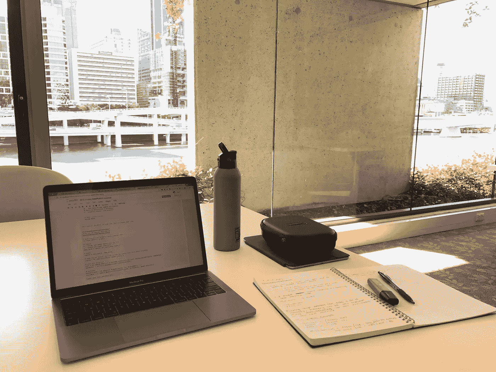

My work station of choice and a nice view from one of my city’s libraries.

大约就在这个时候，我发现了云计算的力量。我过去听说过，但从未完全体验过。如果你几个月前问我什么是 AWS(亚马逊网络服务)，我可能一点都不知道。

我仍然没有完全理解云计算，但没关系，你不需要完全理解它来利用它。简而言之，AWS 是一台你可以通过互联网访问的巨型计算机(至少，我是这么告诉自己的)。

第一次浏览 AWS 控制台令人生畏，但在几次失败的尝试后，我设法启动了我的第一个实例。一个实例实际上激活了 AWS 上您可以访问的少量计算能力。我很惊讶。我现在可以通过互联网访问 GPU 的全部功能，在那里我可以训练我的深度学习模型。

第一次体验这种感觉就像开着一辆比你的车快得多的车。突然间，我开始了训练，而不是在本地机器上等待相当于五分钟的微波时间(很长时间)。

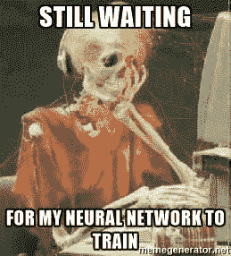

Thanks to the internet, my patience with computers has been beaten down to practically zero.

我还发现了 [FloydHub](https://www.floydhub.com/) 。对我来说，FloydHub 是设计更精美的 AWS 版本(更不用说更便宜了)。我更喜欢使用 Floydhub，因为它很容易安装和运行。通过命令行中的几行代码，您可以开始训练您的深度学习模型。

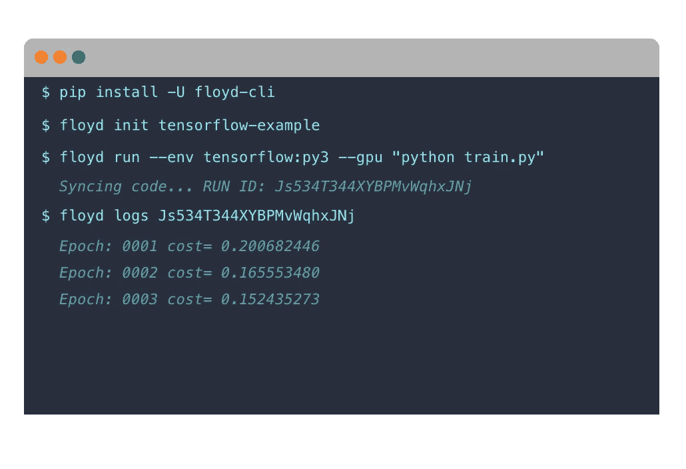

How quickly you can start training a model using FloydHub.

我喜欢 FloydHub 的另一个原因是他们的网站。布置得太漂亮了。在页面上的几秒钟内，我立即知道它能做什么以及如何使用他们的服务。而 AWS 是一个更陡峭的学习曲线。

*还有人对网页设计着迷吗，还是只有我？*

有了这些新发现的云计算知识，我能够为 DLFND 进行我的第二个项目。我的任务是使用卷积神经网络对来自 CIFAR-10 数据集的图像进行分类。

在论坛和专门的 Slack 频道的帮助下(谢谢大家！)，我设法提交了一个工作的 CNN。当你在 Udacity 上提交一个项目时，会出现一条消息说它将在 24 小时内被审核。我过去认为(现在仍然认为)在 24 小时内对一个项目进行全面的评审是令人惊奇的。在我大学的五年里，我从来没有这么快得到反馈。

令我惊讶的是，24 小时实际上是一个夸大的时间。我在提交后的两个小时内完成了一个完整的项目评审。虽然我没有看它，但我需要在那天剩下的时间里从我的电脑上休息一下。

我的第一次提交远非完美，该项目需要改进，我才能获得及格分数。在重新提交之前，我花了大约 8 个小时(和一个 Udacity 支持成员进行了 3 个小时的实时聊天)来调整超参数、训练模型和改进各种功能。我把第二次提交的材料传了过去。

*我的模型还能进一步改进吗？*当然。但我并没有追求完美。我本来可以再花一周时间努力让模型变得更好，但我的目标是学习深度学习的首要原则，而不是完善我的项目提交，这可以稍后进行。

我的完整提交可以在我的 [GitHub](https://github.com/mrdbourke/udacityDLfoundationsP2) 上获得，但是如果没有正确上传请原谅，我正在努力学习如何使用 Git 和 GitHub(稍后会有更多)。

大约在 DLFND 开始 9 周后，我看到[吴恩达的](https://twitter.com/AndrewYNg) [机器学习课程](https://www.coursera.org/learn/machine-learning)的一个新班级正在 [Coursera](http://bit.ly/courserahome) 上开课。我觉得报名参加这个课程会很棒，可以更深入地了解机器学习，以及深度学习的专业知识。再一次，我没有阅读先决条件就开始了课程。我能学会吗？

A photo of me after starting Machine Learning Course on Coursera without reading the prerequisites.

哦，是的，本着签约的精神，我决定挑战自己，承诺 100 天的代码。我开始了每日[媒体系列](https://medium.com/series/my-100-days-of-code-bf23b507fc77)和每周[视频博客](https://www.youtube.com/playlist?list=PL6vjgQ2-qJFclMeLFyh5B6-24MZZDOXnl)记录我的学习。我会更有规律地更新这些内容，每 4-6 周左右写一篇更长的文章。

VLOG 10 of my 100 Days of Code.

# **第 11–14 周**

DLFND 课程的第 3 部分是关于递归神经网络(RNN 氏)。我还不完全理解 RNN 的作品，但我正在慢慢理解这个概念。 [Andrej Karpathy](https://twitter.com/karpathy) 有一篇[非常深入的文章](http://karpathy.github.io/2015/05/21/rnn-effectiveness/)关于 RNN 的有效性，我自己正在读。

我认为 RNN 的方法是，他们接受一系列输入，并能够产生单一输出或一系列输出。

来自一系列输入的单个输出在哪里可以派上用场？

比方说，你有一堆电影评论(作为输入的单词序列)，你想知道哪些是好的和坏的评论(单个输出)。RNN 可用于对评论进行情感分析，并输出评论是好是坏。

*输入序列中的输出序列在哪里使用更好？*

以翻译为例。如果你有一个英语句子(作为输入的单词序列)并想将其翻译成法语(作为输出的单词序列)，可以使用 RNN 来执行翻译。

当然，现在 RNN 还可以产生其他输出(单输入到多输出)，但是我现在让专家来解释这些。我的定义是基本的，但这是我学得最好的方法。我从事物如何工作的总体概念开始，然后慢慢地在此基础上构建。

Siraj 的这个视频展示了一个如何使用 RNN 创作音乐的很酷的例子。

使用长短期记忆(LSTM)网络，Siraj 将采用一系列乐器数字接口(MIDI)并训练 RNN 产生全新的声音。

什么是 LSTM？

我把 LSTM 想象成一系列阀门。如果你把整个 RNN 想象成一个管道系统，水就是流经网络的信息。LSTM 决定有多少水应该流过网络。将这些因素结合起来将有助于微调输出。

再说一次，这是我对他们的看法，还有更多内幕。为了更深入的理解，我推荐[这篇阎石的文章](https://medium.com/@shiyan/understanding-lstm-and-its-diagrams-37e2f46f1714)。

*什么是迷笛？*

MIDI 相当于音乐设备的字母表。就像在单词序列是输入(例如，英语)和输出(例如，法语)的机器翻译模型中一样，MIDI 输入序列(例如，旧钢琴歌曲)可以用于生成输出序列(例如，新钢琴歌曲)。

## **项目 3**

使用我们在之前的课程中学到的知识，下一个项目涉及创建我们自己的 RNN，目标是生成一个电视脚本。

网络的输入将是一个数据集，其中包含 27 季《辛普森一家》的剧本，特别是在莫酒馆的场景。使用这个输入序列(文本串)，RNN 将被用于产生一个全新的场景(输出序列)。

我不会深入研究这个项目的细节(有机会的话，我会把我的代码上传到 GitHub ),但是在准备好数据和几个小时的构建和训练网络之后，下面是我得到的一些输出。

**1)**

> 最低工资和小费。(意味深长地)当然有，但是，嗯，有两个。
> 
> 荷马·辛普森:你知道什么在搅拌吗？
> 
> moe_szyslak:好吧，为什么我有的只是如果这是或者女人的方式他死了。
> 
> 嘿。抱歉。
> 
> 韦伦史密瑟斯:嗷。
> 
> 荷马辛普森:(大笑着，朋友)现在是荷马，我在做一个比我还猪的人(一个热情得可以的家伙)在这种紧张的时候，又有什么好寂寞的。现在，考虑把一个可怕的。
> 
> moe_szyslak:(笑)他会？让我赢！答(很荷马)
> 
> 荷马 _ 辛普森:(对簿)程序。
> 
> 荷马·辛普森:(笑)现在如果你想上游戏，我就和我的新生活一样”。
> 
> homer_simpson:让我们看看什么是玛吉。
> 
> 少年巴特:(说唱，莫伊)这个角色太好了，哪里是真正的你。
> 
> 听着，荷马，这是我记得的时间，我一直在用它？
> 
> 荷马·辛普森:(暂定)

**2)**

> moe_szyslak:喝酒会帮助我们计划。
> 
> 荷马·辛普森:这个情人节的垃圾必须是一个酒吧。(下车)新健康检查员:除了一个白痴。
> 
> (自言自语)对不起，我需要我在你的脚后面。
> 
> moe_szyslak:但是我想我有 200 个孩子，所有人都可以用这些孩子。
> 
> 荷马·辛普森:成为最好的东西？
> 
> 因为我以为你只说了一个。
> 
> (对自己)有人做了一个小的，我能要一个免费的吗？拿着这个！(荷马的声音)
> 
> 荷马·辛普森:有一个，但我没打算去找出来。
> 
> moe_szyslak:(唱)我只想告诉我的生活，直到他们走了！
> 
> 男人们在女人的绅士世界里游荡。
> 
> 哦，你不让我呆在这里？不，莫伊。
> 
> 你知道，是你，莫伊。饮料算你的。
> 
> 西摩·斯金纳:(叹气)不再是眼睛了。
> 
> 荷马·辛普森:(笑)好吧。

这些脚本完全由网络生成，我觉得不可思议。它们也很有可能是完全独一无二的，没有人曾经创造过这样的场景。

## 迁移学习

DLFND 的下一个主题是迁移学习。我认为迁移学习就是把你在一个领域中的知识应用到另一个领域中，而不需要明显地改变它。

所以对我来说，一个真实的例子就是我把我在运动中学到的知识应用到学习中。在过去的七年里，我发现对我来说最好的锻炼方式是设定一个目标，并设定一段时间来实现这个目标。如果我把这些知识应用到学习中，我认为这是迁移学习。

在机器学习/深度学习的情况下，你可以将一个已经在一个数据集上训练过的模型应用于另一个类似的数据集，而不必完全重新训练该模型。能够做到这一点，可以节省大量的时间。

可以使用迁移学习的一个例子是在虚拟模拟中训练机器人，然后使用它在虚拟世界中学到的知识，并将其应用到现实世界的场景中。类似于 [OpenAI](https://openai.com/) 用他们的[积木堆叠机器人](https://blog.openai.com/robots-that-learn/)所做的。

如果你想了解更多关于[转移学习](http://ruder.io/transfer-learning/)的信息，我强烈建议你看看来自 [Sebastian Ruder](https://twitter.com/seb_ruder) 的这篇博文。

# **项目 4**

DLFND 中的第四个项目涉及使用从一种语言到另一种语言的神经网络。

这个项目将利用我们对 RNN 氏症的了解来建立一个能够将一小串英语单词翻译成法语的网络。

如果你在几个月前问我该怎么做，我不会告诉你。现在，我仍然不能完全解释这一过程，但我对谷歌翻译等应用程序如何完成大部分翻译有一个大致的了解。

我发现课程和项目的一个趋势是，我花了大约 50%(有时更多)的时间来完成它们，比预期的工作时间要多。例如，这个项目在最初的描述中有 2 个小时的工作时间，然而，我花了 6 个多小时才完全完成它，如果你包括模型训练时间，那就更多了。我通过 [Toggl](http://toggl.com) 跟踪我所有的在线学习，这有助于我了解我的时间被分配到哪里，并帮助我调整/计划我的学习时间表。

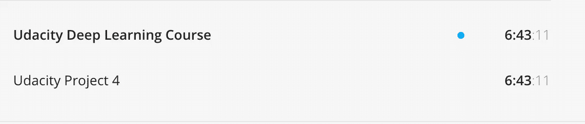

A screenshot of the time I spent working on Project 4 from [Toggl](http://toggl.com).

我花了三次提交来为这个项目获得及格分数，主要是因为如果我诚实的话，我的第一次提交有点仓促。这一模式行之有效，但还可以做得更好。

Udacity 评论者的反馈总是很迅速，充满了洞察力和进一步学习的机会。

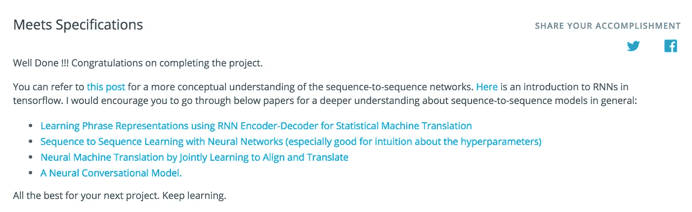

An example of feedback from a Udacity reviewer.

最后，我的模型仍然不完美，但在将英语单词的一个小句子翻译成法语方面，它做得还不错。我本可以在这个项目上花更多的时间来使它变得更好，但是在花了 6 个多小时试图提高一点点的精确度后，我发现最好是继续前进，继续学习。

我发现的一个重要细节是超参数的多样性。我在 Udacity 论坛上看了看，发现一些学生使用了非常不同的参数，仍然得到了很好的结果。我的直觉告诉我，超参数只是最后一步。如果您的模型一开始就没有正确构建，那么再多的超参数调整也不会有助于它的改进(或者只能有很小的改进)。

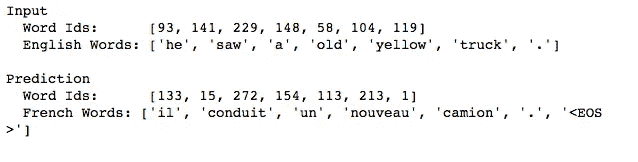

An example of my model translating English to French.

我正式创造了一个比我懂法语的模特。

# 第 15 周—2017 年 7 月 14 日

很难相信我在没有正确使用 GitHub 的情况下坚持到了第 15 周。当我开始学习这门课程时，我使用 git clone 下载了所有的 Udacity 深度学习文件，并从那时起一直使用相同的文件。

这导致了项目 4 的问题。我最终完成了这个项目的一个老版本，当我完成了 80%的时候才意识到这一点。正是因为如此，我决定是时候开始正确使用 GitHub 了。在课程的大部分时间里，我一直忽略它，因为我对它了解得不够，我的工作方式也很好，直到项目 4 事件。

> 如果还能更好，那就跟坏了一样。—格雷格·普利特

这句话与我完全相关。我的工作流程可以更好。它坏了。

这让我开始在[树屋](http://teamtreehouse.com)上了解 [Git](https://teamtreehouse.com/library/git-basics) 和 [GitHub](https://teamtreehouse.com/library/github-basics) 。很快，我开始对使用它更有信心了。我还没有完全弄明白，但它现在在我的清单上。我保证在我写下一篇文章的时候，你会在 GitHub 上看到我所有的文件。

# **第四部分**

DLFND 的第 4 部分是关于生成性敌对网络(GANs)的。这就是我现在的情况。

我说我对课程的每一个新部分都感到兴奋，但这一部分已经让我大吃一惊。

2014 年，Ian good fellow[在酒吧与朋友交谈后想到了 GANs 这个概念(多么不可思议的创始故事)。](https://twitter.com/goodfellow_ian)

我认为 GANs 是两个相互竞争以产生更好输出的网络。

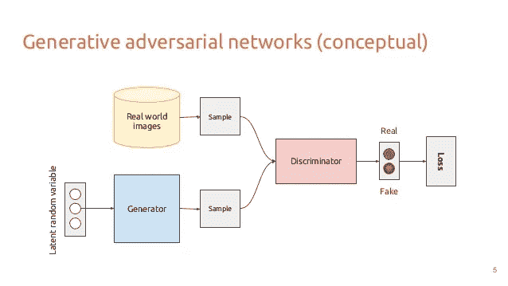

An overview of GANs.

有一个网络叫做生成器(G ),它接收随机的噪声样本。发生器的目标是从噪声中产生新的样本，这些样本与进入另一个网络(鉴别器(D))的真实样本输入具有相同的概率分布。D 的作用是破译哪个输入是真实的。

随着 G 越来越擅长制作假样本，D 也越来越擅长检测假样本。这两个网络相互竞争，并随着时间的推移在各自的特定角色上变得更好。

如果你在寻找更深入的描述，我建议你看看亚瑟·朱利安尼的这篇文章。朱利安尼用[海绵宝宝来比喻甘斯](https://medium.com/@awjuliani/generative-adversarial-networks-explained-with-a-classic-spongebob-squarepants-episode-54deab2fce39)。

由于 GANs 仍然是深度学习领域相对较新的突破，它们的大多数用例可能还没有被发明出来。GANs 目前的一些用途包括生成人脸图像、将草图转换成全尺寸图片( [edges2cats](https://affinelayer.com/pixsrv/) )以及将马变成斑马。

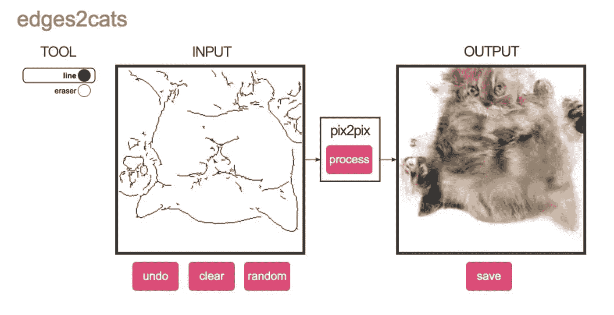

Turning a bunch of random lines into pictures of cats. ([Source](https://affinelayer.com/pixsrv/))

CycleGAN turning a horse into a Zebra using styling transfer at 60 fps.

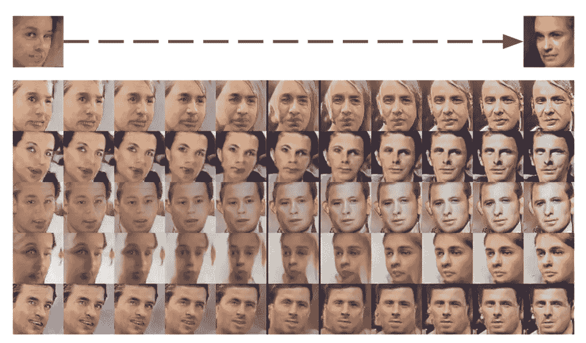

Using GANS to generate and change the direction a face is looking. ([Source](http://www.foldl.me/2015/conditional-gans-face-generation/))

DLFND 即将到来的最终项目包括构建一个 GAN 来生成人脸。我有点害怕又有点兴奋。

到目前为止，我仍然不明白它们到底是如何工作的。在最终截止日期(2017 年 8 月 3 日)之前，我还有几周的课程。

# **额外学习**

当我报名参加 DLFND 时，我几乎没有任何 Python 或机器学习的经验，而且从高中起就没有接触过微积分。

因此，我一直在使用许多其他资源来帮助我学习深度学习所需的技能。

对于 Python，我一直使用的是结合了 [Treehouse](http://teamtreehouse.com) 和[艰难地学习 Python](https://learnpythonthehardway.org/book/)的教材。在撰写本文时，我几乎已经完成了这两篇文章，在写作过程中，我实际上已经学会了所需的 Python 技能。

为了获得一些机器学习的基础知识，我一直在使用 Coursera 上吴恩达的机器学习课程。这是我上过的最好的课程之一。我上周完成了课程(没有正式证书)。

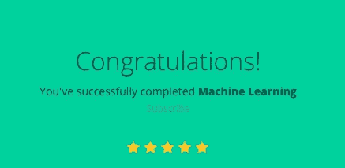

可汗学院的各种课程让我的数学技能达到了标准。我一直在断断续续地学习诸如[线性代数](https://www.khanacademy.org/math/linear-algebra)、[多元微积分](https://www.khanacademy.org/math/multivariable-calculus)、[矩阵](https://www.khanacademy.org/math/precalculus/precalc-matrices)和[向量](https://www.khanacademy.org/math/linear-algebra/vectors-and-spaces/vectors/v/vector-introduction-linear-algebra)之类的课程。

我还没有掌握 Git 或 GitHub 的使用，但是 Treehouse 是一个快速提升我在这两个工具上的技能的好方法。我保证，我的 GitHub 在接下来的几周内会有点像样。

我还每隔一天早上使用 Anki 来帮助巩固我的 Python 语法知识。

# **侧项目**

我不知道这是否适合这篇文章，但我想我最好把它放在这里，因为它是我每周投入一部分时间的地方。

5 月底，我终于掌握了几周前开始的 Coursera 的 DLFND 和机器学习课程。这给了我一些时间开始做一些我已经计划了一段时间的副业。

利用我所学的 AWS 和云计算知识。我在免费的 AWS 微层上构建了一个 LEMP 堆栈服务器来托管我一直在计划的一个网站。我花了相当多的时间在谷歌上寻找一些可靠的指南，但我设法用 WordPress 前端安装并运行了它。几天后，我有了一个功能齐全的网站，并开始运行，只需为域名付费。

我的背景是健身和营养，我计划将我从这些不同的课程中学到的技能与我过去学到的知识结合起来，为这个世界带来价值。

我和我的团队有一个目标，那就是帮助世界前进。所以我们搭建了一个平台，连接全世界的健身设施和用户。目前，它在我们的家乡布里斯班发挥作用，但我们计划在未来的某个时候扩展。它可能永远不会起飞，我知道这一点，但这不是重点。旅程就是一切，我宁愿尝试，也不愿根本没有尝试过。

你可以在 useanygym.com 查看我们的进展。**更新 2019:** 我们失败了。

到目前为止，我还不知道我所学的东西是如何与这个项目联系在一起的，但是我确信我会想出办法的。另外，做自己的项目总是很有趣。

# **下一步是什么？**

如果你要求我，我仍然无法编写一个完整的深度学习模型，但我正在慢慢理解基本概念，并从零开始更好地构建网络。

我还有几周的深度学习纳米学位，所以这是我目前优先学习的内容。

我将继续使用各种在线资源学习 Python，并在未来通过构建一些项目来实践(我将尽我所能来写这些)。

Trello 板块会每隔几天更新一次我学到的东西，所以如果你感兴趣的话，一定要去看看。

我还将在我的中型系列中记录我剩余的 [100 天代码，并制作一个关于我一直在做什么的每周 VLOG。](https://medium.com/series/my-100-days-of-code-bf23b507fc77)

这篇文章是一个系列的一部分，这里是其余的。

*   第一部分:[新的开始。](/how-im-learning-deep-learning-in-2017-part-1-632f4187ce4c)
*   第二部分:[动态学习 Python。](/how-im-learning-deep-learning-in-2017-part-2-5cff7967a0e4)
*   第三部分:[广度太多，深度不够。](/how-im-learning-deep-learning-in-2017-part-3-343598d60032)
*   第四部分: [AI(营养)对 AI(智能)。](/how-im-learning-deep-learning-part-iv-d26753a4e1ed)
*   第五部分:[回归基础](/how-im-learning-deep-learning-part-v-df73a535dd9)。
*   号外:[我自创的 AI 硕士学位](http://mrdbourke.com/aimastersdegree)