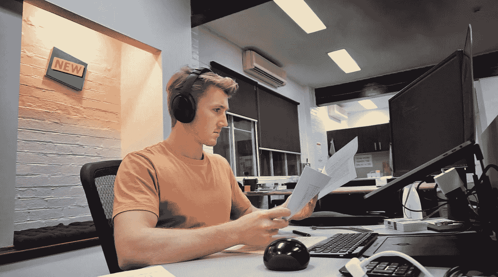
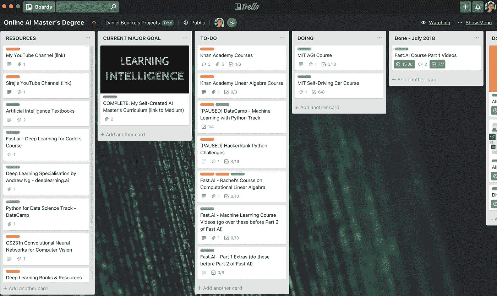

# 我如何学习深度学习——第五部分

> 原文：<https://towardsdatascience.com/how-im-learning-deep-learning-part-v-df73a535dd9?source=collection_archive---------8----------------------->

[A Day In The Life Of A Machine Learning Engineer on YouTube.](https://youtu.be/Eaj7pNeIQhs)

## 回归基础。

**重大更新:**我被聘为机器学习工程师。[麦克斯·凯尔森](http://maxkelsen.com)太牛了。我们正在研究一些很酷的东西。周一是研究日。我制作了一部短片来展示我们在做什么。

从上个帖子开始，我毕业于 [Udacity 的人工智能纳米学位](https://www.udacity.com/course/ai-artificial-intelligence-nanodegree--nd898)。这是一门很棒的课程。我拍的最好的一张。

许多人伸出手来，问自己在某个地方得到一个角色是否足够。

简短回答:*不完全是。*

稍微长一点的回答:*是的，如果你能够通过自己的项目或其他课外活动有效地交流你所学到的东西。*

我认为，工作准备来自于参加吴恩达的 deeplearning.ai 或 Udacity 的 AI Nanodegree 等课程，然后利用你所获得的知识寻找自己的项目。一些让你足够感兴趣的事情，让你去做一段时间，并与世界分享你的旅程。我还没有真正做到这一点。

有一些很棒的在线课程，但是当你在解决一个问题时，没有什么能让你做好准备，你必须自己寻找答案。

# 回归基础

我开始用深度学习学习 Python。有点像被丢在山顶而没有爬完剩下的部分。

自从在 Max Kelsen 开始工作以来，我的大部分时间都花在清理和准备数据集上，以便在上面使用机器学习和深度学习技术。

基础可能是个错误的词。但经过一些实践经验后，我发现深度学习在数据方面只是冰山一角。如果您的数据看起来像本地转储，那么准备好史诗级深度学习模型就没有意义。

俗话说的好。

> 垃圾进，垃圾出。

但是，改变这种说法是一个崭露头角的机器学习工程师或数据科学家的职责。

> 垃圾进来，美丽出去。

为了对此有所帮助，我从 Wes McKinney 那里得到了一本关于使用 [Python 进行数据分析的书。它与我们最近工作的相似之处令人震惊。](https://amzn.to/2OwIDVT)

我哥哥和我正在 [Coursera](http://bit.ly/CourseraDanielBourke) 上[应用数据科学与 Python 专业](https://bit.ly/courseraDS)。它补充了这本书。我甚至用了前几天在工作中的一个讲座中学到的精确函数。

# **未来深度学习课程**

第一部是史诗级的。我喜欢杰里米的教学方式。他是一个真正的从业者。

不过，在继续第 2 部分之前，我将先浏览一下 [Jeremy 的机器学习讲座](http://forums.fast.ai/t/another-treat-early-access-to-intro-to-machine-learning-videos/6826)和 Rachel(fast . ai 的联合创始人)[关于计算线性代数的系列讲座](https://www.youtube.com/playlist?list=PLtmWHNX-gukIc92m1K0P6bIOnZb-mg0hY)。

在这些之后，我会寻找一些基因组学和人工智能主题的课程。健康和科技的交叉让我着迷。在 Max Kelsen，我们很快将开始一项分析全基因组的项目，试图为癌症患者找到更个性化的治疗方法。我等不及了。

在不久的将来，我计划将这些技能带到营养基因组学领域，或与你的 DNA 相匹配的营养学领域。

一如既往，这些将在我的 [Trello 板](https://trello.com/b/tyHAvpcY)上显示。

# **你能做什么？**

如果你想学习深度学习和机器学习。太好了。你会经历一场地狱之旅。

但是要注意，并不是你在网上课程之外找到的所有数据都有一个整洁的小包装。

一定要称赞你的深度学习和机器学习能力，有能力获取数据集，操纵它，精心打扮它，并带它出去吃饭，你将拥有一套危险的(以好的方式)技能。

编程语言其实也不重要。挑一个坚持下去。我选择了 Python。我每天都努力提高一点。

这篇文章是一个系列的一部分，这里是其余的。

第一部分:[新的开始。](/how-im-learning-deep-learning-in-2017-part-1-632f4187ce4c)
第二部分:[动态学习 Python。](/how-im-learning-deep-learning-in-2017-part-2-5cff7967a0e4)
第三部分:[广度太多，深度不够。](/how-im-learning-deep-learning-in-2017-part-3-343598d60032)
第四部分: [AI(ntuition)对 AI(intelligence)。](/how-im-learning-deep-learning-part-iv-d26753a4e1ed)

第五部分:回归基础。(你目前正在阅读这篇文章)

号外:[我自创的 AI 硕士](http://mrdbourke.com/aimastersdegree)