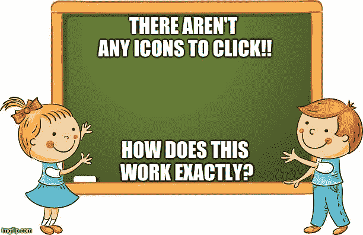
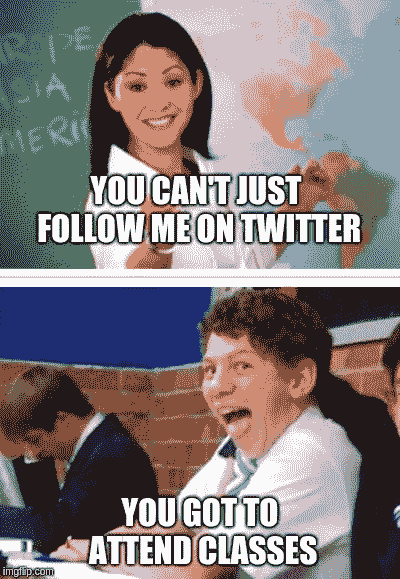

# 物联网将如何变革教育行业

> 原文：<https://towardsdatascience.com/how-iot-is-going-to-revolutionize-education-industry-f6ea952e9669?source=collection_archive---------9----------------------->

技术无处不在，它正在改变我们的生活、学习和工作方式！从汽车到洗碗机，日常用品正在成为互联设备，智能手机正在成为生活的完全遥控器。根据 Statista 的数据，预计全球“物联网”设备的安装数量将增长至近 310 亿台。如今，物联网正在改变各行各业，教育领域也不例外。传统上，学习的起源仅限于教室、会议、在线教程等，但随着物联网的出现，这开始缓慢而稳步地转向更好的方向。

那么，物联网到底能如何颠覆这个行业呢？让我们仔细看看！

**将世界各地的人们联系起来**

想象一个场景，学生坐在他们的舒适区，与世界各地的教育者和同龄人互动，所有人都可以模仿个人互动。嗯，很有可能。智能板和数字荧光笔允许将印刷文本传输到手机或任何其他设备，然后，交互式板可以接收、确认和回复信息([我们做的一个这样的试点项目的快速演示在这里](https://www.binaryfolks.com/portfolio/education/whiteboarding-and-real-time-collaboration-tool?utm_source=towards_data_science&utm_medium=Social&utm_campaign=contentmarketing_nov_2018))，使学习互动和有趣，并且人人都可以使用。

**教材增强**

还记得翻遍图书馆书架寻找参考资料和辅助材料吗？随着技术的进步，这已经成为过去。如今，几乎所有的教科书都有一个二维码，可以扫描该二维码，以便在他/她的设备上获取教科书。他们可以轻松下载或将书保存到 iBooks，并在任何地方开始阅读。更重要的是，在电子书的情况下，如果你正在寻找一些特定的东西，你可以直接搜索并立即找到它，而不是花很长时间翻阅页面来找到它。

**残疾人的援助之手**

除非你听力不好，或者你与听力好的人关系密切，否则你根本不知道什么是手语，这对依赖手语的人来说是令人沮丧的。在物联网的帮助下，手语现在可以被翻译成文本和语音。这也是确保听障人士能够获得尽可能最好的手语教育的一个很好的方式。每当戴着手套的学习者做手势时，传感器就会获取信号，进行分析，并提供关于他/她的准确性的反馈。

**提高效率**

使用物联网简化日常运营有助于更加专注于实际的教学活动，例如，自动检测学生在学校的设备可以消除考勤需求，还允许学校官员向家长发送电子消息。他们可以与物联网传感器合作，并使用它来为经过验证的进入者开门，并在出现任何不速之客的情况下向管理层发送警报。

**安全**

一所学校里有成千上万的学生，监视他们每个人的行踪和活动是一项不可能完成的任务。射频识别(RFID)芯片使用无线电波来读取和捕获数据，这些数据作为标签存储在物体上，可以在几英尺外读取，不需要在数据收集器的直接视线范围内。

这有助于当局和家长在任何给定的时间点监控学生，在增强安全性方面增加了巨大的价值。启用 GPS 的公共汽车系统意味着可以跟踪路线和公共汽车的运动。此外，学生可以在公交车到达时得到通知，从而缩短不必要的等待时间。

根据[皮尤研究中心](http://www.pewinternet.org/2018/05/31/teens-social-media-technology-2018/)的数据，95%的青少年有智能手机，45%的人说他们“几乎经常”在线。那么，有了这样的统计数据，在采用“智能学校”的学校和大学的帮助下，有什么更好的办法来尝试和引导他们持续的网瘾变得更好呢？物联网确实正在改变教育领域，让学习变得更简单、更快速、更安全。在这些技术的帮助下，地理、语言、残疾等常见的教育障碍将不复存在。然而，这仅仅是一个开始，我们才刚刚开始触及未来基于技术的教育的表面。

*最初发布于:*[*binary 乡亲*](https://www.binaryfolks.com/blog/how-iot-is-going-to-revolutionaize-education-industry)