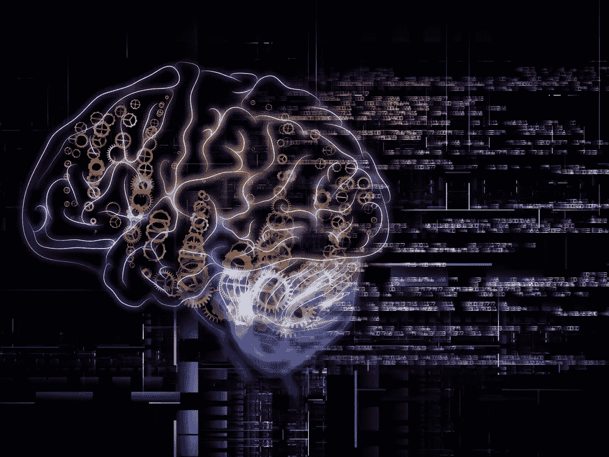

# 大型企业如何利用人工智能/机器学习

> 原文：<https://towardsdatascience.com/how-large-enterprise-can-leverage-artificial-intelligence-machine-learning-715c0bdc27ec?source=collection_archive---------2----------------------->

我们在新闻中听到了很多关于机器学习的消息，并且开始变得很难将双曲线和令人兴奋的未来主义预测与务实的现实世界商业应用分开。我热爱人工智能领域，它每天都激励着我，但人工智能往往看起来像是发生在一个遥远的先进技术领域，或者只有谷歌、脸书和亚马逊的企业在实施它。认为这是错过了一个相当大的机会，其他企业已经在利用这个机会。实际上，我认为大企业比更常见的“小”、“灵活”和“颠覆性”的创业部门有独特的优势。大型企业在实施改变游戏规则的机器学习产品或利用机器学习来获得更高的运营效率方面具有优势。这是因为大企业有两个巨大的优势。1)您有一个现有的客户分销网络。但最重要的是在机器学习的背景下，2)你有*方式*更多的专有数据来训练机器学习算法，而初创公司根本无法获得这些数据。

首先，在谈论这个话题时，你会经常听到三个常见的短语:“人工智能”、“机器学习”和“深度学习”是最常见的。把它们放在一个概念层次中考虑。“人工智能”或“AI”处于顶端，它是计算机科学的整个学科，试图使用机器/软件复制智能推理和行为。人工智能的一个特别强大的策略是所谓的“机器学习”，本质上是指通过给计算机大量数据来学习，教它做一些事情。机器学习算法实际上是非常强大的模式识别过程。在大量数据示例中查看模式是机器学习的目的。最后，“深度学习”是机器学习策略中的一个特殊算法家族，它被发现非常擅长解决以前我们无法解决的人工智能问题(对象识别、理解文本和语音)。出于本文的目的，我经常将机器学习和人工智能作为同义词，但现在你知道了，它们不是。

想想机器学习和人工智能，因为它可以应用到您的业务中，就像高级模式识别一样！ 如果你是一名企业领导者，正在阅读这篇文章，最好的办法是不要陷入技术实现或炒作，而是为自己建立一个概念镜头，这样你就可以审视你组织的各个领域，并开始注意到自己应用机器学习的机会。然后就可以更深入的看技术实现了。这里有一些问题要问你自己:

1.  **数据在哪里？**您在组织的哪个部门收集或利用大量数字数据？(这里的很多是指 10 万到 100，000，000 以上的记录。这些数据可能是客户交易、销售记录或支持票据。与应用程序的一些交互。不可能先验地说你所拥有的数据是否足够。机器学习算法需要大量高质量的数据来开始形成可靠的预测和假设。根据数据的质量，你可能需要更多。高质量的数据越多越好。在这些数据密集的领域，您可以开始利用机器学习来发现复杂的模式并加以利用。重要的是，这些数据需要是机器可读的。如果你有数百万份客户记录，但它们都在纸质文件夹中，你首先需要考虑数字化，然后才能梦想利用机器学习。一个常见的例子是使用机器学习来阐明销售线索列表中的模式，这些模式基于哪些销售线索关闭和哪些未关闭，以便您可以根据关闭概率对销售线索列表进行排序/优先排序，从而提高内部销售团队的转化率，因为他们首先将时间花在关闭销售线索的最高概率上。
2.  你在哪里做预测？您在公司的哪个部门使用数据进行预测？这通常包括财务预测、需求预测、营销预测等。预测越大，从越多的数据中进行预测，机器学习就越适用于提高这些预测的准确性。您的业务分析师可能已经使用了一种称为无监督聚类的机器学习技术来创建客户细分，但您还可以开始做更多的事情。例如，使用历史需求数据、所有 CRM 数据，甚至天气数据，实时进行高度准确的需求预测。
3.  **重复的流程在哪里？**哪些重复过程可能需要人的判断，但仍在可预测的参数或界限内。您试图使用结构良好的数据(即贷款或保险申请)评估欺诈风险或可能性，或浏览陈旧流程(大多数支持渠道请求、数据输入)的任何地方。通常，我们认为需要人类判断的独特洞察力的事情都落在某些具有非常可预测的约束和参数的老路之中。当然，总会有例外情况，比如如何评估贷款申请，但大多数都可以像人类一样准确地自动化，而将例外情况留给人类来评估。机器学习正在迅速自动化这些传统的人类活动。

现在，这些问题应该让你开始用你自己的模式识别镜头来审视你的公司，并开始想象你可以在你的公司中利用机器学习的方法。然而，一旦你看了，我可以预测你将最常看到三个直接用途中的一个。还有许多其他方法来利用机器学习，但这些通常都是唾手可得的成果。

1.  **销售优化** —销售通常是我们拥有一些机器学习最佳数据的领域。这也是实施机器学习可以获得最直接的财务影响的地方。请记住，机器学习可以识别模式，因此它可以注意到:当某些客户群最适合追加销售时，哪种类型的客户线索最有可能关闭，以及潜在客户关闭的概率，以及基于您的历史销售数据和客户档案中的模式的产品推荐系统。如果有足够的数据，所有这些实施都会对转化率产生直接影响，因为你开始将销售人员的时间优先安排在最有可能赢得销售的事情上。无论你是想雇人来定制实现这一点，还是试图使用大多数 CRM 现在提供或正在争相开发的许多交钥匙 SaaS 人工智能支持的销售优化产品，都没有关系，公司在这一领域已经获得的回报是真实而显著的。
2.  **流程自动化** —这是机器学习的一种不同用途。从自动化手动数据输入，到自动化保险风险应用评估。这是在你的公司中寻找大量使用人工决策的地方，但这些地方通常属于共同的模式、界限或约束。我已经给出了评估应用程序的示例，但我还想在这一领域中包括支持渠道自动化。如果你正在阅读这方面的内容，你肯定听说过“聊天机器人”或“对话界面”,如果实现得好，它们可以大大减轻你的支持团队的负担。这里的数据不是销售数据，而是支持票评论和客户档案。它通常不是定量数据，而是定性数据，但仍然有方法来自动化这些经典的人类判断过程。
3.  **支持人工智能的产品/功能** —这是机器学习/人工智能的一种更加无定形和创造性的应用。这就是你利用你的优势，作为一个现有的企业，可以访问所有这些专有数据和现有的客户分销网络，来部署其价值来自他们对人工智能的使用的产品。在这里，你开始审视你的客户数据和客户需求，并开始问自己，现在你可以使用人工智能/机器学习而不是人工劳动(作为一种产品/服务，这可能不具成本效益)，为客户大规模完成哪些看似类似人类的模式识别任务。这不是取代工作，这是做一些你的公司从一开始就做不到的事情，因为用人力做这件事的成本很高。

我的最后一条建议是，开始阅读大公司中人工智能的不同应用。它将开始激发你的想象力，让你有可能在自己的企业中有所建树。首先，这里有两个资源，但我发现简单地在谷歌上搜索“在[在此插入企业功能]中的人工智能应用”，往往会让你找到许多有趣的文章。这里有几个让你开始。

[德勤人工智能创新报告 2016](https://www2.deloitte.com/content/dam/Deloitte/at/Documents/human-capital/artificial-intelligence-innovation-report.pdf)
[人工智能在销售:10 家公司看](https://www.cio.com/article/3220474/artificial-intelligence/artificial-intelligence-in-sales-10-companies-to-watch.html)
[真正的商家是如何使用机器学习的](https://techcrunch.com/2016/03/19/how-real-businesses-are-using-machine-learning/)

最后，一旦你准备好继续前进，组建/雇佣一个小团队，开始探索潜在的应用。这种价值很大程度上取决于数据的质量、相关性和数量，因此在开始试验数据、阐明有趣的模式并进行试点以测试其影响之前，你无法确切知道其影响。