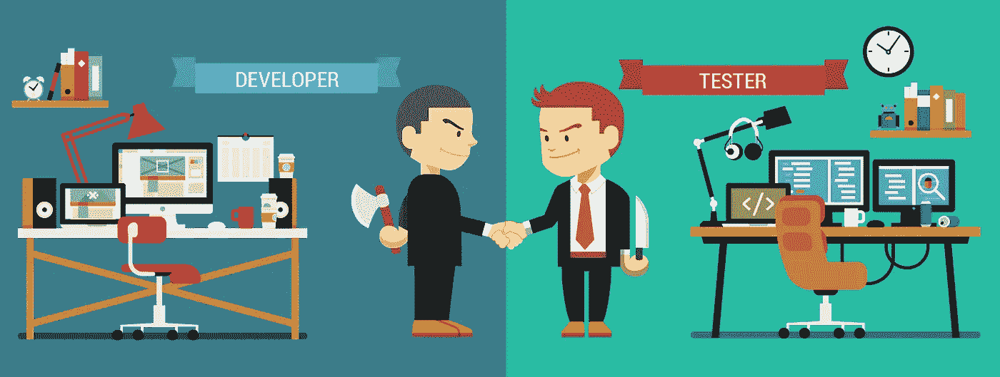

# 机器学习和人工智能如何给软件测试带来新的维度

> 原文：<https://towardsdatascience.com/how-machine-learning-and-ai-bring-a-new-dimension-to-software-testing-7b2b6ea67b61?source=collection_archive---------1----------------------->

看起来，软件测试行业从未停止，并且一直在发展。根据 2017 年测试调查的[状态，未来是自动化测试，因为 62%的受访者认为未来几年将会增加。根据同一份报告，我们还可以预计测试人员将花费更多的时间和资源来测试移动和混合应用程序，而花费在实际开发上的时间将会减少。](https://smartbear.com/SmartBear/media/ebooks/The-State-of-Testing-2017_Report_Final.pdf)

虽然这些因素很大，但没有一个因素(测试自动化、更短的开发周期或专注于移动和混合应用程序)像新兴的机器学习技术一样真正改变了测试游戏。

机器学习现在正在各行各业成功应用，那么问题来了，机器学习和人工智能会如何影响软件测试？他们真的会增强它吗？

阅读这篇文章，了解软件测试和质量保证在机器学习和人工智能时代是如何发展的。

# 传统测试方法的头号挑战

软件测试曾经是一项简单直接的任务。只要我们知道系统在用例中是如何表现的，输入一个输入并比较结果和期望就相对容易了。匹配意味着测试通过。如果有不匹配，警报就会响起，因为我们有一个潜在的错误，需要重新开始来修复它。

在这样一个传统的场景中，测试人员会仔细检查清单，以确保潜在用户的步骤和行为都被覆盖，问题得到解决。然而，由于消费者在某种意义上变得越来越苛刻，越来越缺乏耐心，传统的测试方法往往跟不上他们的步伐。

主要问题在于测试人员需要在他们目前通常拥有的有限时间内处理大量的数据。仅仅这一点就将传统的测试方法排除在外，需要一种更相关的方法。也就是说，由人工智能、机器学习和预测分析驱动的那个。

# 交给机器:不再有人工干预(和错误)

传统的测试技术仍然依赖于人类来获取和分析数据。但是我们只能说，人类并不是一贯正确的，并且很容易做出错误的假设。

处理数据的时间越少，测试产生错误结果的机会就越大，软件中的错误就被忽略了。在你知道之前，消费者会发现这些缺陷，这通常会导致沮丧和破坏品牌的声誉。

这就是为什么机器学习，它教会系统在未来学习和应用这些知识，使软件测试人员得出比传统测试更准确的结果。更不用说出错的概率并不是唯一降低的。执行软件测试和发现可能的错误所需的时间也缩短了，而需要处理的数据量仍然可以增加，而不会给测试团队带来任何压力。

# 使用预测分析来预测客户需求

随着市场需求的增长，企业需要找到比竞争对手领先一步的方法，并能够预测消费者的需求。预测分析在质量保证和软件测试中发挥着关键作用，因为它允许企业分析客户数据，以更好地了解(和预测)他们想要什么样的新产品和功能。

在这一点上，机器学习和预测分析在今天的软件测试和 QA 中齐头并进。它们对于一个不间断的、更短的测试过程都是必要的，最终会带来更好的用户体验。

# 机器学习在 QA 和软件测试中的位置？

人工智能和机器学习无疑也正在成为质量保证和软件测试的重要组成部分。

专家们对这一切可能带来的前景感到兴奋。例如，埃森哲欧洲、非洲和拉丁美洲的董事总经理兼测试服务负责人 Shalini Chaudhari 在接受 [QA Financial](https://www.qa-financial.com/news-video/machine-learning-qa-using-data-super-charge-testing) 采访时表示，人工智能起飞的原因是物联网突破带来的巨大数据可用性，以及不再仅限于专业研究机构的不断增长的计算能力。

# 结论

机器学习让测试人员有机会更好地了解他们客户的需求，并对他们不断变化的期望做出比以往更快的反应。此外，测试人员现在还需要分析越来越多的数据，而给他们的时间却越来越少，同时他们的误差幅度也在不断减小。机器学习和预测分析等工具提供了一种解决这些挑战的方法，要么通过精通测试的内部团队，要么如果情况不是这样，转向 [QA 外包](https://www.a1qa.com/outsourcing/)。无论如何，这种方法将填补传统测试方法的空白，并使整个过程更有效，更符合用户的需求。