# 机器学习如何为你构建应用

> 原文：<https://towardsdatascience.com/how-machine-learning-builds-your-applications-for-you-965cf0c50dba?source=collection_archive---------2----------------------->

**© 2013 Les Stone**

## 或者说用户架构师和机器学习有什么关系？

用户架构师是系统的用户。甚至在这个系统存在之前，它们就以一种模糊不清的方式进入我们的大脑。我们想象这些角色将会是系统的使用者。我们想象和虚构的用户然后形成用户档案。我们向这些用户授予特性。我们赋予他们人格，然后用黑魔法让他们复活。或者，如果不能让他们活起来，至少要清除和洗掉一些模糊我们对他们的看法的因素。

对我们来说，黑魔法只不过是构建一个满足用户需求的应用程序。提供我们认为有用甚至是必要的功能。关于这些需求是什么，我们有大量以前的信息。我们也有足够的证据表明我们将整合哪些功能并赋予其价值。然而，这些证据并不能保证这个系统是一个完美的，甚至是好的解决方案。

为了尝试和设计更完美的解决方案，我们回到用户身边，收集他们的行为。在这个过程开始时，我们进行了调查和采访，但是，这只是我们的第一反应。它没有提供打造良好用户体验所需的深度信息。为突破性特征或前沿功能提供一个计划是不够的。尽管如此，这是一个起点，让我们能够生产出最低限度的可行产品。一个成熟的应用程序将从中成长和发展的产品。

从这个意义上说，它让我们进入了下一个阶段，是不断改进系统的关键一步。让用户告诉我们应用程序的第一步是提供词汇表。通过这种方式，他们开始在系统的架构中发挥作用。他们已经告诉我们他们对应用程序中使用的语言的理解。如果一个应用程序提供了处理数据的方法，那么我们必须知道用户所说的“数据”是什么意思。这个阶段的设计可能有点像泥巴，但我们能够从中找到真理。

# 让应用程序告诉我们用户想要什么

提供软件的悠久历史让我们看到了用户经历的痛苦和问题。我们的灵感是缓解这些痛苦和问题。询问用户他们遇到了什么样的痛苦和挫折使这一点成为焦点。他们面临的问题反复出现，使得简单的任务变得艰巨。寻求减轻负担的系统往往过于复杂。

所有的工程师，包括软件工程师，都倾向于过度工程化。用户可以，也确实要求太多琐碎的功能，这些功能极大地扰乱了他们的生活。我们如何发现什么是本质的，什么是杂乱的？我们如何沿着持续改进的道路前进？是的，我们要求我们的用户，但是以不同的方式，我们要求他们向我们展示。

一个处理数据并提供分析的应用程序应该知道用户如何对数据提出问题。它应该观察并记录他们是如何做的，以及他们收集了什么结果集。为了使应用程序更容易使用，它应该能够预测用户提出的问题。它应该能够建议他们将需要数据的哪些部分，以及如何最好地呈现。

机器学习是实现这一目标的理想工具。这可以手动完成，但需要观察以多种不同方式询问的大量查询。手动这一过程将需要亿万年。在计算上，我们可以编写一个程序，查看所有选项，并有规则来决定输出应该是什么。这将花费大量的时间和精力来设计和编写。我们没有时间做这个，应用程序需要更快地响应。使用机器学习，我们可以实现一个网络来承担这项任务，这将大大缩短时间。它还需要到达一个能快速适应的位置。它需要在描述它正在响应的时间长度内做出响应。

**© 2013 Les Stone**

过去，我们会让用户参加研讨会，捕捉并观察他们的行为。我们观看并记录他们做了什么以及如何做的实验环节。这种收集数据的方法提供了定性信息，但缺乏定量信息。没有足够的数据来支持从小样本中收集的观点。即使对焦点小组进行了最仔细的选择，还是会出现观点偏颇的风险。监督学习算法可以取代这种类型的实验室会议，并产生更好的结果。

# 通过反复做来学习。

观察和记录用户的质量是明确的。然而，没有定量数据，就无法确保所需的平衡。获得洞察力需要适度测量定量和定性数据输入。

从观察用户中获取数据所需的人力和精力是昂贵且耗时的。然而，重复性和耗时的任务是软件非常适合的。机器学习，特别是深度学习和神经网络，由大量数据滋养*。*

深度学习也擅长从少量数据中归纳，最近关于使用深度学习逼近函数的[工作](https://arxiv.org/pdf/1608.08225v2.pdf)指出；“深度学习的成功不仅取决于数学，也取决于物理:尽管众所周知的数学定理保证神经网络可以很好地逼近任意函数，但实际感兴趣的函数类可以通过“廉价学习”来逼近，其参数比一般函数少得多，因为它们具有可追溯到物理定律的简化属性。”

深度学习(DL)是机器学习(ML)的一种类型，深度学习中有子集。深度神经网络(DNNs)；通常用于表格数据集。卷积神经网络(CNNs 通常用于图像数据。递归神经网络；通常用于时态数据。下图显示了由神经元和相互连接的突触组成的神经网络中的多个层。

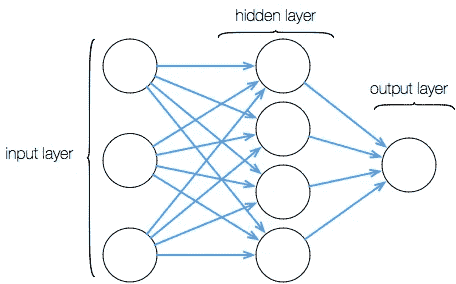

当软件能够参与自己的设计时，它就变得自省，变得有用。捕捉用户与系统的交互收集了新的数据语料库。能够对数据的各个部分进行分类将数据暴露给分析，使用户能够通过使用系统的简单过程来设计应用程序。让我们考虑一下这在实践中是如何运作的。我们将通过检查提供数据分析系统的软件应用的可能性来做到这一点。

**© 2013 Les Stone**

在一个旨在捕捉数据、混合数据、分类数据和探索数据的系统中，各个步骤可以相互分离。捕获数据需要用户将文件上传到系统或将系统插入源。对于此图，让我们看看机器学习如何帮助优化捕获过程。

上传文件需要找到它们，而且通常需要添加一些描述性信息。这同样适用于插入式数据源，一个 API 很可能有一个描述性名称或者一个名称和一个描述。

查找正确的文件和具有正确内容的文件时可能会出现问题。在上传时添加的描述性信息可以提供密钥。如果用户上传一系列电子表格并添加描述(例如“每周销售额”)，系统就能够执行特定的任务。

在上传时，应用程序可以检查文档的结构，并计算单词或模式的实例。它可以检测样式和布局的属性。它可以查看数学或公式的类型。它可以计算数据类型的出现次数，例如:字符串或文本、整数或数字。

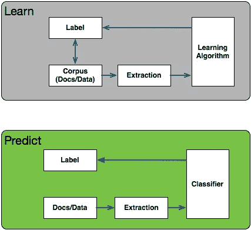

格式可以揭示其他数据特征，如:浮点数、小数、文本、运算符。然后，一系列模式和子模式可以与描述中的摘录相结合。一旦这些组合暴露在分类过程中，系统就学到了一些东西。它已经自学了“销售”文档可能是什么样子。然后，它可以用“每周”、“每月”、“每季度”或“每年”做同样的事情。

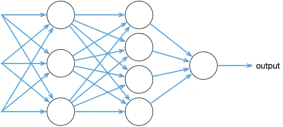

这同样适用于诸如“销售”、“采购”、“订单”或“发票”等标签。一旦它学会了这一点，而不是要求分类，它将能够预测描述符合什么。应用程序可以问用户“你想处理月度数据吗？”。然后，系统能够查找包含以月为间隔构建的数据的文档或数据源。

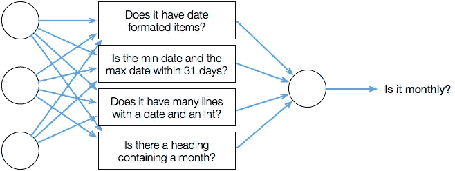

系统对数据检查得越多，它学到的东西就越多，也就越确定自己学到了什么。问题是谁在教谁？机器是自动学习的吗？是的，但是是用户在教它这些描述适用于什么数据的限制和范围。用户是分类过程所利用的语言的原始来源。

收集用户输入、描述和后续查询的摘录作为元数据。该元数据、上传的数据集、查询和查询结果集是学习过程的来源。标签是从这些描述中提取出来的，算法是为了对不同的部分进行加权而编写的。数据集的结构与查询传递的结果集和输出一样分类。

# 说到做到——来自机器学习

机器，或深度学习，接受用户输入并预测行动。这些预测改进了界面，这是系统架构变化的起源。这就是从用户动作中获取的数据如何构建应用程序。它类似于一个进化过程，因为它提供持续的改进。应用越来越好。

随着应用程序理解自然语言查询能力的提高，部分界面可能会被替换。“月”、“季度”、“年”的选择功能可能会被弃用。应用程序将学习提供相关的摘要报告和可视化，以响应:"给我欧洲最近 4 个月的销售数据."，“在接下来的 12 周内，我们需要开始订购什么？”，“如果这个价位提高. 5%会怎么样？”。该系统将学习期望它提供什么报告，并在请求它们之前产生它们。

对许多软件工程师来说，这似乎是对系统架构应该如何设计的彻底背离。很长一段时间以来，计算机科学似乎更乐于忽视用户。许多人认为从采购软件的人那里获取规范，然后构建功能来交付规范是正确的途径。然后出现了一个更开明的观点，即观察用户交互有一定的价值。现在，将用户交互的结果融入到设计中似乎势在必行。

可以收集和存储通过详细日志记录存储的用户交互。监督机器学习从例子和经验中学习，而不是从硬编码规则中学习。处理大量用户输入的可能性打开了新的大门。随着大量不断增长的数据，机器学习将有所借鉴。

软件编写软件，每一种编译语言在编译时都是这样做的。软件创造本身已经被抑制了，人工智能暗示这种选择在某种程度上现在是可能的。现在，软件能够提供一些工具来改进自己。其中最明显的是自动化测试。另一个是跟踪用户如何使用应用程序。

机器学习将应用程序的用户转变为应用程序的架构师，这导致他们成为 ***用户架构师*** 。真正构建应用程序的是用户使用应用程序所获得的用户数据。从这个意义上说，更好的做法是将他们视为 ***数据架构师*** ，因为我们正在考虑一个主要任务是处理数据的应用程序。

深度学习能够在编写软件应用程序中发挥重要作用，并揭示新的方法。这将使编写软件的整个概念从一个主要的工程学科向一个自然科学学科靠拢。下面给出了机器学习和深度学习如何帮助这种转变的简单说明。

## 机器和深度学习如何设计自己。

使用网格搜索并通过学习算法的超参数空间来精炼应用的模型，并在训练集上交叉验证它，这是使用机器学习来微调算法并发现新算法的方式。通过优化算法的性能来优化学习算法的超参数，是模型变得自省的一种方式。

最近的一篇论文指出，现代计算机视觉的最大突破是学习如何直接从数据中优化算法，从循环中去除人工工程。由长短期记忆网络 **(** LSTMs)执行的学习算法，在它们被训练完成的任务上胜过一般的、手工设计的竞争对手

鉴于深度信任网络、卷积网络和基于特征提取的分类器通常包含[十到五十个超参数](https://papers.nips.cc/paper/4443-algorithms-for-hyper-parameter-optimization.pdf)，因此毫不奇怪，诸如超参数优化的强力随机搜索等策略是所有学习算法中有趣且重要的组成部分。在[模型选择](http://auai.org/uai2014/proceedings/individuals/229.pdf)中使用机器学习也是一项有趣的工作，它与程序合成和归纳编程并行。

也已经完成了使用递归网络来生成卷积架构的架构的工作。它基于这样的观察，即神经网络的结构和连通性通常可以由可变长度的字符串来指定。

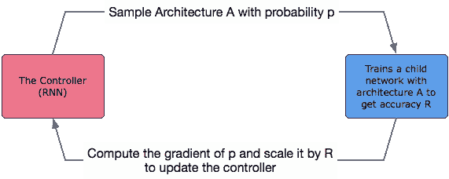

发现'[神经架构搜索可以从零开始设计好的模型](https://arxiv.org/pdf/1611.01578v1.pdf)。像设计算法的例子一样，网络正在创建神经网络的架构超参数。在许多方面，人工设计神经网络的架构比设计算法更具挑战性。

## 机器和深度学习如何编写函数

举个简单的例子，机器学习可以通过看例子来定义函数。标准编程遵循以下过程:为一个函数设置规范，然后实现该函数以满足规范。

机器学习允许给出( *x，y* )对的例子，从这些例子中我们可以猜出函数 *y = f(x)* 。

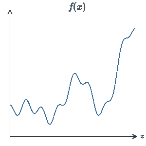

对于任何函数，对于 x 的每个输入都有一个神经网络，值(x)从该网络输出。我们可以从 *x=1* 和 *f(x )* =1 开始，这与我们的训练数据相匹配，但是当我们输入 *x = 2* 和 *f(x)* =5 时，它会失败，因为训练数据显示 x = 3。单个输入和层将不能预测我们正在寻找的功能。如果我们的训练数据非常干净，比如 2，3，5，8，13，21，34，那就不一样了

我们可以有多个输入，并试图创建一个单一的输出，我们正在寻找的输出是一个函数，以预测当 x =n 时，y 会是什么。从我们的例子对(其中我们知道什么是 x 和 y)X1[`2, 3, 1.5],X2[3, 5, 1.66],X3[n,n,n]`

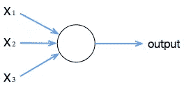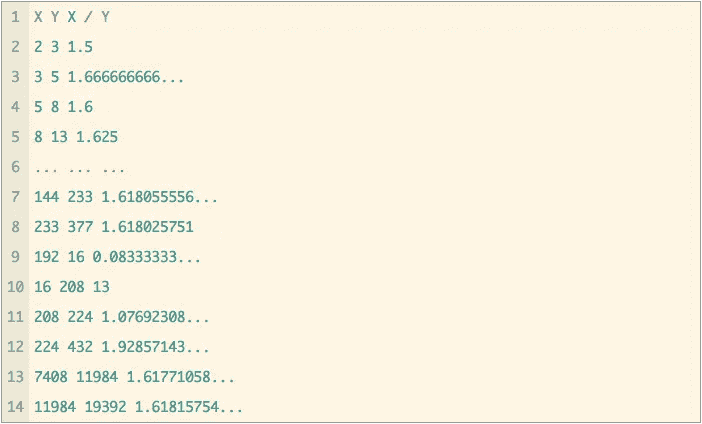

输出(x)可以由以下函数表示

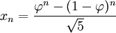

在 Clojure 这样的函数式语言中，这可以写成:

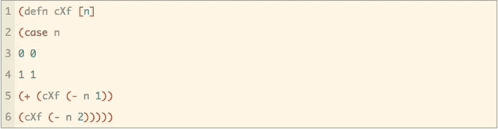

深度学习采用示例 *x，y* 对，并在几个抽象层次上形成它们的表示，以产生对小说 *x* 很好概括的函数

使用深度学习来产生一个函数的众多优势之一是，如果该函数有许多输入，Ǭ=Ǭ(x1，…，x *m* )和许多输出，它也可以工作。

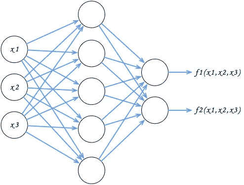

虽然这是一个非常简单的例子，并且有许多方法可以生成斐波纳契数列，但是从数据中导出函数的过程有许多可能性。

我们想要生成的程序是一个相当简单的数学运算序列，比如使用上一个运算的输出和上一个运算的输出。使用递归神经网络，其中控制器输出下一个操作应该是什么的概率分布。它会执行所有可能的操作(例如乘、加、除、减)，然后对输出进行平均。因为我们能够定义导数，只要问题的结果是已知的，程序的输出是可微的，损失是可以计算的。因此，网络能够被训练成[诱导程序](https://arxiv.org/pdf/1511.04834v3.pdf)提供正确的答案。

## 编写源代码

设计算法和架构离用 AI 写程序只有一步之遥。中间步骤可以包括使用神经网络来预测函数出现在源代码中的概率，而不是预测整个源代码。 [DeepCoder](https://arxiv.org/pdf/1611.01989v1.pdf) 是一个提出使用神经网络来“指导搜索与一组输入输出示例一致的程序”的项目。

而对程序综合的初步研究将集中在特定领域语言上。使用受限语言(如 SQL)进行搜索比使用全功能语言(如 python)更容易。查询日志还将提供输入源。网络公司的目标是[创造模型](https://arxiv.org/pdf/1612.00817.pdf)，将程序表现为简单、自然的源代码，即人们编写的那种源代码。

学习如何编写新程序的机器已经使用学习表示和解释程序的架构开发出来。

## 动态程序

语音识别方面的进步，但更重要的是[序列到序列学习](https://arxiv.org/pdf/1409.3215v3.pdf)和允许[神经网络相互通信的技术](https://deepmind.com/blog/decoupled-neural-networks-using-synthetic-gradients/)将影响程序的构建方式。对世界的推理是有序的，这些序列中有一些潜在的随机结构。递归神经网络(RNNs)和随机状态空间模型(SSMs)被广泛用于建模序列数据，[随机递归神经网络](https://arxiv.org/pdf/1605.07571v2.pdf)结合了这两种模型。

设想一个将自然语言查询与程序合成结合起来的应用程序并不太困难。通过提供语音驱动指令集，合成程序将通过搜索可能的功能来匹配这些输入，并设计新的输出。这样，它将创建一个程序来动态地交付所需要的东西。

要做到这一点，网络需要自己的工作记忆。信息的短期存储及其以简单子程序形式进行的基于规则的操作将在运行中创建功能和算法，并设计自我修改的体系结构。而短期存储器将用于保存变量，长期和可重写存储器将用于存储将通过自我学习而改变的例程。

向神经网络添加内存是一个相当明显的步骤[可微分神经计算机](https://deepmind.com/blog/differentiable-neural-computers/)就是这样做的，使网络能够利用知识进行思考或推理。除了使学习过程更有效和计算要求更低之外，它将允许核心程序的持续修改。这将使基于经验的改进成为可能。

> *神经网络和深度学习被 Michael A. Nielsen 描述为“有史以来发明的最美丽的编程范例之一”**

首次发布【2016 年 4 月 14 日

> 致谢。
> 
> 本文中的所有图片均由摄影师 Les Stone 在 2013 海地伏都教仪式 20 年间拍摄。它们发表在互联网上的其他地方，我在这里分享它们(至今未经作者许可)，以反映我个人对他的工作的钦佩。溴
> 
> * [迈克尔·a·尼尔森](http://neuralnetworksanddeeplearning.com/about.html)《神经网络与深度学习》，决心出版社，2015 年

## 参考

为什么深度廉价学习效果这么好？[https://arxiv.org/pdf/1608.08225v2.pdf](https://arxiv.org/pdf/1608.08225v2.pdf)

通过梯度下降学习
通过梯度下降学习[https://arxiv.org/pdf/1606.04474v2.pdf](https://arxiv.org/pdf/1606.04474v2.pdf)

超参数优化算法[https://papers . nips . cc/paper/4443-algorithms-for-Hyper-Parameter-Optimization . pdf](https://papers.nips.cc/paper/4443-algorithms-for-hyper-parameter-optimization.pdf)

基于序列模型的集成优化[http://auai.org/uai2014/proceedings/individuals/229.pdf](http://auai.org/uai2014/proceedings/individuals/229.pdf)

用【https://arxiv.org/pdf/1611.01578v1.pdf 强化学习
搜索神经架构

DEEPCODER:学习写程序[https://arxiv.org/pdf/1611.01989v1.pdf](https://arxiv.org/pdf/1611.01989v1.pdf)

TERPRET:一种概率编程语言
用于程序归纳[https://arxiv.org/pdf/1612.00817.pdf](https://arxiv.org/pdf/1612.00817.pdf)

神经程序员-解释器[https://arxiv.org/pdf/1511.06279.pdf](https://arxiv.org/pdf/1511.06279.pdf)

神经程序员:用梯度下降诱导潜在程序[https://arxiv.org/pdf/1511.04834v3.pdf](https://arxiv.org/pdf/1511.04834v3.pdf)

用神经网络进行序列对序列学习[https://arxiv.org/pdf/1409.3215v3.pdf](https://arxiv.org/pdf/1409.3215v3.pdf)

使用合成梯度解耦神经接口[https://deep mind . com/blog/decoupled-Neural-networks-Using-Synthetic-Gradients/](https://deepmind.com/blog/decoupled-neural-networks-using-synthetic-gradients/)

具有随机层的序列神经模型[https://arxiv.org/pdf/1605.07571v2.pdf](https://arxiv.org/pdf/1605.07571v2.pdf)

可微分神经计算机[https://deepmind.com/blog/differentiable-neural-computers/](https://deepmind.com/blog/differentiable-neural-computers/)