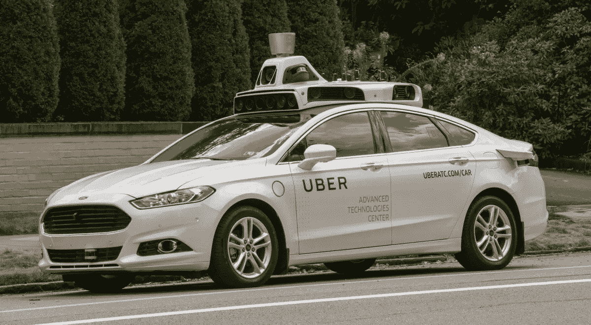

# 机器学习可能如何帮助千禧一代买房子和继承未来

> 原文：<https://towardsdatascience.com/how-machine-learning-might-help-millennials-buy-a-house-and-inherit-the-future-bfc3685e02bd?source=collection_archive---------7----------------------->

[https://cdn.theatlantic.com/assets/media/img/2012/08/21/0912-COL-Millenials-wide/lead_large.jpg?1429717181](https://cdn.theatlantic.com/assets/media/img/2012/08/21/0912-COL-Millenials-wide/lead_large.jpg?1429717181)

如今，似乎你必须成为顶尖的计算机专家才能获得成功，尤其是在机器学习和人工智能被大肆宣传的情况下。但我认为你真正需要做的是跳出框框思考。当然，[机器学习现在正在让人们赚钱](https://medium.com/towards-data-science/6-ways-people-are-making-money-with-machine-learning-db10575f3564)，但是有一场革命正在进行，我认为它可能会影响硅谷技术魔法之外的事情。我相信每个千禧一代都会受益。那么这和买房有什么关系呢？

千禧一代不买房，[主要是因为买不起入门级的房子。](https://www.cnbc.com/2017/05/26/most-millennials-want-to-buy-a-home-but-about-half-have-nothing-saved.html)[千禧一代倾向于住在市区](https://livability.com/topics/real-estate/where-do-millennials-live)，需要住得离他们工作的地方近一些(尽管他们更愿意住在郊区)，所以今天他们租房住，希望有一天他们能负担得起美国梦。这种情况似乎充满了绝望和灾难，但我知道千禧一代可能会如何利用人工智能革命，在这个新世界住房市场中比你想象的更富裕。

重大技术进步可以改变整个行业，或者创造全新的赚钱方式。喷气发动机让整整一代企业可以在一天之内穿越全国或海外，无论是运送货物还是举行面对面的会议。航空业会变成我们今天所知道的样子，这在当时似乎并不明显。想一想所有全新的市场、经济和商业类型，它们今天因为互联网而蓬勃发展；音乐流媒体、快递服务、加密货币、社交媒体……太疯狂了。

我相信我们正处于另一场机器学习的技术革命中。我知道这么说很流行，但我每天都生活在其中，感受着它，我看到了它对商业经济的影响。但是住房呢？

在旧金山湾区，交通绝对是一场噩梦。糟糕的是，离我们工作地点更近的住房需求非常高，这反过来推动了价格上涨。如果你出门[离城市](http://www.estately.com/bay-area-home-affordability-transit-stop)足够远，房价会大幅下跌。我认为这将会改变，因为有一项非常有前途的技术；自动驾驶汽车。

[http://static6.businessinsider.com/image/57d84375077dcc21008b5865-1200/uber-self-driving-car.jpg](http://static6.businessinsider.com/image/57d84375077dcc21008b5865-1200/uber-self-driving-car.jpg)

2027 年，[的交通可能会因为特斯拉](https://phys.org/news/2017-05-self-driving-cars-traffic.html)而消失。那栋远离以前不受欢迎的位置的房子现在更受欢迎，因为住在城市附近的压力已经消失了。我们现在可以分散开来，知道上班的通勤时间(假设由于增强现实，我们真的需要在办公室工作)不再是距离的反函数。

因此，千禧一代可能会在今天对通勤来说是噩梦的地方购买这些更便宜的房子，但在其他方面却非常令人向往，并收回他们承诺继承的美国梦。