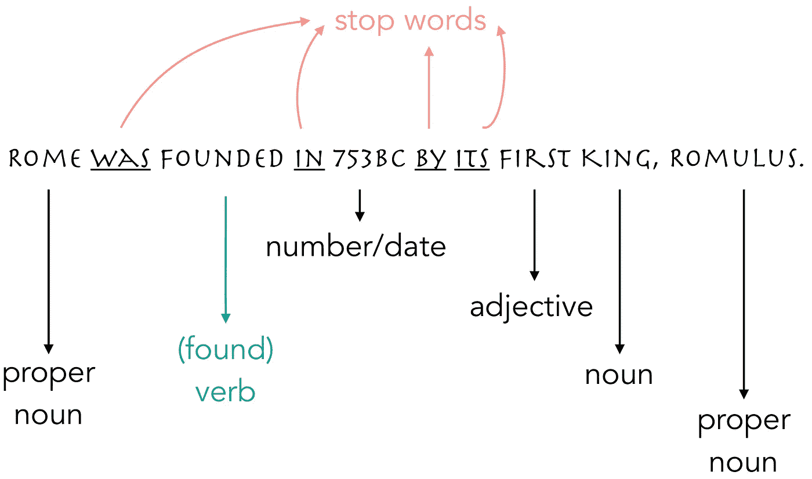

# 机器如何理解我们的语言:自然语言处理导论

> 原文：<https://towardsdatascience.com/how-machines-understand-our-language-an-introduction-to-natural-language-processing-4ab4bcd47d05?source=collection_archive---------5----------------------->


Photo by [Tatyana Dobreva](https://unsplash.com/photos/U7RdV0fKIsc?utm_source=unsplash&utm_medium=referral&utm_content=creditCopyText) on [Unsplash](https://unsplash.com/search/photos/rome?utm_source=unsplash&utm_medium=referral&utm_content=creditCopyText)

对我来说，自然语言处理是数据科学中最迷人的领域之一。机器能够以一定的准确度理解文本内容的事实令人着迷，有时甚至令人害怕。

自然语言处理的应用是无穷无尽的。这是机器如何分类一封电子邮件是否是垃圾邮件，如果评论是正面或负面的，以及搜索引擎如何根据您的查询内容识别您是什么类型的人，以相应地定制响应。

但是这在实践中是如何运作的呢？这篇文章介绍了自然语言处理的基础概念，并重点介绍了在 *Python* 中使用的`nltk`包。

> 注意:要运行下面的例子，您需要安装`nltk`库。如果没有的话，开机前在你的 shell 中运行`pip install nltk`，在你的笔记本中运行`nltk.download()`即可。

无论输入机器的是什么文本或句子，都需要首先进行简化，这可以通过*标记化*和*词条化*来完成。这些复杂的单词意味着一些非常简单的事情:标记化意味着我们将文本分解成*标记*，根据具体情况分解成单个或成组的单词。词汇化意味着我们将一些单词转换成它们的词根，即复数变成单数，共轭动词变成基本动词等等。在这些操作之间，我们还从文本中清除所有不携带实际信息的单词，即所谓的*停用词*。

让我们看看下面的句子，用一个例子来理解这一切意味着什么。



Example of tokenization and lemmatization for ngrams = 1.

对文本进行分词时，相应地选择 *ngram* 很重要。它是指定我们希望每个令牌包含多少单词的数字，在大多数情况下(就像上面的例子)，这个数字等于 1。但是，如果你在一个商业评论网站上进行情绪分析，你的文本可能会包含“不高兴”或“不喜欢”这样的语句，你不希望这些词相互抵消，以传达评论背后的负面情绪。在这种情况下，您可能需要考虑增加 ngram，看看它对您的分析有何影响。

在进行标记化时，还需要考虑其他因素，例如标点符号。大多数时候你想去掉任何标点符号，因为它不包含任何信息，除非文本中有有意义的数字。在这种情况下，您可能需要考虑保留标点符号，否则文本中包含的数字将在出现`.`或`,`的地方被拆分。

在下面的代码中，我使用了`RegexpTokenizer`，一个正则表达式标记器。对于那些不熟悉正则表达式的人来说，在形式语言理论中，它是一个定义模式的字符序列，根据您在`RegexpTokenizer`函数中传递的参数，它将根据该参数分割文本。在一个正则表达式中，`\w+`字面意思是将所有长度大于或等于 1 的单词字符分组，丢弃空格(从而标记单个单词)和所有非单词字符，即标点符号。

Tokenizing with RegexpTokenizer.

这段代码生成的令牌列表如下:

```
tokens = ['Rome', 'was', 'founded', 'in', '753BC', 'by', 'its', 'first', 'king', 'Romulus']
```

这是一个不错的开始，我们有了由单个单词组成的令牌，标点符号不见了！现在我们必须从令牌中删除停用词:幸运的是，对于许多不同的语言，`nltk`中包含了停用词列表。但是当然，根据具体情况，您可能需要定制这个单词列表。例如，文章*默认包含在此列表中，但是如果您正在分析一个电影或音乐数据库，您可能希望保留它，因为在这种情况下，它确实有所不同(有趣的事实:*帮助*和*帮助！*是两部不同的电影！).*

*Discarding the stop words from a text.*

*新令牌列表是:*

```
*clean_tokens = ['Rome', 'founded', '753BC', 'first', 'king', 'Romulus']*
```

*我们从 10 个单词增加到 6 个单词，现在终于到了词汇化的时候了！到目前为止，我已经测试了两个具有相同目的的物体:`WordNetLemmatizer`和`PorterStemmer`，后者肯定比前者更残忍，如下例所示。*

*Lemmatization example with WordNetLemmatizer.*

*最后一个列表理解的输出是:*

```
*['Rome', 'founded', '753BC', 'first', 'king', 'Romulus']*
```

*什么都没变！这是因为`WordNetLemmatizer`只作用于复数单词和一些其他的东西，在这个特殊的例子中，没有单词真正被词条化。另一方面,`PorterStemmer`转换复数和衍生词、动词，并使所有术语小写，如下所示:*

*Lemmatization example with PorterStemmer.*

*列表理解的输出是:*

```
*['rome', 'found', '753bc', 'first', 'king', 'romulu']*
```

*在这种情况下，没有大写字母的单词了，这对我们来说是没问题的，因为仅仅因为一个是小写字母而另一个不是，区分相同的单词是没有意义的，它们有相同的意思！动词 *founded* 已经改成了 *found* 甚至 *Romulus* 都把自己名字的最后一个字母弄丢了，可能是因为`PorterStemmer`以为是复数词。*

*这些引理化函数非常不同，根据具体情况，一个会比另一个更合适。*

*在建模之前，有许多不同的方法来收集和组织文本中的单词，这些只是可用选项的一小部分。在将文本输入机器学习模型以尽可能简化它之前，所有这些清理都是必要的。当你在预测模型中分析大量词汇时，在完成上述步骤后，你将很可能依靠`[CountVectorizer](http://scikit-learn.org/stable/modules/generated/sklearn.feature_extraction.text.CountVectorizer.html)`、`[TfidfVectorizer](http://scikit-learn.org/stable/modules/generated/sklearn.feature_extraction.text.TfidfVectorizer.html#sklearn.feature_extraction.text.TfidfVectorizer)`或`[HashingVectorizer](http://scikit-learn.org/stable/modules/generated/sklearn.feature_extraction.text.HashingVectorizer.html#sklearn.feature_extraction.text.HashingVectorizer)`等`sklearn`方法，将原始文本转换成一个令牌计数的矩阵来训练你的预测模型。*