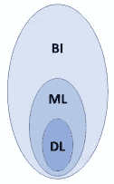
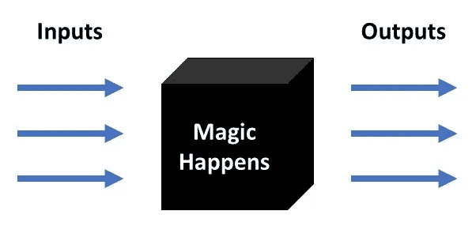
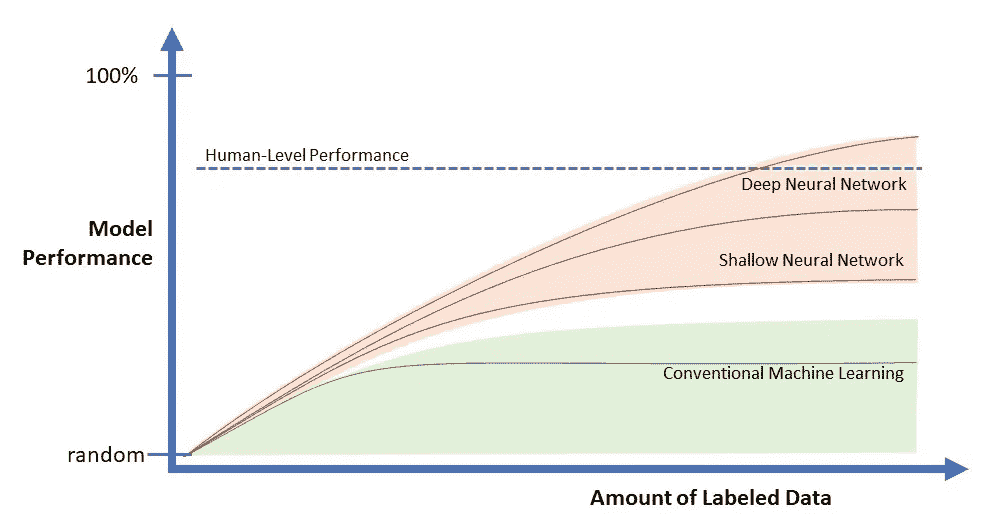

# 管理者应该如何为深度学习做准备:新范式

> 原文：<https://towardsdatascience.com/how-managers-should-prepare-for-deep-learning-new-paradigms-28de63054ea6?source=collection_archive---------7----------------------->

Exploring the unique challenges for managing analytic systems enabled by Deep Learning *[photo by* [*Charlie Wild*](https://unsplash.com/photos/dKb_2w88rsk) *on* [*Unsplash]*](https://unsplash.com/@charles_the1st)

> 本文是关于深度学习 的**管理视角系列文章的第一篇，该系列文章面向参与或负责由使用人工神经网络技术的**深度学习** (DL)实现的分析系统的管理人员。在处理这些系统时，他们面临混乱的概念和独特的挑战。这篇文章关注的是**新范例**，这些范例引导这些管理者思考 DL 的基本性质。[1]**

作为一名大学教授、软件企业家和行业分析师，我的职业生涯一直在大型信息技术(IT)系统中探索。在过去的五年里，这一焦点已经集中在商业分析上，特别是在由神经网络技术驱动的深度学习(DL)上。我最近完成了深度学习领域的 Coursera 专门化[课程](https://www.coursera.org/specializations/deep-learning)和[反思其含义](/deep-issues-lurking-within-deep-learning-f923a96564c7)。[2]

> *注意:我不喜欢这些文章中的术语*深度学习*，尤其是*人工智能*，因为它们有令人困惑的含义和分散注意力的包袱。正确的技术术语是*人工神经网络 *(ANN)。所以，想象下面 DL = ANN。*

DL 与传统的机器学习有独特的区别，尤其是在企业系统的环境中。此外，DL 有潜力以今天无法想象的方式增强这些系统，无论是好的还是不好的。

# IT-DL 断开

在企业系统中正确采用 DL 的一个主要障碍是 IT 专业人员和 DL 实践者之间概念上的脱节。这两个群体对基本原则有不同的想法——问题陈述、数据的性质、结果的交付、性能准确性、数据治理以及对业务的价值。

在这个 *IT-DL 脱节*的中间，是大型 IT 生态系统中与 DL 支持的分析系统有关的经理(和高管)。这些经理了解组织的优先事项和 IT 资源，经常与 IT 和数据科学团队进行跨职能互动。他们也意识到 DL 的非凡成就，这要归功于 Google。他们对面部识别、自动驾驶、文本分析和聊天机器人的新兴应用感到惊讶。此外，他们还担心媒体对人工智能(AI)的神奇好处和悲剧性影响的神秘炒作。

这些文章的读者是这些经理。他们将负责指导使用 DL 的分析应用程序。当这些应用程序成功时，他们将获得荣誉，当#失败时，他们将承担责任。他们很难处理发展迅速的数字鸿沟问题。此外，他们必须解决*IT-DL 脱节*的问题，并需要弥合这一差距。

# 这个问题

本系列文章的问题是…

**对于负责支持 DL 的系统的经理来说，DL 有哪些新的不同之处？**

Business Intelligence — Machine Learning — Deep Learning

通过这个系列，这个问题会有几种形式。本文将讨论**新范例**，管理者需要这些范例来理解 DL 的独特性质，与一般的商业智能(BI ),特别是传统的机器学习(ML)相比较。这种理解对于实现与 DL 实践者的流畅对话以及与 IT 团队的协作至关重要，从而使 DL 项目取得成功。

接下来的部分研究了这些新的范例，将它们与旧的(但仍然相关的)IT 范例进行了对比。对于每一个，从这种范式转变中吸取的教训都被记录下来。

> TL；dr —选择几个看起来有趣的。以后再看别人。

# 超越已知数据的概括

旧的 IT 分析范式是生成洞察，让各级经理能够基于数据做出更好的决策。这种模式出现在 20 世纪 70 年代，由 Peter Keen 等人开发的决策支持系统。从那时起，IT 的一个关键角色就是以报告和仪表板的形式提供有组织的数据，最初是在厚厚的纸张上，到 CRT 屏幕，再到移动设备。这一趋势导致了视觉分析领域的繁荣，出现了 Tableau 和 Qlik 等灵活的仪表盘产品。向管理人员直观地描述已知数据是必不可少的。

新的 DL 分析范式将支持超越已知数据的*概括方法。组织的竞争优势将是推断(聪明地猜测)复杂业务系统的动态。这意味着预测未来事件，就像在预测分析中一样。更重要的是，这意味着能够理解为什么过去的事件在这些复杂的系统中以独特和令人惊讶的方式展开。DL 生成的模型有潜力提取和捕捉这些超出人类能力的复杂性。这既令人欣慰又令人不安。*

**要点** : DL 是关于……获取关于你的组织的具体已知事实，并创建其行为的通用模型。要知道在商业环境中，一个决策需要超越可用数据的概括…这几乎是每一个决策！这个决定是主观(凭直觉)做出的吗？)基于一个人漫长的经历？或者，它是基于具体的数据吗？如果是，数据是什么，这些数据是如何分析的？当管理 DL 驱动的系统时，质疑决策的基础变得更加重要。

# 耕种农场

软件项目的旧 IT 范式就像盖房子一样。第一，设计它；聚集资源；建造它；移动到下一个房子，以及对以前的房子进行一些维护。几十年来，软件开发方法有了很大的改进。敏捷方法目前允许在设计和实现中有更多的灵活性。然而，剩下的是完成项目的概念，以便资源可以应用于新的项目。

“A farmer in a tractor, clearing wheat during sunset in Lincoln” by [Noah Buscher](https://unsplash.com/@noahbuscher?utm_source=medium&utm_medium=referral) on [Unsplash](https://unsplash.com?utm_source=medium&utm_medium=referral)

新的 DL 范式更像是一个农民在耕地。这是一个持续的过程。农民不会在地里播种后就离开。在收获和为即将到来的季节做计划的过程中，人们一直在努力。DL 项目不是正常意义上的*项目*！这是一个不断完善 DL 模型以更好地支持用例的过程。

**收获**:对 DL“项目”进行缓慢而谨慎的长期投资。评估每一步的商业利益是否超过商业成本和风险。不要指望从“低洼的水果”中获得巨大或快速的回报。只期待适度和持续的收益。另一方面，不惜早杀，勤杀 DL 项目。避免认为“项目”已经完成，可以在无人看管的情况下继续运行。

# 应对黑盒

IT 范例是应用程序系统应该(并且可以)被清晰地指定，从而易于维护和管理。事实是，新的 DL 范式是一个邪恶的黑盒！

DL 模型由一组矩阵组成，通过神经网络层传播以产生准确的预测。在数以千计的矩阵中，结果是人类无法解释和说明的。例如，回答 DL 模型拒绝特定贷款申请的原因。这是一个 DL 结果可解释性的巨大问题，对于一个可操作的 DL 系统来说必须解决。

然而，这个硬币有两面。管理者不应该被血淋淋的细节所吸引，成为房间里的焦点人物。作为管理者应对黑箱！下图说明了这种情况。神奇的是数据科学团队的责任。

The DL Blackbox where the Magic Happens

**导读**:你正在和技术人员讨论新的支持 DL 的系统，慢慢陷入黑暗。去白板上画一个简单的方框。询问产出；然后是投入。质疑输出是否促进了特定的业务目标。质疑我们是否能够恰当地将数据作为训练示例的输入。询问如何从模型中解释影响客户的结果。在所有人(尤其是你)都理解并同意之前，不要离开房间！设法拿到黑匣子。

# 举例教学

IT 范例是将预定义的过程编程到硬代码中。首先，必须指定过程，然后编码，最后调试。

DL 范例与过去典型的 IT 软件项目有着本质的区别。第一个区别是，您通过用示例训练 DL 模型来编程，这些示例标有每个示例的预期结果。这叫做*监督学习*。

我不喜欢在这种情况下使用“学习”甚至“训练”这样的术语。第一个暗示学习是模型的责任。第二个意味着模型应该遵循严格的协议来执行任务。两者都暗示责任在于 DL 模型。事实上，真正的责任在于经理和数据科学团队，通过清楚地将**示例**标记为“好”或“坏”来**教授**DL 模型。

Photo by [NeONBRAND](https://unsplash.com/@neonbrand?utm_source=medium&utm_medium=referral) on [Unsplash](https://unsplash.com?utm_source=medium&utm_medium=referral)

经理的比喻就像一年级老师给全班同学讲解动物园，而你们班没有人见过。你的责任就像为他们下周的动物园之旅做准备。所以，你准备一套他们将会看到的动物的例子，详细描述它们。

从技术上讲，DL 中的这个过程被称为“训练模型”,但它更像是教授甚至指导模型。和一年级学生一样，模型一开始知道的很少。不像一年级学生，模型只会通过你的例子来学习。如果你的例子选择不当或标记不当，预计一年级学生和你的模型会有不好的结果。有足够的数量吗？它们是否足够多样化以涵盖未来的情况？诸如此类。

**外带**:负责将数据整理成有标签的例子，*教授*DL 模型。这将是你讨论黑盒输入的主要部分。您会发现，这一职责将严重依赖于您现有的 IT 生态系统来存储和集成跨数据仓库和可能的数据湖的数据。感谢这个生态系统遗产。如果没有这样的生态系统，那就另谋高就。

# 保存信息

数据监管的 IT 范式是清理和组织数据，以满足人们的消费需求，让人们赏心悦目。相比之下，DL 范式是为机器消费保留数据中的信息(类似于 T4 的香农信息熵)，以最精细的粒度进行处理。DL 模特都爱丑位！

Photo by [kevin laminto](https://unsplash.com/@kxvn_lx?utm_source=medium&utm_medium=referral) on [Unsplash](https://unsplash.com?utm_source=medium&utm_medium=referral)

这类似于艺术博物馆中的策展。策展人保存艺术作品，同时用背景和历史增强其本质。似乎数据湖的人们可以通过内化这种类比回到正轨。此外，数据仓库通过提供上下文(即示例数据的补充功能)发挥着关键作用。

许多 DL 项目从与数据仓库隔离的应用程序开始，只是意识到为组织做任何有用的事情都必须小心地与数据仓库联系起来。为自己节省额外的精力，从数据仓库开始，向外构建。数据仓库作为包含上下文和关系的官方结构化数据的存储库，反映了被认为对组织的运作很重要的信息。

原始数据(对人类来说是杂乱的)是好的，如果它准确地传达了关于组织及其环境的准确信息。因此，如果设计得当，数据湖工作可以很好地评估有效性和纠正准确性/有效性。

**外卖**:DL 的动力开始和结束于数据。所以，不要为了让它们看起来漂亮而丢弃它们！丑陋是现实的真实面目。

# 将数据视为现实照片

IT 范式将数据可视化为由行和列组成的表格电子表格。当我学习 DL 的时候，这是影响我个人的范式转变。我会经常回到我旧的表格思维，好像这就是地面真相。然而，当我放开这根拐杖，开始思考矩阵，然后是张量(更高维度的矩阵)作为基础真理时，DL 变得容易多了。以一种微妙的方式，思考表格(行-列，实例-特征)**过度**简化了现实。我们的眼睛和耳朵无法在电子表格中捕捉每一分钟的真实情况！

Photo of Business Reality by [Charlize Birdsinger](https://unsplash.com/@charlize?utm_source=medium&utm_medium=referral) on [Unsplash](https://unsplash.com?utm_source=medium&utm_medium=referral)

DL 范式以两种方式转向图像和其他*非结构化*数据格式。首先，用于物体检测和识别的 DL 图像处理已经非常成功，这意味着利用了照片中嵌入的空间信息。其次，一个新的 DL 技巧是将表格数据视为实际(但杂乱)图像中的像素，然后利用相同的有效 DL 技术。使用这种技巧的早期结果是惊人的。[3]

**外卖**:不要再把数据当成表格了！相反，请将数据视为商业现实的照片。此外，把商业行为想象成现实的视频。得到的 DL 模型可能执行得更好。

# 超越人类水平的性能

IT 范例是通过将组织任务的过程编程到硬代码中来使这些任务计算机化。动机是与同等的人的表现相比，更便宜和更快地完成任务。例如，由于这种更便宜更快的目标，自动化制造装配线(在关键点有几个人)已经取代了人工。

DL 的新范式是教会 DL 模型执行这些相同的任务，并期望超越人类水平的表现(HLP)。为什么？

> 我们人类已经创造了足够聪明的工具来超越我们自己！

计算机在国际象棋和围棋比赛中击败世界冠军的消息，以及 IBM Watson 在 2011 年的 Jeopardy，似乎证明了这种说法是正确的。然而，许多人对这些成就不屑一顾，因为这些例子仅仅是游戏，而不是混乱商业环境中的真实用例。

也许不是这样的……吴恩达经常说，在任何需要人类几秒钟思考才能完成的智力任务上，人工智能技术都可以超越人类。为了证明他的观点，他已经建立了一个风险基金。[4]

每个月，DL 都在进化，将这 5 秒钟增加到更深思熟虑的任务上。这在图像识别任务中尤其明显，从半导体制造缺陷到癌症的 CT 扫描。智力任务的范围正在逐渐扩大，侵入了以前专为受过大学教育的白领工人保留的领域。

对于管理人员来说，这一 DL 成就的意义在于，它使人类能够创建在挑战智力任务方面超过 HLP 的算法。此外，它揭示了思考和学习这些任务的本质，以便可以实现超越 HLP 的一致的增量改进。

这不是通常的超级智能机器人因为我们的自卑而决定消灭人类的科幻故事。真正的问题是在大型系统中嵌入 DL 应用程序的意想不到的后果，如脸书、亚马逊、谷歌和其他影响许多人生活的公司。

**要点**:大胆地(负责任地)考虑将 DL 应用到重要的用例中。鉴于 HLP 由来已久的限制，现在可以实现不可想象的任务。DL 赋予了我们巨大的力量，同时也赋予了我们巨大的责任，为了人类的利益，我们应该明智地使用它。有人将 DL 与人类的其他重大发明相提并论，比如核能。如果这种比较是正确的，那么它是一个发人深省的想法。

# 数据驱动性能

IT 范式是，有了更多的数据，人们就能够在数据中产生更多的关系和更多的跨职能比较，从而产生更多有用的见解。这一假设在过去几十年中推动了数据仓库和商业智能的发展。

新的数字图书馆范例是相似的和协同的。有了更多的数据，DL 模型就能够在概括(即预测)的准确性方面表现得更好。下面是吴恩达在他的 Coursera DL 专业中的一张简单而深刻的幻灯片，标题是“规模推动 DL 进步”。

Model Performance vs Labeled Data

对于任何预测算法来说，模型预测的准确性都受到精选的标记样本数据量的影响。在左边，这些数量可能是几千个例子，不到十亿字节。在右侧，这些数量可能是数百万或数十亿个示例，超过数百万亿字节。左下角表示在没有数据和经验的基础上做出预测，就像掷硬币一样。

这里有几点需要注意…

*   在低量的情况下，任何预测算法都和其他算法一样好。DL 没有优势；因此，使用传统的机器学习算法(如随机森林)，因为它们更容易，更快，并提供更好的可解释性。
*   在较高的数量下，具有较多数据的 DL 模型总是胜过那些具有较少数据的模型。然而，DL 模型必须在其结构上变得更加复杂(即，更多的隐藏层，每层具有更多的权重)，以吸收数据中的附加信息。而且，这种结构的复杂性意味着训练和解释模型的工作量增加。
*   右上角是机器算法能够超过 HLP 的最佳点。认识到并非所有用例都需要 HLP，因此更少的数据和更简单的算法可能就足够了。

**外卖**:简单来说，谁拥有数据谁就赢了。控制最多数据的公司最终会战胜所有其他公司！同样，DL 的力量始于数据，也止于数据，不管模型结构有多奇特和复杂。标签化的训练数据集是 DL 的“阿喀琉斯之踵”。

# 作为打包应用的训练模型

交付解决特定用例的软件工具的常见 IT 范例是通过打包的应用程序，通常由专门处理该用例的专有软件供应商提供。例如，Salesforce.com 推出了一个客户关系管理包，为大公司跟踪从最初的合同到购买的整个销售活动。

新的 DL 范式是软件 2.0……[Andrej Karpathy](https://medium.com/u/ac9d9a35533e?source=post_page-----28de63054ea6--------------------------------)，Testa 的 AI 主管，在[他最近的文章](https://medium.com/@karpathy/software-2-0-a64152b37c35)中明确了这个概念，然后[在推特](https://twitter.com/karpathy/status/893576281375219712)上对所有的程序员朋友说，“梯度下降可以比你写得更好。对不起。”【5】哎哟！

你能想象吗……数百万程序员因为 DL 而失去工作，涌向华盛顿要求立法限制 DL 的使用并禁止支持 GPU 的设备。同样的事情也可能发生在套装软件供应商身上！

对于 DL 系统的经理来说，这意味着您在过去几年中一直在小心翼翼地成熟的 DL 模型…那是您定制的打包应用程序！打包应用程序供应商的下一代将销售基于大量示例数据集的预训练 DL 模型。通过[迁移学习，](https://en.wikipedia.org/wiki/Transfer_learning)这些预先训练的模型可以帮助您的 DL 项目节省数月的努力，以达到所需的绩效水平。

**外卖**:非常尊重地对待你训练过的 DL 模特。这些是您公司的 IT 珠宝，就像一个成熟的数据仓库一样。精通迁移学习，无论是在你的行业内，还是在有类似信息对象的其他行业。

# 增强，而不是自动化！

信息技术范式是计算机化，以减少日常任务，增加执行任务的一致性。

DL 范式更像是一种伦理主张，包含了大量的常识… **使用 DL 来增加人工任务，而不是使这些任务自动化。**

这里的挑战是创造性地将人重新插入到工作流程中。术语 [*人在回路*](https://en.wikipedia.org/wiki/Human-in-the-loop) (HITL)已经在*快速*系统的界面设计中使用了几十年(决策时间要求亚秒级响应)，就像驾驶战斗机一样。HITL 的典型模式是:监视异常情况，批准高度不确定的情况，调查预测错误的情况，否决感觉不正确的情况，等等。

著名的数字图书馆研究者 Francois Chollet 认为[数字图书馆工具不应该被用来操纵人](https://medium.com/@francois.chollet/what-worries-me-about-ai-ed9df072b704)。相反，DL 应该让人们控制那些工具，去追求他们自己的目标和激情。[6]

DL 扩充挑战不受时间限制；它受到思想(或信息)的限制。在 DL 模型中，知识包含在数百万个数字中，这对于张量粉碎来说完全有意义，但对于人脑来说意义不大。我们需要新一代的*沉浸式分析*(就像下一代视觉分析)来创建虚拟空间，利用所有人类感官来表现这些数字的全部复杂性。我认为人类能够胜任这项任务，并将让他们与计算能力更强的人工同事平起平坐。[7]

**要点**:设计 DL 系统时，你的 HITL 临界点在哪里？将如何增加，扩大和人性化的人的任务？在模糊的情况下，人类的判断将如何应用？这些人将如何得到适当的装备来执行这些 HITL 任务？

# 承担责任！

总之，DL 在企业系统中有潜在的好处和坏处。在所有级别，负责支持 DL 的系统的经理必须负责监控和平衡组织和社会的收益和成本。

这篇文章描述了这些经理应该理解并传达给他们的同事的十个范式转变，减轻 IT-DL 脱节的问题，并成功利用 DL。

> **感谢**博尔德[数据侦探的 DL 研究小组](https://www.linkedin.com/groups/6525462)在过去几个月里与我们进行的讨论，这有助于澄清这些想法。
> 
> **最后…** 如果你从这些文章中受益，请支持 [my Patreon](https://www.patreon.com/BizSmartAnalytics) 创建并指导小型经理同行小组，以探索由深度学习实现的分析系统的关键管理问题。如果同事对该计划感兴趣，请分享链接或推文。谢谢，理查德

## 笔记

[1]文章系列概述。惊讶于这个问题是如何爆炸成几十个话题的。这应该够我忙一阵子了！
[https://medium . com/@ Hackathorn/series-on-how-managers-should-prepare-for-deep-learning-f5b 795 b 36148](https://medium.com/@Hackathorn/series-on-how-managers-should-prepare-for-deep-learning-f5b795b36148)

【2】我在完成深度学习 Coursera 专业化后对 DL 的反思。第一部分对课程的逻辑进行了评论，而第二部分则更深入地探讨了创造出比我们更聪明的工具所引发的问题。结论:*权力越大，责任越大*。
[https://towards data science . com/deep-issues-pending-within-deep-learning-f923a 96564 c 7](/deep-issues-lurking-within-deep-learning-f923a96564c7)

[3]用像素表示表格数据。一个新兴的 DL 技巧，对*举例教学*有着更深的含义。与此相关的是由 [Rutger Ruizendaal](https://medium.com/u/1cd710a7c417?source=post_page-----28de63054ea6--------------------------------) 撰写的文章，该文章基于 [de Brébisson 等人在 2015 年](https://arxiv.org/abs/1508.00021)发表的论文，强调了*实体嵌入*用于分类特征。【更新于 2018 年 7 月 4 日。还没有找到表格到图像技巧的参考资料！救命？】
[https://towards data science . com/deep-learning-structured-data-8d6a 278 f 3088](/deep-learning-structured-data-8d6a278f3088)

[4]五年前的文章，仍然总结了深度学习即将产生的影响，以及吴恩达的背景。经常被引用。
[https://www . wired . com/2013/05/neuro-artificial-intelligence/](https://www.wired.com/2013/05/neuro-artificial-intelligence/)

[5]Karpathy 关于*软件 2.0* 的文章。对 DL 软件如何不同于我们过去几十年对软件的传统想法的极好描述。他可爱的推文总结了他的观点！
[https://medium.com/@karpathy/software-2-0-a64152b37c35](https://medium.com/@karpathy/software-2-0-a64152b37c35)

[6]Fran ois Chollet 关于他对人工智能的社会和伦理关注的个人观点。思路清晰，考虑周到。强化*增强，而不是自动化*点。
[https://medium . com/@ Francois . chollet/what-worries-me-about-ai-ed 9df 072 b 704](https://medium.com/@francois.chollet/what-worries-me-about-ai-ed9df072b704)

[7]沉浸式分析(IA)，我的长期爱好！别让我开始！然而，我现在看到了通过由 DL 模型集群驱动的沉浸式虚拟世界(大规模的和协作的), DL 和 IA 之间的紧密耦合，所有这些都集中在一个特定的问题领域。感兴趣吗？更多详情请见…
[https://www.immersiveanalytics.com/](https://www.immersiveanalytics.com/)