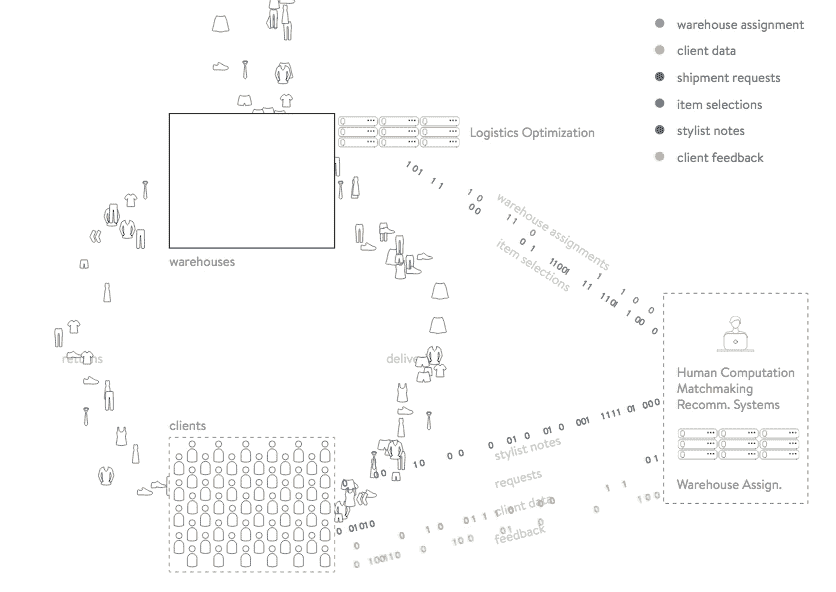
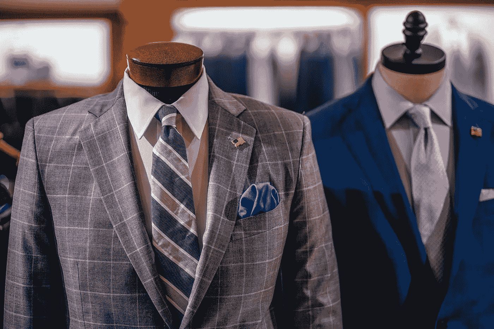

# 男士服装店如何利用数据科学

> 原文：<https://towardsdatascience.com/how-mens-wearhouse-could-use-data-science-4a194f8fdbb?source=collection_archive---------8----------------------->

最近，我会见了几个朋友，为将于 5 月 31 日在西雅图举行的关于电子商务的机器学习小组会议做准备。我们的目标是用数据科学和数据分析解决方案回答零售商的实际业务问题。我们开始讨论如何利用数据来改善不同的实体店和电子商务网站。

我们的一次讨论让我们谈到了[男士服装店](https://www.menswearhouse.com)。我们最初是从讨论网上买衣服的问题开始的。主要问题是尺寸和品牌之间的差异。

最终，它让我们意识到，男装店可能正坐拥利用其客户大量数据的机会，或者……它应该抓住机会收集更多数据。老实说，我们感到惊讶的是，男装店似乎仍然没有类似下面的一些想法，因为 [Stitch Fix 已经提供了一些这样的服务。](http://algorithms-tour.stitchfix.com/#warehouse-assignment)

Here is an example from [Stitch Fix’s Algorithm Page](http://algorithms-tour.stitchfix.com)…it is honestly just fun to watch and think about all the different algorithms they have developed to mange each portion of their supply chain.

# 以前的购买历史

上次我去男装店时，销售助理查看了我上次购买的服装，帮我找到了一些与我之前购买的套装相配的衬衫和领带。

为什么不用这些信息为我下次网上购物提供时尚建议。有点像虚拟时尚顾问(有点像缝针)。而不是每天用 2-3 封电子邮件来轰炸我的销售(这是他们目前的做法)。他们可以用更个性化的方式来处理这个问题。

男装店已经知道我有一套灰色西装，搭配两件不同款式的紫色礼服衬衫、一件蓝色礼服衬衫等。也许他们发送的电子邮件会推荐另一件与顾客当前西装相配的礼服衬衫，也许是另一条与礼服衬衫相配的领带，或者是一套全新的西装。你明白了。他们可以从本质上管理顾客的衣柜，并通过消除知道什么衬衫配什么西装的不便来增加价值。归根结底，大多数成功使用数据的服务都专注于提供更多便利。网飞、亚马逊、优步等。与同类产品相比，它们都提供了更多的便利，而且……最重要的是，让花钱变得更容易。

事实上，男装店甚至可以更上一层楼。如果他们能够获得足够的数据，将他们的客户分为不同的类别，如“传统型”、“冒险型”和/或“古怪型”，那么他们就可以更好地知道向谁销售哪些产品。有时候，人们甚至不知道他们穿其他颜色好看，疯狂的袜子等。他们只是需要有人建议一个新的外观。

同样，也许男装店可以预测某个性类型的人会喜欢戴领结，然后要么推荐一款与顾客西装相配的领结，要么免费送给他们一款(这可能会令人毛骨悚然)。但最终，它可能会让顾客在未来购买三个领结，并对佩戴它们感到自信。

也许男装店还可以打造一个豪华版的 Stitch Fix 服务，专门针对西装和更精致的时装。

# 他们有我的尺寸

再一次，以一种奇怪的方式，男装店可能拥有的关于我们的信息量可能令人毛骨悚然。然而，事实上，他们得到我们的尺寸对所有的服装零售商来说都是非常有价值的。

我相信梅西百货会很想知道我的确切尺寸！然后，他们可以更好地向我推荐产品。此外，我相信在未来，所有的零售商都必须知道我们的尺寸和尺寸，才能与像 Stitch Fix 这样专注于让产品尽可能方便的公司竞争。

这对男式 Wearhouse 来说是一个巨大的优势。我不在网上购买衣服的一半原因是我不确定它们是否合身。然而，如果他们真的知道什么产品适合他们的客户，什么不适合，那么他们就意味着他们可以给我们发送产品，避免过多的退货。这将为他们或他们的客户节省一大笔退货费用。无论是哪种情况，都会改善他们的服务，给我留下一个满意的顾客。

# 结论

这是我们讨论过的两个想法。在这种情况下，Stitch Fix 确实具有先发优势，我们认为，像梅西百货、男装店和其他服装店这样的公司将不得不效仿，以便参与竞争。

否则，这些公司就有可能像百视达或巴诺一样完蛋。让服务和产品更方便往往是最成功的策略。

如果 Men's Wearhouse 突然开始向你推荐与你目前的衣橱直接相关的衣橱，你会有什么感觉？

是不是有点太小众报道了？

加入我们关于电子商务的[机器学习小组](https://www.meetup.com/meetup-datascience/events/248152512/)进一步讨论！

**其他关于数据科学的精彩阅读:**

[什么是决策树](http://www.acheronanalytics.com/acheron-blog/brilliant-explanation-of-a-decision-tree-algorithms)

[算法如何变得不道德和有偏见](http://www.acheronanalytics.com/acheron-blog/how-do-machines-learn-bias-data-science)

[如何开发鲁棒算法](https://medium.com/@SeattleDataGuy/how-to-develop-a-robust-algorithm-c38e08f32201)

[4 数据科学家必备技能](https://www.theseattledataguy.com/4-skills-data-scientist-must-have/)