# 神经网络如何“学习”

> 原文：<https://towardsdatascience.com/how-neural-network-learn-3b56c175b5ca?source=collection_archive---------11----------------------->

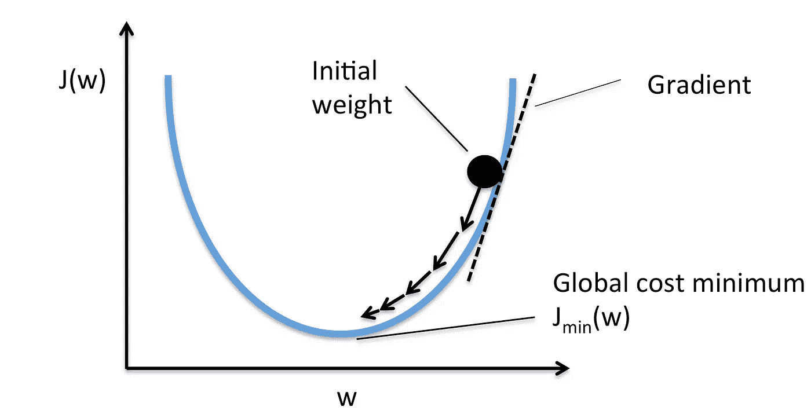

Source: [https://stats385.github.io/assets/img/grad_descent.png](https://stats385.github.io/assets/img/grad_descent.png)

在我的第一个故事中，我解释了神经网络如何处理你的输入。在神经网络能够像前一篇文章那样进行预测之前，它必须经过一个预处理阶段。这个阶段控制神经网络在处理输入时使用的权重和偏差值。

在神经网络生命周期中有两个阶段，一般来说，所有机器学习算法都是训练阶段和预测阶段。寻找权重和偏差值的过程发生在**训练阶段**。与此同时，神经网络处理我们的输入以产生预测的阶段发生在预测阶段，如在[之前的](https://medium.com/datadriveninvestor/how-neural-network-process-your-input-trained-neural-network-fd48f1bf310)中。这一次，我将讨论**神经网络如何在训练阶段获得正确的权重和偏差**也称为“学习”以做出准确的预测(阅读:回归或分类)。

那么，神经网络如何获得最优的权重和偏差值呢？答案是通过一个误差梯度。在固定当前权重和偏移(最初随机生成)时，我们想知道的是当前权重和偏移值是太大还是太小(我们需要**减少还是增加**我们的当前值吗？)关于它们的最优值？以及它偏离了多少(**我们需要减少或增加当前值多少**？)从它们的最优值。我们寻找的梯度是误差相对于权重和偏差的导数。

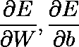

where E is an error, W is weight and b is bias

这是为什么呢？因为我们想知道我们当前的权重和偏差如何影响神经网络误差的值，作为回答上段 2 个问题(减少或增加以及增加多少)的参考。**我们如何得到梯度值**是通过一个众所周知的算法叫做**反向传播**。**我们如何利用通过反向传播获得的梯度**来改善权重值和偏差是通过**优化算法**实现的。优化算法的一个例子是梯度下降，这是最简单和最常用的优化算法。它只是用获得的梯度值乘以*学习速率*常数来减少最近的权重和偏差值。什么是*学习率*以及更多细节，我们将在本帖中立即讨论。

假设我们有一个如下的神经网络。

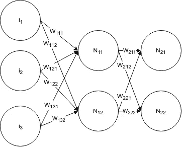

Our neural network has a structure 3–2–2

假设我们有一个输入向量、偏差向量、权重矩阵和真值，如下所示

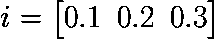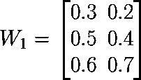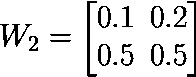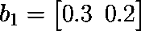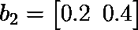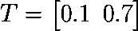

为了明确起见，权重值的顺序为

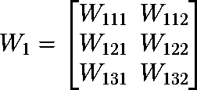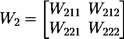

让我们做一下*向前传球* 。流程与[上一篇](https://medium.com/datadriveninvestor/how-neural-network-process-your-input-trained-neural-network-fd48f1bf310)相同。在本演示中，我们对所有神经元使用的激活函数是 sigmoid 函数。

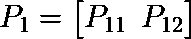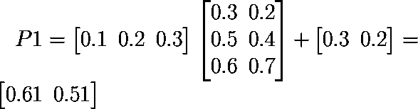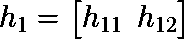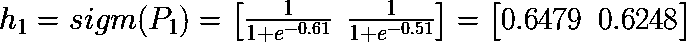

这里我们将 sigmoid 函数的输出值四舍五入到 4 位小数。在实际计算中，**这样一轮会大大降低神经网络的精度**。小数的个数对神经网络的准确性至关重要。我们这样做是为了简化计算，这样写作就不会太长。

在我们进行下一层之前，请注意下一层是最后一层。意味着**下一层是输出层**。在这一层，我们只做*纯线性*运算。

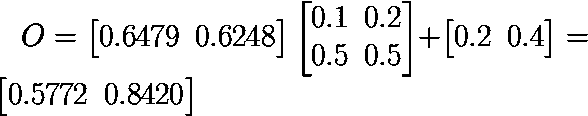

是时候计算误差了。在这种情况下，我们使用*均方误差* (MSE)来计算输出神经元的误差。MSE 方程如下

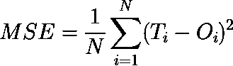

在我们的例子中，N = 1，因为我们只有 1 个数据，所以等式简化为

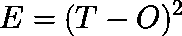

让我们根据前面定义的真值(T)来计算输出层神经元的误差。

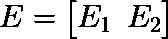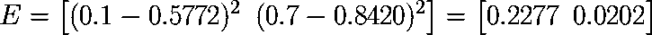

这就是我们当前在输出层的误差。现在是通过反向传播(也称为反向传递)在层**之间的每次交互中寻找相对于权重和偏差的误差梯度，然后应用梯度下降来最小化误差的时候了。**反向传播仅仅是一个链式法则**，它是如何工作的将立即讨论。现在，让我们找出我们在正向传递中使用的所有方程的导数。**

1.  E 关于 O 的导数

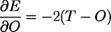

2.sigmoid (h)函数关于 P 的导数(纯线性运算的输出)

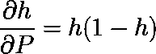

h 在哪里

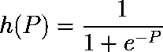

3.关于权重(W)、偏差(b)和输入(h)的纯线性导数。

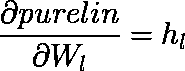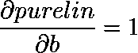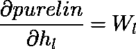

purelin 在哪里

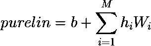

其中 l 是从 1 到 m 的数。

这就是我们所需要的，是时候应用反向传播了。我们首先寻找隐藏层和输出层之间的权重和偏差的梯度。为了寻找梯度，我们使用链式法则。

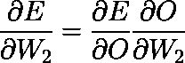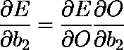

通过应用这些，我们得到

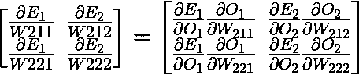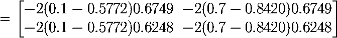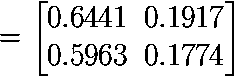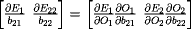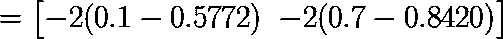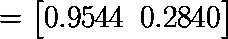

这就是我们在隐藏层和输出层之间的渐变。现在，进入下一层。这里真正的挑战(不那么挑战)！但是不要担心，在这之后一切都会变得清晰和容易:)。

**反向传播中的链式法则完全是关于神经元之间的路径**。让我们收集信息吧！

1.  隐含层有 **2 个神经元，每个神经元在左侧(输入层和隐含层之间)用 3 个权值和 1 个偏置**连接**。**
2.  在右侧，隐藏层中的每个神经元都与输出层中的 2 个神经元相连**。**

**这些信息对于求 W1 的梯度非常重要**。从这些，我们想要找到的梯度是

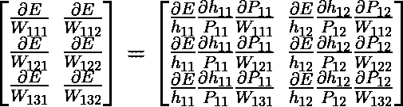

在哪里

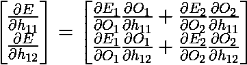

**添加了从我们关注的权重到输出层的所有可能路径。这就是为什么上面的等式中有两项之和。现在，让我们计算 W1 的真实梯度。**

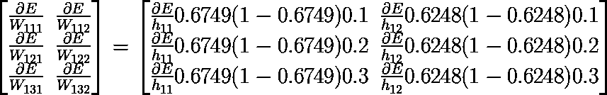

代入 E 对 h 的偏导数，我们得到

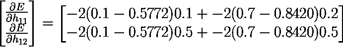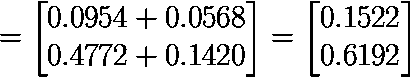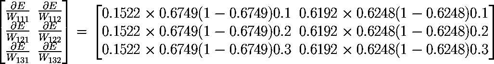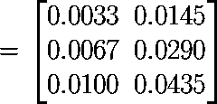

现在谈谈偏见，又称 b1

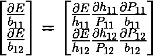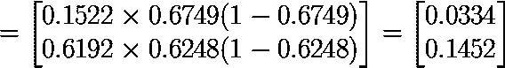

**这就是反向传播算法作用的终点**。现在，让我们来看看优化算法。优化算法是关于如何利用我们已经获得的梯度来校正现有的权重和偏差。我们选择的优化算法是梯度下降法。梯度下降法通过下面的等式校正权重和偏差。

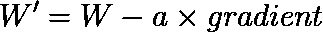

其中 W’是新的权重，W 是权重，a 是学习常数，梯度是我们从反向传播获得的梯度。**学习常数是至关重要的常数**，因为如果这个常数太大，结果将不会收敛，如果太小，需要更多的迭代，这意味着训练阶段将更加耗时。假设我们有一个等于 0.02 的**学习常数。**

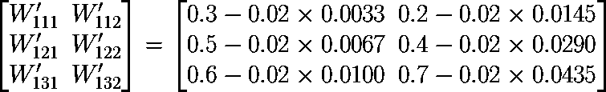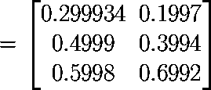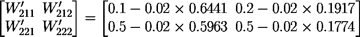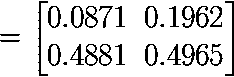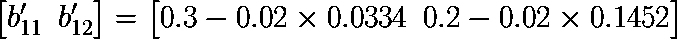

依此类推，**该过程将被重复**(具有将被输入的相同输入)直到达到所需的迭代次数**或目标误差**。

这就是神经网络一般是如何“学习”的。如果我有更多的空闲时间(当然还有好心情)，我会用 numpy 分享 python 中多层感知器(另一种“普通神经网络”的名称，这是我们这里的重点)的源代码。再见。

**我的另一个神经网络系列:**

1.  [神经网络如何处理你的输入(经过训练的神经网络)](https://medium.com/datadriveninvestor/how-neural-network-process-your-input-trained-neural-network-fd48f1bf310)
2.  **神经网络如何“学习”**
3.  [知道你的输入在神经网络中有多重要的简单方法](https://medium.com/datadriveninvestor/a-simple-way-to-know-how-important-your-input-is-in-neural-network-86cbae0d3689)