# 神经科学家如何分析来自透明鱼脑的数据:第 1 部分，预处理。

> 原文：<https://towardsdatascience.com/how-neuroscientists-analyze-data-from-transparent-fish-brains-part-1-pre-processing-63a09436ea93?source=collection_archive---------20----------------------->

## 从鱼脑的视频到可利用的数据集。

大脑很酷。不仅仅是人脑。在神经科学中，许多动物模型被用来研究大脑回路:小鼠、大鼠、苍蝇、蠕虫和我最喜欢的一种——鱼。但不仅仅是任何鱼:T2 斑马鱼。

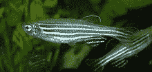

An adult zebrafish (wikipedia)

斑马鱼最初来自南亚，现在可以在任何普通的水族馆和商店里找到。它们很小，有漂亮的条纹，喜欢温暖的水。但是让科学家们感兴趣的是，一些斑马鱼发生了突变，阻止它们产生黑色色素，因此它们拥有完全透明的皮肤**。如果想研究大脑，这是一个很好的特性。不需要打开头骨，不需要切开任何东西，只需要把一条鱼放在显微镜下，你就可以研究它的大脑。或者……差不多。**

**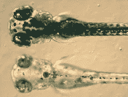**

**Below, a transparent zebrafish (wikipedia)**

**斑马鱼真的很棒，因为它们的基因组是已知的，科学家能够精确地产生一些突变，使鱼的神经元在活跃时发出荧光(所有这些都不会影响大脑的功能或斑马鱼的健康！).你可以想象这背后的大量工作和研究，但这是一个数据科学博客，所以我现在将专注于这种数据的分析。**

**这是原始数据的样子:这是一个斑马鱼大脑的视频，每一个圆形的白色斑块都是一个变得活跃的神经元。**

**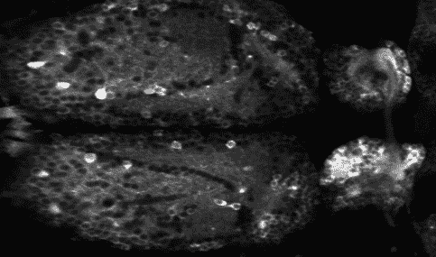**

**Courtesy of [Yaksi lab](https://yaksilab.com/) **©**, NTNU in Trondheim, Norway**

**已经很酷了！然而，在能够使用一些机器学习算法(如 PCA 或聚类)之前，我们需要将该视频转换为可利用的数据集，即[神经元 x 时间]的 2D 矩阵，其中每个元素都是特定神经元在特定时间点的活动程度。“预处理”管道有 3 个主要步骤:**

1.  **对齐**
2.  **细胞检测**
3.  **荧光提取**

**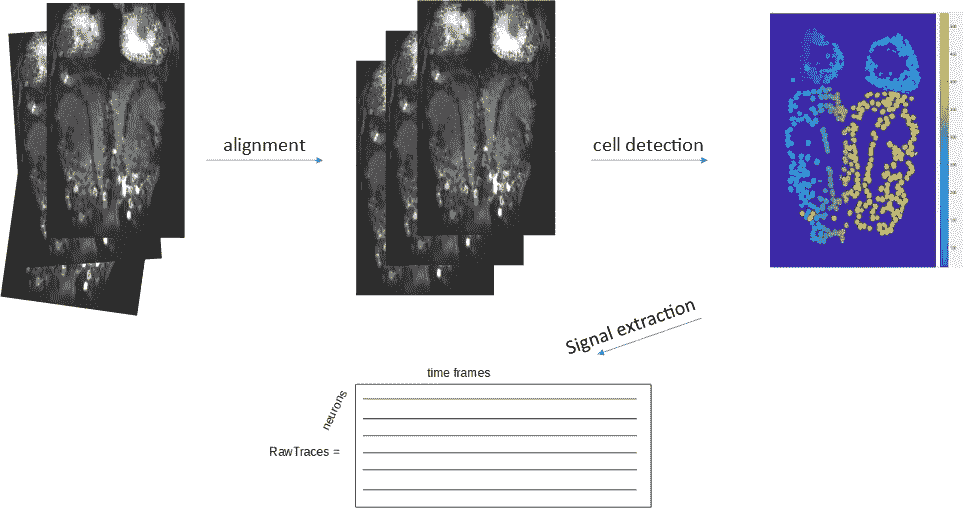**

**The preprocessing pipeline that extracts the activity of each neuron in time, from the raw images.**

**第一步是**对准**。在实验过程中，鱼是活着的，可以自由移动尾巴(只有头部和腹部被一些琼脂糖凝胶保持不动)。这可能会导致录制过程中的一些运动，因此，图像可能会轻微平移或旋转。因此，图像必须重新对齐，以适合用户选择的一个“参考”图像的方向。这是**图像配准**的过程。**

**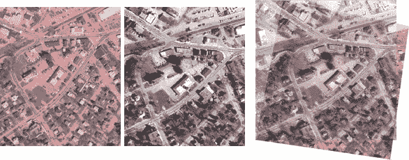**

**An illustration of image registration with [Matlab](https://fr.mathworks.com/help/images/register-an-aerial-photograph-to-a-digital-orthophoto.html)**

**这可以通过多种方式完成，例如(除其他方式外)使用 [Matlab](https://fr.mathworks.com/discovery/image-registration.html) 或使用开源图像处理软件 [ImageJ / Fiji](https://imagej.net/Register_Virtual_Stack_Slices) 。为了保持这篇文章(相对)简短，我将不详细说明这一步，而是将重点放在细胞检测。**

**一旦运动伪影被校正，第二步检测神经元在图像中的位置。同样，神经科学家目前正在使用或开发许多不同的方法，但我想在这里介绍的方法使用**模板匹配**。基本上，用户可以创建一个细胞应该是什么样子的模板，算法将在整个图像中寻找这个特定的形状。**

**首先，在*参考图像*中对对应于期望时间段的所有记录图像进行平均。然后，通过高斯滤波器对该图像进行平滑，以统一背景并调整所有细胞的对比度。**

**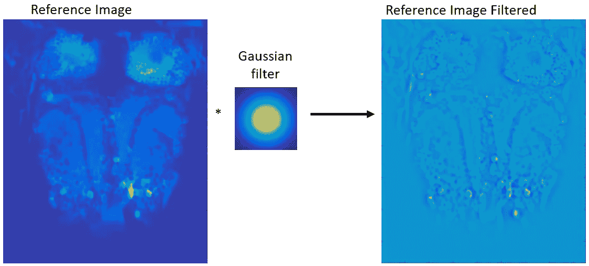**

**这可以通过使用高斯滤波器(或 [*内核*](https://en.wikipedia.org/wiki/Kernel_(image_processing)#Convolution) )的 2D 卷积来完成。每个像素的值将被原始图像和高斯核之间的卷积所取代。这在下面的示意图中有很好的描述:**

**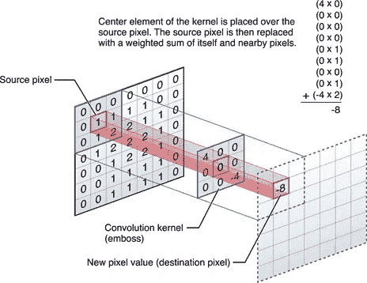**

**From [developer.apple.com](https://developer.apple.com/library/archive/documentation/Performance/Conceptual/vImage/ConvolutionOperations/ConvolutionOperations.html)**

**其次，生成细胞的模板。用户可以选择模板的形状和大小(取决于你正在研究的大脑区域，神经元可以更小或更大)。然后，该模板将在*参考图像*上传递，并且——对于每个图像块——将使用该模板计算相关性。**

****

**A cell-like donut template**

****相关性**值表示模板与图像部分的匹配程度。结果将由一个 *correlationMap* 组成，其中颜色代表模板与以像素为中心的区域的匹配程度。基于相关值的直方图，用户可以选择一个阈值来仅选择具有高相关性的像素(在本例中为 0.5)。**

**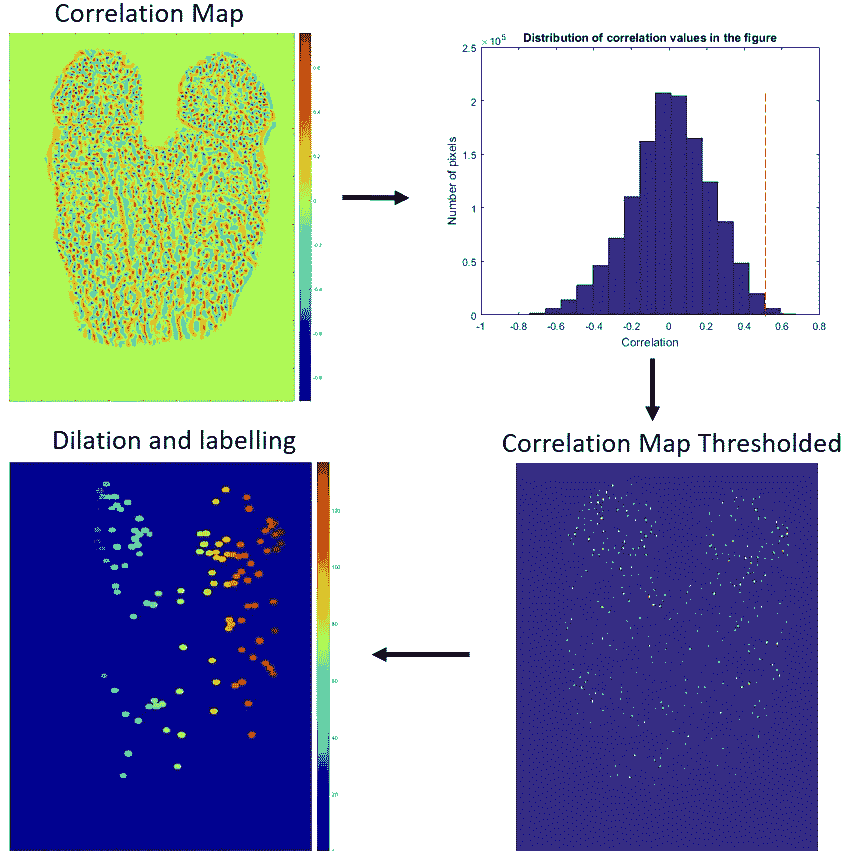**

**由于选定的像素只是我们神经元的中心，所以需要一个膨胀步骤来在其周围添加更多的像素。此后，所有像素被认为属于一个神经元:它们可以被标记(例如用 Matlab 函数 [*bwlabel*](https://fr.mathworks.com/help/images/ref/bwlabel.html) )，这意味着它们被赋予一个新的数字，代表它们所属的神经元的身份。该结果随后显示给用户，用户可以手动消除任何检测错误。**

**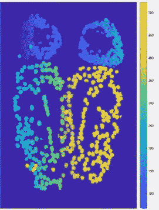**

**neuronLabels**

**对于不同尺寸和形状的不同模板，可以重复这个过程。最终的输出是原始图像大小的一个“遮罩”:如果每个像素不属于一个神经元，它就会被标记为 0，或者是一个介于 1、2、3 之间的数字。550，如果它属于一(550 是在这个特定例子中发现的神经元的数量)。这用于最后一步:提取每个神经元在一段时间内的荧光值。**

**为了及时提取每个神经元的荧光水平，将掩模应用于图像，并且对属于组成神经元的像素的所有值进行平均。这为每个神经元创建了一个向量，显示其在时间上的活动:**

**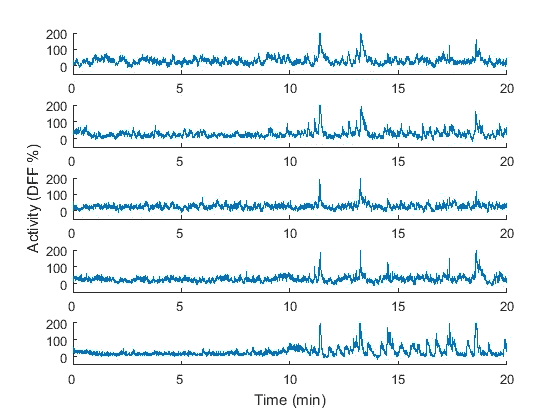**

**Activity profiles of 5 neurons during 20min**

**但是当你有 550 个神经元的时候，不可能一个个去看。同时查看几个神经元的更有效的方法是绘制活动图(x 轴:时间，y 轴:神经元标签，颜色:活动):**

**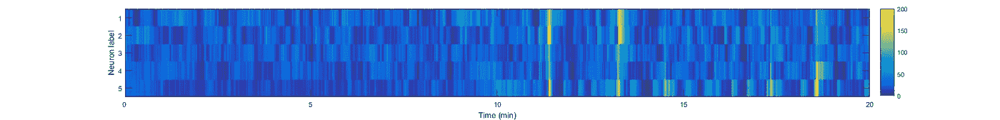**

**Activity map**

**这样，预处理就完成了。现在，有趣的事情可以开始了，这将是第二篇文章的目标，我们将看看一些聚类算法和 PCA:神经科学家如何分析来自透明鱼脑的数据:第二部分，聚类神经数据。**