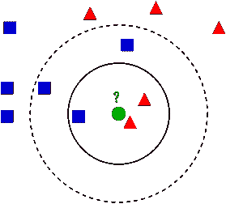

# Nike Run Club 如何引导我编写第一个人工智能项目

> 原文：<https://towardsdatascience.com/how-nike-run-club-led-me-to-write-my-first-ai-project-116d0617c2d1?source=collection_archive---------4----------------------->


很长时间以来，我一直想开始学习如何将人工智能作为我代码流的一部分。我应该从哪里开始？嗯，我没有理科学士学位，也没有数学基础来理解它背后的所有方程和计算。但是后来，我看到了[杰森·布朗利的这篇](https://machinelearningmastery.com/tutorial-to-implement-k-nearest-neighbors-in-python-from-scratch/)惊人的文章，我又开始相信了！

在多次阅读这篇文章并理解它之后，我终于可以说我对 KNN 算法很流利了。让我们谈谈 KNN 吧。

# KNN 算法

想象你在世界杯上。你看到三个不同球迷的酒吧:英格兰，瑞典和法国。你是威尔士人，你会和谁一起庆祝？当然是英国，因为你们都在大不列颠！

那是 KNN 的意思: **K 最近邻**。
我们的数据将被分类为同一维度中最接近的类型:



From [Wikipedia](https://en.wikipedia.org/wiki/K-nearest_neighbors_algorithm)

我们可以看到中间的绿色圆圈。它最接近三角形，所以它可能会被归类为三角形。我说“可能”是因为没有定义“K”。这个“K”表示应该考虑多少个项目。如果“K”是 3，则该圆应归类为三角形(两个三角形对一个正方形)。但是如果“K”是 5，那么该圆应该被归类为正方形(三个正方形对两个三角形)。
大多数时候“K”的默认值是 3(较大的“K”表示不敏感)。

一个美好的一天，我正在用 Nike Run Club 应用程序跑步。那天我觉得很累，我需要有人叫醒我，给我一些动力。你猜怎么着，它从没来过。我突然想到:把歌曲分为节奏型和非节奏型！

我不是一个音乐家，但一点点研究让我想到了术语“ [Tempo](https://en.wikipedia.org/wiki/Tempo#Measurement) ”和它的度量单位“BPM”。每分钟节拍值决定了歌曲是否有节奏。

正如[维基百科](https://en.wikipedia.org/wiki/Tempo#Basic_tempo_markings)中所写的，一首节奏歌曲的 BPM 值在 120 以上:

> 快板——快速，迅速，明亮(120–156 BPM)(非常快板比快板稍快，但总是在它的范围内)
> 
> Vivace —活泼而快速(156–176 BPM)
> 
> Vivacissimo —非常快且活泼(172–176 BPM)
> 
> 快板或活泼的快板——非常快(172–176 BPM)
> 
> 很快—非常非常快(168–200 BPM)
> 
> Prestissimo —甚至比 presto 更快(200 bpm 及以上)

所以理论上我们需要对一首歌的 BPM 是否在 120 以上进行分类。问题是我没有找到任何精确的算法来计算 BPM，所以我必须添加更多的值来确保歌曲是有节奏的。一首歌的 BPM 平均值。
2。高 BPM 点占总点数的百分比。
3。歌曲有多少 BPM 点序列(连续 5 个高 BPM 点以上)。
我还用 5 减去了每个点，因为我不相信 [Aubio](https://github.com/aubio/aubio) 库算法的结果。

让我们检索这些值并将它们添加到 DB:
首先用 [aubio](https://github.com/aubio/aubio/blob/master/python/demos/demo_tempo.py) 提取歌曲的 BPM 值示例:

然后，获取我们需要的所有值:

把所有的值放入一个数据库，让我们开始分类！

## 创建数据集

我们需要给机器喂食。诀窍是数据集，数据集是我们希望为学习部分的算法提供的数据列表(很多)。

让我们来看看:

我们用数据库中的数据创建了一个列表列表。
然后，我们需要加载它并将其分成 2 组:
*训练集——算法实际学习的数据。
*测试集——用于测试我们算法的验证集。

每个列表包含 4 个属性:
* BPM 平均值。
* BPM 计数器百分比。
*高 BPM 点序列。
*歌曲是否有节奏

## 创建 KNN 模型

我们的 KNN 模型处理实数。这就是我们要使用"[欧几里德距离](https://en.wikipedia.org/wiki/Euclidean_distance)"来计算即将到来的预测的最佳 K 点的方法。将每个训练集与一个测试用例进行比较:我们计算每个训练集值和测试集值之间的距离，并将其添加到一个变量中。我们对存储数据的变量进行排序，并检索 K 个最佳选项(最小距离)。

我们写点代码吧！

## 预测未来

我们创建了所有数据，检索了每个训练集的最佳点，现在我们可以预测结果了！

预测是投票。主要群体是选举出来的。就这么简单。

让我们看看它是怎么做的

## 把所有的放在一起

现在我们有了所有的碎片，让我们来完成这个拼图吧！

1.  首先获取训练数据，或者从现有的 Pickle 对象中加载它。
2.  找到周围最好的邻居。
3.  预测。

我们会有两种模式:
1。训练模式——尽我们所能找到最准确的最佳数据集。预测。
2。对一首歌进行分类，不管它是否有节奏。

让我们测试分类器并检查结果:

```
Remix.mp3
Train set: 64
Test set: 1
[[158, 64, 125, <TEMPOS.RHYTHMIC: 'Rhythmic'>], [154, 63, 112, <TEMPOS.RHYTHMIC: 'Rhythmic'>], [167, 72, 145, <TEMPOS.RHYTHMIC: 'Rhythmic'>]]
Is Remix.mp3 rhythmic? True
Remix.mp3 is added successfully
```

我测试过的歌是有节奏的(是混音的！！！)
我们可以看到它找到的最好的邻居是:
【158，64，125，< TEMPOS。节奏:>)
【154，63，112】<节奏。节奏:>)
【167，72，145】<节奏。节奏:'节奏'> ]

获胜者是……‘有节奏’！我们成功了！

# 结论

我们已经学习了 KNN 模型，以及如何实现它和用它预测数据。在你的代码中使用人工智能，即使你可能不具备所有必要的基础**也是可能的**。我确信，如果我们有更多类似上面提到的关于这些模型及其实现的简单文章，我们将会看到更多的开发者在他们的代码中使用这些概念。**不要害怕使用它！**

我希望这篇文章教会你一些新的东西，我期待着你的反馈。请告诉我——这对你有用吗？

完整的项目可以在 Github [**这里**](https://github.com/Ori-Roza/SportPlayListSite) **找到。**