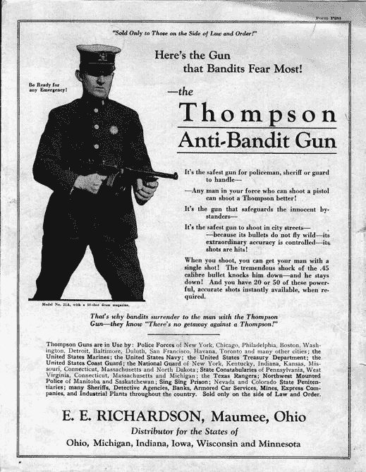
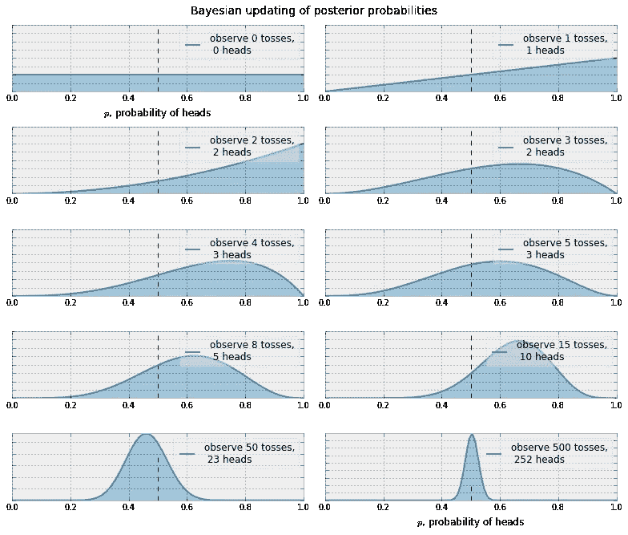
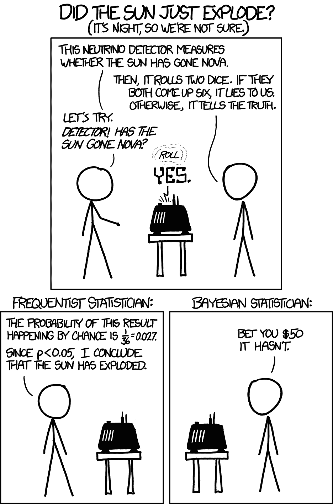

# 如何不按受欢迎程度排序

> 原文：<https://towardsdatascience.com/how-not-to-sort-by-popularity-92745397a7ae?source=collection_archive---------2----------------------->

**问题**:你是一个 web 程序员。你有用户。你的用户会阅读你网站上的内容，但不会对他们进行[评级](http://www.evanmiller.org/how-not-to-sort-by-average-rating.html)。您想要制作一个用户可能想要点击的流行内容列表。你需要某种“分数”来排序。

**错解#1** :分数=浏览量

*为什么是错的*:如果你的网站足够老，你可能有过去流行的内容，但那已经不再相关了。

**错解#2** :分数=最近*小时浏览量 x* 小时。

*为什么是错的*:“趋势”是一个比绝对流行更好的解决方案，但它缺乏意外收获。没有必要显示用户[可能会找到的内容](https://www.slideshare.net/xamat/recommender-systems-machine-learning-summer-school-2014-cmu/20)。如果某样东西很流行，它可能已经在你的主页上了。

# **间歇 I:隐性反馈**

如果用户在给你的内容评分，你应该去看看埃文·米勒 8 年前的建议，而不是按平均评分排序。但通常情况并非如此。更多的时候，我们有隐性的反馈，而不是显性的评级。那个是什么[？](http://recsyswiki.com/wiki/Implicit_feedback)

> **隐性反馈**是[用户](http://recsyswiki.com/mediawiki/index.php?title=User&action=edit&redlink=1)活动，可用于间接推断用户[偏好](http://recsyswiki.com/mediawiki/index.php?title=Preference&action=edit&redlink=1)，例如点击、页面浏览量、购买行为。有时只知道正面的反馈，例如，客户已经购买的产品，但不知道他们已经决定不购买的产品。

通过隐式反馈来推断用户偏好听起来可能很难，但在实践中效果很好。主要原因是，收集点击量和页面浏览量比显式评级容易得多。如果你有足够的数据，输入中的噪声就不会有太大影响。

如果你有很多注册用户，你可以(也应该)[用这些数据建立一个推荐系统](https://open.blogs.nytimes.com/2015/08/11/building-the-next-new-york-times-recommendation-engine/?mcubz=0&_r=0)。但即使你建立了一个，你如何推荐项目(博客帖子，文章，音乐，视频，产品等。)给新用户如果你对他们一无所知？

这就是所谓的[冷启动](https://en.wikipedia.org/wiki/Cold_start)问题。当你掌握了用户的一些信息，你可以推荐与她之前消费过的东西相似的商品，但对于新用户，你不能这么做。最简单的方法是显示“流行”的内容，但我们可以做得比天真的解决方案好得多。

主要的技巧是不要只跟踪人们在看什么，而是要跟踪呈现给他们的选项是什么(*印象*)以及他们决定点击什么。

**错误解决方案#3:** 得分=点击率=点击数/印象数

如果我们将*点击数*除以一个项目的*印象数*，我们就得到了 CTR(点击率)。这意味着一个项目每次被推荐时平均有多少点击量。好的物品会有很高的点击率。

*为什么错了*:这里的问题是，如果一件商品的点击率很少，就很难估计它的点击率。假设有一篇文章被推荐了一次，没有被点击。你会相信点击率为零，你永远不会再推荐它吗？或者说如果这个商品被展示一次并被点击，你会把它推荐给每个用户吗？

*免责声明* : [CTR 不是评估推荐质量的唯一指标，也可能不是最佳指标](http://www.hongliangjie.com/publications/recsys2014.pdf)。我们不想显示用户实际上不喜欢的点击诱饵内容，但这超出了本文的范围。

让我们回到我们的问题上来。我们怎样才能得到一个可靠的估计项目的 CTR？

**错误解决方案#4:** 得分= LCB(CTR)

LCB 在这里代表较低的置信限。它表示在您可以指定的置信度下，该项目保证具有的最小 CTR。为了计算这一点，我们可以使用威尔逊评分，来自埃文·米勒的建议。我们只需要将每一次点击视为“竖起大拇指”，而将每一次未被点击的印象视为“竖起大拇指”。如果我们的例子很少，它会考虑到 CTR 的不确定性。

*为什么是错的*:这个解决方案在实践中很好，但它仍然是错的。它擅长*发掘点击率高的*文章，但不擅长*发掘*新文章。也许一篇新文章会有一个更好的点击率，但是我们会因为没有一个好的估计值而陷入展示一篇次优文章的困境。

如果你明白这一点，恭喜你！这是[多股武装匪徒](https://en.wikipedia.org/wiki/Multi-armed_bandit)理论背后的基本概念。你已经知道了足够的术语来在拉斯维加斯的鸡尾酒会上讨论 MAB。但是什么是 MAB 呢？

# 幕间休息二:多武装匪徒

By Yamaguchi 先生 at the English language Wikipedia, CC BY-SA 3.0, [https://commons.wikimedia.org/w/index.php?curid=57295504](https://commons.wikimedia.org/w/index.php?curid=57295504)

[维基百科定义](https://en.wikipedia.org/wiki/Multi-armed_bandit)解释了这个古怪名字的来源:

> **多臂土匪问题**是一个在一排[吃角子老虎机](https://en.wikipedia.org/wiki/Slot_machines)(有时被称为“独臂土匪”)上的赌徒必须决定玩哪些机器、每台机器玩多少次以及以什么顺序玩它们的问题。当游戏开始时，每台机器从特定于该机器的[概率分布](https://en.wikipedia.org/wiki/Probability_distribution)中提供随机奖励。游戏者的目标是通过一系列的杠杆操作获得最大的回报。

MAB 在业内最为人所知的是作为 A/B 测试的替代选择，作为挑选你的网站的最佳变体的一种方式。在我们的例子中，我们可以把每篇文章看作一个不同的手臂，每一次点击都是一种奖励。有些文章会给更好的奖励，因为他们有更好的平均点击率。

**好的解决方案#1:** 分数=对某些用户随机，对其余用户 LCB

如果我们选择一小部分(epsilon，ε)用户，并向他们展示随机的文章，我们将能够探索所有的项目，同时仍然显示大多数用户的最佳选择。这被称为ε-greedy，非常有效，但是很难为ε选择一个好的值。如果太小，我们将无法探索所有项目。如果太大，太多用户会收到差的推荐。

**好方案#2:** 得分= UCB(CTR)

如果我们使用 [UCB](http://www.cs.mcgill.ca/~vkules/bandits.pdf) (置信上限)而不是 LCB，我们将有一个非常好的 MAB 政策。LCB 给出了项目的最小 CTR 估计值，而 UCB 返回了项目在给定期望置信度的情况下可以具有的最大 CTR。

它能够尝试新的武器，直到它有一个合理的点击率估计，并会更经常地推荐最好的文章。我们说它有低*遗憾*。如果与总是推荐最好武器的最佳可能的*政策*相比，这基本上是多少*点击*将会失去。一个问题是，如果你不实时更新点击和印象，它可能不会很好地工作。我们可以做得更好。

**最佳解决方案**:分数= beta(点击次数+ 1，展示次数-点击次数+ 1)

也称为汤普森采样。

[https://sk.pinterest.com/pin/537898749225885705](https://sk.pinterest.com/pin/537898749225885705)

> Thompson 抽样是解决多臂强盗问题的最古老的启发式方法之一。这是一种基于贝叶斯思想的随机算法，最近几项研究表明，与最先进的方法相比，它具有更好的经验性能，因此引起了人们的极大兴趣。

上面的引用来自文章[Thompson Sampling for Contextual bottom with Linear payments](http://proceedings.mlr.press/v28/agrawal13.pdf)。 [Xavier Amatriain](https://twitter.com/xamat) ，前机器学习研究员，后来领导网飞的推荐系统团队，以及后来的 Quora，[在本期播客](https://soundcloud.com/twiml/twiml-talk-3-xavier-amatriain-engineering-practical-machine-learning-systems#t=41:44) [TWiML](https://twimlai.com/twiml-talk-3-xavier-amatriain-engineering-practical-machine-learning-systems/) 中说了同样的话:

> 有很多关于多臂强盗的文献，但只有一本在实践中有效。我不知道我是否想给出答案(……)在业内众所周知，汤姆逊抽样是最简单、最实用的 MAB 方法。

听起来不错，对吧？不过，如果你看看维基百科上关于[汤普森取样](https://en.wikipedia.org/wiki/Thompson_sampling)的文章，数学可能会非常吓人。幸运的是，实现和理解它实际上非常简单。

那么，什么是汤普森抽样？它是以威廉·r·汤普森的名字命名的，他在 1933 年提出了这个想法。这叫做抽样，因为对于每一条手臂，我们从我们当前对其概率分布的信念中挑选(抽样)一个随机的 CTR 比率，然后我们根据*抽样的* CTR 对文章进行分类。

但是 CTR 的概率分布是什么呢？当我们使用 LCB 和 UCB 时，我们承认我们不知道确切的 CTR 值是多少，所以我们对其值进行了有根据的猜测。概率分布只是一个函数，它返回 CTR 为任何特定值的几率。

它看起来怎么样？对于一篇新文章，我们不知道 CTR 是什么。它可以是 0 到 1 之间的任何数字。这叫做均匀分布。但每次我们展示一篇文章，就像是在抛一枚不公平的硬币。我们翻转它，看看结果。假设是正面，我们得到一个点击。每次我们抛硬币并看到结果，我们可以更新我们对正面概率或文章 CTR 的信念。

下面是一个例子，根据我们得到的人头数，在我们进行一些投掷后，这个分布(名为 [Beta](https://en.wikipedia.org/wiki/Beta_distribution) )看起来是什么样的:

[http://nbviewer.jupyter.org/github/CamDavidsonPilon/Probabilistic-Programming-and-Bayesian-Methods-for-Hackers/blob/master/Chapter1_Introduction/Ch1_Introduction_PyMC2.ipynb](http://nbviewer.jupyter.org/github/CamDavidsonPilon/Probabilistic-Programming-and-Bayesian-Methods-for-Hackers/blob/master/Chapter1_Introduction/Ch1_Introduction_PyMC2.ipynb)

这种承认我们不知道所有事情的想法和[根据新信息修正我们的信念](https://www.nytimes.com/2017/05/27/opinion/sunday/youre-not-going-to-change-your-mind.html)是所谓贝叶斯统计背后的主要思想。如果你想了解更多这方面的知识，我推荐《T4 概率编程》&黑客贝叶斯方法这本书。它不像深度学习那样新潮，但仍然很有趣，很有用。这是你在鸡尾酒会上可以讨论的另一个好话题！

那么，用 score = beta(点击+ 1，impressions - clicks + 1)是什么意思呢？我们只是得到一个随机的 CTR，从 beta 分布中取样。然后，我们根据这个随机分数对文章进行排序。点击率高的文章将会更频繁地展示( *exploited* ) ，但我们也会随着新项目的出现*探索*。太神奇了，这么简单，效果这么好。

确保你理解所有概念的最后一个测试:你会发现这部卡通很有趣。:)

[https://xkcd.com/1132/](https://xkcd.com/1132/)

*拜* [*雨果·洛佩斯·塔瓦雷斯*](https://twitter.com/hltbra)*[*莱安德罗·莫雷拉*](https://leandromoreira.com.br/)*[*丹尼尔·马丁斯*](https://twitter.com/danielfmt)*[*菲拉维奥·里贝罗*](http://flavioribeiro.com/)*[*拉斐尔·卡里奥*](https://caricio.com/)****