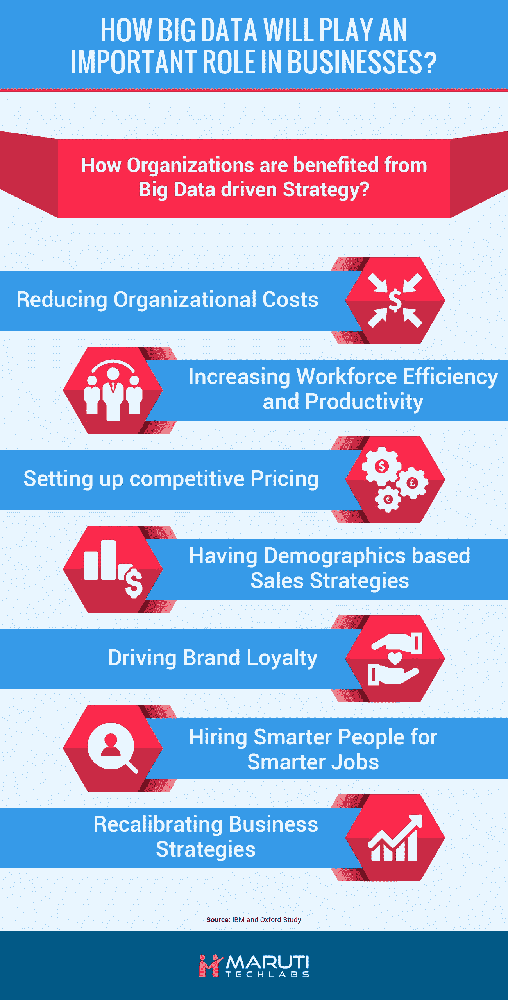

# 组织如何从技术驱动的大数据战略中获益？

> 原文：<https://towardsdatascience.com/how-organizations-gains-from-a-technology-driven-big-data-strategy-f1a834e7d7b0?source=collection_archive---------2----------------------->

# 中小型企业如何从数据分析中受益？

小型企业缺乏资源来进行大数据投资。因此，中小企业需要更明智的策略来加入大数据趋势。这里有一些提示——

*   中小型企业应该从投资小规模分析开始，而不是担心使用大数据集或小数据集，并专注于通过最佳业务数据集将数据技术分析用于企业决策。
*   此外，中小型企业应该利用数据集来帮助他们解决眼前的问题，而不是收集各种业务数据来预测未来的用途。
*   由于大多数中小企业高管依赖个人经验和信念，而不是业务数据驱动的结果，因此组织变革成为在小型组织中引入大数据文化的先决条件。
*   使用云计算也是在中小企业中有效实施大数据解决方案的基础。云有双重好处——一；它有助于通过统一的平台连接所有服务。第二，中小型企业可以通过采用基于云的大数据处理解决方案获得显著的成本优势。
*   中小企业的经营规模要小得多，因此在运营分析、R&D 分析等方面投资过多。对他们来说没什么意义。相反，他们可以通过专注于客户分析而受益更多。凭借更好的产品营销、个性化服务和有针对性的产品，中小企业可以获得显著的成本收入比优势。
*   最后，中小企业应该毫不犹豫地利用其组织外部的数据，以获得对客户行为、运营和财务管理的更多洞察。

如果中小型企业明确定义自己的目标，并且不被市场炒作所左右，他们可以从大数据实施中获益更多。然而，企业(无论规模大小)在实施大数据解决方案方面的成功取决于两件事。第一，数据的可用性，第二，正确处理技术的实施。

# 从技术驱动的大数据战略中获得组织收益

[大数据分析在组织效率中发挥着重要作用。](https://www.marutitech.com/big-data-analytics-need-business/)大数据战略带来的好处使公司获得了超越竞争对手的竞争优势，这通常是由于组织及其员工通过使用分析作为决策基础而增强了意识。以下是组织如何通过部署大数据战略获益——

# 降低组织成本

大数据解决方案有助于建立高效的制造流程，实现需求驱动型生产和原材料的最佳利用。[自动化和使用人工智能来减少人工工作](https://www.marutitech.com/ebooks/artificial-intelligence-revolutionize-industries/)是在生产和运营中实现成本效益的另一种方式。对销售和财务部门的深入了解有助于管理者制定战略，促进敏捷工作环境，降低整体组织成本。

# 提高员工效率和生产力

数据驱动的决策有助于增强员工的信心。当人们根据可量化的数据做出决策时，而不是被要求自己做出决策时，他们会变得更加积极主动和富有成效。这反过来又提高了整个组织的效率。

# 设置有竞争力的价格

正如本文前面所证明的，众所周知，创建差异化的定价策略有助于开发有竞争力的定价，并带来相关的收益。此外，组织可以通过使用大数据来获得价格优势，从而应对类似产品和服务的竞争。

# 基于人口统计的销售策略

人口统计学划分了大多数市场，但是在客户分类中存在更深的划分。[大数据分析](https://www.marutitech.com/big-data-analytics-need-business/)可以根据顾客购买的可能性，将顾客分为不同的等级。这为销售代表提供了更多可靠的线索，并帮助他们转化更多。此外，当销售和营销基于大数据洞察时，销售代表很可能知道潜在客户的倾向和订单历史，从而提升销售代表的优势。

# 提升品牌忠诚度

客户可能会对关系驱动的营销做出更大的反应。[使用数据分析，](https://www.marutitech.com/data-science-useful-businesses/)组织可以利用他们对客户需求和期望的先验知识，并相应地提供服务。因此，大大增加了重复订单的机会，并建立长期关系。

# 雇用更聪明的人做更聪明的工作

使用大数据技术已经成为人力资源经理通过访问社交媒体、商业数据库和求职引擎的概况数据来识别候选人的有用工具。这使得公司能够比传统的招聘技术更快、更可靠地招聘员工，因为传统的招聘技术总是存在不确定性。此外，当组织在所有平台上使用分析时，他们必须雇用符合其政策的候选人。

# 重新调整商业策略

大数据战略不仅为组织提供了更好的决策权，还为他们提供了验证这些决策结果的工具。组织可以使用这些久经考验的商业策略，根据新的需求重新调整他们的策略或规模。

# 结论

毫无疑问，[大数据技术](https://www.marutitech.com/data-science-useful-businesses/)将继续发展，并在未来几年涵盖更多领域。随着数据生成速度的提高，即使是较小的企业也会发现很难使用较旧的系统来维护数据集。最重要的是，分析将成为商业活动背后的指导原则。此外，公司将需要更加自动化和[数据驱动，以竞争和生存。](https://www.marutitech.com/data-science-useful-businesses/) [拥有](https://www.marutitech.com/ebooks/)[机器学习](https://www.marutitech.com/artificial-intelligence-and-machine-learning/)和智能个人助理等技术的人工智能的发展也严重依赖于大数据。他们将在未来的商业管理、制造流程、销售和营销以及整体组织中扮演何种角色，仍有待观察。

如果您喜欢阅读上述文章，您可能会喜欢阅读“[大数据分析将如何在企业中发挥重要作用？](https://www.marutitech.com/big-data-analytics-will-play-important-role-businesses/)”