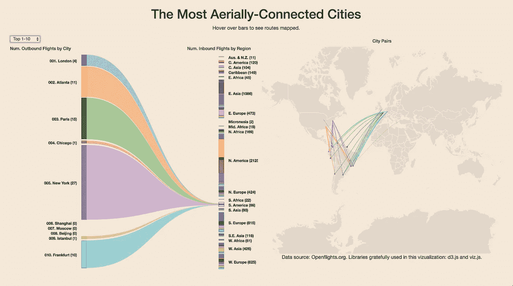
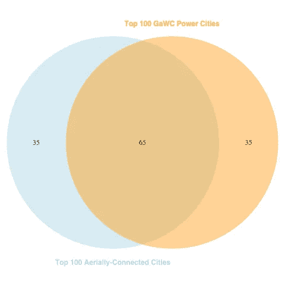
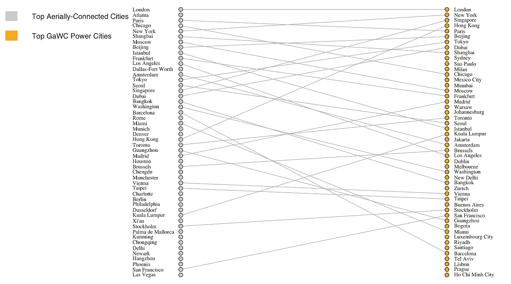
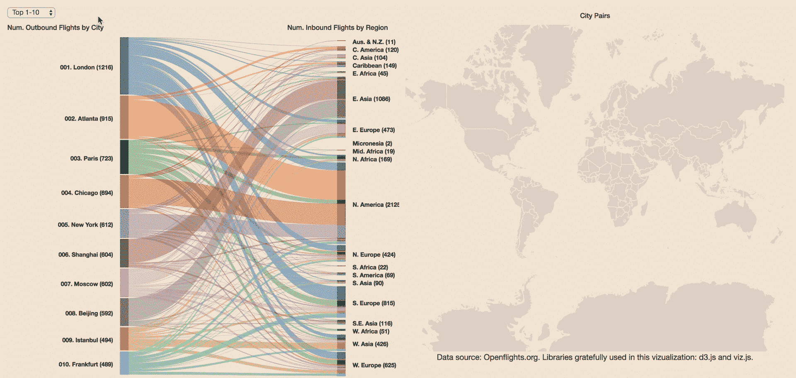

# 你的城市有多强大/空中连接？

> 原文：<https://towardsdatascience.com/how-powerful-aerially-connected-is-your-city-79d886a79907?source=collection_archive---------9----------------------->

## 探索我的第一个“真正的”D3 可视化来找出答案

Click [here](https://brandnewpeterson.github.io/) to explore the live visualization!

# 首先，快速插入 D3.js

一直在学 d3.js，被它吹得神魂颠倒。不久前，我尝试用 R 闪亮的构建一个交互式可视化。我发现它很强大，但有点被服务器端的设置所阻碍——不太容易在任何旧服务器上部署。

D3.js 有一个令人困惑的更新周期(至少对我来说)，但这是我唯一不喜欢它的地方。令人惊讶的是，您可以如此广泛地定制它的输出。如果你能想象，你就能做到。而且总会有一个[bl . lock](https://bl.ocks.org/)样本让你开始走上正确的道路。

如果你对学习 d3.js 感兴趣，我推荐[这个简短的 Udemy 课程](https://www.udemy.com/masteringd3js/)。这位教师很了解他的东西，他已经构建了一些真实世界的入门项目，在几周内带你从简单到复杂。

写完之后，我想试着围绕我对航空数据的兴趣做点东西。我在 R(仍然喜欢用它来做数据准备)处理了最新的 OpenFlights.org 数据，并给出了 100 个联系最紧密的城市的路线。

# 空中连接的城市是强大的城市

关于这些数据，有趣的第一件事是，一个城市的空中连接程度与城市权力的各种指数有多少重叠。全球化和世界城市研究网络(T9)(GaWC)和其他组织根据大都市的 GDP 估计值和其他数据编制了年度城市实力排行榜。

他们的选择标准[听起来很复杂](https://en.wikipedia.org/wiki/Global_city#Characteristics)，有些是专有的。但是，仅仅通过对城市提供的出境航班数量进行排名，你就可以得到与 GaWC 100 强相当接近的结果。

这就是维恩图显示的。

这两份清单有 65 个重叠的项目。如果你想生活在一个强大的城市，你可以做得比简单地测量其出境航班时刻表的厚度更糟。

对于超级好奇的人来说，看看这张显示每个列表中前 50 名城市排名对应关系的二分图。

请注意，某些航空枢纽城市(例如亚特兰大和达拉斯)的空中连接排名比电力高得多。看起来，他们之间的联系更多的是由于主要航空公司的轴辐式航线，而不是他们的整体经济实力。

# 那么，你所在的城市与空中的联系有多紧密？

它在名单上吗？(我住在#18！)

探索[我的 viz](https://brandnewpeterson.github.io/) 找出答案。通过下拉菜单浏览整个 100 列表。将鼠标悬停在两侧的桑基条(是的，就是这些东西)上，查看绘制的路线(这部分花了一些时间！).

你会注意到前 20 个左右的城市是真正的全球连接，提供许多地区和直接的跨大陆航班。随着你在列表中越来越深入，提供的直飞洲际航班的数量逐渐减少，剩下的大部分都是区域航班。