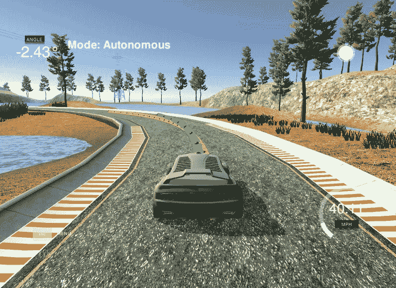
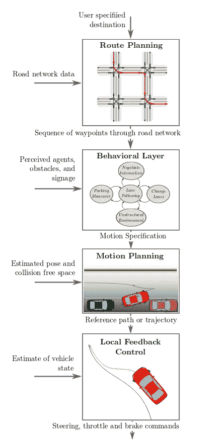
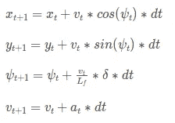

# 自动驾驶汽车如何从 A 地到达 B 地？

> 原文：<https://towardsdatascience.com/how-self-driving-cars-get-from-a-to-b-f18b1fc12044?source=collection_archive---------4----------------------->

最近我偶然发现了一篇非常有趣的[论文](https://arxiv.org/pdf/1604.07446.pdf)，这篇论文对城市地区无人驾驶汽车的运动规划和控制技术做了很好的概述。在这篇文章中，我将回顾这篇论文中与我在 [Udacity 无人驾驶汽车纳米学位](https://www.udacity.com/course/self-driving-car-engineer-nanodegree--nd013)的最后一个学期 2 项目相关的几个部分。

The final output from last project in Term 2

构建自动驾驶汽车系统的常见方法之一是组织传感器感知(雷达、激光雷达、摄像头等)。)和决策过程分成一个等级结构。

# 分级结构

自动驾驶汽车的决策模块可以通过四个组件来表示:

1.  **路线规划**——寻找 A 点和 b 点之间的最短路径。当你搜索附近的餐馆时，想想谷歌和 Here 地图在做什么。
2.  **行为决策** —一旦找到路线，该子模块负责选择驾驶行为(车道跟随、变道、右转等)。)基于其他交通参与者和既定的交通法规。这些行为是有限的一组动作，通常表示为*有限状态机*和一些启发法，用于反映车辆周围环境(其他车辆、道路工程等)的当前上下文。).这一领域的最新发展之一是麻省理工学院的人工智能方法，用于模拟决策过程中的这一步骤。
3.  **运动规划** —一旦行为被选择，它需要被转换成一个低级别反馈控制器可以遵循的轨迹。运动规划模块负责寻找轨迹/路径。
4.  **车辆控制** —反馈控制器通过使用适当的执行器(转向、油门、刹车)和纠正轨迹误差，完成沿着选定轨迹移动车辆的所有艰苦工作。

Decision making process in self-driving cars. [Source](https://arxiv.org/pdf/1604.07446.pdf).

# 关于运动规划和车辆控制的更多信息

在课程第二学期的最终项目中，我们被要求在模拟器中使用[模型预测控制](https://en.wikipedia.org/wiki/Model_predictive_control)(简称 MPC)驾驶汽车，这基本上涵盖了自动驾驶汽车决策过程的最后两个部分(运动规划和车辆控制)。

MPC 能够预测车辆在有限时间范围内的未来状态(位置、方向和速度)。这是一个不断自我更新的迭代模型，并在 *N* 个时间段( *dt* )预测车辆状态。预测本身是基于数学车辆模型。

创建一个正确的车辆模型是一项相当复杂的任务，并且伴随着权衡(我们是应该选择精度较低的简单模型还是计算要求较高的复杂模型)。在我们的项目中，我们将使用**运动学模型**，与**动力学模型**(考虑了影响车辆动力学的其他力)相比，该模型更容易理解。

这是我们的车型:

Kinematic vehicle model

车辆坐标用 *x* 和 *y* 表示。 *ψ* 和 *v* 分别对应方位和速度**和*。*** 车辆执行器用转向角( *δ* )和加速度( *a* )建模。

Udacity simulator 为我们提供了车辆应该去哪里的方式(参考点)。这将来自*路线规划*步骤，来自现实世界中的层级流。通过这些点拟合高阶多项式，并且输出用于与 MPC 预测模型进行比较。这将是*运动规划*步骤。

MPC 的工作方式是，它预测车辆未来的位置，并试图通过正确调整执行器(转向、油门和刹车)来最小化错误率。这将代表*车辆控制*步骤。

你会注意到项目中缺少*行为决策*步骤，但这是由于 Udacity 模拟器中场景的简化(路上没有其他车辆，没有路障，等等。).

# 延迟启动

我们应该注意的一件事是反馈控制器中执行器的响应性。在现实世界中，改变转向角和/或油门的请求将由汽车上的致动器以一定的延迟来执行。在该项目中，为了模拟这种行为，引入了人工**100 毫秒**延迟。我通过设置运动学方程来处理这个问题，以使用前一时间步的驱动。在这种特殊情况下，时间步长( *dt* )与模拟延迟具有相同的值。

# 最后结局

该项目的源代码可以在我的 Github 个人资料中找到:

 [## bdjukic/CarND-MPC-项目

### CarND-MPC-Project - CarND Term 2 模型预测控制(MPC)项目

github.com](https://github.com/bdjukic/CarND-MPC-Project)