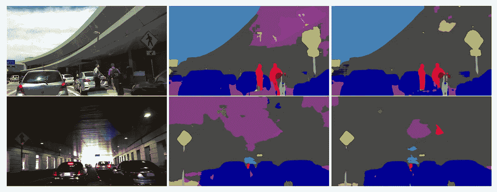
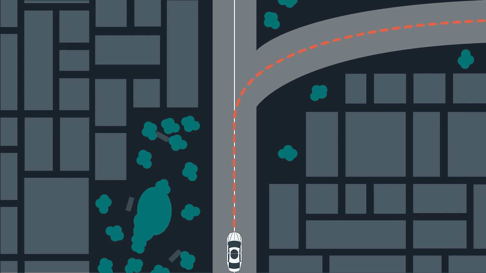
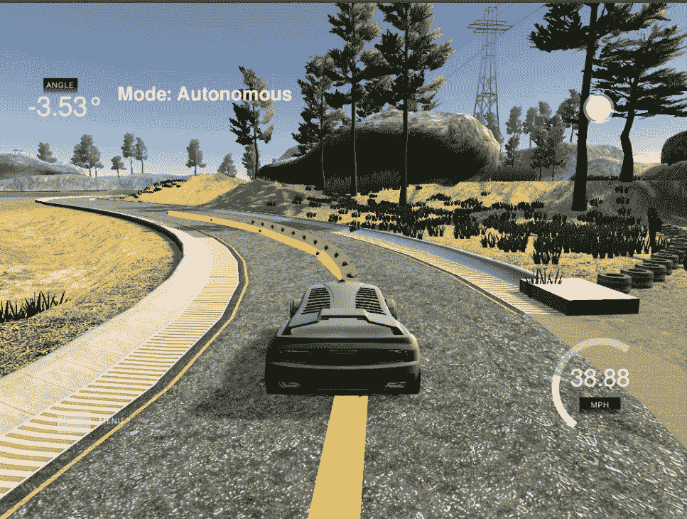

# 自动驾驶汽车的转向控制

> 原文：<https://towardsdatascience.com/how-self-driving-cars-steer-c8e4b5b55d7f?source=collection_archive---------2----------------------->

*用数据做酷事*

典型的自动驾驶汽车从感知系统开始，该系统估计周围环境的状态，包括地标、车辆和行人。



Perception of local environment

定位模块将其所学与地图进行比较，以确定车辆的位置。


Localizing a self driving car

一旦知道了车辆的位置，路径规划模块就绘制出到达目的地的轨迹。



Path planning trajectory

最后，控制回路在每个时间步决定转向和油门/制动，以在该轨迹上引导车辆。在这篇博客中，我将讨论控制回路如何决定转向和油门值

对于我在 Udacity 自动驾驶汽车 nano degree 中的项目 10，我实施了预测控制，以在模拟器中驾驶汽车。见下图。模拟器向用户提供汽车在每个时间点的位置和速度，反过来，用户向模拟器提供转向和加速度以应用于汽车。非常感谢 Udacity 创建了这个模拟器，并为我提供了实现模型预测控制的专业知识



Self Driving Car in Udacity Simulator

我已经用 C++分享了我的 [**GitHub**](https://github.com/priya-dwivedi/CarND/tree/master/Term%202/CarND-MPC%20Control%20-P5) 的链接和完整代码。

**模型预测控制**

**状态**:车辆在任一点的状态由四个向量描述——x 位置、y 位置、速度(v)和方向(psi)。

**执行器或控制输入**是转向角(δ)和节流阀(a)。刹车可以表示为负油门。因此 throttle 的值可以在-1 和+1 之间。转向角通常设置在-30 度到+30 度之间。

**运动学运动模型**可用于在应用转向和油门后从先前状态预测新状态。

x _[t+1]= x[t]+v[t]* cos(psi[t])* dt
y _[t+1]= y[t]+v[t]* sin(psi[t])* dt
psi _[t+1]= psi[t]+v[t]/Lf * delta[t]* dt
v _[t+1]= v[t]+a[t]* dt

这里 Lf 是车辆前部和重心之间的距离。车辆越大，转弯速度越慢

为了估计理想的转向角和油门，我们从理想状态估计新状态的误差——我们想要遵循的实际轨迹和我们想要保持的速度和方向，并使用 [Ipopt 解算器](https://www.coin-or.org/CppAD/Doc/ipopt_solve_get_started.cpp.htm)来最小化该误差。这有助于选择最小化期望轨迹误差的转向和油门。

所以良好运动控制的关键是很好地定义这个**误差**。我将误差设置为基于以下内容

1.  与参考点的距离——见下面的等式。我们将由于与参考 x，y 的差异而产生的误差(定义为跨磁道误差(CTE))、与期望取向的差异(定义为取向误差(epsi ))以及与参考速度的差异相加。n 是我们预测未来的时间步数。

```
double cost = 0;
for (int t=0; t < N; t++) {
    cost += pow(epsi[t], 2); //Orientation error
    cost += pow(cte[t], 2); //Cross track error
    cost += pow(v[t]- ref_v, 2);//Delta from ref velocity
}
```

2.与执行器成比例的误差

```
cost += pow(delta[t], 2); //Steering angle
cost += pow(a[t], 2);//Throttle 
```

3.与致动器变化成比例的误差——成本函数中的这一附加项反映了下一个致动器状态与当前状态之间的差异。这确保了致动器值的平稳变化

```
for (int t = 0; t < N-1; t++) {
  cost += pow(delta[t+1] - delta[t], 2) //Change in steering
  cost += pow(a[t+1] - a[t], 2)  //Change in throttle
}
```

上述各项可以乘以权重，这些权重增加了该项在总成本等式中的重要性。例如，如果我们将`pow(delta[t+1] - delta[t], 2)` 乘以 500，这将确保非常平稳的转向变化，并防止模拟器中的颠簸运动

C++ [Ipopt 解算器](https://www.coin-or.org/CppAD/Doc/ipopt_solve_get_started.cpp.htm)用于最小化误差，并计算转向和油门的最佳值。

另外两个相当重要的参数是我们要预测转向和油门的未来时间步数(N)。和时间步长(dt)。

*   dt——不同时间步长之间的时间间隔。我发现 dt 是模拟器中整体性能的一个非常重要的参数。如果 dt 太低，就会导致赛车在赛道中心来回摆动。发生这种情况可能是因为致动器输入接收非常快，并且车辆不断响应。此外，如果 dt 小于延迟时间(0.1 秒)，则在执行前一个信号之前接收到新的致动器信号。这导致汽车的颠簸运动。另一方面，如果 dt 太大，在致动器被接收之前，汽车行驶了太多的距离，虽然这导致沿着轨道的直线部分的平稳性能，但是它导致汽车在弯道上偏离道路。
*   n-是模型预测的时间步数。随着 N 的增加，模型预测更远。模型预测的时间越长，预测就越不准确。此外，如果 N 很大，则需要进行更多的计算，这会导致求解器的结果不准确，或者求解器无法实时提供解。我发现大约 10-15 步是最好的

一旦设置了所有的模型并且定义了所有的参数，

1.  我们将当前状态作为初始状态传递给模型预测控制器。

2.我们称之为优化求解器。给定初始状态，求解器将返回使成本函数最小化的致动器向量。

3.我们将转向和油门应用到车辆上。然后回到步骤 1。

通过预测每一步正确的转向和油门来驾驶汽车绕着模拟器行驶不是一件容易的事情，但却是一次令人敬畏的学习经历。非常感谢 Udacity 创建了这个课程！

**其他著述**:【https://medium.com/@priya.dwivedi/】T2

PS:我住在多伦多，我希望将职业生涯转向深度学习。如果你喜欢我的帖子，并能把我联系到任何人，我将不胜感激:)。我的电子邮件是 priya.toronto3@gmail.com

**参考文献:**

[Udacity](https://www.udacity.com/) 无人驾驶汽车 Nano Degree——我感谢 Udacity 和巴斯蒂安·特龙给我机会成为他们新的无人驾驶汽车项目的一部分。这是一次非常有趣的旅程。我使用的大部分代码都是在课堂讲课中建议的。这里的图片和视频参考也在讲座中分享

图片:[https://arxiv.org/pdf/1612.02649.pdf](https://arxiv.org/pdf/1612.02649.pdf)