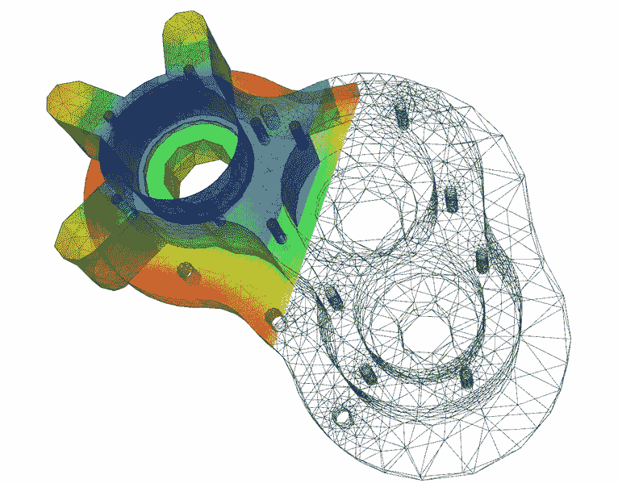

# 模拟将如何发展数据科学

> 原文：<https://towardsdatascience.com/how-simulations-will-evolve-data-science-3187c18de886?source=collection_archive---------1----------------------->

数据科学可以分为两类:监督学习和非监督学习。不同的是，监督学习有一个所谓的标签。标签或目标变量包含关于真相的信息。与世界各地的许多客户合作时，我经常建议:

如果你能被监督；去监督。

我更喜欢这样，因为有监督的问题更容易优化。你有了一个更清晰的业绩衡量标准，这让生活变得更轻松。

在这个领域，很难被监督。要克服的问题是:我从哪里得到一个标签？

在大多数教育例子中，关于这个基本事实的信息是简单给出的。事实上，你经常要付出很大的努力来获得这些信息。这项工作分为三类:

*   用一种可以被监督的方式来解释问题
*   从数据中提取信息(例如，获取时间序列中的预测值)
*   获取一般的标签信息

在这篇文章中，我们主要讨论获取标签的问题。更准确地说，我们关注一种未被充分利用的方式来获得它。

Elmer-pump-heatequation by A1, [Wikipedia](https://commons.wikimedia.org/wiki/File:Elmer-pump-heatequation.png), CC BY-SA 3.0

**获取标签信息的三种方式**

目前最常用的获取标签的方法是使用历史数据。虽然这很直观，但也有其独特的问题。一方面，可能有些事情从来没有发生过，因此你没有相关的数据。另一方面，你可能会遇到概念漂移的问题。概念的漂移意味着潜在的模式随着时间而改变。一个常见的原因是机器的腐蚀。

获得标签数据的第二种方式是人类专家。人类非常擅长给日常物品贴标签，比如图片或文本。如果你问一位生物学家，他在显微镜图像上看到的是哪种细菌，他通常能说出名字。这些技术的缺点是:有限的数据量、主观性和用例的局限性。人类不太擅长标记 1000 个传感器的时间序列问题。

第三个很少被使用的选项是:模拟。作为一名工程师，你可以非常精确地模拟你的设备。汽车或飞机制造商正在模拟空气动力学。但是你可以在所有工程领域看到类似的模拟。

如果你不仅模拟了设备本身，还模拟了整个传感器电子设备来获取数据，你就可以用它来进行数据科学研究。您可以使用它来生成给定缺陷的传感器读数。这样，您可以生成许多积极的预测性维护案例。只有在使用模拟的情况下才有可能，因为搜索到的维护需求很少被记录下来。

**物理学家正在开拓**

事实上，这是粒子物理学家使用了几十年的技术。现代粒子探测器，如 ATLAS 或 Cern 的 CMS，是通过非常精确的模拟来描述的。为了找到你的希格斯粒子，你要模拟整个探测器，给自己创造模拟的希格斯粒子。之后，您可以将它用作监督学习算法的标记数据。

在实践中很少这样做的原因是获得好的模拟的挑战。模拟的质量限制了建模技术的复杂性。在欧洲粒子物理研究所，物理学家花了数年时间研究模拟本身。

随着物联网和工业 4.0 的兴起，我希望模拟工程师和数据科学家能够找到彼此。我对结果非常兴奋。有没有行业内的动手经验？如果是这样，我很想听听你们的经历！