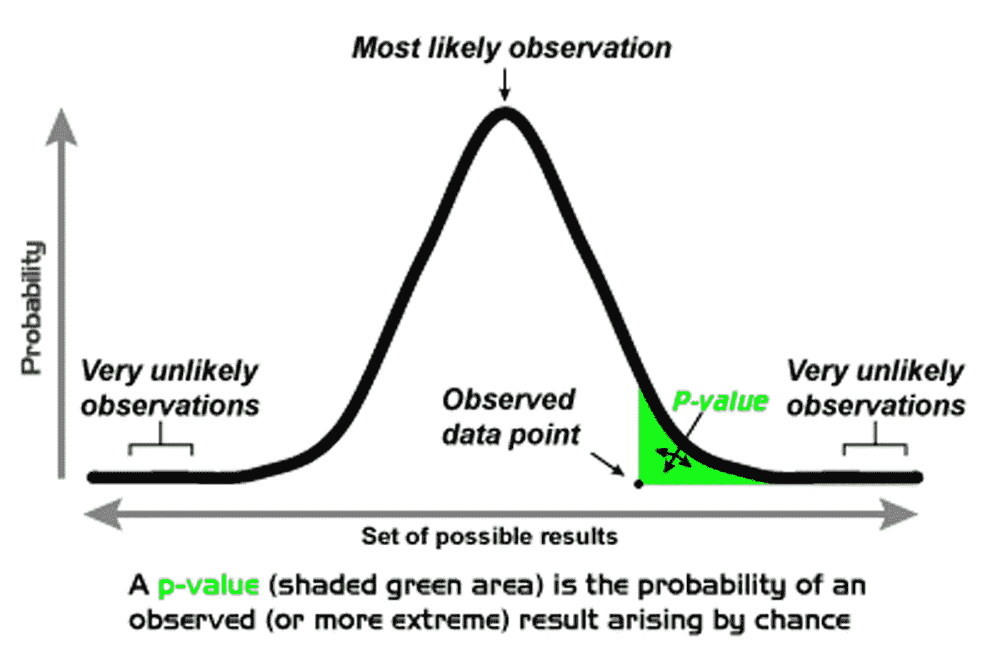
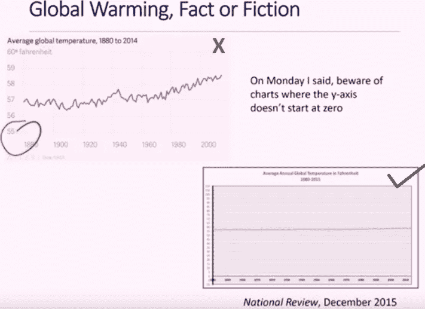
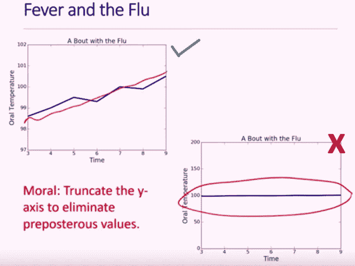
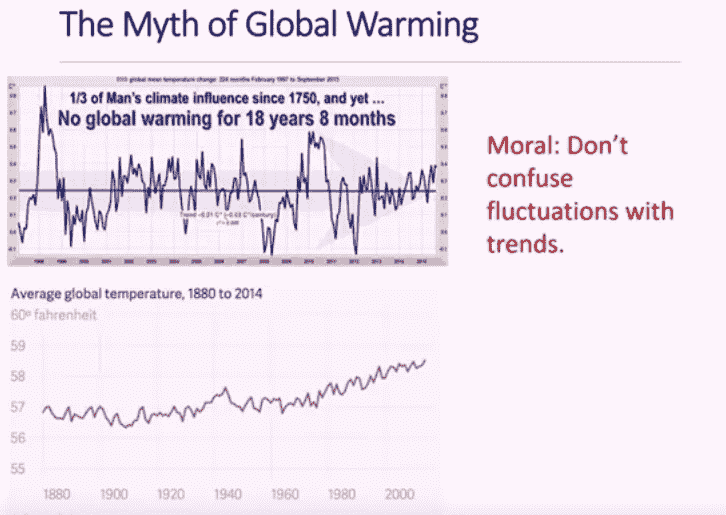
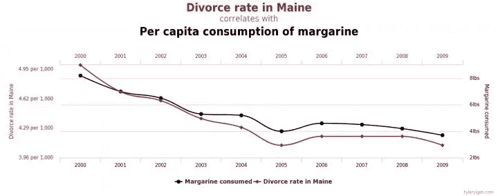
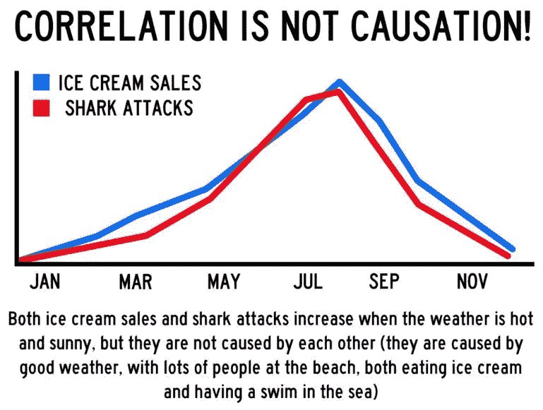
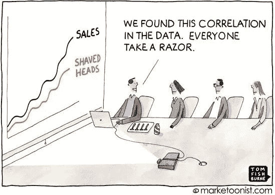
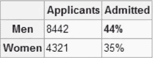
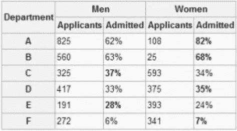
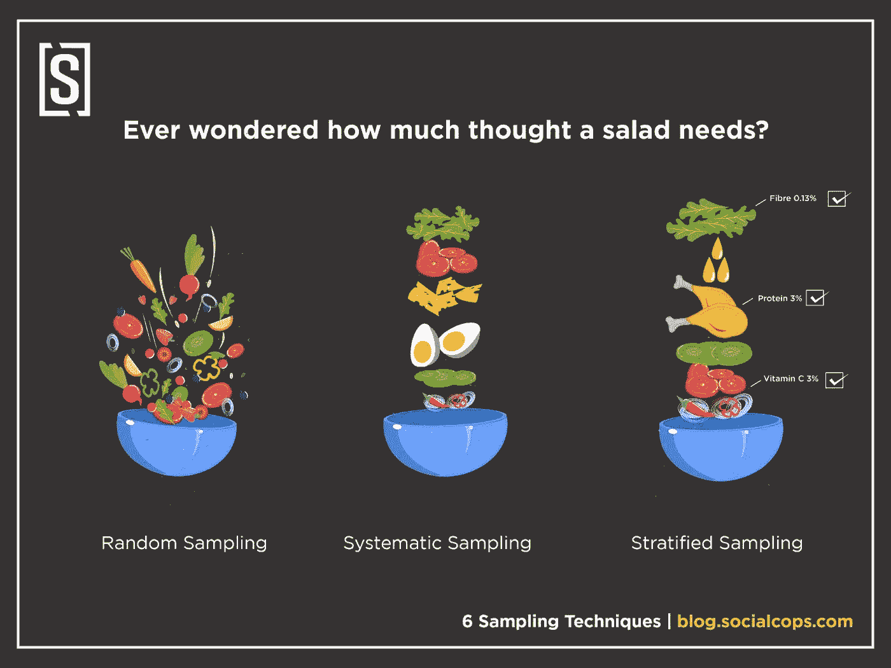

# 统计数据如何误导你

> 原文：<https://towardsdatascience.com/how-stats-can-mislead-you-e0ad563a578a?source=collection_archive---------5----------------------->

“我的统计数据不会说谎”，隔壁的统计学家说；嗯，也许是的，但爱丽丝可以使用那些很酷的图表，曲线数字来编造谎言！，不是在仙境，而是在现实！

如果你是一名数据科学家、分析师、机器学习工程师，或者仅仅是喜欢数字的人，理解统计学是至关重要的。但是统计数据并不是绝对的真理！也许你看到的统计数据被操纵了，为什么？因为他们可以！媒体和广告公司经常玩弄消费者心理，只展示他们想让消费者感知的东西。为了做出正确的决定，经常需要知道你得到的数据是真实的，毕竟你不想失去那笔百万美元的交易，不是吗？让我们仔细看看如何识破谎言，这样下次你去开会或看报纸时，你就不会被花哨的图表误导了。

## **统计数据误导的方式**

**①。** **统计意义**并不意味着实际意义。简单地说，某件事在统计上有意义并不一定意味着它是可行的或有任何实际重要性。

在一个统计实验中，假设检验(H0 和 H1)的框架是评估关于总体的两个相互排斥的陈述，以确定哪一个陈述最受样本数据支持。零假设(H0)是一种假设，即两个或多个总体的参数(均值、方差)没有差异，而另一种假设表示存在差异，称为备择假设。

显著性水平，用希腊字母 alpha 'α'表示(当假设为真时拒绝零假设的概率)，在实验开始前选择。例如，显著性水平为 0.05 表示当没有实际差异时，得出存在差异的结论的风险为 5%(通常选择 0.05 作为显著性水平，但它最终取决于用例，如果您的研究是关键的，您可以考虑 0.01)。另一个统计是“p 值”，即当研究中的零假设(H0)为真时，发现观察到的或更极端的结果的概率。

如果 p < α Null Hypothesis is rejected, which means the likelihood of the occurrence of the event if the Null Hypothesis is true is unlikely. A test result is said to be Statistically Significant when the sample statistic is unusual enough relative to the Null Hypothesis. Confused still?, [在这里阅读更多信息](https://atrium.lib.uoguelph.ca/xmlui/bitstream/handle/10214/1869/A_Statistical_versus_Practical_Significance.pdf;sequence=7)，但是现在要明白统计意义并不意味着实际意义。例如:你进行的一项研究(即使 alpha 为 0.01)可能完全具有统计学意义，但也许你收集的样本不足以代表总体，或者涉及的风险太高，你甚至不希望有 1%的概率出错。

**②。无关情节:**俗话说‘一图胜千言’，统计的图表/情节也是如此。

a.曲线图/图表类型:用于表示数据取决于您想要向观众讲述什么故事，例如:折线图更适合描述股价的涨跌，而条形图可能适合表示 x 地区每家公司的销售数据。使用饼图(条形图可以完成这项工作)可能会使整个演示文稿显得笨拙，并且您可能无法向观众传达一个观点。

b.操纵 Y 轴: *Y 轴可以被截掉，告诉一个不相关的检查*

其他时候， *Y 轴需要截断，以必要的比例表示数据*

[省略基线](https://venngage.com/blog/misleading-graphs/)或[挑选数据](https://venngage.com/blog/misleading-graphs/)是图表可能被歪曲的一些其他方式。同样*解释你的情节也很重要*，例如，不要混淆趋势的波动(如下图所示)。

**3)。相关性并不意味着因果关系:**想象你在一个周日的早晨醒来，当你走向沙发，手里可能拿着一杯咖啡，啜饮着，当你拿起那份报纸时，你震惊地看着一条可能是很好的误导性信息，它读起来像这样

不要担心，放松你的大脑肌肉，简单地抓住‘相关性并不意味着因果关系’这个事实；我的意思是，虽然缅因州的离婚率和人造黄油的消费是相关的，但没有证据表明一个导致了另一个。要了解更多信息，请参考。

相关性就像一种潜在的关系，虽然有潜在的关系并不意味着关系的存在。所以，下次你看到一个奇特的图表，有人说这是造成这种情况的原因，记得不要落入陷阱，除非你有确凿的证据。这并不意味着相关性是无用的，事实上它被用在许多地方，例如:评估机器学习中变量对之间线性关系的强度和方向。

**4)。辛普森悖论:** *辛普森悖论*，或*尤尔-辛普森效应*，是概率统计中的一种现象，一个趋势出现在几组不同的数据中，但当这些组组合在一起时就消失或反转。

一个真实的悖论发生在 1973 年。在伯克利大学的研究生院调查了录取率。该大学因招生中的性别差距被女性起诉:

调查的结果是:当每个学校被分开看时(法律、医学、工程等。)*，女性的录取率比男性高！然而，平均值表明，男性的录取率比女性高得多。说到困惑。*

当单个部门被关注时，录取实际上稍微偏向女性。这个误导性的平均值是悖论的经典例子。

**5)。抽样:**收集的数据需要数量合适，样本量小的统计数据通常不太准确。影响数据收集的一个因素是调查是如何进行的。抽样的目的是收集、计算和分析统计数据，以便我们可以从样本中为总体做出推断。最后，我们需要确信结果充分代表了我们关心的人群。

构建样本时，请记住->收集的过程和数据的一致性、多样性和透明度。有几种抽样技术(随机的、系统的、分层的等等),每一种都有其优点和缺点。你可以在这里进一步了解它们[。](https://blog.socialcops.com/academy/resources/6-sampling-techniques-choose-representative-subset/)

## **结论**

统计数据只是数字，它们是你想要讲述的故事的一半，如果没有上下文，它们是没有意义的，所以在做出任何结论之前，你需要精通并知道他们正在解决的问题，他们正在处理的数据，即你需要领域知识来推断/解释所进行的研究背后的统计数据。此外，统计只是一种工具，就像所有工具一样，你需要知道何时何地使用它们，如果使用得当，它可以帮助你做出价值数百万美元的决策，如果使用不当，它会让你失去这些决策。所以下次你看到一张图表或一些统计数据时，不要忘记质疑权威！或许在得出结论之前收集更多的证据。

我希望我已经提供了在分析你的统计数据或进行实验时要考虑的基础知识的概述。尽管不用说，我还没有深入研究过任何主题，您可能希望进一步探索它，为此，我提供了我的一点知识来源的链接。

# **参考文献**

计算思维与数据科学讲座-15。统计罪恶并总结:【https://www.youtube.com/watch?v=mCHwwW_Y5wE】T2&list = pl 2 goet 98 czrrq 0 nku 3c mpvr 0 v2 mjb 1 qku&index = 15

*统计 vs 实际意义:*[https://atrium . lib . uoguelph . ca/xmlui/bitstream/handle/10214/1869/A _ Statistical _ vs _ Practical _ Significance . pdf；sequence=7](https://atrium.lib.uoguelph.ca/xmlui/bitstream/handle/10214/1869/A_Statistical_versus_Practical_Significance.pdf;sequence=7)

*辛普森悖论:*[https://www . statisticshowto . datascience central . com/what-is-Simpsons-Paradox/](https://www.statisticshowto.datasciencecentral.com/what-is-simpsons-paradox/)

*样本量问题:*[https://askpivot.com/blog/2013/11/05/sample-size-matters/](https://askpivot.com/blog/2013/11/05/sample-size-matters/)

*采样技术:*[https://blog . social cops . com/academy/resources/6-Sampling-techniques-choose-representative-subset/](https://blog.socialcops.com/academy/resources/6-sampling-techniques-choose-representative-subset/)

*理解统计显著性:*[http://blog . minitab . com/blog/adventures-in-statistics-2/Understanding-hypothesis-tests-Significance-levels-alpha-and-p-values-in-statistics](http://blog.minitab.com/blog/adventures-in-statistics-2/understanding-hypothesis-tests-significance-levels-alpha-and-p-values-in-statistics)

【误导图:】[【https://venngage.com/blog/misleading-graphs/】](https://venngage.com/blog/misleading-graphs/)

*相关性与因果性:*

1.[https://www . insights association . org/article/correlation-does-not-equal-causance-and-why-you-should-care](https://www.insightsassociation.org/article/correlation-does-not-equal-causation-and-why-you-should-care)

2.[https://idata STS . com/why-journalists-love-cause-and-how-statists-can-help/](https://idatassist.com/why-journalists-love-causation-and-how-statisticians-can-help/)