# 出租车是如何算出车费的？—预测纽约市黄色出租车的价格

> 原文：<https://towardsdatascience.com/how-taxis-arrive-at-fares-predicting-new-york-city-yellow-cab-fares-71a8c43b7c50?source=collection_archive---------11----------------------->


photo credit: Pixabay

## 如何从基线模型到机器学习

预测出租车价格绝对没有[预测机票价格](https://www.business-standard.com/article/international/predicting-airfare-is-a-750-million-business-118100301166_1.html)那么红火。然而，由于我们目前没有可用的机票价格公开数据，为什么不从预测出租车价格开始练习呢？

在此任务中，我们将在给定接送地点和接送日期时间的情况下，预测纽约市的出租车费用。我们将在一些基本的数据清理后从创建一个最简单的模型开始，这个简单的模型不是机器学习，然后我们将转移到更复杂的模型。让我们开始吧。

# 数据预处理

数据集可以从 [Kaggle](https://www.kaggle.com/c/new-york-city-taxi-fare-prediction/data) 下载，整个训练集包含 5500 万次打车，我们将使用 500 万次。

```
import numpy as np
import pandas as pd
import matplotlib.pyplot as plt
import seaborn as sns
% matplotlib inline
plt.style.use('seaborn-white')
pd.set_option('display.float_format', lambda x: '%.3f' % x)taxi = pd.read_csv('ny_taxi.csv', nrows = 5_000_000, parse_dates = ['pickup_datetime']).drop(columns = 'key')
print("The dataset is {} taxi rides".format(len(taxi)))
```

***数据集为 5000000 次打车***

我们先看几排。

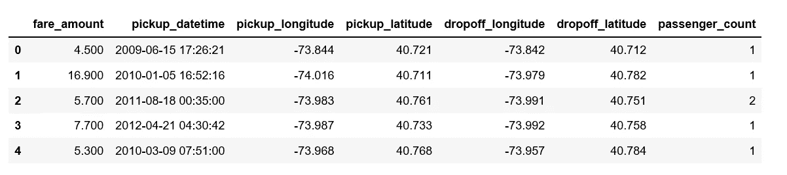

Figure 1

和统计摘要。

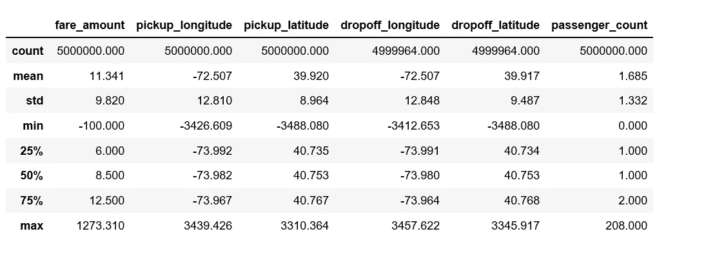

Figure 2

当我们查看统计摘要时，我们有几个发现:

*   最低票价金额为负数。
*   最小和最大经度和纬度看起来不真实。
*   最小乘客数为 0。

我们将修复它们。

*   纽约市的经度约为-74 度，纬度约为 41 度。
*   移除 0 乘客计数。
*   出租车费的初始费用是 2.5 美元，所以我们取消了低于这个数额的车费。

```
taxi = taxi[((taxi['pickup_longitude'] > -78) & (taxi['pickup_longitude'] < -70)) & ((taxi['dropoff_longitude'] > -78) & (taxi['dropoff_longitude'] < -70)) & ((taxi['pickup_latitude'] > 37) & (taxi['pickup_latitude'] < 45)) & ((taxi['dropoff_latitude'] > 37) & (taxi['dropoff_latitude'] < 45)) & (taxi['passenger_count'] > 0) & (taxi['fare_amount'] >= 2.5)]
```

然后我们再检查统计汇总。

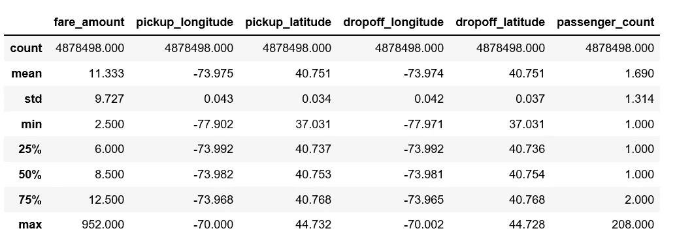

Figure 3

看起来好多了。

# 电子设计自动化(Electronic Design Automation)

让我们试着想象几次乘坐出租车的情景。

```
import seaborn as sns
def showrides(df, numlines):
  lats = []
  lons = []
  goodrows = df[df['pickup_longitude'] < -70]
  for iter, row in goodrows[:numlines].iterrows():
    lons.append(row['pickup_longitude'])
    lons.append(row['dropoff_longitude'])
    lons.append(None)
    lats.append(row['pickup_latitude'])
    lats.append(row['dropoff_latitude'])
    lats.append(None)plt.plot(lons, lats)showrides(taxi, 10)
```

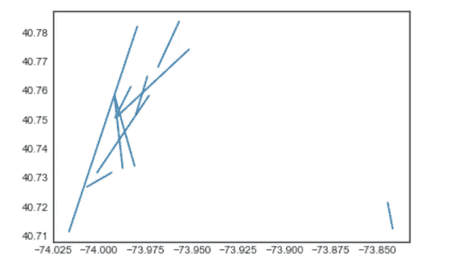

Figure 4

有些骑行距离很短，有些在中间距离，其中一个相当长。

**票价金额**

```
plt.figure(figsize = (14, 4))
n, bins, patches = plt.hist(taxi.fare_amount, 1000, facecolor='blue', alpha=0.75)
plt.xlabel('Fare amount')
plt.title('Histogram of fare amount')
plt.xlim(0, 200)
plt.show();
```

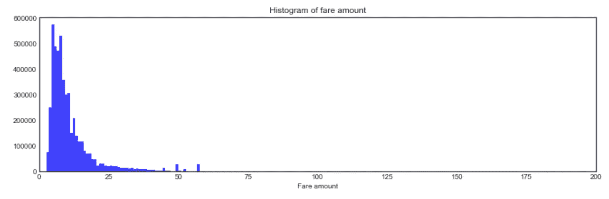

Figure 5

车费金额直方图显示大多数车费金额非常小。

```
taxi.groupby('fare_amount').size().nlargest(10)
```

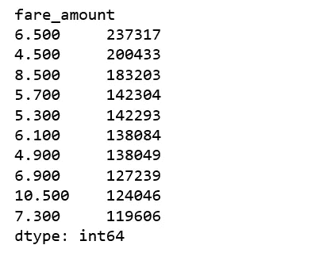

Figure 6

最常见票价金额非常小，仅为 6.5 英镑和 4.5 英镑，表明它们是曼哈顿内非常短的车程。

**乘客数量**

```
taxi['passenger_count'].value_counts().plot.bar(color = 'b', edgecolor = 'k');
plt.title('Histogram of passenger counts'); plt.xlabel('Passenger counts'); plt.ylabel('Count');
```

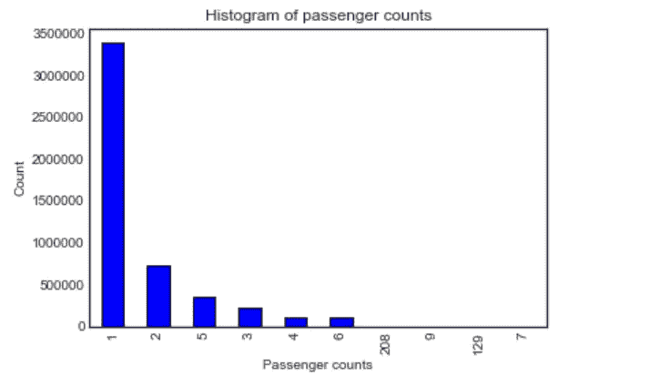

Figure 7

```
taxi.groupby('passenger_count').size()
```

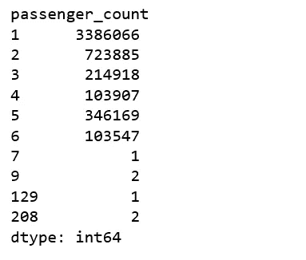

Figure 8

基于以上发现，我们准备去除`passenger_count` > 6 的打车。

```
taxi = taxi.loc[taxi['passenger_count'] <= 6]
```

# 基线模型

我们要创建的第一个模型是一个基于比率计算的简单模型，不涉及机器学习。

baseline_model

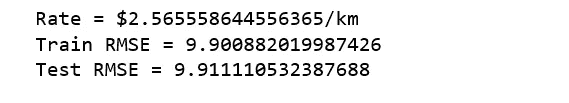

Figure 9

这个基线模型让我们的测试集 RMSE 为 9.91 美元。我们期望 ML 能取得比这更好的成绩。

# 特征工程

*   从日期时间中提取信息(星期、月、小时、日)。出租车费在一天中的不同时段以及工作日/周末/节假日有所不同。

```
taxi['year'] = taxi.pickup_datetime.dt.year
taxi['month'] = taxi.pickup_datetime.dt.month
taxi['day'] = taxi.pickup_datetime.dt.day
taxi['weekday'] = taxi.pickup_datetime.dt.weekday
taxi['hour'] = taxi.pickup_datetime.dt.hour
```

*   从上车到下车的距离。行程越长，价格越高。

haversine_np

*   增加一栏，标明从接送坐标到 JFK 的距离。往返 JFK 的统一票价为 52 美元。

```
JFK_coord = (40.6413, -73.7781)pickup_JFK = haversine_np(taxi['pickup_latitude'], taxi['pickup_longitude'], JFK_coord[0], JFK_coord[1]) 
dropoff_JFK = haversine_np(JFK_coord[0], JFK_coord[1], taxi['dropoff_latitude'], taxi['dropoff_longitude'])taxi['JFK_distance'] = pd.concat([pickup_JFK, dropoff_JFK], axis=1).min(axis=1)del taxi['pickup_datetime']
taxi.head()
```

添加新要素后，我们的新数据框看起来是这样的。

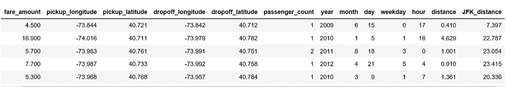

Figure 10

让我们想象一个新的特征，距离

```
plt.figure(figsize = (14, 4))
n, bins, patches = plt.hist(taxi.distance, 1000, facecolor='blue', alpha=0.75)
plt.xlabel('distance')
plt.title('Histogram of ride distance')
plt.show();
```

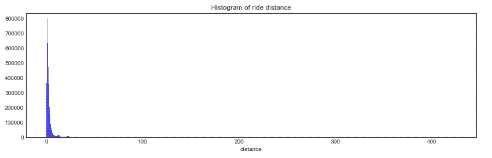

Figure 12

```
taxi['distance'].describe()
```

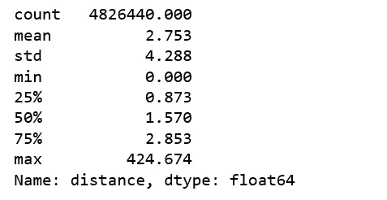

Figure 13

最小距离为 0，我们将删除所有 0 距离。

```
taxi = taxi.loc[taxi['distance'] > 0]
```

我们已经为更复杂的模型做好了准备，并击败了基线模型产生的 RMSE。

# 线性回归模型

linear_regression


Figure 14

# **随机森林回归**

random_forest


Figure 15

# LightGBM

Figure 16


Figure 16

# Keras 回归模型

keras_regression


Figure 17

今天到此为止。 [Jupyter 笔记本](https://github.com/susanli2016/Machine-Learning-with-Python/blob/master/NYC%20taxi%20fare.ipynb)可以在 [Github](https://github.com/susanli2016/Machine-Learning-with-Python/blob/master/NYC%20taxi%20fare.ipynb) 上找到。周末愉快！