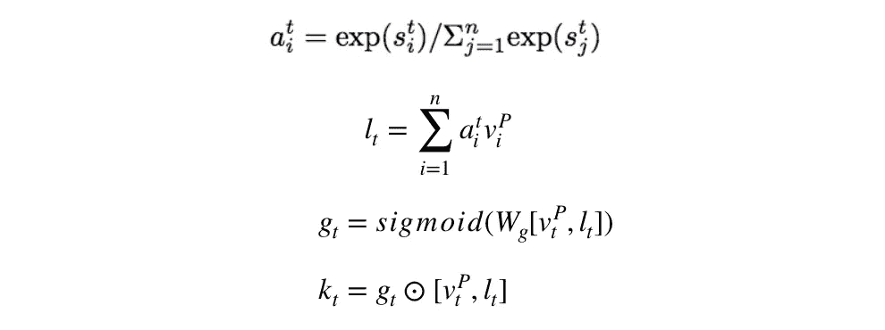

# 【当前】最佳问答模式是如何运作的？

> 原文：<https://towardsdatascience.com/how-the-current-best-question-answering-model-works-8bbacf375e2a?source=collection_archive---------1----------------------->

[https://pixabay.com](https://pixabay.com)

最近对深度学习如何解决**问答问题**产生了兴趣。

给定一篇文章和一个问题，任务是根据文章中的信息预测问题的答案。这被证明是一项相当复杂的任务，尤其是在处理大量文本的情况下。经过相当广泛的研究，我发现几个月前(2017 年 5 月)，微软亚洲研究院的科学家发布了最新和最准确的模型，旨在解决这个问题。迄今为止，他们的模型在[斯坦福问答数据集](https://rajpurkar.github.io/SQuAD-explorer/)上保持着最高的结果——用于评估任何问答系统。

在这篇文章中，我将尝试一步一步地解释他们的模型，称为 [R-NET](https://www.microsoft.com/en-us/research/publication/mrc/) 。

首先，让我们从实现的概述开始。它由 4 个阶段组成，每个阶段解决一个特定的问题:

1.  分别为文章和问题建立表征。
2.  将问题信息整合到文章中。
3.  通过直接将其与自身进行匹配来获得该段落的最终表示。
4.  *预测答案的起止位置。*

*边注:上述步骤使用具有 GRU 细胞(门控循环单元)的循环神经网络。如果你不熟悉，我推荐看* [*我的解释*](/understanding-gru-networks-2ef37df6c9be) *。*

## #1.为问题和文章建立表征

为了做到这一点，作者使用了一些基本的技术，我将在下面的步骤中解释。为了清楚起见，m 表示问题中的字数，n 表示文章中的字数。

*   对问题和段落分别执行[单词级嵌入](https://www.quora.com/What-is-word-embedding-in-deep-learning)产生矩阵:

其中第一个是 **Q** 问题矩阵，第二个是 **P** 访问矩阵。

*   对问题和段落分别执行字符级嵌入会产生矩阵:

其中第一个是 **Q** 问题矩阵，第二个是 **P** 访问矩阵。作者声称**字符级嵌入有助于词汇外标记**。这里有一个很好的定义:

> 该模型(使用字符级嵌入)逐个读取字符，以创建给定句子/文本的嵌入。因此，我们的神经网络将试图学习由空格或其他标点符号分隔的特定字母序列组成的单词。— [人物级深度学习](https://offbit.github.io/how-to-read/)。

*   将单词和每个单词的字符嵌入连接到一个新的向量中，我们得到:

其中第一个是 **Q** 问题连接，第二个是 **P** 消息连接。

*   最后，作者使用两个具有 GRU 细胞的双向递归神经网络来获得最终结果:

BiRNN — bidirectional recurrent neural network

## #2.把这个问题添加到文章中

使用上面的问题和段落表示，该模型将来自问题的信息合并到段落中。这产生了一个新的矢量:

先解释一下 *k_t* 是什么*。基本上，这个向量保存问题和当前段落单词的数据。其计算方法如下:*

*   使用不同的权重(标记为 *W* )我们计算:

*(s_j)^t* 表示来自矩阵 *s^t* 的单个向量)。向量从单个疑问词— *(u_j)^Q* 、当前段落词— *(u_t)^P* 和前一状态— *(v_(t-1))^P.* 中提取信息

在应用了 *tanh* 激活函数和附加权重向量 *V 后，(s_j)^t* 变成:

*边注:V^T 表示 v 的转置向量—如果 v =[1；2;3]的大小是 3x1，那么 V^T = [1，2，3]的大小是 1x3。*

*   然后模型计算矩阵 s^t.的 [softmax 函数](https://www.youtube.com/watch?v=mlaLLQofmR8)考虑单行，我们有:

*   将上述等式组合成:

产生整个问题的注意力集中向量*l^t*u^q.

*   *最后，作者又增加了两个计算。他们计算矢量 g^t:*

**

*它使用激活函数 *sigmoid* ，一组独特的权重 *W_g* 和 *(u_t)^P* 和 *l_t* 的串联。*

*最后一个等式使用对 *g_t* 的逐元素乘法和对 *(u_t)^P* 和 *l_t:* 的相同串联来获得 *k_t**

**

*本质上，这些最后的步骤是基于当前的段落单词和问题的注意力集中向量。关注它们的关系旨在模拟这样一个事实，即**只有部分段落与问题回答中的问题**相关。*

## *#3.将这篇文章和它自己配对*

*作者已经注意到了如上所述的问题意识段落表征的问题。基本上，这个模型对上下文的了解非常有限。一个答案候选人经常没有意识到其周围窗口之外的段落中的重要信息。*

*由于文章上下文对预测答案至关重要，模型需要使用与第二步类似的等式，将有问题意识的文章与其自身进行匹配。*

*   *自匹配后当前段落单词的结果向量是:*

**

*如你所见，它的获得方式与 *(v_t)^P* )完全相同，唯一的区别在于 *k_t* 的计算。*

*我们不使用当前的文章单词和问题，而是取问题意识文章 *v^P* 和它的当前单词 *(v_t)^P:**

**

*所有其他的等式都遵循第二个等式的相同模式，使用问题意识段落表征 *v^P:**

**

## *#4.预测答案*

*为了预测答案，作者使用所谓的[指针神经网络](https://medium.com/@devnag/pointer-networks-in-tensorflow-with-sample-code-14645063f264) —从文章中输出答案的开始和结束单词的索引的递归神经网络。数学插图看起来像这样:*

**

*其中 *h^P* 是步骤#3 中自匹配产生的问题感知段落， *(h_(t-1))^a* 是指针 RNN 的前一状态， *p^t* 是函数[*argmax*](https://en.wikipedia.org/wiki/Arg_max)*应用于当前 *a^t* 向量的结果。因为我们只需要 2 个索引，所以网络只由 2 个 GRU 单元构成，只产生 *p* 和 *p* (开始和结束索引)。**

**让我们看一下整个流程:**

*   **首先我们有:**

****

**本质上，上面的等式计算了面对 *r^Q* 的 RNN 的初始隐藏状态。这里我们使用问题表示 *u^Q* 和一个参数 *(V_r)^Q* )。**

**最终结果 *r^Q* 可以看做是 RNN 中的 *(h_0)^a* (隐藏状态)。**

*   **使用 *(h_0)^a* (= *r^Q* )和问题意识段落，我们计算答案起始词的索引如下:**

****

*   **然后我们产生第一个隐藏状态，它需要传递给 RNN 中的下一个 GRU 单元:**

****

*   **使用*对 p 重复上述步骤(h_1)^a* 隐藏状态给我们提供了答案结尾词的索引:**

****

## **最后的想法**

**我希望 R-NET 模型的演示足够全面，以便您能够掌握基本原理并更好地理解该模型。在撰写本文时，这款车型因在斯坦福问答数据集上的最佳表现而在[排行榜](https://rajpurkar.github.io/SQuAD-explorer/)中排名第一。**

***我很高兴在评论区听到你的问题和想法。***

## **谢谢你的阅读。如果你喜欢这篇文章，给它一些掌声👏。希望你有一个伟大的一天！**