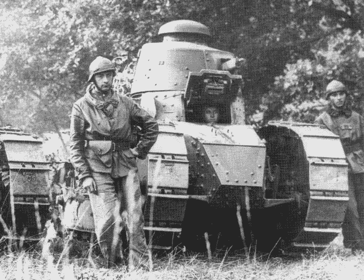

# 第一次世界大战中的法国军队如何教会你管理一个更好的分析团队

> 原文：<https://towardsdatascience.com/how-the-french-army-of-world-war-1-can-teach-you-to-run-a-better-analytics-team-d71e64efa7cd?source=collection_archive---------12----------------------->

100 年前的这个月，WW1 结束了。一场长达四年的血腥战争改变了我们的生活方式。正如历史上许多伟大的斗争一样，创新往往会发展得非常快，WW1 也不例外。结果，许多新的想法被付诸实践，因为每个竞争者都试图超越对方。坦克就是从第一次世界大战中发展起来的这样一种发明。我们最常想到的是英国人和他们的坦克，或者是庞大的德国陆地战舰。然而，我们今天仍然可以把一些创新归功于法国人。正是这些创新可以为当今的分析、大数据和数据科学团队提供借鉴。

1915 年，法国人着手建造他们自己的坦克，因为他们认为这将是打破西线僵局的一个好方法。他们第一次制造坦克非常昂贵，第一个模型预计 100 辆坦克要花费 700 万法郎，这在当时是一大笔钱。第一批坦克必须争夺资源。法国工业生产其他武器已经达到极限，为了制造坦克，必须进口钢板。最终，一辆 60 马力的坦克诞生了，它可以在平坦的地面上行驶 7 公里，在崎岖的地面上行驶一半的距离。这种装甲的厚度仅够阻挡小型武器的火力，但不能被大炮击中。这些坦克也是死亡陷阱，因为它们不是为机组人员的安全而设计的，发动机放在前面，这是大多数撞击发生的地方。换句话说，这些坦克并不完美。有点像第一批大数据和数据科学团队。

那些早期的团队很有趣，我享受我拥有的时间，然而我们所创造的还有很多需要改进的地方。我们有粗略的想法和理想主义，但让数据科学和大数据作为业务单位为组织服务的能力仍然是一条出路。许多人认为这些新学科会取代其他一切，有时当我访问一家公司时，他们仍然会有这些想法。但我们知道这是不正确的，我们在这些新的分析领域的初步尝试需要改进。公司对结果感到失望；团队领导对缺乏资源感到沮丧，团队成员经常与真正的期望脱节。需要一些新的不同的东西。

1916 年春天，法国人意识到他们的第一批坦克需要改进，有人想出了一个好主意，让我们把它做得更大！设想新坦克有 9 名乘员，更大的炮，更多的炮！见鬼，甚至连火焰喷射器都被设计出来放在坦克上。它最终被称为圣肖蒙德坦克，如果你玩过战地 1，你可能会很熟悉它。它更大更重，但是它的履带和一年前制造的第一辆坦克一样大。众所周知，这意味着履带上的重量更大，这意味着它更容易陷入泥中。

随着分析的发展，在过去几年中，我们看到数据科学团队和大数据团队也出现了这种情况。他们把失败视为成长的一种方式。我们需要更多的人、更快的系统、更大的系统！我们需要一个高管席位。首席数据官或首席分析官的重要性越来越大。但失败仍然是常态，主要是因为就像 1916 年法国的新坦克一样，如何使分析工作的基础没有随着时代而改变。从 2016 年到现在，公司看到了一些小的成功，但没有什么真正大的规模。当然，这里或那里有一些小的成功，但是能够横向扩展并以创建快速扩展的方式使用数据仍然是许多人的梦想。法国人在 1916 年的内维尔战役中引进了坦克，并且看到了整体上的巨大失败。然而，他们看到个别坦克表现出色，并利用这些知识来改变他们的坦克战略和使用方法。坦克被用作冲击武器，与步兵一起碾压，帮助清除敌军。这不起作用，太多的坦克被摧毁，士兵被杀。

法国人从头开始，意识到坦克的主要杀手是火炮。所以这意味着摧毁火炮是首要任务。因为摧毁炮兵是首要任务，这意味着你需要知道他们在哪里。这意味着你需要以航空摄影的形式进行空中侦察。为了使空中摄影成为可能，你需要拥有当地的空中优势。一旦他们拥有了空中优势，他们就需要高度集中自己的火炮来压制敌人的火炮。一旦炮击发生，坦克需要知道他们在最好的地面上的路线，在前进中，用烟幕弹来帮助他们尽可能接近敌人的阵地，以帮助最大限度地减少炮兵干掉太多坦克。他们需要与步兵更好的沟通，这意味着与军队其他部门的新的沟通方法。最后，坦克将用于有限的交战和有限的目标。

当法国人使用他们新的交战方式时，他们非常成功地达到了他们的目标。在他们的第一次交战中，许多坦克坏了，这在当时是很常见的。但是坦克在突破防线或者转移步兵的注意力方面起到了至关重要的作用，使得步兵能够到达他们的目标。

像法国人一样，许多公司需要思考他们如何使用数据，并真正摆脱他们团队的孤立方法。团队通常被创建为公司中的一个新的筒仓，与公司中的其他人没有什么关系。法国人意识到这是一场灾难，他们改变了他们的方法，采取了更加综合的方法。大多数数据团队也需要这样做，并花时间与他们组织的各个接触点进行沟通。因为就像法国人 100 年前学到的那样，你可以拥有新的技术和伟大的技术，但如果你不能与你组织的其他人交流，这些技术就是一种浪费。

但是法国人并没有就此止步。他们有重型坦克，他们决定需要轻型坦克。有两个乘员的坦克，一个旋转炮塔，这在当时是新的。这种坦克也轻得多，只有 4 吨重，行驶速度是当时任何一种坦克的两倍。此外，这种坦克很容易生产。金融时报是大多数人所说的这些坦克。从 1918 年 6 月开始，它们很容易部署，法国生产了 2000 多辆这种坦克，比其他坦克加起来还多。事实上，英国《金融时报》通常被称为赢得战争的坦克。法国的联合部队理论并没有随着英国《金融时报》而改变，事实上，他们能够用这些坦克更快地占领更多的土地，比敌人可能希望恢复的速度更快，因为坦克的速度使得重新集结以进行可能的反击变得困难。直到今天，FT 的设计也经常被称为所有坦克的模板。两条轨道的基本设计，一个带枪的移动炮塔，100 年后本质上是一样的。

数据团队需要找到他们的 FT。现在，我们真的没有一个，因为大多数公司还没有就他们的联合力量战略进行对话，以创建 FT 场景，这将使他们有能力与竞争对手竞争。因此，数据科学和大数据仍然是阵地战式的努力。第一次世界大战 100 年后，我们可以从当时人们的经历中吸取教训，并将其应用于当前的形势。法国坦克使用的演变可以教会我们团队融合的重要性，以及为解决实际问题而创新的重要性，而不仅仅是为了创新本身。如果数据团队希望生存下去，他们今天需要学习的东西。因为堑壕战对战壕里的士兵或他们各自的国家从来都不是好事。

我要感谢 youtube 频道《伟大的战争》，这是我获得关于法国军队研究信息的地方。我强烈建议去看看他们的频道。