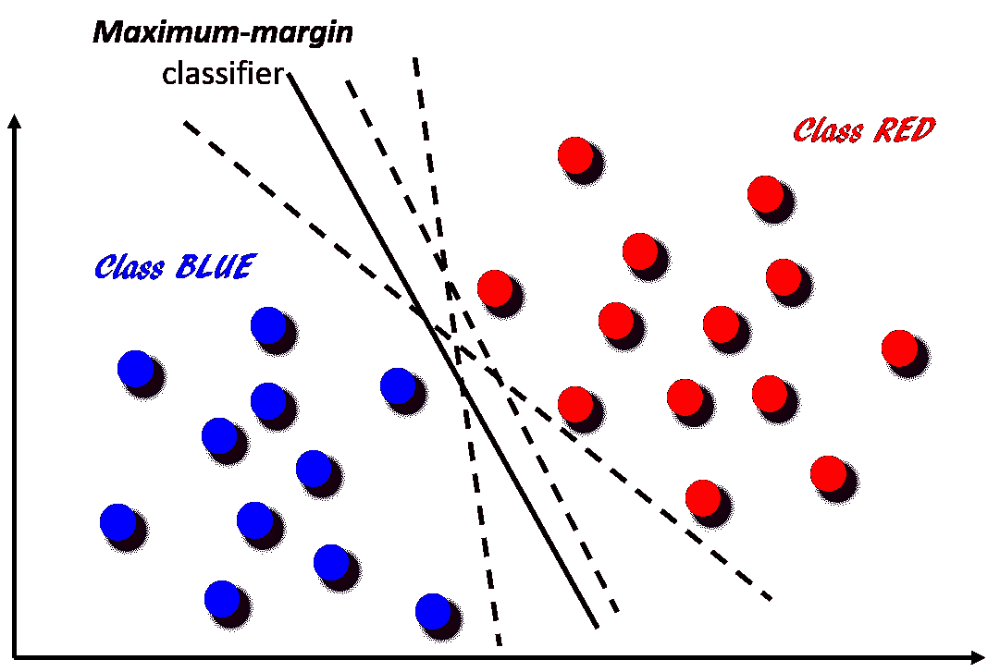
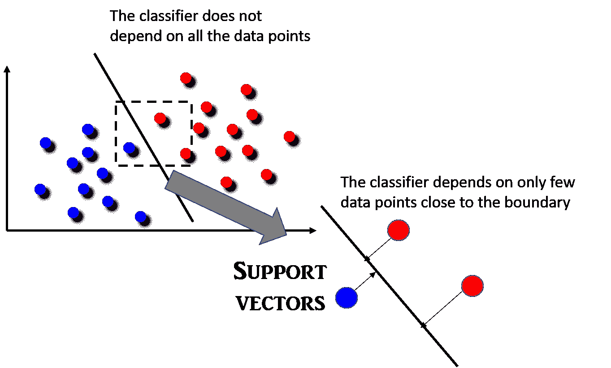
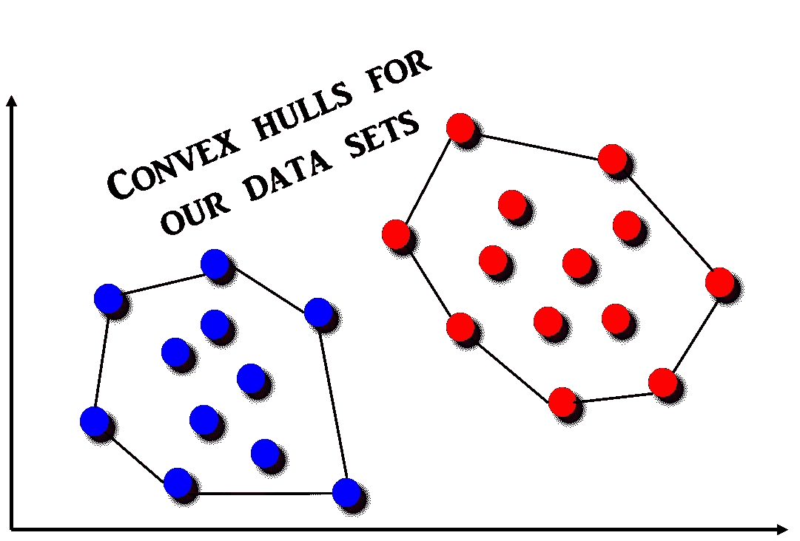
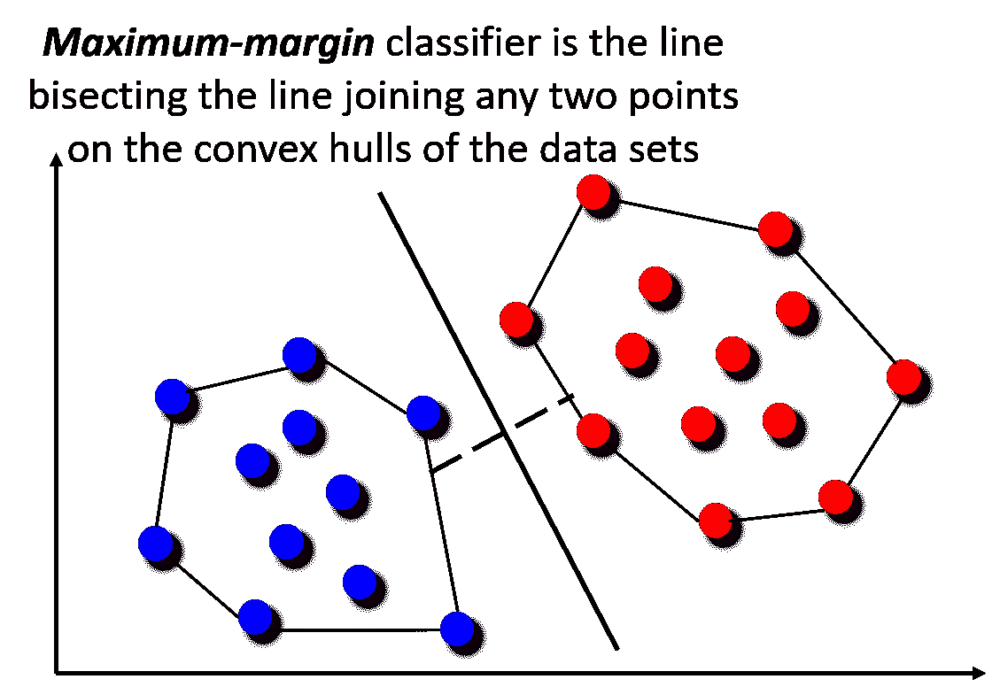
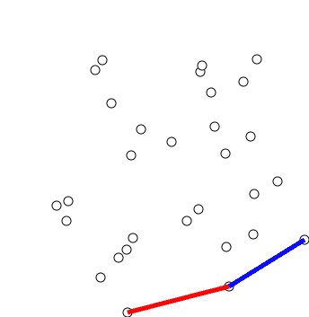

# 古老的排序算法如何帮助伟大的机器学习技术

> 原文：<https://towardsdatascience.com/how-the-good-old-sorting-algorithm-helps-a-great-machine-learning-technique-9e744020254b?source=collection_archive---------5----------------------->

## 在本文中，我们展示了简单排序算法如何成为解决计算几何中一个重要问题的核心，以及它如何与广泛使用的机器学习技术相关联。


机器学习正迅速成为现代社会中最重要的计算技术之一。作为人工智能(AI)的一个分支，它正被应用于从[自然语言翻译和处理](https://www.nytimes.com/2016/12/14/magazine/the-great-ai-awakening.html)(想想 Siri 或 Alexa)到[医学](https://www.techemergence.com/machine-learning-in-pharma-medicine/)、[自动驾驶](https://www.nytimes.com/2014/11/20/technology/personaltech/picking-your-cars-computerized-brain.html)或商业战略发展的方方面面。一系列令人眼花缭乱的智能算法正在不断开发，以解决 ML 问题，从数据流中学习模式，并建立人工智能基础设施。

> 然而，有时后退一步，分析一些基本算法如何在这场革命中发挥作用，并欣赏它们的影响，感觉会很好。在本文中，我将举例说明这样一个重要的案例。

## 支持向量机

[支持向量机或 SVM](https://en.wikipedia.org/wiki/Support_vector_machine) 简而言之，是过去几十年发展起来的最重要的机器学习技术之一。给定一组训练样本，每个样本被标记为属于两个类别中的一个或另一个，SVM 训练算法建立一个模型，将新样本分配给一个类别或另一个类别，使其成为非[概率](https://en.wikipedia.org/wiki/Probabilistic_classification) [二元](https://en.wikipedia.org/wiki/Binary_classifier) [线性分类器](https://en.wikipedia.org/wiki/Linear_classifier)。它广泛应用于工业系统、文本分类、模式识别、生物 ML 应用等。

下图说明了这个想法。主要目标是将二维平面中的点分为两类——红色或蓝色。这可以通过在两组点之间创建分类器边界(通过运行[分类算法](https://en.wikipedia.org/wiki/Statistical_classification)并从标记数据中学习)来完成。图中显示了一些可能的分类器。它们都将正确地对数据点进行分类，但是并非所有的数据点都与最接近边界的数据点集具有相同的“*余量*”(即距离)。可以看出，它们中只有一个最大化了蓝点和红点集合之间的这个“T4”裕度。该唯一分类器用实线表示，而其他分类器用虚线表示。这种间隔最大化的效用在于 ***两个类之间的距离越大，对于一个新点的分类的泛化误差就越低。***



**FIG 1**: SVM and Maximum-margin classifier

SVM 算法的主要区别特征是 ***分类器不依赖于所有的数据点*** (不像逻辑回归，其中每个数据点的特征将用于分类器边界函数的构建)。事实上， ***SVM 分类器依赖于数据点的一个非常小的子集，那些最靠近边界*** 的数据点以及它们在超平面中的位置会影响分类器边界线。由这些点形成的向量唯一地定义了分类器函数，并且它们'*支持*分类器，因此被命名为'支持向量机'。这个概念如下图所示。



阅读更多关于支持向量机的[白痴指南。一个关于 SVM 的视频教程可以在这里找到。](http://web.mit.edu/6.034/wwwbob/svm.pdf)

## SVM 工作原理的几何解释:*凸包*

SVM 算法背后的形式数学相当复杂，但通过考虑一种叫做[凸包](https://en.wikipedia.org/wiki/Convex_hull)的特殊几何构造，可以直观地理解它。

***什么是凸包*** ？形式上，[欧氏平面](https://en.wikipedia.org/wiki/Euclidean_plane)或[欧氏空间](https://en.wikipedia.org/wiki/Euclidean_space)中的点集 *X* 的**凸包**或**凸包络**或**凸闭包**是包含 ***X*** 的最小[凸集。然而，使用*橡皮筋类比*最容易形象化。想象一根橡皮筋绕着一组钉子(我们的兴趣点)的圆周伸展。如果橡皮筋被释放，它会缠绕在挂钩上，形成一个紧密的边界来定义原来的设置。最终的形状是*凸包*，并且可以通过接触橡皮筋创建的边界的钉的子集来描述。这个想法如下所示。](https://en.wikipedia.org/wiki/Convex_set)



现在，很容易想象 SVM 分类器只不过是一个线性分隔符，它将连接这些凸包的线正好在中点处一分为二。

> 因此，确定 SVM 分类器简化为寻找一组点的凸包的问题。



## 如何确定凸包？

图片(动画的)说一千个字！因此，让我展示用于确定一组点的凸包的算法。它叫做[格雷厄姆扫描](https://en.wikipedia.org/wiki/Graham_scan)。该算法找到沿着其边界排序的凸包的所有顶点。它使用一个[堆栈](https://en.wikipedia.org/wiki/Stack_(abstract_data_type))来有效地检测和移除边界中的凹陷。



**FIG**: Graham’s scan to find convex hull.

> 现在，问题是这种算法的效率如何，也就是说，格雷厄姆的扫描方法的时间复杂度是多少？

事实证明，Graham 的扫描 ***的时间复杂度取决于底层排序算法*** ，它需要使用该算法来找到构成凸包的正确点集。但是排序是从什么开始的呢？

这种扫描技术的基本思想来自凸包的两个特性，

*   可以通过逆时针旋转穿过凸包
*   凸包的顶点相对于 y 坐标最低的点 p 以极角
    递增的顺序出现在**中。**

首先，这些点存储在一个数组`points`中。因此，算法从定位参考点开始。这是具有最低 *y* 坐标的点(如果出现平局，我们通过选择具有最低 *y* 坐标和最低 *x* 坐标的点来打破平局)。一旦我们定位了参考点，我们通过使它与数组中的第一个点交换位置，将该点移动到`points`的开头。


**FIG**: A stack data structure

接下来， ***我们根据剩余点相对于参考点*** 的极角对其进行排序。排序后，相对于参考点极角最小的点将位于数组的开头，极角最大的点将位于末尾。

正确排序这些点后，我们现在可以运行算法中的主循环。这个循环使用了第二个列表，当我们处理主数组中的点时，这个列表会增长和收缩。基本上，**我们将逆时针旋转出现的点推到堆栈上，如果旋转变为顺时针**则拒绝点(从堆栈中弹出)。第二个列表开始时是空的。在算法结束时，构成凸边界的点将出现在列表中。一个[堆栈数据结构](https://www.tutorialspoint.com/data_structures_algorithms/stack_algorithm.htm)用于此目的。

## 伪代码

```
# *Three points are a counter-clockwise turn if ccw > 0, clockwise if*
# *ccw < 0, and colinear if ccw = 0 because ccw is a determinant that #gives twice the signed  area of the triangle formed by p1, p2, and #p3.***function** ccw(p1, p2, p3):
    **return** (p2.x - p1.x)*(p3.y - p1.y) - (p2.y - p1.y)*(p3.x - p1.x)**let** N **be** number of points
**let** points[N] **be** the array of points
**swap** points[0] with the point with the lowest y-coordinate***# This is the most time-consuming step*
sort** points by polar angle with points[0]**let** stack = NULL
**push** points[0] **to** stack
**push** points[1] **to** stack
**push** points[2] **to** stack
**for** i = 3 **to** N:
    **while** **ccw**(next_to_top(stack), top(stack), points[i]) <= 0:
        **pop** stack
    **push** points[i] **to** stack
**end**
```

所以，格雷厄姆扫描的时间复杂度取决于排序算法的效率。可以使用任何通用排序技术，但是使用***【o(n^2】***和 ***O(n.log(n))*** 算法之间有很大的区别(如下图所示)。


**FIG:** Animations of various sort algorithms

## 摘要

在本文中，我们展示了简单排序算法如何成为解决计算几何中一个重要问题的核心，以及它如何与广泛使用的机器学习技术相关联。尽管有许多基于离散优化的算法来解决 SVM 问题，但这种方法展示了在核心处使用基本有效的算法来构建人工智能复杂学习模型的重要性**。**

如果您有任何问题或想法要分享，请联系作者在[**tirthajyoti【AT】Gmail . com**](mailto:tirthajyoti@gmail.com)。此外，您可以查看作者的 [**GitHub 资源库**](https://github.com/tirthajyoti?tab=repositories) 中其他有趣的 Python、R 或 MATLAB 代码片段和机器学习资源。如果你像我一样对机器学习/数据科学充满热情，请随时[在 LinkedIn 上添加我](https://www.linkedin.com/in/tirthajyoti-sarkar-2127aa7/)或[在 Twitter 上关注我。](https://twitter.com/tirthajyotiS)

***关键词***:#机器学习，#支持向量机，#算法，#人工智能，#计算几何