# 如何用机器学习赢得陌生来电

> 原文：<https://towardsdatascience.com/how-to-ace-cold-calling-with-machine-learning-8409737cc62d?source=collection_archive---------11----------------------->

## 打还是不打？

**陌生来电:**“你好卢克，今天过得怎么样？我注意到您正在办理汽车保险续保，我想知道您是否有几分钟时间听听我为奖励您的忠诚而向您提供的这个令人惊叹的优惠？”

如果你是卢克，你会怎么做？

这实际上很难讲，这就是为什么冷电话的成功率极低，需要成千上万次电话才能带来任何价值。由于所涉及的随机性，它们对于所涉及的任何一方来说都不是真正令人愉快的。然而，有了机器学习和足够的数据，就有可能了解成功电话背后的因素，然后可以用来更好地确定潜在客户并定制电话内容。

在本文中，我们将使用自动化数据科学团队 [AuDaS](http://mindfoundry.ai/audas) 建立一个机器学习模型，用于预测汽车保险电话推销的成功。数据由慕尼黑[技术大学](https://www.kaggle.com/emmaren/cold-calls-data-mining-and-model-selection/data)提供，由 Kaggle 托管。

## 数据探索

该数据集是从美国的一家银行收集的，该银行也提供汽车保险，并包含其客户的信息。因此，我们的目标是建立一个能够预测客户是否会购买汽车保险的模型。下表提供了此信息的快速概述:

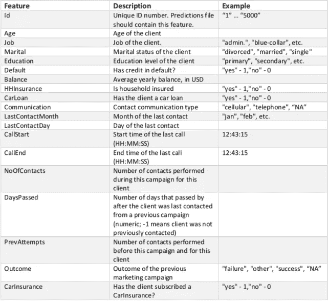

为了理解推动转化的特征，我们可以试着想象一下陌生电话的持续时间如何影响结果。首先，我们需要通过添加 datediff 操作，通过 AuDaS 的数据准备页面来创建该特性。

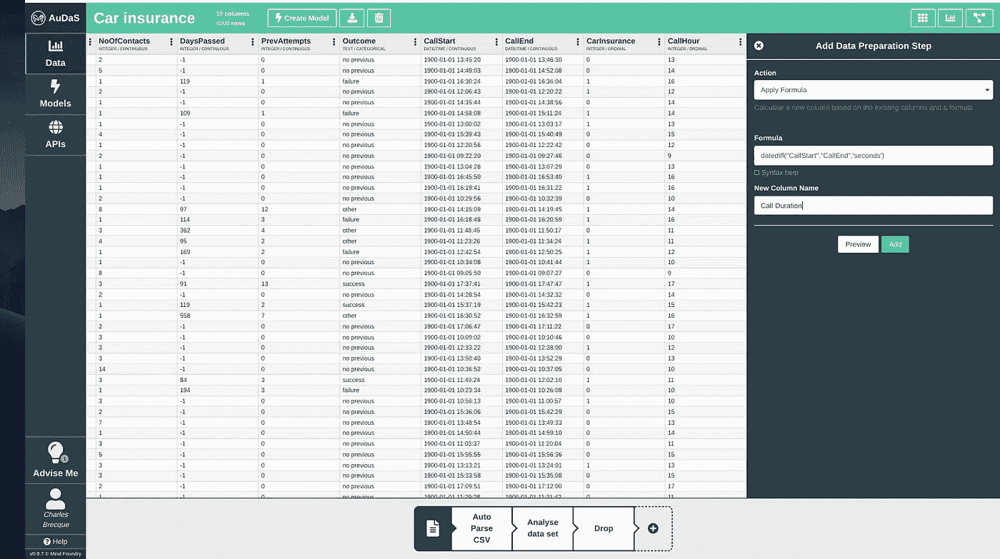

Data Preparation in AuDaS

然后，我们可以访问直方图视图来了解可能的关系。

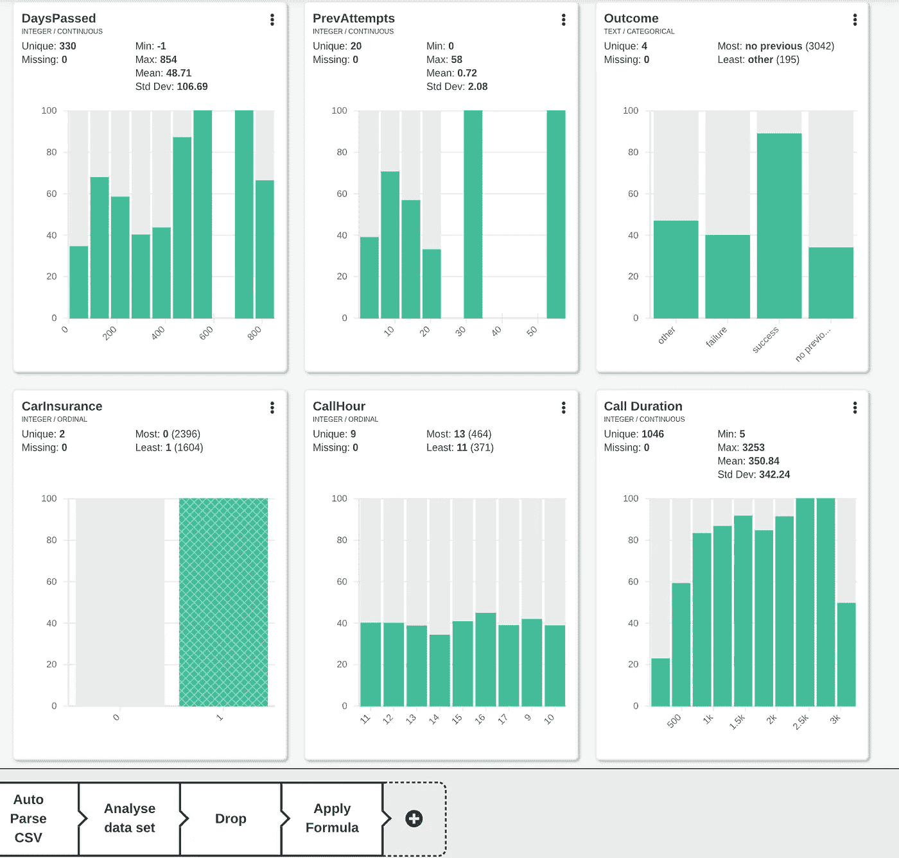

Histogram view in AuDaS

令人惊讶的是，虽然通话时长确实增加了转化的几率(CarInsurance = 1)，但似乎并没有明确的关系。打电话的时间似乎也不会影响结果。

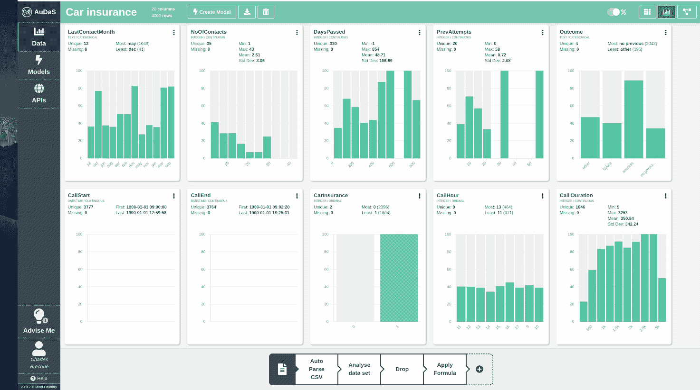

Distribution of successful conversions across all the features

总的来说，我们的数据集中似乎确实存在模式，这就是为什么我们可以希望 AuDaS 将找到一个性能良好的机器学习模型！

## 自动化建模

我们的目标是建立一个分类管道来预测客户是否会购买汽车保险。但是，我们需要能够在生产中使用这种模式，这就是为什么我们将**排除**通话持续时间和通话结束时间戳，因为这是我们在通话前无法预料的信息！

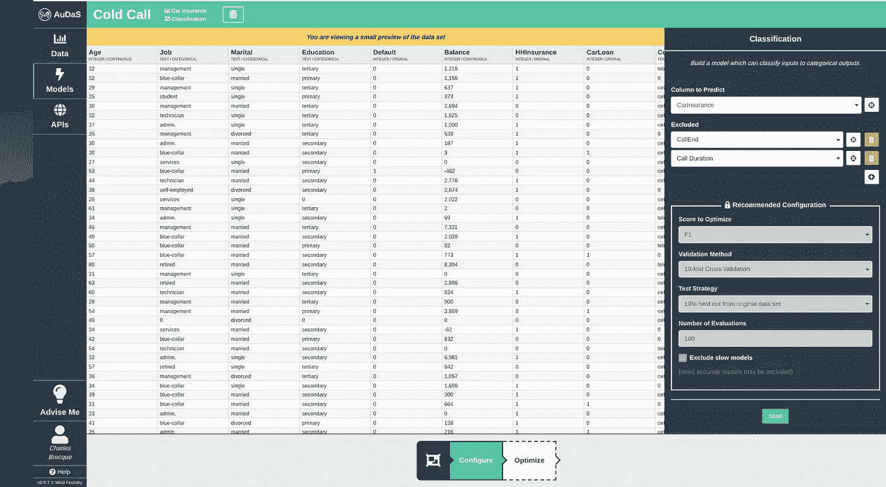

对于模型训练，AuDaS 将执行 10 重交叉验证，并将保留原始数据的 10%平衡样本用于最终验证。AuDaS 还将使用 [OPTaaS](http://optaas.mindfoundry.ai) 、 [Mind Foundry](http://mindfoundry.ai) 的专有贝叶斯优化器来有效地导航可能的数据科学管道空间。

AuDaS 提供了最佳数据科学管道(模型、参数值等)的完全透明性以及得分指标。

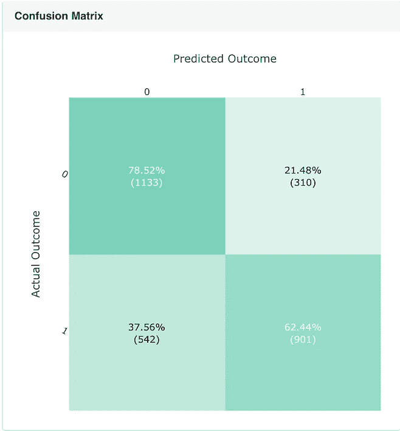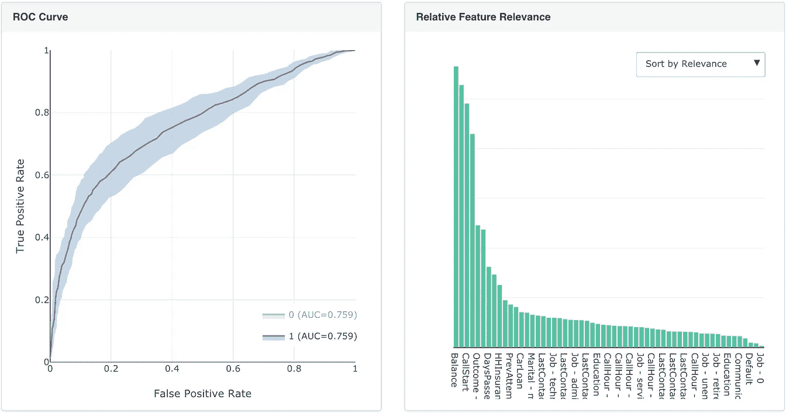

Score metrics of the best found model

一旦运行完成，我们就可以查看模型在 10%保持率上的性能，并且我们放心地看到分类准确性相当好(72.4%)并且模型健康状况良好！

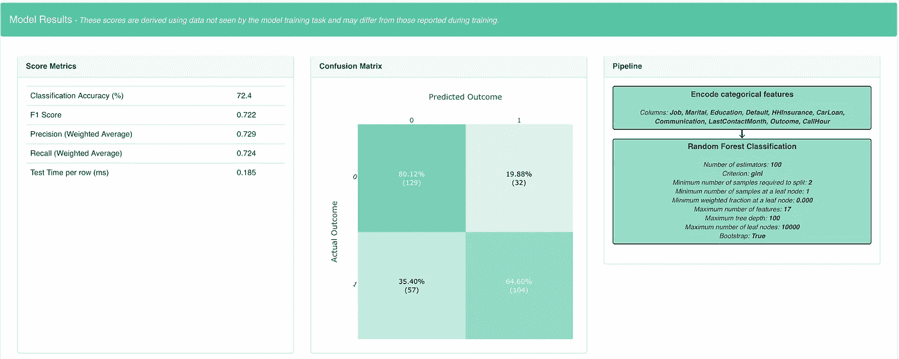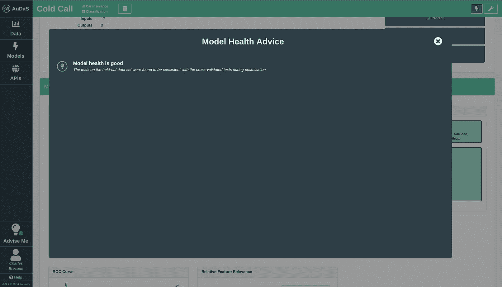

AuDaS Model Health Diagnostic

## 解释模型

我们的模型的特征相关性表明，客户银行账户的年平均余额似乎对他们是否购买汽车保险有最大的影响，其次是他们的年龄和电话推销的时间。

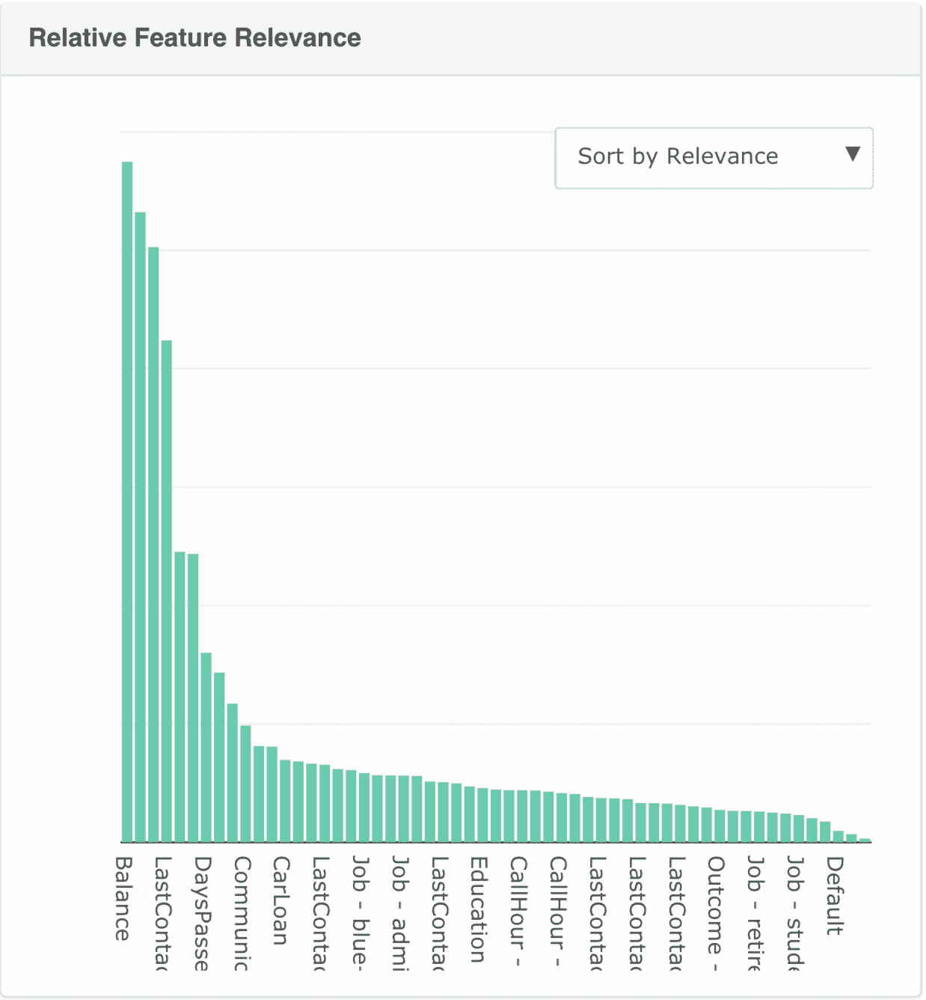

AuDaS feature relevance

换句话说，如果卢克 40 岁，账户上有很高的余额，他很有可能接受陌生来电者的提议！

然后，这个模型可以由 AuDaS 通过 RESTful API 自动投入生产。

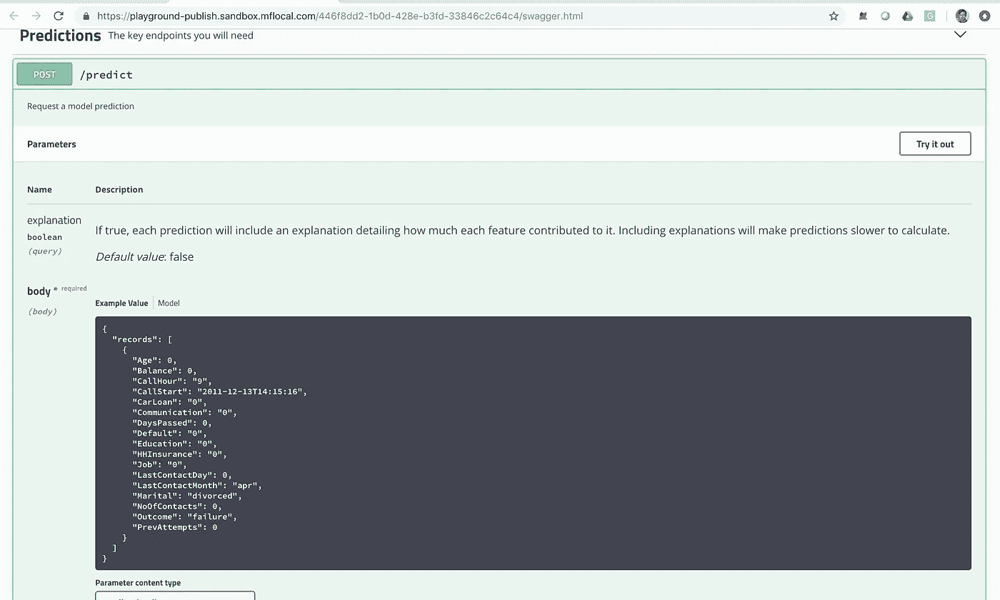

这意味着，陌生来电者可以使用 AuDaS 训练的机器学习模型来优先考虑他们应该致电的客户，这将帮助他们提高营销活动的成功。不幸的是，这个数据集没有提供足够的见解来定制这些电话的内容，但我们可以想象，分析抄本可能会让我们确定一些有趣的建议！

AuDaS 完成这项任务的完整视频可以在下面查看。如果你想尝试澳币，请不要犹豫，通过[电子邮件](http://charles.brecque@mindfoundry.ai)或 [LinkedIn](https://www.linkedin.com/in/charles-brecque-96768397/) 联系我们。

## 奥达斯

AuDaS 是由 Mind Foundry 开发的自动化数据科学平台，为构建端到端的机器学习解决方案(分类、回归、聚类和 soon 时间序列)提供了一个强大的框架。该框架有助于识别[数据泄漏](/detecting-data-leakage-before-its-too-late-afcfa4ea9f77)并采取行动，以免为时过晚。你可以在这里和这里阅读一些其他的实际用例[。](/optimize-your-email-marketing-strategy-with-automated-machine-learning-e1bfb8cc171b)

## 注册尝试 AuDaS:

**更新**:我开了一家科技[公司](http://www.legislate.tech)。你可以在这里找到更多

## 团队和资源

Mind Foundry 是牛津大学的一个分支机构，由斯蒂芬·罗伯茨(Stephen Roberts)和迈克尔·奥斯本(Michael Osborne)教授创建，他们在数据分析领域已经工作了 35 年。Mind Foundry 团队由 30 多名世界级的机器学习研究人员和精英软件工程师组成，其中许多人曾是牛津大学的博士后。此外，Mind Foundry 通过其分拆地位，拥有超过 30 名牛津大学机器学习博士的特权。Mind Foundry 是牛津大学的投资组合公司，其投资者包括[牛津科学创新](https://www.oxfordsciencesinnovation.com)、[牛津技术与创新基金、](http://www.oxfordtechnology.com)牛津大学创新基金和 [Parkwalk Advisors](http://parkwalkadvisors.com) 。