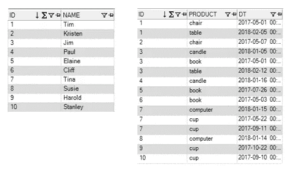
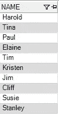
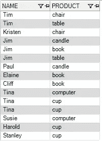
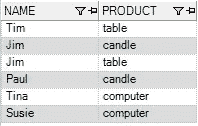
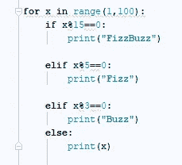

# 如何赢得面对面的数据科学面试

> 原文：<https://towardsdatascience.com/how-to-ace-the-in-person-data-science-interview-584ca11df08a?source=collection_archive---------1----------------------->


我以前写过关于我最近找工作的文章，但是这篇文章只关注面对面的面试。那一整天，试着让他们眼花缭乱，交叉你的手指，希望你已经为扔给你的东西做好了准备。在参加了大量这样的面试后，我发现他们倾向于遵循一些非常标准的时间表。

你可能会遇到 3-7 个不同的人，在与这些不同的人见面的过程中，你可能会涉及到:

*   说说你自己吧
*   行为问题
*   “白板”SQL
*   “白板”代码
*   谈论你简历上的项目
*   简单的分析问题
*   问你自己的问题

# 说说你自己吧

我以前在谈论手机屏幕时提到过这一点。我处理这件事的方式永远不会改变。人们只想听到你能说出你是谁，你在做什么。我的是某种变体:

*我是一名数据科学家，拥有 8 年使用统计方法和分析解决各行业业务问题的经验。我擅长 SQL，R 建模，目前正在学习 Python。*

# 行为问题

几乎每一家与我交谈过的公司都提出了应该用星型模式回答的问题。我在数据科学访谈中看到的最常见的明星问题是:

*   告诉我你向非技术人员解释技术成果的一次经历
*   告诉我你改进流程的一次经历
*   告诉我一个与难相处的利益相关者相处的时间，它是如何解决的

这里的目标是简明清晰地解释*的情况、任务、行动和结果*。

我对“技术结果”问题的回答大概是这样的:

*Vistaprint 是一家为小型企业在线销售营销材料的公司(请务必给出背景，面试官可能不熟悉该公司)。我有机会使用 k-means 进行客户行为细分。这包括创建 54 个变量，标准化数据，大量的分析等等。当需要与利益相关者分享我的成果时，我真的将这些信息提升了一个层次，构建了这个故事。我没有谈论方法，而是谈到了谁是客户群，以及他们的行为有何不同。我还强调了这种划分是可行的！我们可以在我们的数据库中识别这些客户，开发针对他们的活动，我给出了我们可能尝试的具体活动的例子。这是我向非技术利益相关者解释技术成果的一个例子。(之后一定要重述问题)。*

对我来说，这些问题需要一些准备时间。我从自己的经历中思考了一些最好的例子，并练习说出答案。这次有回报了。在整个面试过程中，我一遍又一遍地被问到同样的问题。

# 白板


## 白板 SQL

面试官让你站在白板前回答一些 SQL 问题。如果一份工作描述要求 SQL，这是公平的游戏。在大多数情况下，他们会在白板上贴几张纸。一个是包含(例如)id 和姓名的表(我们称之为 NamesTable)，另一个可能包含 id、日期和购买(我们称之为 PurchasesTable)。您明白了这个想法，您将编写 SQL 查询来回答他们的问题。



他们会问一系列问题，例如:

*   写一个查询来获得所有的名字—

```
*select names from NamesTable*
```



*   编写一个查询来获取姓名和购买情况—

```
select names, purchasesfrom NamesTable as njoin PurchasesTable as pon n.id = p.id
```



*   编写一个查询来获取在某个日期(他们随机选择的日期，这里是 2017 年 12 月)之后购买的商品的名称和购买次数

```
select names, purchasesfrom NamesTable as njoin PurchasesTable as pon n.id = p.id where p.dates > ‘2017–12–31’
```



*   编写一个查询来获取至少购买过两次的人的姓名和购买次数

```
select names, count(purchases) as cntfrom NamesTable as njoin PurchasesTable as pon n.id = p.idgroup by nameshaving count(purchases) ≥ 2
```


*   你明白了。一位面试官曾经问过我一个需要返回到同一个表的查询，但我还没有经历过比这更复杂的查询。

## **白色登机代码**

正如我在之前的文章中提到的。两家不同的公司连续两天问我 FizzBuzz。用 Python 写解决方案的一种可能方式(只是拍了一张我电脑的截图)如下:



编码问题很可能涉及到一些循环、逻辑语句，并且可能需要你定义一个函数。如果在职位描述中提到了某种特定的语言，他们可能希望看到这种语言的答案。招聘经理希望确保当你说你会编程时，你至少已经*掌握了一些基本的编程知识。*

# 你简历上的项目

我曾经被问到过我在简历中提到的所有方法(回归、分类、时间序列分析、MVT 测试等)。我在简历中没有提到我硕士学位的论文，但当被问及我以前是否有贝叶斯方法的经验时，我会随意引用它。面试官接着问了一个关于我论文中用到的先验分布的问题。

我在 9 年前完成了论文，不记得以前的事，告诉他我需要跟进。我确实跟进了，并把他的问题的答案发给了他。他们确实给了我一份工作，但这不是你想看到的情景。如果你要引用某样东西，要能对着它说话。即使这意味着在面试前通过查看维基百科来刷新你的记忆。简历上的东西和你提到的项目应该是全垒打。

# **简单分析题**

将会问一些基本问题，以确保你了解数字是如何工作的。这个问题可能需要你画一张图或用一些代数来得到答案，这将表明你有一些商业背景，可以解释正在发生的事情。关于转换率、平均销售价格变化的问题，为什么在这种情况下收入会下降？在这种情况下，您会选择什么型号？通常我会被问两三个这类问题。

在一次面试中，我被问到一个概率问题。他们问掷骰子的期望值是多少。然后有人问我，如果骰子以某种方式加权，那么骰子的期望值是多少。我不被允许使用计算器。

# **我提出的问题:**


*   告诉我一个你认为是高绩效/高潜力员工的人的行为。

老实说，我用上面的问题来试着了解你是否需要一周工作 60 个小时并在周末工作来成为一个出类拔萃的人。我经常在周末工作，因为我喜欢我所做的事情，如果这是意料之中的，我就不会喜欢。

*   你正在使用什么软件？

真的，我喜欢在手机刷屏的时候把这个问题解决掉。我个人对为 SAS 商店工作不感兴趣，所以我想提前了解一下。对于这个问题，我最喜欢的回答是“你可以使用任何你喜欢的开源工具，只要它适合这个问题。”

*   关于我的技能和资格，还有什么我可以告诉你的，让你知道我非常适合这份工作吗？

这是你的机会，让他们告诉你是否有你还没有涉及的，或者他们可能关心的事情。你不想在离开面试时，觉得他们没有得到决定是否聘用你所需的一切。

*   我什么时候能得到你的消息？

我还询问了报告结构，当然，我还询问了在开始工作后不久我将从事什么类型的项目(如果这还不清楚的话)。

# 摘要

祝你在数据科学面试中取得巨大成功。希望你能遇到很多优秀的人，并有一个积极的经历。每次面试后，记得发送感谢信！如果你没有收到录用通知，或者没有接受某家公司的录用通知，仍然可以登录 LinkedIn，向他们发送联系请求。你永远不知道什么时候未来的时机会更好，你们的道路可能会交叉。

如果你喜欢这篇文章，请访问我的网站！[这里](https://datamovesme.com/)