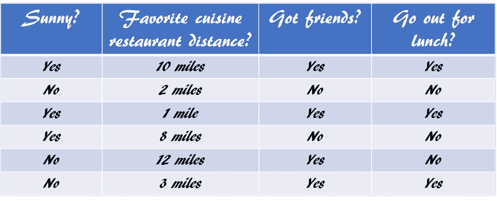
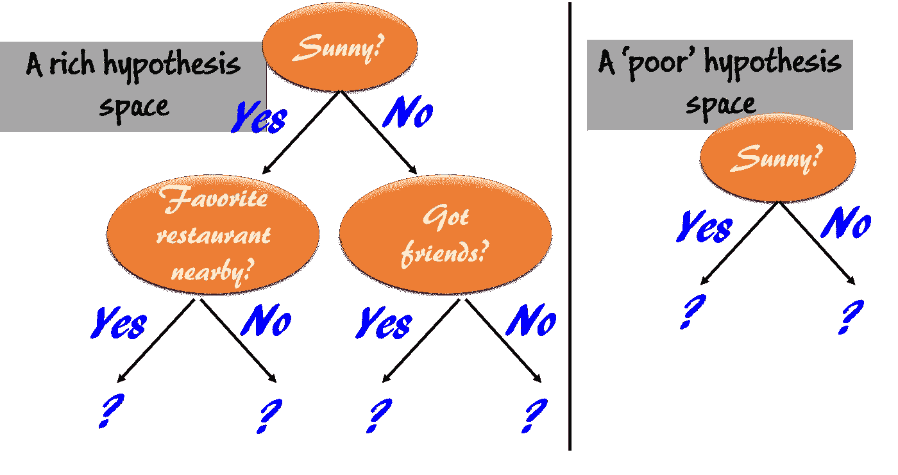
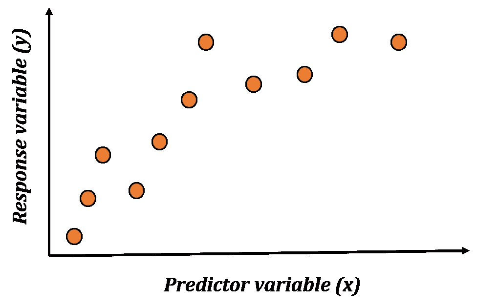
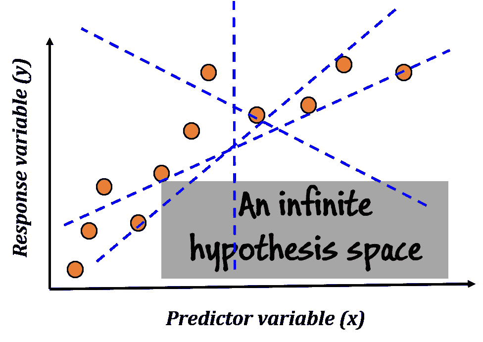
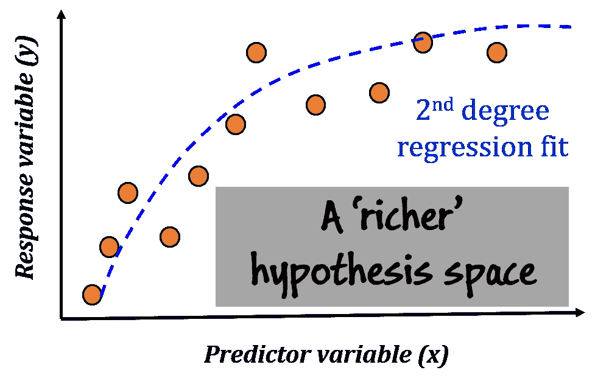
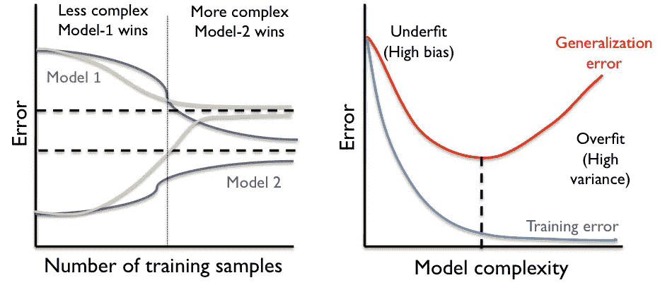
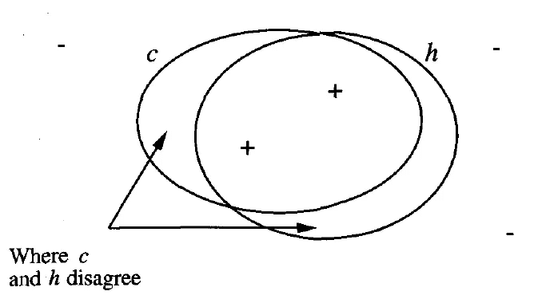
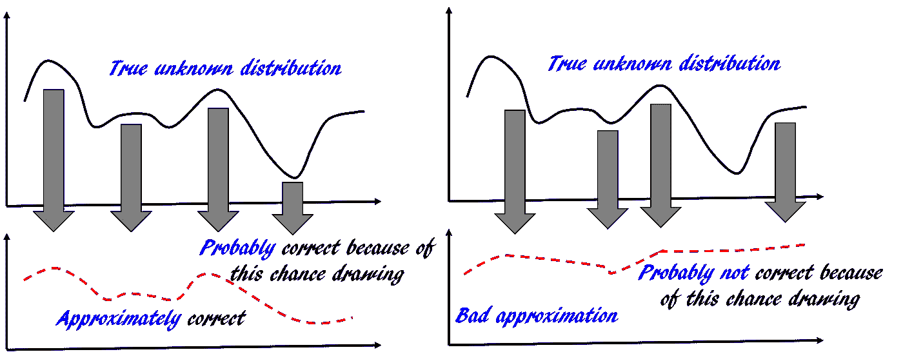
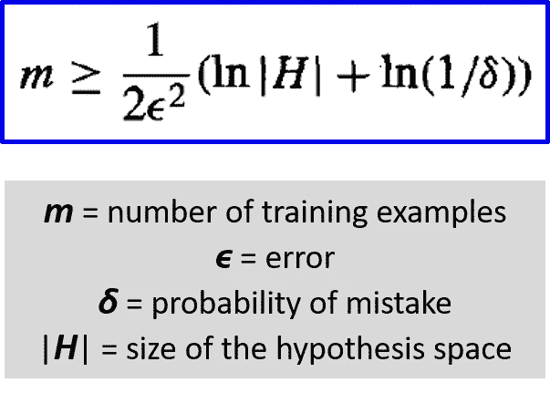

# 触及机器学习的本质:CLT 简介

> 原文：<https://towardsdatascience.com/how-to-analyze-learning-short-tour-of-computational-learning-theory-9d93b15fc3e5?source=collection_archive---------7----------------------->

## 作为机器学习的实践者，了解计算学习理论的基础可以极大地增强你的能力。

# 介绍

假设，这是一个阳光明媚的日子，你有朋友来访，你最喜欢的餐馆在 12 英里外开了一家分店。一般来说，你会避免长途驾驶，但是今天你会出去吃午饭吗？你是否有这种情况的过去的例子(一些因素是积极的，一些是消极的)，从中你制定了一个规则？

这就是我们如何从过去的经验和行为中学习，形成规则，并将其应用于当前的情况。机器也没有什么不同。但是这种机器学习背后也有一个理论。

**C** 计算 **L** 收入 **T** 理论( **CLT** )是统计学/机器学习/人工智能(总的来说)的一个分支，它处理关于分析我们(人和机器)从数据中学习规则和模式的能力的基本界限和定理。

它**超越了我们经常听到的特定算法**的领域——*回归、决策树、支持向量机*或*深度神经网络*——并试图回答**关于整个机器学习企业的限制和可能性的根本问题**。

> 这就是我们如何从过去的经验和行为中学习，形成规则，并将其应用于当前的情况。机器也没有什么不同

听起来很刺激？请继续阅读，快速浏览这个领域…

## 有哪些基本问题？

当研究机器学习时，很自然会想知道什么一般规律可以支配机器(和非机器)学习者。举个例子，

*   是否有可能独立于学习算法，识别出天生困难或容易的学习问题类别？
*   你能描述出确保成功学习所需的或足够的**培训示例的数量吗？**
*   如果允许学习者向培训师提问，而不是观察随机抽样的培训示例，这个数字会受到什么影响？
*   在学习目标函数之前，你能描述一个学习者会犯的错误的数量吗？
*   有人能描述学习问题类固有的计算复杂性(T21)吗？

> 下面是令人失望的答案:所有这些问题的一般答案还不知道。

但是我们可以专注于任何实际机器学习任务中最常出现的特定设置，****—**[**归纳学习**](https://www.netlanguages.com/blog/index.php/2017/06/28/what-is-inductive-learning/) **一个未知的目标函数，只给定这个目标函数的训练示例和一组候选假设**。**

**在这种情况下，我们主要关心的问题是，**

*   ***多少个训练示例足以成功学习目标函数*，以及**
*   ***学习者会犯多少错误才能成功*？**

**正如我们将看到的，根据学习问题的属性，为这些度量设置数量界限是可能的，**

*   **学习者考虑的假设空间的大小或复杂性**
*   **目标概念必须达到的近似精度**
*   **学习者输出成功假设的概率**
*   **向学习者展示培训示例的方式**

> **CLT 试图回答关于整个机器学习事业的限制和可能性的基本问题。**

## **关键词的图示**

**为了进行全面的讨论，我在这里尝试定义一下在 CLT 普遍使用的基本关键词。**

****数据**:一组给定的例子，我们试图从中学习目标概念。**

****

****目标概念(又名规则)**:这是我们试图从数据中学习的隐藏模式例如，“我们出去吃午饭 ***如果*** 天气晴朗*我们有朋友 ***或*** ***如果*** 最喜欢的美食餐馆就在附近 ***和*** 我们有朋友***

*****这种规则是根据属于[命题逻辑](https://www.geeksforgeeks.org/proposition-logic/)的陈述编写的，即用 AND、OR、NOT 表达的真值。*****

*******假设空间**:这是一组假设，我们希望从中发现目标概念。在这个例子中，假设的“智能”选择应该看起来像我们上面写的作为目标概念的逻辑连接短语。但是它们可以更简单或者看起来不同，*****

*   *****如果天气晴朗*****
*   *****如果我们有朋友或者天气晴朗*****

*****注意上面两个假设和目标概念之间的细微差别。**这两个假设不够丰富，不足以抓住真正的目标概念**，如果应用于给定的数据，它们会有误差。*****

*****为什么？*****

*****因为它们不属于“析取陈述的连词”形式，即(X1 & X2)|(X3 & X4)|(X5 & amp！X6)。它们过于简单和笼统，无法捕捉所呈现数据的所有细微差别。*****

*****因此，这个故事的寓意是，你在机器学习(这里是分类)任务中搜索目标概念是否会成功，很大程度上取决于你选择工作的假设空间的丰富性和复杂性。*****

*******预测器和响应变量**:这些是不言自明的。“*晴*？”、‘*最喜欢的餐厅距离*、‘*有朋友吗？“T9”是预测变量，“出去吃午饭”是响应变量。******

## *****感觉抽象？需要具体例子吗？*****

*****还记得分类的决策树吗？这里有两个这样的树，以及它们在关于上述学习问题的假设空间方面的丰富性。*****

*****如果你阅读从根开始向下到一片叶子的树的边所满足的条件，你会自动得到和上面一样的命题逻辑陈述。试试看。*****

**********

*****Rich and ‘poor’ hypothesis space illustrations*****

> *****因此，这个故事的寓意是，你在机器学习(这里是分类)任务中搜索目标概念是否会成功，很大程度上取决于你选择工作的假设空间的丰富性和复杂性。*****

## *****假设空间的大小？那里有个陷阱！*****

*****那么，这里假设空间的大小是多少呢？*****

*****如果你用所有三个预测变量构建树，你可以从其中的任何一个开始，然后你可以在深度**)**处有 *n* 的叶子，如果你使用所有的预测变量。但是你可以选择在所有的叶子上写“是”和“不是”。所以，大小可以和 O(n*2^(2^n)).一样大对于这个例子，有 3 个变量，我们可以得到 3*2^(2^(3–1)= 48 棵树！这 48 棵树分别代表一种不同的假设。很多都是多余的，用简单的思考就能消除，但那是题外话。*****

> *****那么，如果我们考虑一个足够丰富、足够大的假设空间，是否保证能找到目标概念(给定足够的数据)？*****

*****没有。*****

*******考虑一个简单线性回归问题**。*****

**********

*****有多少预测值？ **1** 。那么，什么是假设空间大小呢？2?4?*****

*****答案是——**无限**。*****

*****你能在一个平面上画多少条直线？*****

**********

*****你对无害的最小二乘误差最小化回归算法的尊重是不是越来越大了？毕竟，[能够从那些无限的可能性中找到最优的路线【T3:-)](/where-did-the-least-square-come-from-3f1abc7f7caf)*****

> *****但问题是——即使假设空间无限大，我们也不能指望在这个回归任务中找到真正的目标概念。*****

*****这是因为**真正的概念存在于另一个空间，其大小是一个‘更大的无限’**。在这个例子中， ***y*** 和 ***x*** 之间的真实函数关系可能是二次函数关系。这意味着二次项的无限可能性+线性项的无限可能性+截距的无限可能性。*****

**********

*****除非我们决定在我们的假设空间中包含一个二次项，否则我们将永远无法找到真正的函数，即使在只有线性项(和截距)的无限大的空间中。*****

> *******所以，很多时候，我们需要更丰富的空间，而不一定是更大的。**而且，像灭霸一样，我们需要不断担心和寻找哪个无限大小的空间最适合我们必须学习的特定数据集！*****

**********

## *****那么，CLT 试图估算的关键量是什么呢？*****

*****在很大程度上，CLT 关注的不是个别的学习算法，而是以他们考虑的假设空间、训练样本的呈现等为特征的学习算法的大类。它试图推理的关键量是，*****

*   ********样本复杂度*** :一个学习者
    需要多少训练样本才能收敛(大概率)到一个成功的假设？*****
*   ********计算复杂度*** :一个学习者需要多大的计算努力才能收敛(大概率)到一个成功的假设？*****
*   ********错误界限*** :在收敛到一个成功的假设之前，学习者会错误分类
    多少训练样本？*****

**********

*******Model complexity and learning curve show how much data and what class of hypothesis space we need*******

*****有各种各样的方法来说明对学习者来说“成功”意味着什么我们可以指定，为了成功，学习者必须输出一个与目标概念相同的
假设。或者，我们可以简单地要求它输出一个大多数时候与目标概念一致的假设，或者它通常输出这样一个假设。*****

*****同样，我们必须指定学习者如何获得训练样本。训练示例有可能是由一位乐于助人的老师提供的，或者是由学习者执行精心计划的实验获得的(**想一想 A/B 测试或科学实验**)，或者是根据学习者控制之外的一些自然过程随机生成的(**想一想随机点击流，癌细胞与药物的相互作用**)。正如我们所料，上述问题的答案取决于我们心目中的特定环境或学习模式。*****

## *****“大概近似正确”(PAC)的神奇世界*****

*****在这种理论设置下，我们假设所有观察到的数据都是从一个未知但固定(非时变)的分布过程中产生的，该分布过程的参数不会受到我们从中抽取样本的过程的影响。此外，不失一般性，我们可以假设无噪声测量过程。*****

*****设 ***H*** 为假设空间， ***D*** 为未知真分布， ***c*** 为目标概念。假设在观察了一些数据***d*** 后，学习算法 ***L*** 输出一个它认为是***【c***的最佳逼近的假设*。******

******这里衡量错误/成功的标准是什么？误差在哪里 ***c*** 和 ***h*** 的预测不一致。******

************

********Image credit**: “Machine Learning”, by Tom Mitchell******

> ******我们的目的是描述目标概念的类别，这些目标概念可以从**合理数量的**随机抽取的训练样本和**合理数量的计算**中**可靠地学习**。******

******我们没有无限的时间、计算能力、存储或传感器带宽。因此，我们并不试图使误差为零。为此，我们需要看到由*生成的每一个可能的实例。出于同样的原因，我们限制自己检查有限的训练样本，并使用多项式时间算法。*******

*******此外，假设训练样本是随机抽取的，
学习者遇到的训练样本
总会有一些非零概率是误导的。*******

**************

*******因此，我们将只要求它的**误差被某个常数
**限制，该常数可以任意变小**。此外，我们不会要求学习者对随机抽取的训练样本的每个序列都成功，相反，我们的要求只是它的**失败概率由某个常数限制，该常数可以任意变小**。*********

> *******简而言之，我们只要求学习者 ***大概学习*** 一个 ***近似正确*** 的假设。*******

*******有了这些设置，我们说我们的概念类 ***C*** ，目标概念 ***c*** 所属的， [**PAC-learnable**](https://www.cs.cmu.edu/~mgormley/courses/10601-s17/slides/lecture28-pac.pdf)如果学习算法在用数据***【d】***进行训练后能够输出假设 ***h*** 具有一定高的 ***概率*** 和一定低的 ***误差*** 并且计算量是 1/ ***误差**********

## ******样本复杂性界限******

******这里我们不讨论形式上的证明，但是根据上一节中讨论的概念，可以推导出一个非常简单和优雅的数学界限来回答下面的问题。******

> ******“当假设空间具有一定大小时，以一定概率学习近似正确的假设所需的最小训练样本数是多少？”******

******界限由下式给出，******

************

******这叫做 [**豪斯勒束缚**](http://citeseerx.ist.psu.edu/viewdoc/summary?doi=10.1.1.125.6931) 。这个不等式很容易证明我们在任何机器学习任务的实践中所经历的以下事实，******

*   ********我们需要更多的训练数据来减少测试/泛化错误********
*   ********该算法需要“看到”更多的训练样本，以增加其学习的信心，即减少出错的可能性********
*   ********更丰富、更大的假设空间意味着在寻找正确假设时要搜索更大的维度，这就需要更多的训练样本********

************

## ******我们短暂的旅行到此结束，但更多的“学习”还在前面******

******对这种类型的复杂性界限有一种普遍的批评，认为它们过于悲观，不能代表实际的学习问题。关于这个话题有很多争论，你可以从我在本文末尾提供的参考资料中读到一些。******

******一个关于无限假设空间的自然问题出现了。样本界是否趋于无穷大？原来有一个概念叫做' [VC-dimension](http://disi.unitn.it/moschitti/Teaching-slides/VC-dim.pdf) ' (V 在这里代表 [Vladimir Vapnik](https://en.wikipedia.org/wiki/Vladimir_Vapnik) ，支持向量机的发明者)，它有助于保持许多实际学习问题的样本复杂度有限，即使是线性回归或核机器这样的无限假设空间。但是我们可以在另一篇文章中讨论这些高级概念。******

******我希望这篇文章能够引发一些关于基本机器学习理论的有趣概念，并有助于激发您学习这些主题的兴趣。******

******要获得关于这些主题的优秀教程，请观看此视频，******

## ******可供参考的资料******

1.  ******《机器学习》，汤姆·米切尔(1997)。******
2.  ******[CMU PAC 学习教程](http://www.cs.cmu.edu/~./awm/tutorials/pac.html)******
3.  ******[PAC 学习、VC 维度和基于边界的边界](http://www.cs.cmu.edu/~guestrin/Class/10701-S05/slides/pac-vc.pdf)******
4.  ******" [PAC 学习是不可判定的](https://arxiv.org/pdf/1808.06324.pdf)"******
5.  ******"[学习算法的效率和计算限制](https://pdfs.semanticscholar.org/733d/d84bc10fa96c65a10c7856f6f9bd1b389700.pdf)"******

******如果您有任何问题或想法要分享，请联系作者在[**tirthajyoti【AT】Gmail . com**](mailto:tirthajyoti@gmail.com)。此外，您可以查看作者的 [**GitHub 资源库**](https://github.com/tirthajyoti?tab=repositories) 中其他有趣的 Python、R 或 MATLAB 代码片段和机器学习资源。如果你像我一样对机器学习/数据科学充满热情，请随时[在 LinkedIn 上添加我](https://www.linkedin.com/in/tirthajyoti-sarkar-2127aa7/)或[在 Twitter 上关注我。](https://twitter.com/tirthajyotiS)******