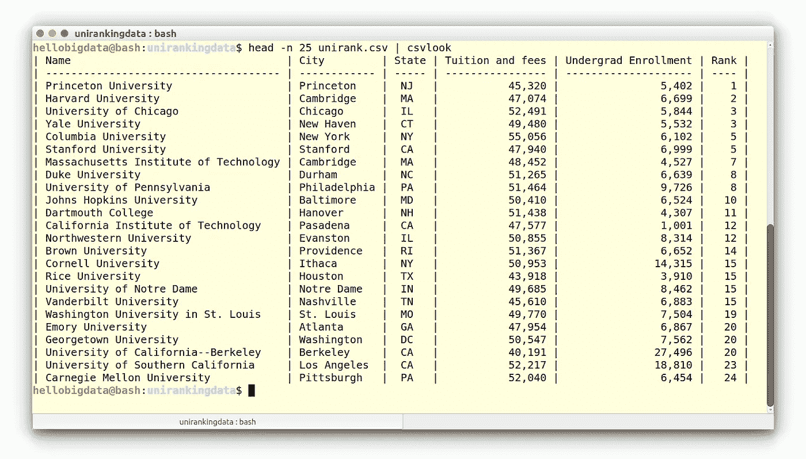

# 如何在命令行上探索美国大学 2017 排名？(第一部分—数据预览)

> 原文：<https://towardsdatascience.com/how-to-analyze-us-university-ranks-2017-with-bash-part-i-data-preview-e39b8f2ffee9?source=collection_archive---------7----------------------->


**Keep exploring** data @ Bash shell, image adopted with thanks from [unsplash.com](https://unsplash.com/)

大学排名已经成为许多机构的共同任务，每个机构都根据几个加权类别提出不同的排名。这些排名的例子有:[世界大学网络计量学排名](http://www.webometrics.info/)、[QS 世界大学排名](https://www.topuniversities.com/university-rankings)、[世界大学学术排名](http://www.shanghairanking.com/)等等。第一个排名衡量了大学的知名度及其在网络上的全球表现。最后两项试图根据会员获得的奖项、引用和出版物等类别来衡量大学的表现。雇主，尤其是跨国公司的雇主，使用排名来寻找大学来招聘毕业生，因此进入一所排名靠前的大学有助于在竞争激烈的就业市场中找到工作。

在这个项目中，我们将使用一个从 [data.world](https://data.world/education/university-rankings-2017) 获得的简单(公开可用)数据集，名为:**美国新闻大学排名 2017** 版。从这些数据中，使用 Bash 我们将探索不同的特性，并最终发现一个关于学费和大学排名相关性的有趣事实。

**学习目标**
通过完成这些，您将学会使用以下 Bash 命令:

`head` —输出文件的第一部分
`tail` —与头`cat`相对—连接并打印文件
`sort` —整理文件内容
`uniq` —删除重复条目

在我们继续之前，让我们通过在桌面上创建一个文件夹来设置我们的工作环境。为此，假设我们的计算机上有一个基于 Linux 的操作系统(例如 Ubuntu ),让我们首先启动一个命令行并导航到我们的分析文件夹:

```
cd ~/Desktop
mkdir unirankingdata
cd unirankingdata
```

这将在你的桌面上创建一个文件夹`unirankdata`。接下来，我们下载数据。

您应该从下面的网页下载数据，因为我们已经稍微简化了数据，让我们将数据保存为:`unirank.csv`

```
wget https://www.scientificprogramming.io/datasets/unirank.csv
```

**数据集预览**
这个数据集很小(玩具)，原则上我们可以在文本编辑器或 Excel 中打开它。然而，真实世界的数据集通常更大，而且整体打开起来很麻烦。让我们假设它是一个大数据(和非结构化数据),我们希望得到数据的一个潜在峰值。当你接触到新数据时，这通常是你要做的第一件事——预览；首先，了解数据包含的内容、组织方式以及数据是否有意义是非常重要的。

为了帮助我们预览数据，我们可以使用命令“head ”,顾名思义，它显示文件的前几行。

```
head  unirank.csv
```

然而，您会发现最初的输出并不是很有趣，因此我们安装了一个名为`csvkit`的工具，这是一套用于转换和使用 CSV 的命令行工具(install: `sudo pip install csvkit`)。

这将极大地帮助我们未来的分析。在我们安装了`csvkit`之后，我们重新运行`head`命令，但是通过`csvkit`套装的`csvlook`命令输出管道`|`:

```
head  unirank.csv | csvlook
```

您应该会看到输出到屏幕上的文件的前`10`行，要看到比前`10`行更多的行，例如第`25`，请使用`-n`选项:

```
head -n 25 unirank.csv | csvlook 
```

这里，数据集名称`unirank.csv`是一个**命令行**参数，它被赋予命令`head`而`-n`是一个选项，它允许我们覆盖`10`行的默认设置。这种命令行选项通常用破折号后跟字符串、空格和选项值来指定(例如`-n 25`)。看下面最后的结局(想不想看[直播](https://www.educative.io/collection/page/5183519089229824/5629499534213120/5657382461898752)？):



The unirank.csv data set preview (head -n 25 unirank.csv)

**从文件**的前 25 行，我们可以推断出数据被格式化为具有分隔值的文件。从第一行(通常称为标题行)和前几行数据可以推断出列内容:`Name`、`City`、`State`、`Tuition and fees`、`Undergrad Enrollment`、`Rank`。 [**见第二部**](https://medium.com/towards-data-science/finding-the-percent-of-colleges-in-the-us-university-ranks-2017-at-the-command-line-part-ii-grep-5db6d59f76a1) [🚀](https://apps.timwhitlock.info/emoji/tables/unicode#emoji-modal)！

[该项目是'[学习在 Bash Shell 和 Linux 中分析数据](https://www.scientificprogramming.io/learn-bash/)课程的一部分。]

# 相关作品

[](https://www.scientificprogramming.io/learn-bash/) [## 学习在 Bash Shell 和 Linux 中分析数据——学习科学编程

### 一个简单的课程演示了 Bash shell 在处理真实数据集时的使用

www . scientific 编程. io](https://www.scientificprogramming.io/learn-bash/)