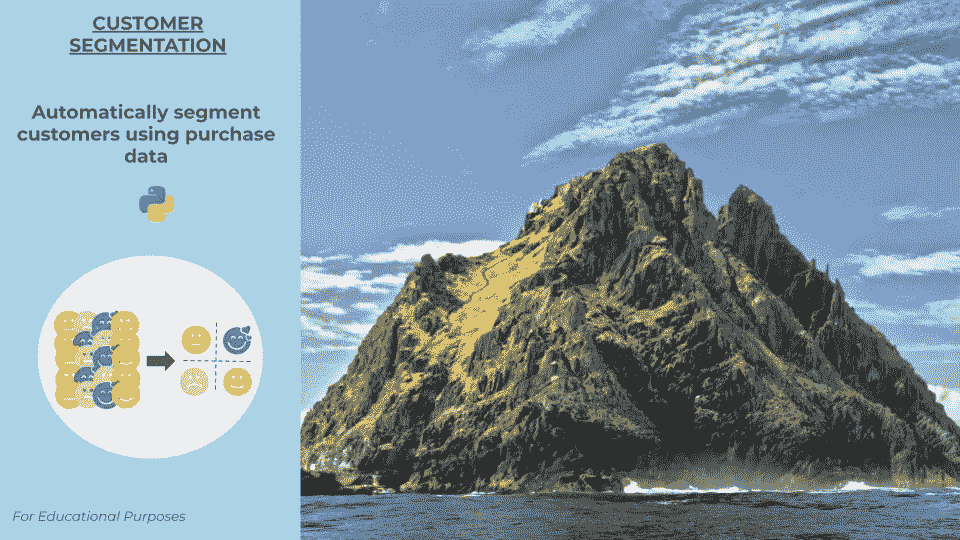
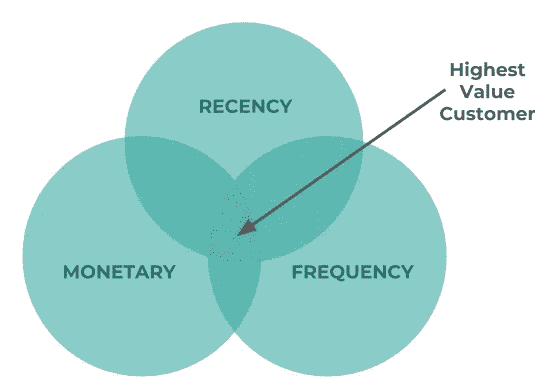
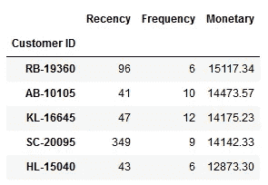
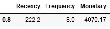
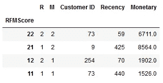
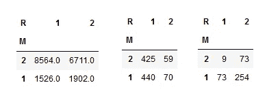
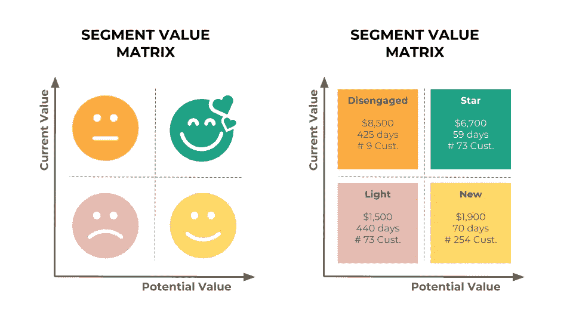
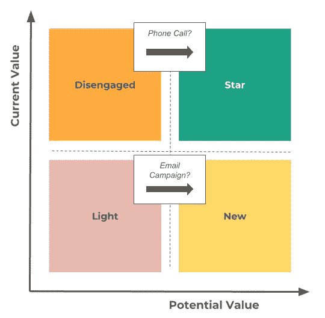

# 如何使用购买数据和几行 Python 代码自动细分客户

> 原文：<https://towardsdatascience.com/how-to-automatically-segment-customers-using-purchase-data-and-a-few-lines-of-python-36939fb587a4?source=collection_archive---------9----------------------->

## 用简单的数据分析技术学习“客户细分”的小型教育项目



Automatic Customer Segmentation using Recency/Monetary Matrix — Right: Photo by [Michael](https://unsplash.com/@michael75?utm_source=unsplash&utm_medium=referral&utm_content=creditCopyText) on [Unsplash](https://unsplash.com/s/photos/mountain?utm_source=unsplash&utm_medium=referral&utm_content=creditCopyText)

**您为什么应该关注客户细分？**要向客户提供个性化体验，细分是关键。它可以洞察客户的行为、习惯和偏好，使您能够提供量身定制的营销活动，增加您的成功几率，并通过量身定制的内容改善客户体验。


Customer Segmentation

**我们要建造什么？**使用交易购买数据，我们将能够创建一个 2 x 2 价值矩阵来创建 4 个客户群。每一组都将根据两个维度来区分其他组:(1)当前客户价值，和(2)潜在客户价值。

**我们要用什么技巧？**我们将使用 RFM 模型从交易型采购数据中创建所需的功能。RFM 模式代表着:

*   最近:他们最后一次购买是什么时候？
*   频率:他们购买的频率和持续时间？
*   货币价值/销售额:他们购买了多少？

它通常用于在每三个问题的交叉点识别最高价值的客户。为了构建 2 x 2 矩阵，我们将只使用 RFM 的 R &。



RFM Model

我们使用的是什么数据？我们将使用 Tableau(也称为“全球超市”)提供的购买样本数据集。它通常用于预测和时间序列分析。它包含 1500 多个不同的客户和 4 年的购买数据。因为我们做的是行为细分，而不是人口统计细分，我们将通过只过滤 B2C 细分市场(消费者)和美国国家来消除一些潜在的人口统计偏见。

**我们采取什么方法？**

*   **步骤 0:** 在客户级别加载、过滤、清理和聚合数据，
*   **第一步:**为每个客户创建 RFM 功能，
*   **第 2 步:**为了实现细分自动化，我们将使用 80%的分位数来表示近期和货币(我们也可以使用 k-mean 聚类或杠杆业务知识来创建存储桶，例如，全球超市企业用户将活跃客户视为最近订单不到 100 天的人)。
*   **第三步:**计算 RM 评分，对客户进行排序，
*   **第四步:**可视化价值矩阵，探究一些关键数字。

**蟒蛇道:**

*   **步骤 0:** 在客户级别加载、过滤、清理和聚集数据

```
import matplotlib as plt
import numpy as np
%matplotlib inline  
import warnings
warnings.filterwarnings('ignore')
import pandas as pd
url = '[https://github.com/tristanga/Data-Analysis/raw/master/Global%20Superstore.xls'](https://github.com/tristanga/Data-Analysis/raw/master/Global%20Superstore.xls')
df = pd.read_excel(url)
df = df[(df.Segment == 'Consumer') & (df.Country == 'United States')]
df.head()
```

*   **步骤 1:** 为每个客户创建 RFM 功能

```
df_RFM = df.groupby('Customer ID').agg({'Order Date': lambda y: (df['Order Date'].max().date() - y.max().date()).days,
                                        'Order ID': lambda y: len(y.unique()),  
                                        'Sales': lambda y: round(y.sum(),2)})
df_RFM.columns = ['Recency', 'Frequency', 'Monetary']
df_RFM = df_RFM.sort_values('Monetary', ascending=False)
df_RFM.head()
```



*   **第 2 步:**为了实现自动分割，我们将使用 80%的分位数来表示近期和货币

```
# We will use the 80% quantile for each feature
quantiles = df_RFM.quantile(q=[0.8])
print(quantiles)
df_RFM['R']=np.where(df_RFM['Recency']<=int(quantiles.Recency.values), 2, 1)
df_RFM['F']=np.where(df_RFM['Frequency']>=int(quantiles.Frequency.values), 2, 1)
df_RFM['M']=np.where(df_RFM['Monetary']>=int(quantiles.Monetary.values), 2, 1)
df_RFM.head()
```



*   **第三步:**计算 RFM 分数，对客户进行排序

```
# To do the 2 x 2 matrix we will only use Recency & Monetary
df_RFM['RMScore'] = df_RFM.M.map(str)+df_RFM.R.map(str)
df_RFM = df_RFM.reset_index()
df_RFM_SUM = df_RFM.groupby('RMScore').agg({'Customer ID': lambda y: len(y.unique()),
                                        'Frequency': lambda y: round(y.mean(),0),
                                        'Recency': lambda y: round(y.mean(),0),
                                        'R': lambda y: round(y.mean(),0),
                                        'M': lambda y: round(y.mean(),0),
                                        'Monetary': lambda y: round(y.mean(),0)})
df_RFM_SUM = df_RFM_SUM.sort_values('RMScore', ascending=False)
df_RFM_SUM.head()
```



*   **第四步:**形象化价值矩阵，探索一些关键数字

```
# 1) Average Monetary Matrix
df_RFM_M = df_RFM_SUM.pivot(index='M', columns='R', values='Monetary')
df_RFM_M= df_RFM_M.reset_index().sort_values(['M'], ascending = False).set_index(['M'])
df_RFM_M# 2) Number of Customer Matrix
df_RFM_C = df_RFM_SUM.pivot(index='M', columns='R', values='Customer ID')
df_RFM_C= df_RFM_C.reset_index().sort_values(['M'], ascending = False).set_index(['M'])
df_RFM_C# 3) Recency Matrix
```



Final Matrix

**一些简单销售的外卖/速赢&营销策略示例？**

*   **处于“空闲”阶段的客户很少，他们的平均收入高于“明星”阶段**。因为它们很少，所以应该很容易与业务合作，以了解在客户级别发生了什么。根据分析，可能会有一个简单的快速获胜方法:通过电话或会议重新激活他们中的一些人，希望他们回到“明星”行列(例如，参与的客户)。
*   **“轻量级”客户的平均最后订单时间非常长(超过 1 年，而“参与型”客户为 60-70 天)。**利用优惠券发起简单的重新激活活动可能会带来一些新订单，并帮助其中一些客户转向“新”类别(例如，已参与的客户)。



Simple Tactics Examples

该笔记本在 [Github](https://github.com/tristanga/Data-Analysis/blob/master/Notebooks/Automatic%20Customer%20Segmentation%20with%20RFM%20(Python).ipynb) 上有售。感谢你阅读我的帖子，如果你喜欢，请鼓掌。如果您想在您的组织内进行简单或更复杂的 RFM 细分，请随时联系我。

通过 Python k-means 了解 RFM 更多信息的其他有趣读物:

[](http://www.kimberlycoffey.com/blog/2016/8/k-means-clustering-for-customer-segmentation) [## 用于客户细分的 k-均值聚类:一个实例

### 客户细分是一个听起来似乎很简单的概念。概括地说，目标是将客户分为…

www.kimberlycoffey.com](http://www.kimberlycoffey.com/blog/2016/8/k-means-clustering-for-customer-segmentation)