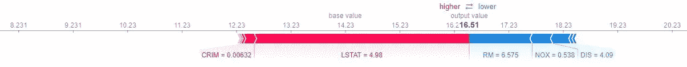
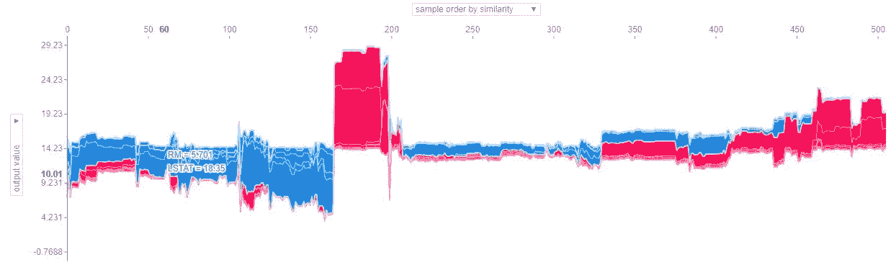
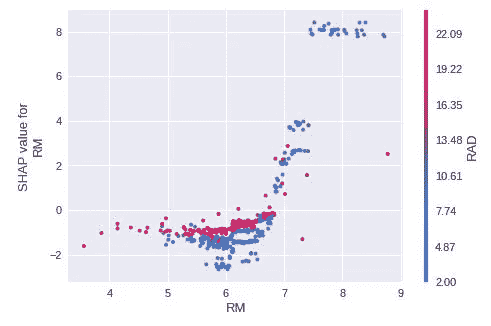
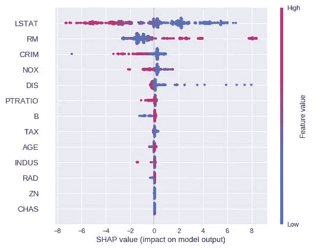
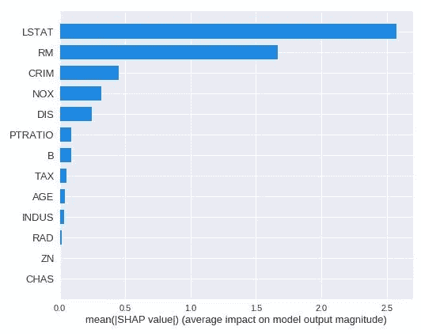

# 如何用 SHAP 避开机器学习黑箱

> 原文：<https://towardsdatascience.com/how-to-avoid-the-machine-learning-blackbox-with-shap-da567fc64a8b?source=collection_archive---------9----------------------->

Kazimir Malevich’s 1915 “Black Square”

> 我相信我们都同意这样的观点，机器学习给科技产品带来了巨大的进步，因此也给我们所有人的福祉带来了巨大的进步。然而，从事机器学习的公司和研究人员面临一个巨大的挑战:**“黑盒算法”**。

黑盒算法可以被宽泛地定义为其输出不容易解释或者完全不可解释的算法。意思是你从一个输入得到一个输出，但是你不明白为什么。更不用说 GDPR 对“[解释权](https://www.privacy-regulation.eu/en/r71.htm)”的强化，避免黑盒算法事关透明度和问责制——这是任何公司都应该努力追求的两个价值观。

考虑到这一点，我最近开始探索的一个非常好的工具是 SHAP，它代表*沙普利附加解释*。

# 什么是 SHAP？

这个[框架](https://github.com/slundberg/shap)通过提供直观和交互式的可视化，旨在显示哪些特征与某个预测和模型整体更相关，从而使任何机器学习算法本质上都变得“可解释”。

我不会过多地钻研理论部分——SHAP 背后的 UWashington 的研究团队在他们的 [NIPS 论文](http://papers.nips.cc/paper/7062-a-unified-approach-to-interpreting-model-predictions.pdf)中解释了这一点——但基本想法是在最初训练的模型之上训练一个更简单和可解释的模型(即线性回归或决策树)，以便它接近最初的预测。这样，这些预测现在可以用更简单的模型来解释了。

我想和你们分享我在一个开放数据集上的框架实现，以及我们能从它那里得到什么类型的解释。

# SHAP 教了我们什么？

我从[波士顿数据集](https://www.cs.toronto.edu/~delve/data/boston/bostonDetail.html)开始(查看功能首字母缩略词含义的链接)。该数据集包含由美国人口普查局收集的有关波士顿地区住房的信息，其中的目标变量是中值房价。我在这个数据集上训练了一个 XGBoost 学习者，使用 GridSearch 进行了超参数优化。

现在，让我们看看 SHAP 的输出。

## 预测解释器

第一张图表旨在解释个人预测。在这种情况下，我选择了测试集的第一个样本。我们可以看到，该模型预测的中值房价为 16.51 英镑(16 510 美元)。此外，我们可以看到哪些功能有助于提高(红色)或降低(蓝色)该值。在这种情况下，LSTAT 等于 4.98 是证实目标变量的最明确的特征，这意味着它提高了预测值。另一方面，RM、NOX 和 DIS 的值会降低预测值。

## 模型解释器

这张图表的目的是从整体上解释这个模型。它将所有样本绘制在 x 轴上(在本例中，按照相似性排序，但可以在组合框中更改)，并将它们的预测值绘制在 y 轴上。此外，基于特征值，它还具有每个样本的每个特征的单独贡献。

在本例中，我选择了样本号 60 (x 轴)，其预测值为 10.01 (y 轴)，其中 RM 和 LSTAT 是最相关的要素，但它们会降低预测值。但是，只要将鼠标悬停在其他样本上，就可以看到特征值及其影响如何变化，以及预测结果如何变化。

## 依赖图

在这个图表中，我们可以看到两个特征是如何根据它们在模型中的影响而相互关联的，通过 **SHAP 值**(模型中特征相关性的度量)来衡量。SHAP 值也可以被视为一个*几率*——值为-2 意味着观察到该特征会将你获胜的对数几率降低 2，这里的“获胜”只是意味着拥有一栋更昂贵的房子。

在这种情况下，我们可以看到，对于低于 7 (x 轴)的 RM 值，SHAP 值(y 轴)实际上总是负的，这意味着该特征的较低值会将预测值向下推。此外，如果 RM 等于 6，则 SHAP 值可以在-2.5 和 0 之间，具体取决于 RAD 的值。这意味着，如果你也有一个良好的高速公路(RAD)的可达性，那么拥有更少的房间(RM)就不那么糟糕。请注意，RM 低于 5 和高于 7 时，这种垂直分布变窄了很多，这证明其他功能(如 RAD)失去了很多影响。

## 汇总图

这两个图表显示了相同输出的不同可视化，这是对模型作为一个整体的特性相关性的一般评估。第一个图表有一些附加信息，因为它考虑了每个单独预测的特征相关性(描述为一个点)。此外，对于每个特征，它显示了该特征的较高或较低值如何影响它同意或不同意预测的事实。

作为一个例子，我们可以看到 LSTAT 是迄今为止最有影响力的特征，无论是积极的还是消极的。在这种情况下，较低的 LSTAT 值似乎会对预测产生积极影响。我们还可以看到，RM 具有相反的行为—更高的值导致更高的预测值。

当我们考虑缩略语的含义时，这一切都是有意义的。预计较低的人口比例(LSTAT)和较高的房间数量(RM)都会导致更贵的房子。

# 正在总结…

没有什么比尝试更好的了，对吧？我的建议是:从一个开放的数据集开始，也许是一个分类数据集，如[虹膜数据集](https://archive.ics.uci.edu/ml/datasets/iris)，训练一个适当的模型并运行框架。

提示:另外，看看[斯科特·伦德伯格在 TDS 上的帖子](/interpretable-machine-learning-with-xgboost-9ec80d148d27)，他是《SHAP》的原创者之一😉