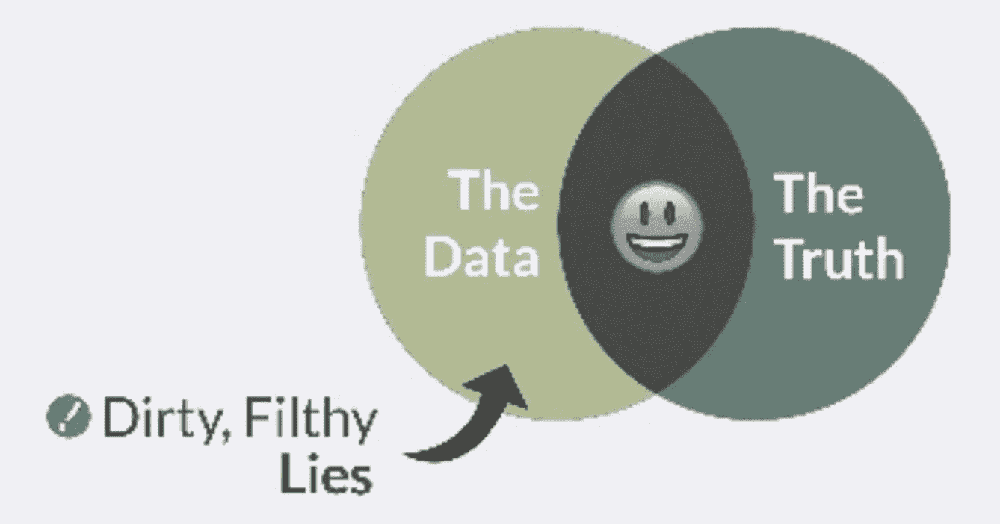
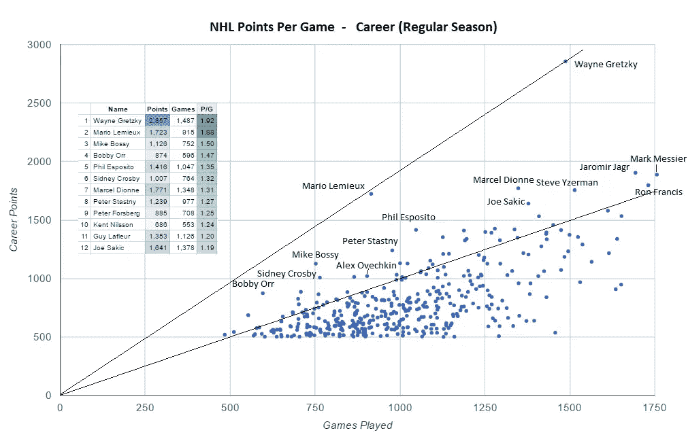
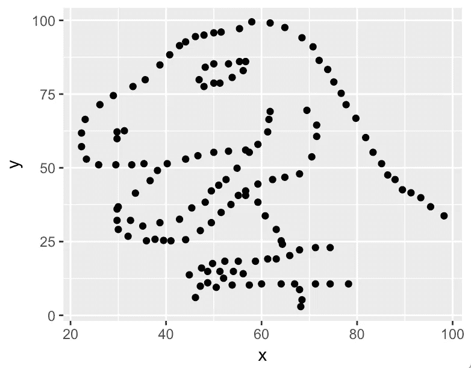
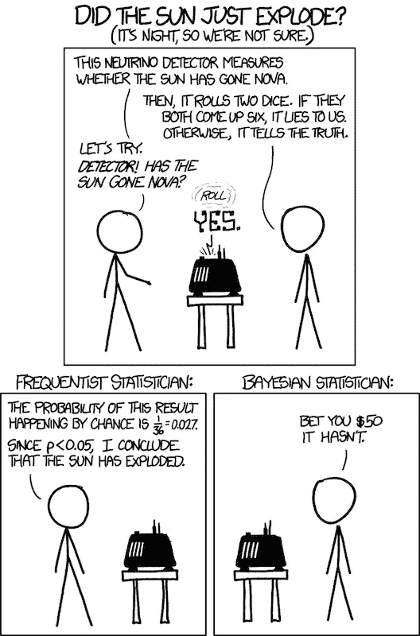
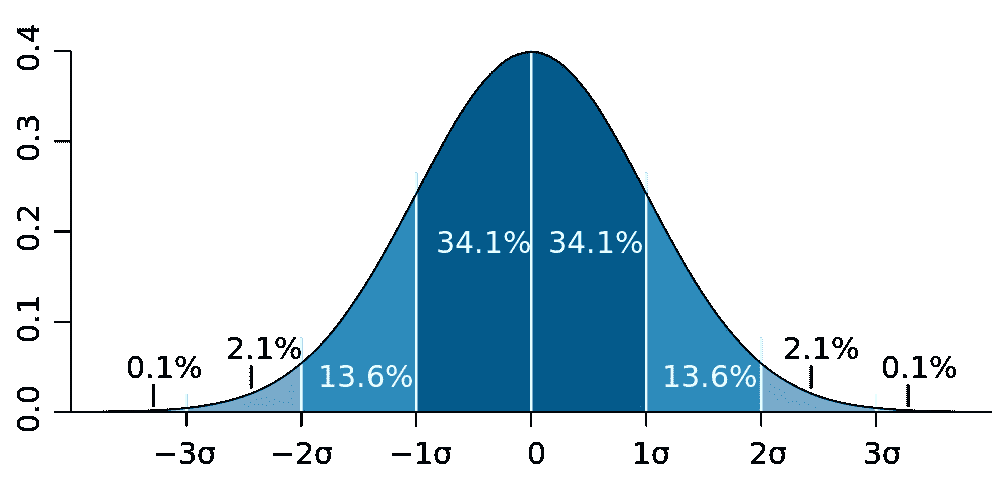
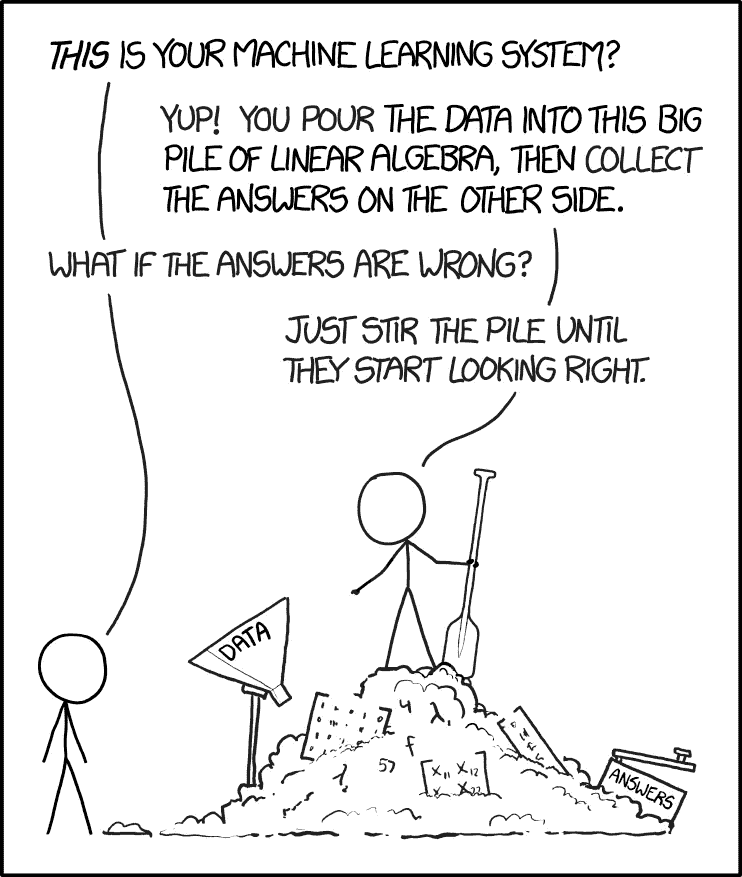
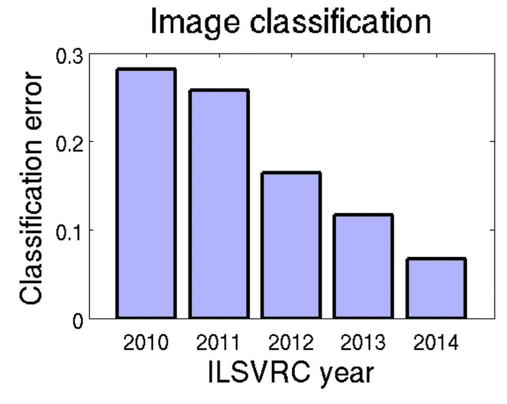

# 如何成为数据科学家，第 2 部分:尝试解决问题

> 原文：<https://towardsdatascience.com/how-to-become-a-data-scientist-part-2-try-to-solve-the-problem-f9b9746f6eb9?source=collection_archive---------3----------------------->

一旦你开始尝试解决你的问题，事情终于有了进展。

1.  获取数据。
2.  清理数据。
3.  看数据。
4.  汇总数据。

# 获取数据

“80%的时间花在准备数据上，20%的时间抱怨需要准备数据。”— [一个随机的博客](http://www.apixio.com/10-jokes-only-data-scientists-will-understand/)

为什么这是如此昂贵值得自己的职位。相反，这里是给初露头角的数据科学家的快速建议。

Credit: [Nick Rosener](https://www.slideshare.net/NickRosenerCSMS/the-data-never-lies-how-to-get-the-truth-from-marketing-data) ([twitter](http://twitter.com/nickrosener)).

**对数据的含义要精确。**这通常意味着询问他人、阅读代码、阅读文档以及查看数据的分布。例如，字段有值的频率。过度信任的一个常见例子是，看到一个名为“年龄”的用户字段，说“啊，用户的年龄”，然后立即将其插入另一个系统(比如，一个模型构建器)。但也许这个领域在一年前才开始被填充，或者只在某些平台上，并且经常是空白的。更糟糕的是，以偏概全的空白(老用户没有价值，某些平台的用户没有价值)。或者也许“年龄”是他们成为用户的时间，也就是说，不是你想的那样。要发现这些东西，就要和人交谈，看数据。你必须和人们交谈，因为有时他们知道。但是，你必须看数据，因为有时他们会说谎(有意或无意)。

[**学习 SQL**](https://www.codecademy.com/learn/learn-sql) **。大量数据存储在关系数据库中，可通过 SQL 访问。还有很多在 Hive 中，可以通过 HiveQL 访问，Hive QL 是经过扩展和修改的 SQL。即使对于文本文件，您也将使用表的概念(固定命名的列和行)。**

**对于文本，使用** [**制表符分隔值(TSV)文件**](https://en.wikipedia.org/wiki/Tab-separated_values) **。**它们易于读写，可以从许多地方导出，可以轻松粘贴到 google 电子表格或 Excel 中进行共享。

**对于简单的任务，** [**用 UNIX 命令行**](https://en.wikibooks.org/wiki/Ad_Hoc_Data_Analysis_From_The_Unix_Command_Line) **进行处理。大约从 1990 年开始，UNIX 成为我的朋友的时间比大多数人都长。我仍然一直这样做，以获得十大最常见的事情:**

> cut-F5-d "<tab>" foo . tsv | sort | uniq-c | sort-rn | head-10</tab>

**不要刮。**有时候你想要的数据在公共网站上。人们写着[铲运机](https://en.wikipedia.org/wiki/Web_scraping)去抢它。这个实用有用，但是我不爱。可能是偷。这很常见。如果你能找到一个许可的来源就更好了。

# 清理数据

在分析过程中，我所有的清洗都是手动的。这可能很糟糕。我很诚实。

我查看数据记录的示例，并总结数据。如果有些东西看起来不可思议(例如，字段数量错误的行，混乱的文本)，我会删除它们。但是，不要去除太多或者以偏概全。

作为偏差的一个例子，如果 20%的记录有一个字段“type”为空，这些可能不是随机的，它们是某种类型的数据。也许是最重要的数据。你不能只是推销他们。对于具有未知字段值的记录(例如，键入 empty，键入“NULL”)，我通常将它们留在(标记为“NULL”或“empty”)中，以便向任何观看的人展示其中的奥秘。

另一个例子是一个格式良好的异常数据记录。推销它，让你的结果更容易用图表表示，更容易理解，多么令人满意。例如，[这里的](http://beerleaguetips.com/article/nhl-career-scoring-visualization-goals-per-game/)是职业冰球运动员的职业积分和比赛的帖子:

[National Hockey League (NHL) career scoring](http://beerleaguetips.com/article/nhl-career-scoring-visualization-goals-per-game/). Credit: beerleaguetips.com.

顶部有一个巨大的异常值。我们应该推销它吗？

那是[韦恩·格雷兹基](https://en.wikipedia.org/wiki/Wayne_Gretzky)，10 岁时被昵称为【伟大的那个】*。他太有名了，我的浏览器知道把格雷特斯基改成格雷茨基。Reddit [说](https://www.reddit.com/r/dataisbeautiful/comments/68qi0l/nhl_career_points_per_game_visualization_of/dh0xuqb/)“韦恩和他的兄弟布伦特保持着一对兄弟得分最多的 NHL 记录。韦恩 2857，布伦特 4。”我对曲棍球一无所知，但他的故事鼓舞人心:他不高，不强壮，也不快；他通过创造力、练习和团队合作打破了每一项记录。*

丢掉一分是多么容易，但我们可能会丢掉格雷茨基。从这一点上我们可以学到很多东西。

# 看数据

人们是惊人的视觉模式匹配者。

下面是一个示例数据集:X 均值 54.26 标准差，Y 均值 47.83 标准差 26.93，X 和 Y 的相关性为-0.06。

不知道那个？

以下是完整数据(142 行):

)(那)(就)(是)(我)(们)(的)(一)(个)(小)(人)(,)(我)(们)(都)(没)(想)(到)(这)(些)(事)(,)(只)(是)(这)(个)(小)(人)(,)(只)(是)(这)(个)(小)(人)(,)(只)(是)(这)(个)(小)(人)(,)(只)(是)(这)(个)(小)(人)(,)(只)(是)(这)(个)(小)(人)(,)(只)(是)(这)(个)(小)(人)(,)(只)(是)(这)(个)(小)(人)(。 )(那)(就)(是)(我)(们)(的)(一)(年)(里)(,)(我)(们)(都)(不)(知)(道)(了)(,)(我)(们)(还)(不)(知)(道)(,)(我)(们)(还)(有)(些)(不)(知)(道)(吗)(,)(我)(们)(还)(不)(知)(道)(,)(我)(们)(还)(是)(不)(知)(道)(,)(我)(们)(们)(还)(不)(知)(道)(,)(我)(们)(们)(还)(不)(知)(道)(,)(我)(们)(还)(有)(些)(不)(知)(道)(理)(,)(我)(们)(还)(不)(能)(不)(知)(道)(理)(。 )(我)(们)(都)(没)(想)(到)(这)(些)(事)(,)(我)(们)(还)(没)(想)(到)(这)(些)(事)(,)(我)(就)(没)(想)(到)(这)(些)(事)(了)(。 )(我)(们)(都)(没)(想)(到)(这)(些)(事)(,)(我)(们)(还)(没)(想)(到)(这)(些)(事)(,)(我)(就)(没)(想)(到)(这)(些)(事)(,)(我)(们)(还)(没)(想)(到)(这)(些)(事)(。

仍然不承认吗?

这里有一个图表:

Datasaurus says: don’t trust summary statistics, always look at the data.

是的，这是阿尔贝托·开罗的 [Datasaurus](http://www.thefunctionalart.com/2016/08/download-datasaurus-never-trust-summary.html) ，他一直在互联网上转来转去，告诉我们看看这些数据。(这是[安斯科姆的四重奏](https://en.wikipedia.org/wiki/Anscombe%27s_quartet)的异想天开的版本，创作于 1973 年，目的相同:相同的统计数据，不同的数据。)

计算机研究人员(我想说是数据科学家)进一步发展了这个概念，向[展示了如何使用模拟退火将几乎相同的汇总统计数据](https://www.autodeskresearch.com/publications/samestats)突变成不同的形状。

重点是，看数据。

在 Datasaurus 的例子中，我们完成了。它是一只恐龙。在我看来,[霸王龙](https://en.wikipedia.org/wiki/Tyrannosaurus)可以用 8000 磅的压力咬人，让骨头“爆炸”我们需要更多的分析吗？

# 总结数据

从数据中获得洞察力或价值。这包括以一种有用的方式总结它:要么是*描述性的*(“这是一只霸王龙”)要么是*预测性的(*给定一个输入，预测它是不是一只霸王龙，或者可能是什么)。两者都有用。两者都是数据科学任务。

(最后，人们所认为的数据科学，这一节既太长又不够详细！我很同情，但我的目标是快速游览。)

## 描述性分析

**一种常见的技术是概率。**一个概率往往是

> (有趣事物的数量)/(事物的数量)

很多数据科学都是计数，学习如何处理计数。

善于精确定义“事物的数量”。数数从思考开始。当考虑解决一个问题时，试着定义一个概率。

一个很大的优势是，人们对思考概率相当放心:“80%的<things>是<interesting things="">”，“80%的<interesting things="">的几率在上升”，以及“我们的目标至少是 75% <interesting things="">”</interesting></interesting></interesting></things>

事实上，它们太舒服了。他们对不确定性几乎完全不感兴趣(即“80%正负 10%”)，但这很重要。

在实际应用中，您必须处理低计数，即*缺少数据*。当你除以一个低计数，你得到一个嘈杂的概率。即使是“大数据”，你通常也只对其中的一部分感兴趣。示例:推荐内容的一种方法是预测每个项目有人会参与的概率(特写，购买，..)看完后，并把大概率项目排序到最上面。如果只有一个人看了那个东西，他们参与了，概率是 100%。所以，如果你按这个概率排序，大量不受欢迎的东西会排在最前面。但是这个概率并不是**精确地说** 100%，存在不确定性。在这种情况下(单个视图)，很多。怎么办？

最简单的方法是在没有足够数据的情况下(在这个例子中，没有足够的视图)得出任何结论。判断“够不够”是艺术，不是科学。多少个视图就够了？我很想看到更多关于这门艺术的实际讨论。我认为大多数从业者只是挑选一些东西。有些人变得更正式，这很复杂。

你可以保留数据，但用置信区间陈述不确定性，而不是抛出数据。对于二项分布的随机变量:**1.96 * sqrt(p *(1-p)/n)**，我已经使用了一千次(a 的正态近似)[置信区间，其中 p 是概率，n 是观察次数，1.96 是一个乘数，它给出了 95%的置信区间。(也就是说，粗略地说，如果你将一个类似的实验运行 100 次，其中 95 次的概率在你计算的区间内。)这个工具有很多假设，这意味着它可能会被误用。实际上，在我提到的例子中，p=1，所以区间会是 0，这显然是错误的。事实上，我认为贝叶斯主义者会声称这个公式总是错的，因为你对概率有一个先验的信念，而这个信念没有被恰当地使用。我要跳过一个完整的讨论，太长了。简而言之，学习概率、二项分布的随机变量及其置信区间。](https://en.wikipedia.org/wiki/Binomial_proportion_confidence_interval#Normal_approximation_interval)

陈述不确定性的另一种方式是使用[假设测试](https://en.wikipedia.org/wiki/Statistical_hypothesis_testing)，即假设(断言)的统计测试，例如，“某人在看到该内容后参与其中的概率高于平均水平。”进行这种测试的一种方法是计算一个 T2 p 值 T3、罗纳德·费雪推广的 T4 T5。统计学家可能会对我的过度简化感到愤怒，但 p 值大致是“一个结果随机出现的概率”。因此，你可以说，“有人在看到这些内容后参与其中的概率高于平均水平，p=0.01”，意思是“有 1%的可能性，这个结论实际上是随机噪声。”统计学家称之为“第一类错误”(我从来不记得是第一类还是第二类，我更喜欢“假阳性”)，并进一步用短语“[不正确地拒绝真零假设](https://en.wikipedia.org/wiki/Type_I_and_type_II_errors)”为自己披上了一件隐形斗篷关键是，如果你想得出一个结论，给它加上一个 p 值是处理不确定性的第一步。越小越好，因为这样你的结论就不太可能是随机噪声。费希尔提出 p < 0.05 被认为是显著的，从那以后人们就一直使用它，尽管不清楚他是否对这个想法的实现感到满意。

一个大问题是 p 值黑客攻击:人们进行不同的研究，以不同的方式分析，查看不同的数据，每当 p 值为 0.05 时，他们就使用(或发布)结果。我的朋友 John Riedl 曾经开玩笑说，科学论文中 20 个结论(使用 p 值)中有 1 个是随机噪声。呵呵，只有认真。如果你让人类来解决这个问题，情况会变得更糟，因为他们有强烈的动机发表结果，或者得出他们已经相信的结论。关于 p 值有很多争议。

几个想法。首先，至少一个置信区间或 p 值代表一个*健全性检查*。它有助于快速抛弃人们从没有不确定性或大量数据的图表中得出的大量垃圾结论。其次，任何单一的定量结论都是一个更大故事的一部分。如果你想更确定，随着时间的推移收集多条证据。如果你根据一个证据做出一个非常重要的决定，要有一个好的理由。第三，选择你的战斗。有时候你需要高度的确定性，往往不是。不到万不得已不要抓狂。

(处理不确定性的另一种方法是贝叶斯方法:先有一个信念，然后根据数据调整这个信念。例如，[加法平滑](https://en.wikipedia.org/wiki/Bayesian_probability)，它有很多花哨的术语，但却是一个简单而美丽的想法:在分子和分母上加一些东西，这样如果没有数据，你仍然可以得到一个合理的数字。比如说，参与我们例子的总体概率。但是，分子和分母加什么更有艺术)

[xkcd on p-values](https://xkcd.com/1132/).

## 其他聚合

有时你的解决方案不是一个概率，但它几乎总是一个**集合**:数据的总结。

最常见的后一种概率是平均值。关于平均值有很多需要了解的。同样的处理低计数，你可以推销他们，把他们的置信区间，使用假设检验，或使用先验。一个最重要也是最美丽的数学思想，[中心极限定理](https://en.wikipedia.org/wiki/Central_limit_theorem)说，将不同的事物加在一起(技术上独立的、同分布的随机变量，具有有限的非零方差)趋向于一个[钟形曲线](https://en.wikipedia.org/wiki/Normal_distribution)。因为平均值是将事物相加(然后除以事物的数量)，所以平均值的集合趋向于一个钟形曲线。关于钟形曲线有很多要了解的，由于篇幅原因，我将再次跳过。

The central limit theorem explains why bell curves show up everywhere.

## 预言

我谈到了描述。现在我们来谈谈预测。

> "很难做出预测，尤其是对未来的预测。"— [丹麦谚语](http://quoteinvestigator.com/2013/10/20/no-predict/)

这是软件极客们兴奋的地方:回归、聚类、神经网络、决策树、深度学习等等。我不能在这里面面俱到。预测(“监督学习”)的最短故事是:

*   给你的数据贴上真实的标签(好的或坏的例子)
*   定义一个总结预测数据的模型
*   定义一个误差(或损失)函数，将测试集上的实际值与预测值进行比较(不用于计算模型！！)
*   尽量使误差变小

这里有值得兴奋的美丽，但它通常只是整个任务的一小部分。那种美诱使人们关注这一部分。其余的(挑选正确的问题，获取和清理数据，..)可能对结果的影响更大，往往事倍功半。[别人说的这个好](http://jvns.ca/blog/2014/06/19/machine-learning-isnt-kaggle-competitions/)。

[xkcd](https://xkcd.com/1838/) on machine learning.

又一个集合，这次更有趣:一个神经网络。在一种常见的算法中，你将网络中的“神经元”与输入和输出连接起来，将训练样本作为输入，查看输出，当网络出错时，你会在下一次将其调整为更正确的(例如使用[反向传播](https://en.wikipedia.org/wiki/Backpropagation))。在给出大量示例后，该网络是训练数据的汇总，能够在给定输入的情况下准确预测输出。当网络是“深”的，即具有许多层时，这也被称为“[深度学习](https://en.wikipedia.org/wiki/Deep_learning)”。

我过去常常对神经网络和深度学习感到烦躁。它产生预测，但不是理解。我认为我们应该寻求理解。然而，当你想要预测时，对于像图像或声音识别这样的模糊任务，这些技术比其他任何技术都好得多，以至于我不得不忽略我的偏执。

深度学习是我们这个时代的戏剧性故事之一。最近几年，深度学习系统赢得了 [ImageNet 挑战赛](https://en.wikipedia.org/wiki/ImageNet#ImageNet_Challenge)，这是一项年度竞赛，旨在检测和标记图像中的对象，将其标记为来自某个类别(例如，将图像标记为其中有一只“狗”)。2012 年，分类错误率开始大幅下降:

[ImageNet Large Scale Visual Recognition Challenge](https://arxiv.org/abs/1409.0575) error rates. 0.1 is a 10% error rate.

事实上，Andrej Karpathy [估计](http://karpathy.github.io/2014/09/02/what-i-learned-from-competing-against-a-convnet-on-imagenet/)他自己(人类！)2014 年误差为 5.1%，2015 年被电脑“打败”。(注意 Karpathy [说](https://plus.google.com/+AndrejKarpathy/posts/dwDNcBuWTWf) 5.1%只是权衡曲线上的点估计。他知道不确定性。然而，一个惊人的故事。)

这里的其他技术工具是逻辑回归(产生可解释的模型系数)和梯度增强决策树(比线性方法更好地处理数据中的非线性和交叉特征)。

这里还有很多要说的，但是当图片和文字的比例仍然很高的时候，我要停下来，继续第 3 部分的工作。

这是一个系列的一部分。0 部分是 [*这里的*](https://medium.com/@dfrankow/how-to-become-a-data-scientist-part-0-introduction-3fc18c2073ee) *。*

*上一篇:* [*如何成为一名数据科学家，第一部分:找到一个好问题*](https://medium.com/@dfrankow/how-to-become-a-data-scientist-part-1-find-a-good-problem-2971442227cc)

*接下来:* [*如何成为一名数据科学家，第三部分:给人讲讲*](https://medium.com/@dfrankow/how-to-become-a-data-scientist-part-3-tell-people-about-your-work-87f4edf1d896)