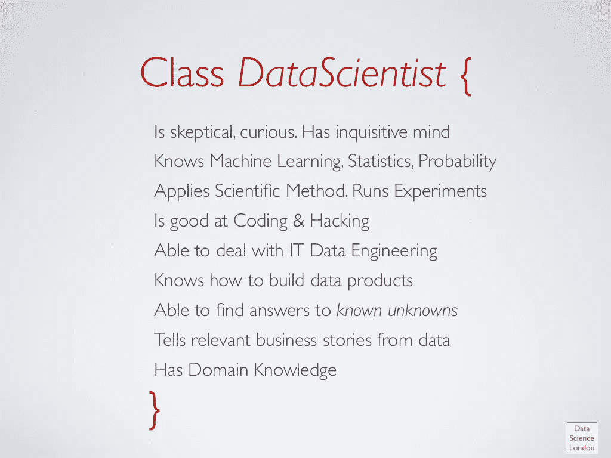

# 如何成为一名机器学习工程师？

> 原文：<https://towardsdatascience.com/how-to-become-a-machine-learning-engineer-ce81821a025f?source=collection_archive---------6----------------------->

source : engadget

> 最近我在我的团队中发布了一个机器学习工程师的职位。我收到了很多人的问题，他们很好奇，想了解这个职位本身，如何准备这个职位，以及它面临什么样的问题？

# 数据科学 vs 机器学习工程

让我们从定义职位本身开始。什么是机器学习工程？是新事物吗？它与所谓的 21 世纪最性感的工作数据科学家有什么不同吗？

当人们发明数据科学家这一术语时，他们在寻找擅长以下方面的超级英雄:

via [Big Data [sorry] & Data Science: What Does a Data Scientist Do](https://www.slideshare.net/datasciencelondon/big-data-sorry-data-science-what-does-a-data-scientist-do)

1-获取数据、清理数据、发现问题、提出正确的问题以及为不同的 KPI 设定正确的衡量标准。

2-进行必要的统计分析，提出关于解决方案的不同假设

3-使用统计方法验证不同的建议解决方案。

4-在某些时候，解决方案可能不仅仅是一个数学模型(方程)，它可能包括一些需要使用机器学习的复杂性。因此，通过不同的迭代开发一个合适的 ML 模型变得很有必要。

5-一旦这个模型准备好了，你需要设计一个工程系统，除了其他方面需要仔细的工程设计以确保这个模型的持续有效性之外，还要为这个模型服务。

6-对模型结果进行必要的连续分析和调查，以及必要的监控。

> *它们确实存在于我们的星球上，但非常罕见；)*

Photo by [Franki Chamaki](https://unsplash.com/@franki?utm_source=ghost&utm_medium=referral&utm_campaign=api-credit) / [Unsplash](https://unsplash.com/?utm_source=ghost&utm_medium=referral&utm_campaign=api-credit)

由于人类获取知识和跟上各个不同子领域不断变化的能力有限，专业化就成了必须。我们开始看到不同的职位描述在前面提到的工作流程的不同区域工作。

> *例如，一些对基础设施更感兴趣的数据工程师/科学家专门从事数据工程。这给了他们更多的带宽来吸收不同分布式处理系统的内部(例如:Apache Spark，Apache Hadoop，..因此能够扩展这些系统来处理非常定制的用例，这些用例可能不容易用标准 API 来处理*

我们可以列出 6 个概况，它们共同组成了一个有能力的数据团队，能够推动其组织成为数据驱动的，然后在稍后阶段成为人工智能驱动的。

*   数据分析师和数据即
*   数据科学家
*   数据工程师
*   机器学习工程师
*   数据基础设施工程师
*   数据操作

然而，很难将这一点推广到每一个组织，因为在考虑数据团队保护伞下的每个配置文件之间的界限时，每个组织的需求和规模是决定性因素。

# 那么什么是机器学习工程师呢？

Photo by [Wes Hicks](https://unsplash.com/@sickhews?utm_source=medium&utm_medium=referral) on [Unsplash](https://unsplash.com?utm_source=medium&utm_medium=referral)

我将引用 Oreilly 的优秀文章[对他们的描述如下:](https://:/www.oreilly.com/ideas/what-are-machine-learning-engineers)

*   他们比典型的数据科学家拥有更强的软件工程技能。
*   机器学习工程师能够与维护生产系统的工程师一起工作。他们还[编写干净的代码](https://medium.com/@ahmdkamal/clean-code-debate-e1bd5eab2538)。
*   他们了解软件开发方法、敏捷实践和现代软件开发人员使用的所有工具:从 Eclipse 和 IntelliJ 等 ide 到持续部署管道的组件。
*   他们参与软件架构和设计
*   因为他们的重点是让数据产品在生产中发挥作用，所以他们从整体上考虑问题，并考虑日志记录或 A/B 测试基础设施等组件。
*   他们了解生产中监控数据产品的具体问题。有许多关于应用程序监控的资源，但机器学习有更进一步的要求。数据管道和模型可能会过时，需要重新培训，或者它们可能会受到对手的攻击，而这些攻击对于传统的 web 应用程序来说毫无意义。

# 如何获得体验？

Photo by [Ali Yahya](https://unsplash.com/@ayahya09?utm_source=medium&utm_medium=referral) on [Unsplash](https://unsplash.com?utm_source=medium&utm_medium=referral)

*   做一个扎实的软件工程师
*   获得 ML 经验
*   理论部分，你可以在 Coursera、Edx 或 Udacity 上选修任何一门现有的 MOOCs。一个选择是 [Udacity 机器学习工程师 Nanodegree](http://udacity.com/course/machine-learning-engineer-nanodegree--nd009) 。
*   通过在真实数据上做真实项目获得实践经验。如果你还没有问题的话，Kaggle 是最好的来源:)
*   读，听，看。互联网上有许多精彩的文章、播客和视频会议。

> 为了前任。这里是一个博客，讨论我的*经验，建立我们的内部 ML 基础设施平台，这将让你先睹为快真实世界的 ML 工程经验。*

 [## 缩放机器学习@ Careem

### 我们如何构建我们的内部 ML 平台？

medium.com](https://medium.com/careem-tech/yoda-scaling-machine-learning-careem-d4bc8b1be195) 

# 推荐资源

**博客**

*   [ [走向数据科学](https://towardsdatascience.com/)
*   【[激情学习](http://blog.ahmedkamal.me)】—不要脸的塞；如果你想收到关于机器学习、数据工程和其他主题的帖子，请务必订阅。
*   [机器学习掌握]

**播客**

*   [ [机器学习— SE Daily](https://itunes.apple.com/us/podcast/machine-learning-software-engineering-daily/id1230807136?mt=2)
*   [ [奥莱利数据显示](https://www.oreilly.com/topics/oreilly-data-show-podcast)

**理论背景:**

[https://www . quora . com/What-is-the-successed-courses-I-take-in-my graduate-studies-to-a-Machine-Learning-Engineer/answer/Alex-Smola-1](https://www.quora.com/What-are-the-recommended-courses-should-I-take-in-my-graduate-studies-to-become-a-Machine-Learning-Engineer/answer/Alex-Smola-1?ref=fb_page)

# 面试是什么样的？

似乎大多数公司会像面试其他软件工程师一样面试你。另外，可能会就你的机器学习理论知识、数据工程、ML 产品设计进行面试。

更多详情可以阅读[小寒曾](https://medium.com/u/851f75cef87f?source=post_page-----ce81821a025f--------------------------------)作为机器学习工程师的面试经历。

 [## 我在五天内面试了硅谷的五家顶级公司，幸运的是获得了五份工作邀请

### 以下是我的做法和我的想法

medium.com](https://medium.com/@XiaohanZeng/i-interviewed-at-five-top-companies-in-silicon-valley-in-five-days-and-luckily-got-five-job-offers-25178cf74e0f) 

# **哪里可以找到合适的机会？**

包括五大在内的大公司大多都有自己的机器学习和数据团队。如果你有合适的经验，应该很容易找到合适的机会。你随时可以从 [Linkedin](https://www.linkedin.com/jobs/search/?keywords=Machine%20Learning%20Engineer&location=Worldwide&locationId=OTHERS.worldwide) 开始。

# 包裹

对于机器学习工程岗位的什么、哪里、怎么做的问题，我尝试给出了一些答案。如果能分享一下进入该领域的经验就好了。一如既往地感谢阅读！

# 你喜欢你读到的东西吗？

在 Twitter [@_ahmdkamal](http://twitter.com/@_ahmdkamal_) _ 上关注我，获取关于#AI 和#tech 的有趣更新。

***你知道你最多可以放弃 50 个*👏*到本帖*** 😉 ***？！***

*鼓掌让其他人看到&鼓励我在 medium 上发布更多高质量的内容！*

*原载于*[*blog . Ahmed Kamal . me*](http://blog.ahmedkamal.me/how-to-be-a-machine-learning-engineer/)*。*