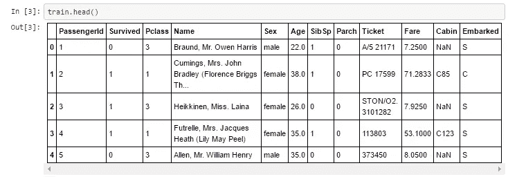
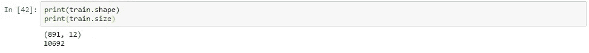
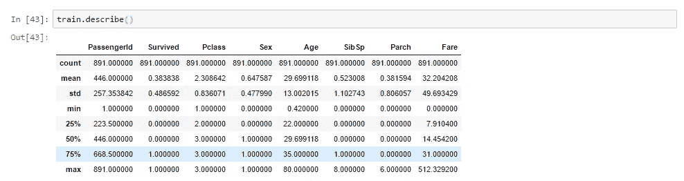
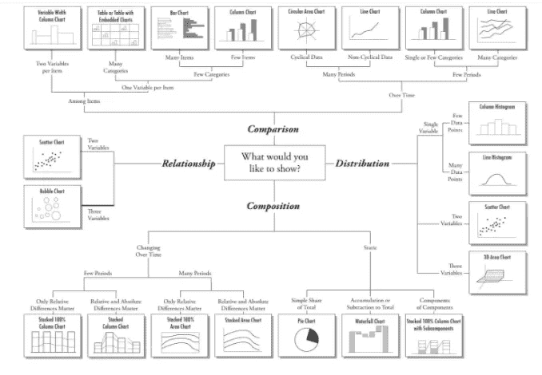
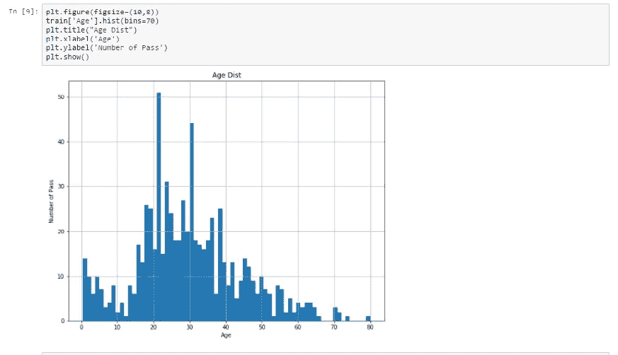
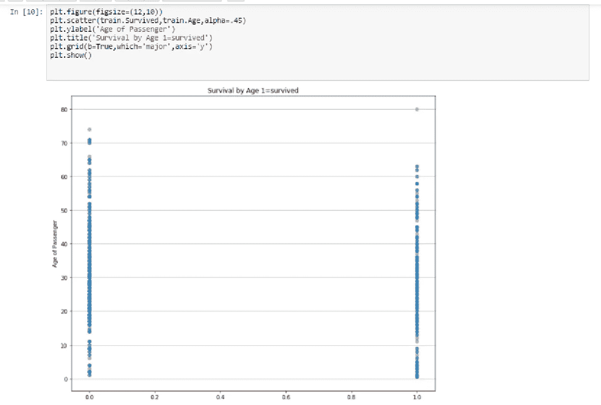
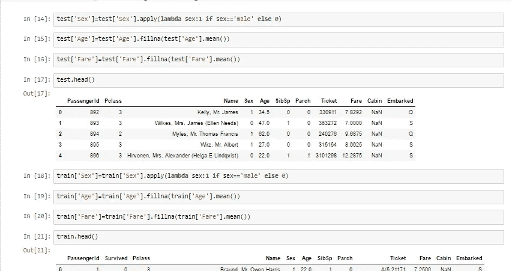
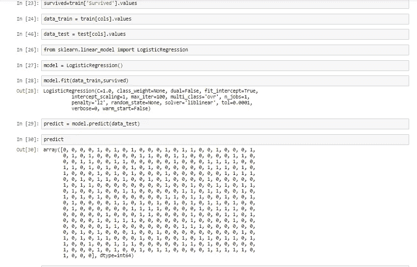

# 如何开始自己的数据科学之旅！

> 原文：<https://towardsdatascience.com/how-to-begin-your-own-data-science-journey-2223caad8cee?source=collection_archive---------0----------------------->

嘿，你好，

不久以前，商人们常常去找这些占星家预测他们的下一个财政年度会如何。尽管这是毫无根据和不确定的，但人们习惯于根据这一点或该领域某个专家的建议来做决定。但是现在我们在前进，已经前进到这样一个程度，我们接受一切基于事实和数字的东西。

我们生活在一个数据丰富的世界，你去达美乐点披萨，他们问的第一件事就是你的号码，通过这个手机号码，他们获取了从地址到过去订单的所有信息，但数据仅限于此吗？或者我们能从这些数据中做些别的什么吗？这就是数据科学家发挥作用的地方。

现在，让我们谈谈用于分析数据的工具。

1.  SAS——统计分析系统的缩写，用于高级分析、数据管理和商业智能。这是一个由 NCSU 从 1966 年到 1976 年开发的授权软件。SAS 仍然被广泛使用，大多数财富 500 强公司都使用 SAS。
2.  R-R 语言是一种用于分析和统计模型的开源语言。许多开源库是为 R 语言创建的。主要用于命令行界面
3.  Python——我个人最喜欢的，Python 是革命性的，今天在这篇文章中我们将使用 Python。这是一种高级编程语言，由 Guido Van Rossum 创建。它是开源的，因此每天都有很多库被创建。事实上，如果你想在机器学习和人工智能领域做出一番事业，Python 是最理想的语言。

今天我们将研究用于数据科学的 **Python。**

```
 import pandas as pd
    import numpy as np
    import matplotlib.pyplot as plt
    %matplotlib inline
```

这里我们导入了三个基本的依赖项，大约 90%的项目需要您导入这三个依赖项。那么这些依赖是什么呢？

1.  numpy——这是一个内置的 python 库，有助于执行数学函数，如矩阵乘法、转换等
2.  Pandas 最重要的库，该库用于导入数据集和创建数据框。这可以进一步用于分析或预测，无论你想做什么！
3.  matplotlib——这是一个用于数据可视化和表示的工具。
4.  % matplotlib inline—因为我要使用 jupyter(Ipython notebook)笔记本，所以我希望我的输出(图形)在笔记本内部。

```
train = pd.read_csv('train.csv')
```

现在我们已经准备好了，我们使用上面的命令导入数据。pd 是上面提到的熊猫的简称(进口熊猫为 pd)。read_csv 是熊猫图书馆内部的一个函数。train.csv 文件位于 anaconda 目录中。我们已经成功地将该文件上传到我们的 python 生态系统中，并创建了一个数据框，并且准备好执行功能了！

```
train.head()
```

什么是头？人体的上部，不是吗？类似地，pandas 使用 head 函数给我们一个关于数据帧顶部的概述。默认情况下，head()会返回数据帧的前 5 行。

同样，如果我们输入 head(20 ),它将返回前 20 行！有趣不是吗？

类似地，我们可以使用 tail()来查看数据帧的最后 5 个(默认情况下)。

head()的输出将是:-



output for the head() command

现在，我们已经获得了数据框的前 5 行和前 5 列。

最重要的是首先要知道你在处理什么样的数据集，像大小、形状和描述这样的问题是非常重要的，而且随着我们的进一步发展也非常有用，那么关于数据集，我们需要知道哪些关键的事情呢？由于很少有数据集是巨大的，并且处理起来会很痛苦，我们需要找到有用的信息并消除不需要的信息，这听起来很容易，但识别这些信息可能很难。据说研究数据集的形状是一种很好的做法。



shape and size of the data

这里我们可以看到数据有 891 行和 12 列，总数据大小为 10692。

让我们来看一些关于我们现在拥有的数据的基本统计数据



Basic statistics about the data

在这里可以看到数据的统计数据，如计数、平均值、百分位数、标准偏差。当我们处理一些财务数据或绩效相关数据时，这些数据非常重要。

接下来，我们将进行一些数据可视化，这是数据科学必须掌握的最重要的技能之一。正如在导入数据集的过程中所讨论的，我们使用 matplotlib，尽管如果你在 google 上搜索它，还有各种其他的库，但是 matplotlib 在这里服务于我们的目的。

对于数据科学家来说，知道使用哪种表示是非常重要的，我们将首先讨论这一点，然后讨论代码。

# **表现类型**

当我们将数据可视化时，我们头脑中必须有一些东西，

1.  一张图上要显示多少个变量？
2.  一个数据点有几个项目还是很多？
3.  我们是否显示一段时间的数据？还是我们在分组？

这些因素影响图表的选择。



Which chart ?

上图有助于我们确定何时使用哪种图表类型。

但是强烈建议学习一下数据可视化，掌握它。因为许多公司想要数据来告诉我们这个故事。

可视化工具，如 Tableau，PowerBI 可以通过创建一个非常有用的仪表板来告诉我们关于整个数据的故事。

现在，我们看看如何使用 matplotlib 在 python 中可视化数据



Age vs number of passengers (Age distribution of passengers)

我们已经将 matplotlib 作为 plt 导入，这里我们首先从定义 figsize 开始，这意味着图形大小。通常，如果我们没有定义 figsize，它会被设置为默认值，然后我们使用我们的数据并绘制年龄。

我们可以设置标签，xlabel 表示 x 轴标签，ylabel 表示 y 轴标签，title 用于定义图形的标题。

看到图表后，我们可以从数据中推断出一些东西，所有的事情都可以推断出什么呢？

1.  年轻人更加积极。
2.  老年人真的很少。
3.  22 岁的人最高。
4.  最老的旅行者是 79 岁。

通过观察图表，我们可以推断出更多信息。

类似地，我们也可以从数据集制作许多其他图表，



Survival of people by age

数据集通过使用二进制来告诉我们一个人是否幸存，这很有趣，不是吗？这就是我们如何为我们的需求争论数据，我们将在以后使用统计模型预测更多的事情。

让我们继续，训练我们的计算机根据现有的数据来预测是否有乘客幸存。

# 机器学习算法

到目前为止，我们已经了解了如何导入数据、可视化数据以及如何从数据中进行推断，现在我们将了解要使用哪些算法以及何时使用？

有两种机器学习算法

1.  监督学习:-当我们有标签数据时，我们使用监督。机器在数据点的值标签中寻找模式。
2.  无监督学习:-当我们没有标记的数据时，我们使用它。该机器将数据组织成组并进行比较以找到关系。

监督学习的例子是回归，非监督学习是朴素贝叶斯。

[](https://www.dezyre.com/article/top-10-machine-learning-algorithms/202) [## 十大机器学习算法

### 顶级机器学习算法正在数据科学领域取得进展。这里解释的是其中的 10 大…

www.dezyre.com](https://www.dezyre.com/article/top-10-machine-learning-algorithms/202) 

此链接将帮助您了解哪种算法是最适合的，以及要使用哪种算法。

但是对于这些数据，我们将使用逻辑回归，我们如何做呢？

逻辑回归帮助我们预测数据的真假。基本上，将一组数据提供给机器，机器使用回归公式进行计算，并以二进制格式给出答案

根据维基百科，在[统计](https://en.wikipedia.org/wiki/Statistics)、**逻辑回归**，或者**逻辑回归**，或者**逻辑回归模型**、[、](https://en.wikipedia.org/wiki/Logistic_regression#cite_note-Freedman09-1)是[回归](https://en.wikipedia.org/wiki/Regression_analysis)模型，其中[因变量(DV)](https://en.wikipedia.org/wiki/Dependent_and_independent_variables) 是[分类](https://en.wikipedia.org/wiki/Categorical_variable)。本文涵盖了一个[二元因变量](https://en.wikipedia.org/wiki/Binary_variable)的情况——也就是说，它只能取两个值，“0”和“1”，分别代表通过/失败、赢/输、活着/死了或健康/生病等结果。因变量有两个以上结果类别的情况可以在[多项逻辑回归](https://en.wikipedia.org/wiki/Multinomial_logistic_regression)中进行分析，或者，如果多个类别是[有序的](https://en.wikipedia.org/wiki/Level_of_measurement#Ordinal_type)，则在[有序逻辑回归](https://en.wikipedia.org/wiki/Ordinal_logistic_regression)中进行分析。在经济学术语中，逻辑回归是定性反应/离散选择模型的一个例子。

那么逻辑回归在这方面如何帮助我们呢？

我们保留了二进制格式的列。所以这不是问题，但我们需要将性别列更改为 1 和 0，这样我们就可以预测是否将性别作为变量之一。

要求我们再次导入 python 库中内置的 sklearn，用于统计工具。Sklearn 服务于所有目的，是一个非常强大的工具。

我们如何做到这一点？

```
from sklearn.linear_model import LogisticRegression 
```

我们导入 sklearn 库中的逻辑回归。

逻辑回归的先决条件是有两组数据

1.  训练数据—该数据用于训练计算机
2.  测试—测试数据通常很小，用于检查机器对数据的准确性



Converting genders into binary format

在将它们转换成二进制格式后，我们现在可以使用 LogisticRegression 函数来预测我们的结果。

首先，我们将来自训练幸存列设置为逻辑回归模型的输出，以便理解。

因为我们有一个单独的训练和测试数据集，我们可以很容易地使用它，而不需要使用训练和测试分割功能。



Prediction using logistic regression

让我们一步一步来，

1.  我们将幸存列标记为我们的标签(输出),并使用 data_train(变量)作为我们的训练输入，而不使用幸存列
2.  然后我们导入 sklearn，并定义模型(变量)以使用逻辑回归函数。
3.  然后我们拟合我们的模型，这是我们的计算机试图识别模式的地方。这使得我们的计算机能够在类似的数据传入时给出预测。
4.  我们有一个单独的数据叫做测试，在那里幸存下来的不存在。我们使用 predict 函数根据训练数据集预测结果。

这就是计算机如何通过学习进行预测。下次我们将其他模型，也将看到什么是准确性得分和矩阵得分。

希望你喜欢它并从中得到一些东西，如果有，请分享，下次再见。