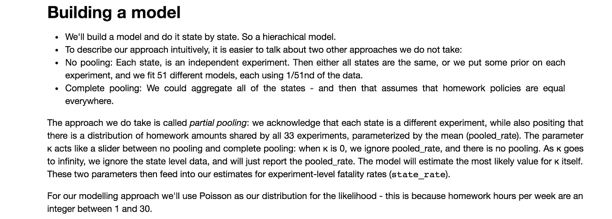
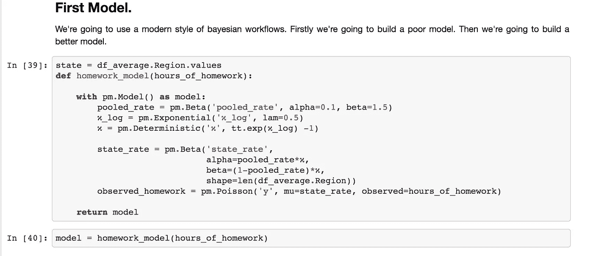
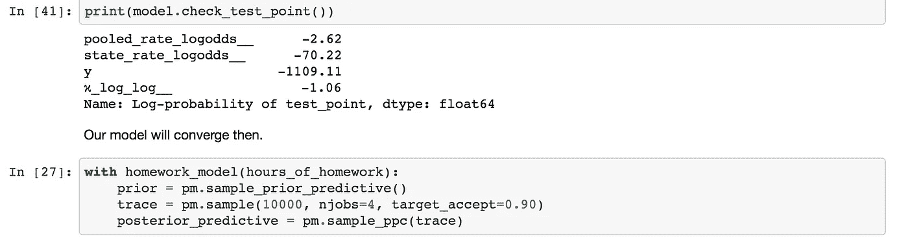
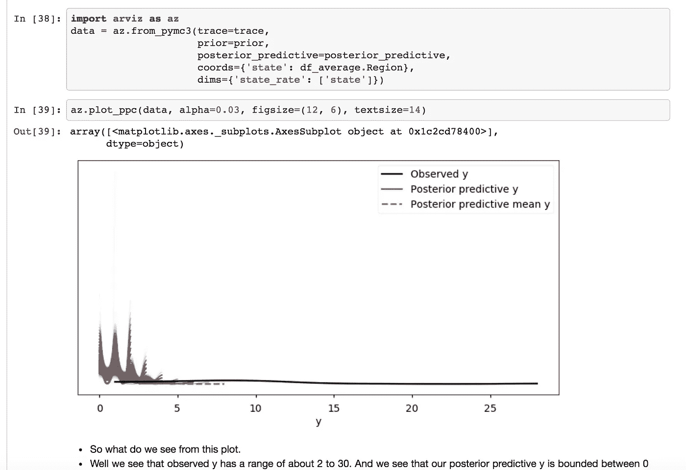
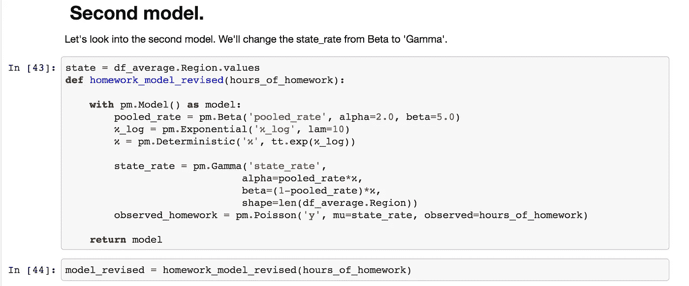
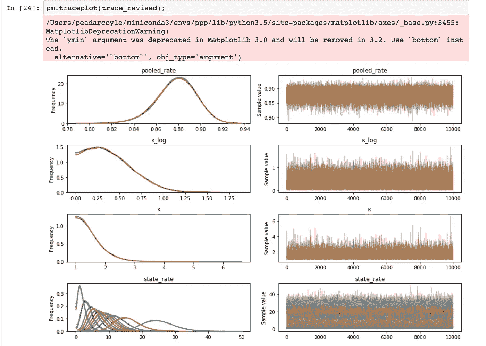
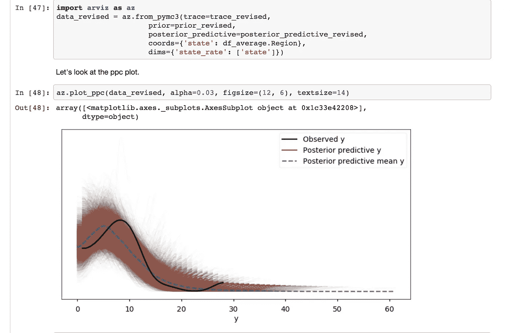
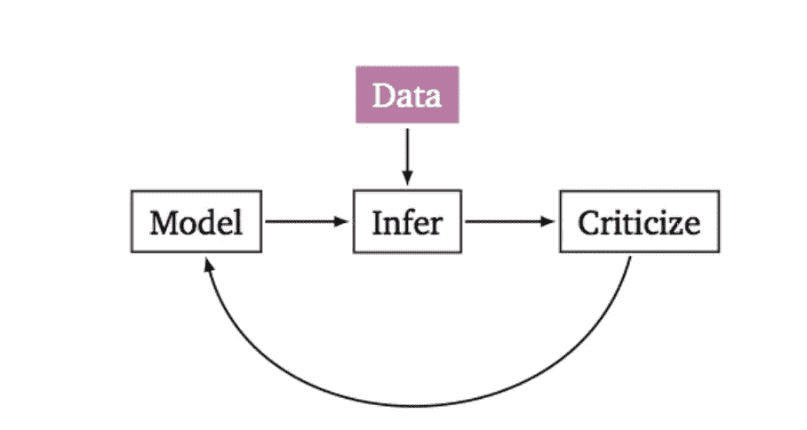

# 如何在 30 分钟或更短时间内建立贝叶斯模型

> 原文：<https://towardsdatascience.com/how-to-build-a-bayesian-model-in-30-minutes-or-less-fd7a23ca1ecf?source=collection_archive---------18----------------------->

# 你有一个问题，你认为可能需要一些贝叶斯模型

我被问到的一个常见问题是**你如何启动**？

在本教程中，我将带您了解一个新的数据集，这个数据集是一个教育数据集。我对数据一窍不通，也没有具体的领域知识。我改编了来自 [PyMC3 文档](https://docs.pymc.io/notebooks/hierarchical_partial_pooling.html)的模型。

然后，我使用诸如 [Arviz](https://arviz-devs.github.io/arviz/) 之类的工具来评估模型，解释和评估你的建模决策。我用这个来通知一个更好的模型，我们从对模型的评估中看到，第二个模型要好得多。您可以在[Github](https://github.com/springcoil/modernbayesianworkflow)—`census_data`笔记本中查看活页夹链接。

我们的第一步是建立一个模型。我们在上面的截图中描述过。

[gallery ids="2034，2033，2032 " type = " rectangle "]

我们做观想阶段。

我们看到我们的第一个模型很差，看看`plot_ppc`图，我们的模型根本不符合观察到的数据。这是穷人。

# 如何改进模型？

我们可以利用我们在建模过程中获得的知识来认识到，Beta 分布是一个差的分布，而且过于紧密，我们还可以看到各种模型指标都很差。(这些都在笔记本里)。让我们从贝塔分布转换到伽玛分布，看看会发生什么。

我们看到第二种模式要好得多。查看红色后验预测图如何更好地拟合黑色观察数据。这是一个更好的模型。

# 关键要点是什么？

从一个例子的模型开始，然后看看它在你的建模用例中的表现，这是一个好主意。关键是完善和批评你的模型。你可以在上面看到我是如何使用像[样本后验预测](https://docs.pymc.io/notebooks/posterior_predictive.html)这样的工具来批评和改进模型的。

将这种形象内在化是很好的——盒子循环，这是你在建立贝叶斯模型时需要的工作流程。

关键的事情是，你将你对你试图建模的领域的了解整合到模型中。当我从贝塔分布转到伽玛分布时，你会看到上面的情况。这与您可能习惯的一些机器学习工作流不同。

# 想了解更多？

如果这满足了你的胃口，你可能想了解更多。你可以在这里注册一个为期 5 天的免费贝叶斯统计电子邮件课程，或者如果你已经确信你可以购买[概率编程初级课程](http://www.probabilisticprogrammingprimer.com)。在我的课程中，我给出了近 4 个小时的视频来解释贝叶斯建模的概念。我涵盖了诸如“自动驾驶汽车安全吗”的例子，我介绍了一系列新的概率编程工具，我还在 [Arviz](https://arviz-devs.github.io/arviz/) 上做了独家截屏。如果你能跟随这篇博文并理解它，那么这个课程就是为你而设的。