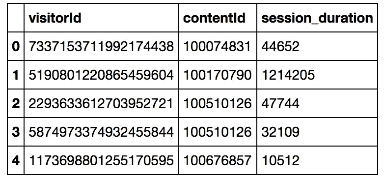

# 如何构建个性化推荐的协同过滤模型

> 原文：<https://towardsdatascience.com/how-to-build-a-collaborative-filtering-model-for-personalized-recommendations-using-tensorflow-and-b9a77dc1320?source=collection_archive---------3----------------------->

## 基于张量流和张量流变换的推荐模型

2020 年 4 月更新:请注意，现在有一种更简单的方法可以做到这一点。阅读本文关于构建 [**模型的建议使用 BigQuery ML**](/training-a-recommendation-model-for-google-analytics-data-using-bigquery-ml-2327f9a2e8e9) **。**

在本文中，我将带您逐步了解如何使用 TensorFlow 的 Estimator API 来构建用于产品推荐的 WALS 协同过滤模型。最近，我的同事 Lukman Ramsey 发布了一系列解决方案，详细介绍了如何构建推荐模型— [阅读这些解决方案](https://cloud.google.com/solutions/machine-learning/recommendation-system-tensorflow-overview)，了解什么是推荐以及如何建立端到端系统。


Recommending chocolates to users is a collaborative filtering problem

在本文中，我将用 Apache Beam 替换原始解决方案中对 Pandas 的使用——这将允许解决方案更容易地扩展到更大的数据集。因为上下文存在于解决方案中，所以我将在这里简单地深入技术细节。完整的源代码在 GitHub 上。

## 步骤 1:提取原始数据

对于协同过滤，我们不需要知道任何关于用户或内容的属性。本质上，我们需要知道的只是 userId、itemId 和特定用户对特定项目的评价。在这种情况下，我们可以用花在页面上的时间作为评级的代理。Google Analytics 360 将 web 流量信息导出到 BigQuery，我就是从 BigQuery 中提取数据的:

```
#standardSQL
WITH visitor_page_content AS (

   SELECT  
     fullVisitorID,
     (SELECT MAX(IF(index=10, value, NULL)) FROM UNNEST(hits.customDimensions)) AS latestContentId,  
     (LEAD(hits.time, 1) OVER (PARTITION BY fullVisitorId ORDER BY hits.time ASC) - hits.time) AS session_duration 
   FROM `cloud-training-demos.GA360_test.ga_sessions_sample`,   
     UNNEST(hits) AS hits
   WHERE 
     # only include hits on pages
      hits.type = "PAGE"

   GROUP BY   
     fullVisitorId, latestContentId, hits.time
     )

# aggregate web stats
SELECT   
  fullVisitorID as visitorId,
  latestContentId as contentId,
  SUM(session_duration) AS session_duration 

FROM visitor_page_content
  WHERE latestContentId IS NOT NULL 
  GROUP BY fullVisitorID, latestContentId
  HAVING session_duration > 0
  ORDER BY latestContentId
```

查询本身特定于报纸设置 Google Analytics 的方式，特别是他们设置自定义维度的方式，您可能需要使用不同的查询来提取数据，如下表所示:



这是进行协同过滤所需的原始数据集。显然，你将使用什么样的 visitorId、contentId 和 ratings 取决于你的问题。除此之外，其他一切都很标准，您应该能够照原样使用它。

## 步骤 2:创建枚举的用户和项目 id

WALS 算法要求枚举用户 id 和项目 id，也就是说，它们应该只是交互矩阵中的行号和列号。因此，我们需要获取上面的 visitorId，它是一个字符串，并将它们映射到 0，1，2，…我们需要对项目 id 做同样的事情。此外，评级必须是小数字，通常为 0-1。因此，我们必须调整 session_duration。

为了进行这种映射，我们将使用[TensorFlow Transform](https://github.com/tensorflow/transform)(TFT)——这是一个允许您使用 Apache Beam 创建预处理数据集进行训练的库，然后在推理期间将该预处理作为 tensor flow 图的一部分来应用！

下面是我使用 TFT 的预处理功能的关键:

```
**def** preprocess_tft(rowdict):
    median = 57937
    result = {
      'userId' : tft.string_to_int(rowdict['visitorId'], vocab_filename='vocab_users'),
      'itemId' : tft.string_to_int(rowdict['contentId'], vocab_filename='vocab_items'),
      'rating' : 0.3 * (1 + (rowdict['session_duration'] - median)/median)
    }
    *# cap the rating at 1.0*
    result['rating'] = tf.where(tf.less(result['rating'], tf.ones(tf.shape(result['rating']))),
                               result['rating'], tf.ones(tf.shape(result['rating'])))
    **return** result
```

预处理 BigQuery 中由 visitorId、contentId 和 session_duration 组成的行的结果是一个名为 result 的 Python 字典，它包含三列:userId、itemId 和 rating。

tft.string_to_int 查看整个训练数据集，并创建一个映射来枚举访问者，并将该映射(“词汇表”)写入文件 vocab_users。我对 contentId 做了同样的事情，创建了 itemId。通过将 session_duration 调整到 0–1 之间来获得评级。我的缩放基本上去掉了极长会话持续时间的长尾，这可能代表了在阅读报纸文章时关闭笔记本电脑的人。需要注意的关键点是，我使用纯张量流函数(如 tf.less 和 tf.ones)来进行这种裁剪。这很重要，因为这种预处理函数必须在推理(预测)过程中作为张量流服务图的一部分来应用。

使用 Apache Beam 将预处理功能应用于训练数据集:

```
transformed_dataset, transform_fn = (
          raw_dataset | beam_impl.AnalyzeAndTransformDataset(preprocess_tft))
```

## 步骤 3:写出 WALS 训练数据集

WALS 的训练集由两个文件组成，一个文件提供特定用户评定的所有项目(按行排列的交互矩阵)，另一个文件提供评定了特定项目的所有用户(按列排列的交互矩阵)。显然，这两个文件包含相同的数据，但是有必要分割数据集，以便可以并行处理它们。我们也可以在进行枚举的同一个 Apache Beam 管道中这样做:

```
users_for_item = (transformed_data
    | 'map_items' >> beam.Map(**lambda** x : (x['itemId'], x))
    | 'group_items' >> beam.GroupByKey()
    | 'totfr_items' >> beam.Map(**lambda** item_userlist : to_tfrecord(item_userlist, 'userId')))
```

然后，我们可以在云数据流上执行 Apache Beam 管道。这是一个完全托管的服务，所以我们不必到处设置基础设施和安装软件(完整代码见 GitHub 中的[笔记本)。](https://github.com/GoogleCloudPlatform/training-data-analyst/blob/master/courses/machine_learning/deepdive/10_recommend/wals_tft.ipynb)

此时，我们将拥有以下文件:

```
items_for_user-00000-of-00003
...
users_for_item-00000-of-00004
...transform_fn/transform_fn/saved_model.pb
transform_fn/transform_fn/assets/
transform_fn/transform_fn/assets/vocab_items
transform_fn/transform_fn/assets/vocab_users
```

1.  ` ''项目的用户''以 TFExample 格式包含每个项目的所有用户/评级。这里的项目和用户是整数(不是字符串)，即 itemId 不是 contentId，userId 不是 visitorId。等级被缩放。
2.  ` ` items_for_user ` `以 TFExample 格式包含每个用户的所有项目/评级。这里的项目和用户是整数(不是字符串)，即 itemId 不是 contentId，userId 不是 visitorId。等级被缩放。
3.  ` ` vocab_items ` `包含从 contentId 到枚举 itemId 的映射
4.  ` ` vocab_users ` `包含从 visitorId 到枚举 userId 的映射
5.  saved_model.pb 包含我们在预处理过程中进行的所有张量流变换，因此它们也可以在预测过程中应用。

## 步骤 4:编写张量流代码

TensorFlow 中有一个基于估算器 API 的 WALS 实现。我们使用它的方式与使用任何其他估计器一样——参见 GitHub repo 中的函数 read_dataset()和 train_and_evaluate()。

更有趣的是我们如何使用训练好的估计量进行批量预测。对于特定用户，我们希望找到前 K 项。这可以在 TensorFlow 中通过以下方式实现:

```
**def** find_top_k(user, item_factors, k):
  all_items = tf.matmul(tf.expand_dims(user, 0), tf.transpose(item_factors))
  topk = tf.nn.top_k(all_items, k=k)
  **return** tf.cast(topk.indices, dtype=tf.int64)
```

批量预测包括为每个用户调用上述函数，但是要确保当我们写出输出时，我们写出的是字符串 visitorId，而不是数字 userId(contentId/userId 也是如此):

```
**def** batch_predict(args):
  **import** **numpy** **as** **np**

  *# read vocabulary into Python list for quick index-ed lookup*
  **def** create_lookup(filename):
      **from** **tensorflow.python.lib.io** **import** file_io
      dirname = os.path.join(args['input_path'], 'transform_fn/transform_fn/assets/')
      **with** file_io.FileIO(os.path.join(dirname, filename), mode='r') **as** ifp:
        **return** [x.rstrip() **for** x **in** ifp]
  originalItemIds = create_lookup('vocab_items')
  originalUserIds = create_lookup('vocab_users')

  **with** tf.Session() **as** sess:
    estimator = tf.contrib.factorization.WALSMatrixFactorization(
                         num_rows=args['nusers'], num_cols=args['nitems'],
                         embedding_dimension=args['n_embeds'],
                         model_dir=args['output_dir'])

    *# but for in-vocab data, the row factors are already in the checkpoint*
    user_factors = tf.convert_to_tensor(estimator.get_row_factors()[0]) *# (nusers, nembeds)*
    *# in either case, we have to assume catalog doesn't change, so col_factors are read in*
    item_factors = tf.convert_to_tensor(estimator.get_col_factors()[0])*# (nitems, nembeds)*

    *# for each user, find the top K items*
    topk = tf.squeeze(tf.map_fn(**lambda** user: find_top_k(user, item_factors, args['topk']), 
                                user_factors, dtype=tf.int64))
    **with** file_io.FileIO(os.path.join(args['output_dir'], 'batch_pred.txt'), mode='w') **as** f:
      **for** userId, best_items_for_user **in** enumerate(topk.eval()):
        f.write(originalUserIds[userId] + '**\t**') *# write userId \t item1,item2,item3...*
        f.write(','.join(originalItemIds[itemId] **for** itemId **in** best_items_for_user) + '**\n**')
```

为了进行训练和批量预测，我们可以在 Cloud ML Engine 上运行 TensorFlow 模型，同样不需要任何基础设施:

```
gcloud ml-engine jobs submit training $JOBNAME \
   --region=$REGION \
   --module-name=trainer.task \
   --package-path=${PWD}/wals_tft/trainer \
   --job-dir=$OUTDIR \
   --staging-bucket=gs://$BUCKET \
   --scale-tier=BASIC_GPU \
   --runtime-version=1.5 \
   -- \
   --output_dir=$OUTDIR \
   --input_path=gs://${BUCKET}/wals/preproc_tft \
   --num_epochs=10 --nitems=5668 --nusers=82802
```

像这样硬编码 nitems 和 nusers 有点难看。因此，我们可以回到我们的 Beam 管道，让它将 nitems 和 nusers 也写入文件，然后简单地执行“gsutil cat”来获得适当的值 GitHub 上的完整代码可以做到这一点。

以下是输出结果的一个示例:

```
6167894456739729438	298997422,262707977,263058146
3795498541234027150	296993188,97034003,298989783
```

实际上，每个 visitorId 有 3 个项目。

## 第 5 步:行和列因子

虽然进行产品推荐是 WALS 的主要用例，但另一个用例是寻找表示产品和用户的低维方法，例如，通过对项目因子和列因子进行聚类来进行产品或客户细分。因此，我们实现了一个服务函数来将这些返回给调用者(同样，完整代码请参见 GitHub):

```
**def** for_user_embeddings(originalUserId):
      *# convert the userId that the end-user provided to integer*
      originalUserIds = tf.contrib.lookup.index_table_from_file(
          os.path.join(args['input_path'], 'transform_fn/transform_fn/assets/vocab_users'))
      userId = originalUserIds.lookup(originalUserId)

      *# all items for this user (for user_embeddings)*
      items = tf.range(args['nitems'], dtype=tf.int64)
      users = userId * tf.ones([args['nitems']], dtype=tf.int64)
      ratings = 0.1 * tf.ones_like(users, dtype=tf.float32)
      **return** items, users, ratings, tf.constant(True)
```

## 管弦乐编曲

注意，本文只是关于替换原解决方案中的机器学习训练和批量预测部分。原始解决方案还解释了如何进行编排和过滤。它们在哪里？

此时，我们现在有了一个 BigQuery 查询、一个 Beam/Dataflow 管道和一个潜在的 AppEngine 应用程序(见下文)。你如何一个接一个地定期运行它们？按照解决方案中的建议，使用 Apache Airflow 来执行此流程编排。

## 过滤

如果你向顾客推荐巧克力，那么推荐一种他们已经尝试过的巧克力是可以的，但是如果你向用户推荐报纸文章，那么避免推荐他们已经读过的文章是很重要的。

与原始解决方案不同，我的批量预测代码不会过滤掉用户已经阅读过的文章。如果重要的是推荐不包括已经阅读/购买的项目，那么有两种方法可以做到这一点。

更简单的方法是在找到 top_k 之前，将对应于已经读取的项目(这里是评级< 0.01 的项目)的条目清零:

```
**def** find_top_k(user, item_factors, read_items, k):
  all_items = tf.matmul(tf.expand_dims(user, 0), 
                        tf.transpose(item_factors))
  all_items = tf.where(tf.less(read_items, 
                               0.01*tf.ones(tf.shape(read_items))),
                       all_items,
                       tf.zeros(tf.shape(all_items)))
  topk = tf.nn.top_k(all_items, k=k)
  **return** tf.cast(topk.indices, dtype=tf.int64)
```

这样做的问题是滞后-您可能不会推荐用户昨天阅读的项目(因为它在您的训练数据集中)，但批量预测代码确实可以实时访问阅读的文章流，因此您将推荐他们几分钟前阅读的文章。

如果这种滞后是您想要避免的问题，那么您应该使批量预测中的 k 更高(例如，即使您打算只推荐其中的 5 篇，您也会从推荐者那里获得 20 篇文章)，然后在 AppEngine 中进行第二级过滤，如原始解决方案中所建议的那样。

## 摘要

您现在可以进行批量预测、在线预测和训练，而无需设置任何集群！另外，TensorFlow Transform 允许我们简化元数据的计算和项目/用户的映射，以适应 WALS 范式。

感谢我的同事 Lukman Ramsey 和 Yiliang Zhao 对本文提出的有益意见和建议。