# Python:如何构建卷积网络分类器:耐克 vs 阿迪达斯鞋子

> 原文：<https://towardsdatascience.com/how-to-build-a-convolutional-network-classifier-81eef880715e?source=collection_archive---------3----------------------->

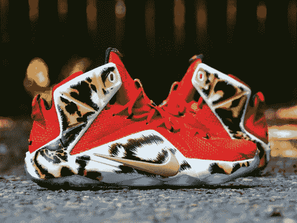

Nike Basketball Shoes

我为#100DaysOfMLCode 做的一个实验是建立一个图像分类器，用来区分耐克和阿迪达斯的篮球鞋。我的数据集中目前有 140 张图片。我正致力于增加这个数字，以提高分类器的准确性，并开始使用生成式对抗性网络来创建独特的篮球鞋设计。

通过 140 张图像，我能够使用 4 层卷积网络在耐克和阿迪达斯的鞋子之间实现 91%的准确性。我通过 sentdex 提供的教程学会了如何做到这一点，下面的链接是开始使用 tflearn API 构建图像识别模型的一个很好的资源。

 [## Python 编程教程

### 从初级到高级的 Python 编程教程，涵盖了各种各样的主题。所有视频和文本教程都是…

pythonprogramming.net](https://pythonprogramming.net/convolutional-neural-network-kats-vs-dogs-machine-learning-tutorial/) 

我将这段代码修改成适合我的自定义数据集。为了从 sentdex 的示例到我自己的示例提高性能，我增加了图像大小，并添加了更多的卷积层。另外，我使用 PIL 库代替 opencv 进行图像预处理。

所有代码和数据都可以在 github 上找到:

 [## CShorten/NIKE_vs_ADIDAS

### NIKE _ vs _ ADIDAS 耐克和阿迪达斯篮球鞋之间的图像识别分类器。数据集可在…

github.com](https://github.com/CShorten/NIKE_vs_ADIDAS) 

随着将来添加更多数据，我将更新这个存储库。请在 twitter @ [CShorten30](https://twitter.com/CShorten30) 上关注我，以获得关于此数据集的更新。

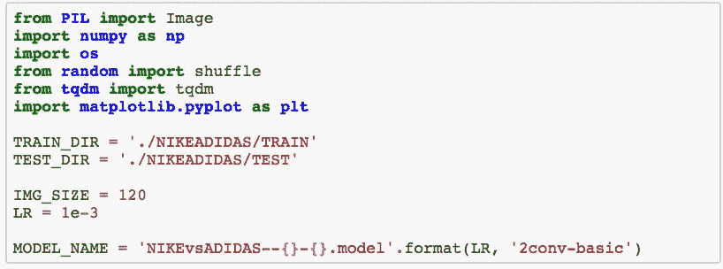

在第一个代码块中，我们导入了除 tensorflow 和 tflearn 之外所需的所有依赖项。PIL 用于预处理和加载图像，numpy 用于将我们的图像数据存储在数组中并将其提供给我们的模型，os 用于与我们的文件系统接口，random 用于混洗数据，这样我们就不会有一个由 20 个连续的 nike 图像和 20 个连续的 adidas 图像组成的数据集，tqdm 用于在您加载数据时提供加载栏，matplotlib.pyplot 用于可视化我们的错误和图像。

TRAIN_DIR/TEST_DIR 变量用于存储数据的相对路径。在本例中，我调整了所有图像的大小，使其具有正方形的尺寸，如 sentdex 示例所示。IMG 大小为 120 会产生(120，120)大小的图像。在未来的实验中，我可能会尝试调整图像的大小，使其高度/宽度更好地代表原始数据，例如(80，140)。

LR = 1e-3 表示学习率。我还没有尝试用学习率参数进行实验，因为我相信 adam 优化算法会对这些简单的实验进行相应的调整。

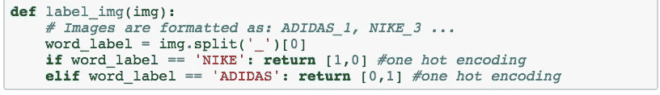

这个函数将为我们的图像分配标签。从这个函数中有两点要注意。

I .数据集中的每个图像都被标记为类似“阿迪达斯 _1”或“耐克 _3”的东西，因此 img . split(“_”)可以将其分成[“阿迪达斯”、“1”]，并且我们可以比较[0]元素，即耐克或阿迪达斯来分配类别标签。

二。一键编码，我第一次尝试的时候用[0]或[1]来编码类标签。然而，这将不如在诸如[1 0]或[0 1]的向量中编码类那样有效。一键编码也可以很容易地扩展为拥有多个类。例如，如果我们想包含锐步鞋，我们可以将锐步编码为[0 0 1]，耐克编码为[1 0 0]，阿迪达斯编码为[0 1 0]。

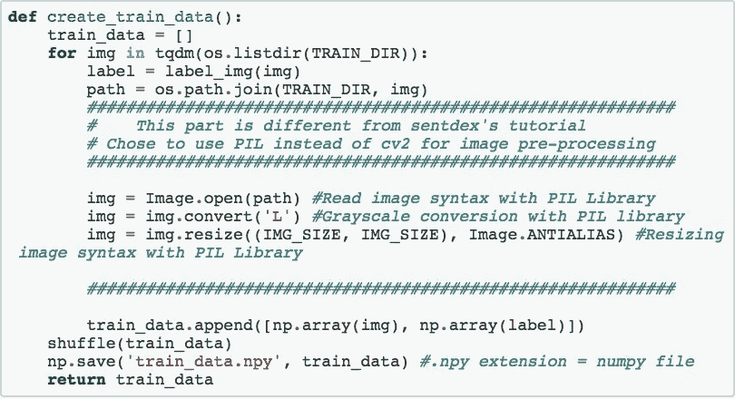

该函数用于从磁盘加载训练数据，并将其带入我们的程序。如果您正在跟随 sentdex 教程，我已经留下了大量的注释块来指示如何使用 PIL 而不是 opencv。这段代码的另一个有趣之处是 train_data 中结果张量的格式。我们看到我们有一个包含矩阵和向量的数组。这些张量的格式化是 numpy 库提供给我们的令人难以置信的特性之一。另外，我不知道您可以使用。np.save('train_data.npy '，train_data)函数中的 npy 扩展。

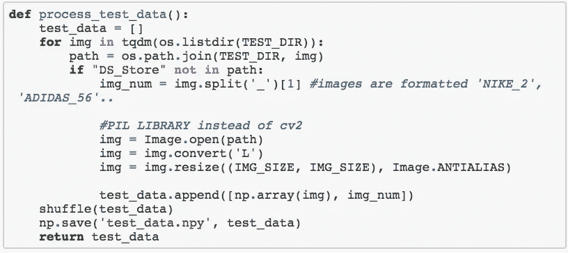

该函数用于加载没有类别标签的测试数据。这个函数的大部分和上面的一模一样。

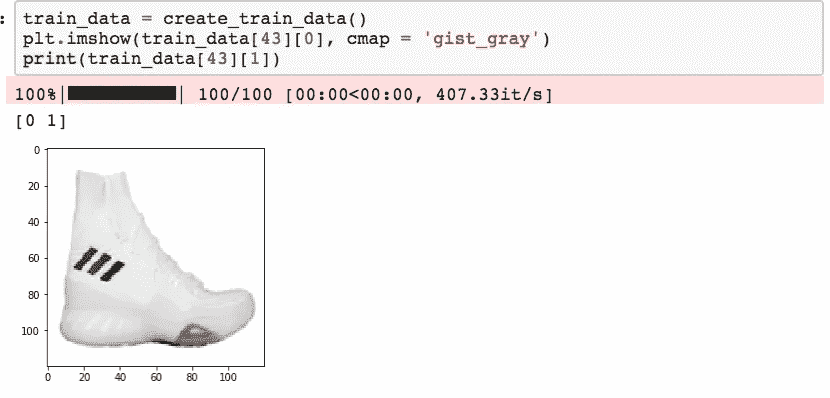

接下来，我们运行 create_train_data()函数，您可以看到我们从 tqdm 库中获得的黑色加载栏。接下来，我想要绘制一个图像，以确保数据集被正确加载，并查看新调整的尺寸如何使图像看起来更好。正如我们在上面的图像中看到的，120 x 120 的分辨率产生了一个明显失真的图像，这个图像太高了。但是，你仍然可以清楚地看到阿迪达斯的三条条纹。我认为这个数据集中最重要的视觉特征是区分阿迪达斯条纹和耐克标志。

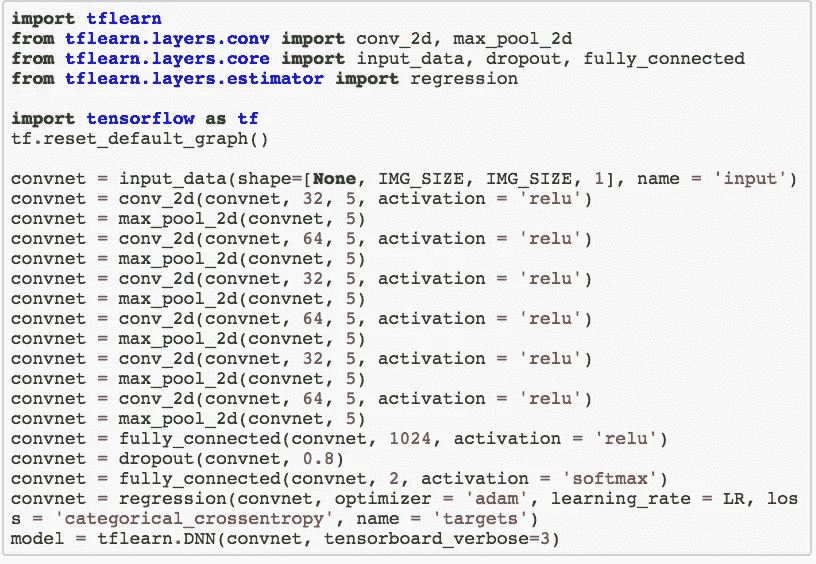

这是美国有线电视新闻网的代码，如果你想刷新自己的工作原理，我强烈推荐这个视频:

我仍在熟悉这些内核参数，如高度、宽度、步幅、填充等。所以我决定从 sentdex 导入这段代码，并将其视为一个黑盒示例。

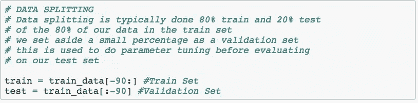

尽管有上面的评论，我最终决定使用 90%的训练数据来训练模型，因为我真的没有那么多数据来开始。当我们使用 model.fit 函数来评估模型运行情况时，这段代码用于留出一些数据进行验证。

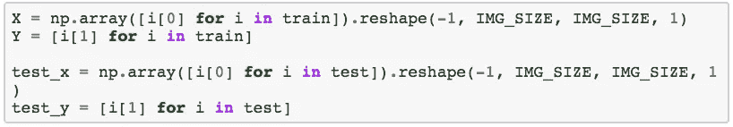

当我浏览 sentdex 的例子时，我不确定这段代码是否有必要，因为看起来我们已经在 create_train_set()函数中格式化了数据，尽管如此。

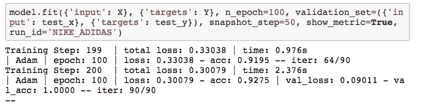

这是我们用来实际拟合模型的代码。我在加载 tensorboard 来可视化参数更新时仍然有些问题。然而，这个控制台输出仍然非常有趣，因为您可以试验您的模型参数，例如图像的大小、训练数据量、卷积层数、卷积核维数和历元数。根据这一评估，我们有大约 92–93%的准确率，我对此非常满意。

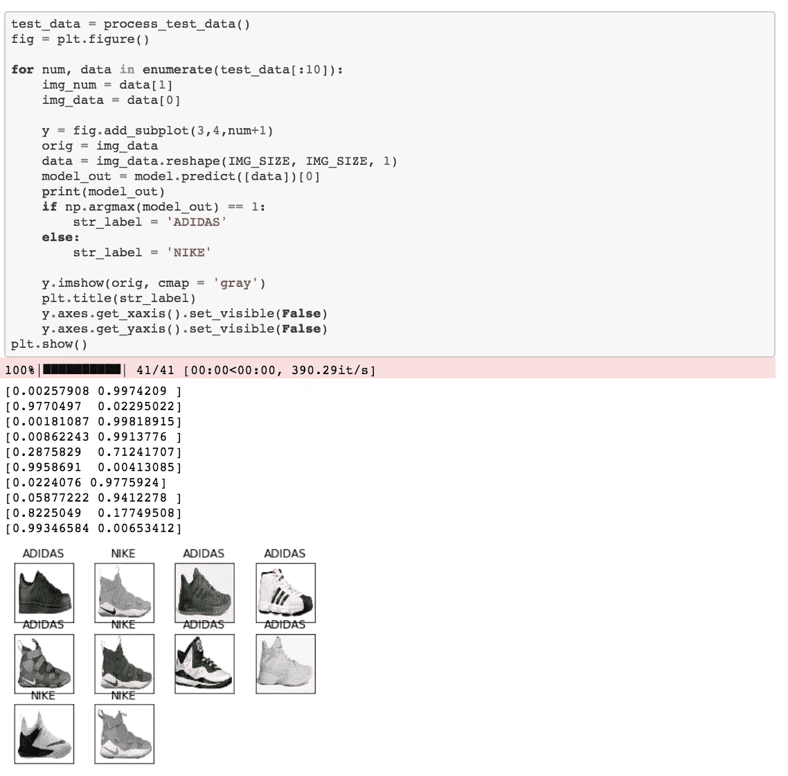

最后，我们使用这个代码块加载我们的测试数据，并了解模型的执行情况。正如我们在上面的例子中看到的，只有一只勒布朗鞋被误归类为阿迪达斯的。图像上方的概率列表显示了模型对每只鞋属于每个类别的置信度。例如，在第一张图片中，我们看到模型认为只有 0.2%的可能性是耐克鞋，而 99.7%的可能性是阿迪达斯鞋。

总之，当我第一次加载数据并运行模型时，我得到的结果非常糟糕。然而，一旦我开始调整卷积层数，调整图像大小，使用学习率值和历元数，我开始得到一个令人敬畏的结果。

如果您使用自己的数据集尝试 sentdex 的教程，如果一开始它似乎不起作用，请不要气馁。在放弃之前，尝试调整模型的超参数。此外，如果你想链接到本教程的视频演练，这里是:

感谢您的阅读，如果您自己做这件事有困难，请联系我们！

[https://github.com/CShorten/NIKE_vs_ADIDAS](https://github.com/CShorten/NIKE_vs_ADIDAS)

# [CShorten](https://medium.com/@connorshorten300)

Connor Shorten 是佛罗里达大西洋大学计算机科学专业的学生。对软件经济学、深度学习和软件工程感兴趣。

## 这是从哪里来的

这个故事发表在[值得关注的](http://blog.usejournal.com)杂志上，每天都有成千上万的人前来了解塑造我们喜爱的产品的人们的想法。

关注我们的出版物，查看更多由 [Journal](https://usejournal.com/?utm_source=usejournal.com&utm_medium=blog&utm_campaign=guest_post) 团队报道的产品和设计故事。