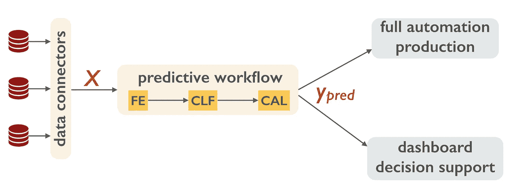

# 如何建立数据科学管道

> 原文：<https://towardsdatascience.com/how-to-build-a-data-science-pipeline-f24341848045?source=collection_archive---------1----------------------->

## 从 y 开始。专注于形式化预测问题，建立工作流程，并将其转化为生产，而不是优化您的预测模型。一旦前者做到了，后者就好办了。

如果你喜欢这个博客，看看这个关于同一话题的 [*播客*](http://podcast.machinelearningcafe.org/what-is-beyond-pocs-ml-project-hurdles-you-should-be-prepared-to-take-with-balzs-kgl-016) *。*

当一个运行良好的预测工作流最终投入生产时，它是如何工作的，这一点没有争议。数据源被转换成一组特征或指标 *X* ，描述预测将作用的每个实例(客户、设备、资产)。然后，预测器将 *X* 转化为可操作的信息 *y_pred* (客户端会流失吗？，设备会失效吗？，资产价格会涨吗？).在某些不稳定的市场中(例如，广告定位)，预测然后通过完全自动化的流程货币化，在其他情况下，它被用作决策支持，并有一个人在循环中。

The data flow in a data science pipeline in production.

这听起来很简单，但有效且盈利良好的预测工作流的例子很少。公司在建造过程中苦苦挣扎。他们需要问的问题是:

*   谁构建这个工作流？我需要涵盖哪些角色和专业知识？
*   构建过程是怎样的？步骤是什么，每一步我需要什么专业知识？
*   这些步骤的成本和风险是什么，我如何控制它们？

围绕数据挑战的炒作给人一种错误的印象，即数据科学家和预测分数是这一过程的主要驱动力。即使是自 90 年代以来就存在的工业流程(例如 [CRISP-DM](https://en.wikipedia.org/wiki/Cross_Industry_Standard_Process_for_Data_Mining) 和 [Dataiku](https://blog.dataiku.com/2016/03/30/automation-scenarios-another-step-towars-a-successful-model-deployment) )也通常将数据科学家放在中心位置，并在流程的最后进行部署。虽然他们没有错，但他们大多是不相关的。构建和优化预测器很容易。困难的是找到业务问题和它将改进的 KPI，搜寻数据并将其转换为可消化的实例，定义工作流的步骤，将其投入生产，并组织模型维护和定期更新。

公司通常从一个看似显而易见的事情开始:要求他们的 IT 部门建立大数据基础设施并构建一个数据湖。然后他们雇佣了第一批数据科学家。这些刚从学校毕业的专家和一些 Kaggle challenges，带着数据科学工具包，渴望将他们的手放在数据上。他们可以预测任何事情，他们做到了！他们与业务部门交谈，找到已经存在标签的合理预测目标，尝试十几个模型，对它们进行超测，并选择最佳的。他们建立 POC 并向业务部门发送报告。然后重新开始。

The usual way to construct a data science workflow.

大多数概念验证从未投入生产。业务部门不知道该拿他们怎么办。他们无法解读分数。这个预测目标似乎很合理，但是他们不知道如何用他们的 *y_pred* 赚钱。如果是这样的话，将 POC 投入生产似乎是不可逾越的。代码必须重写。实时数据必须被导入工作流程。需要满足操作约束。决策支持系统需要与用户的现有工作工具集成。模型维护、用户反馈、回滚需要到位。与数据科学家从事的安全 POC 相比，这些操作通常成本更高、风险更大，而且 POC 根本无法推动这一过程。

我下面描述的过程不会解决这些问题，但是它给你一个顺序，在这个顺序中你至少可以处理和控制成本和风险。首先，**不惜任何代价找到一位首席数据官**(或者更确切地说是一位*数据价值架构师*)，他已经将一个预测性的工作流程投入生产。你的 CDO 不需要知道最新的深度学习架构，但她应该对公司的业务和数据科学流程都有广泛的了解。她应该发挥核心作用，推动这一进程。

尽早让它上船是很重要的。您需要您的数据湖，但更重要的是，**您需要数据工程师从第一天起就考虑生产。但这并不是第一步。第一步是弄清楚**你是否需要一个预测**。**

> 所以，从 ***y*** 开始，预测目标。

你的 CDO 应该与业务部门密切合作，找出他们想知道的东西。是什么推动了他们的决策？对 *y* 的更好预测将如何提高底线(成本下降，利润上升，生产率上升)？一旦你有了你的 *y* ，试着**尽可能地将预测误差货币化**。没有什么比良好的货币化指标更能让你的(未来)数据科学家高兴的了。他们会知道，提高 2%的分数会让你成为百万富翁；更重要的是 ***你*将知道你可以在你的数据科学团队**上花费多少。

一旦你巩固了 y 和度量标准，

> 去寻找数据，

在你的数据湖和其他地方找到**指标**，这些指标**可能与你的预测目标**相关。原则上，您仍然不需要数据科学家来做这件事，这个过程应该由 CDO 和业务部门来推动(毕竟，*他们*知道他们使用什么信息来做决策，这通常是一个很好的基线)。但是，如果有人知道公开的和可购买的数据，这可能会有所帮助。在这里，您绝对需要**与 IT 部门交流，以便了解当这些指标需要实时收集时**的运营成本。数据科学家需要这些信息。如果在每个客户端上存储一个新功能每天要花费 4TB，那么这个事实就决定了预测器的外观。

*现在*雇佣一名数据科学家，最好是能开发生产质量软件的。让他

> 构建实验设置和基线工作流

用简单的预测来检验它是否能投入生产。此时，您已经为数据科学家知道如何处理的全面实验数据科学循环做好了准备。你可能需要一个深度学习专家，但很可能你可以外包和众包你的第一个模型，例如，通过与我们一起做 [RAMP](http://www.ramp.studio/) 。

## 如果你喜欢你读的东西，就在[中](https://medium.com/@balazskegl)、 [LinkedIn](https://www.linkedin.com/in/balazskegl/) 、&、 Twitter 上关注我吧。