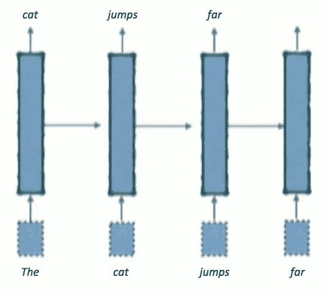
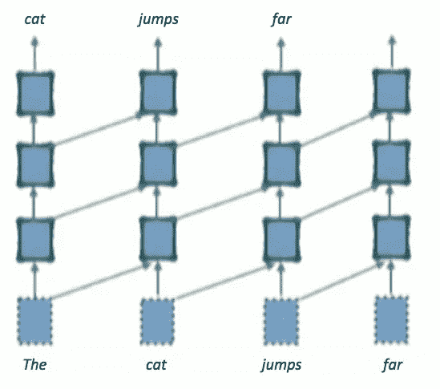
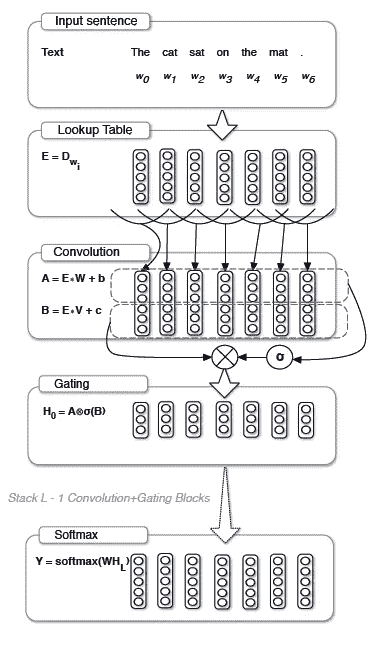
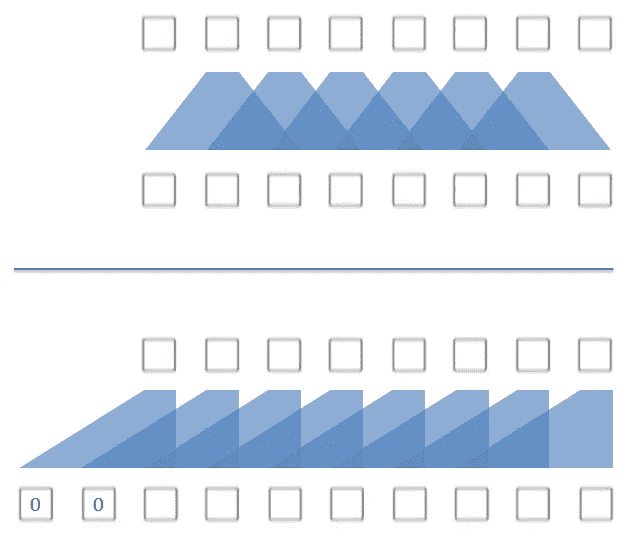
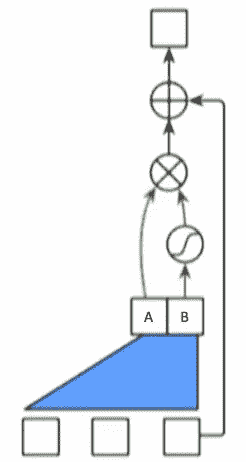
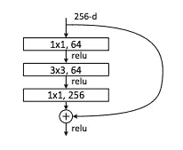
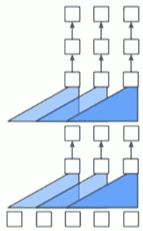
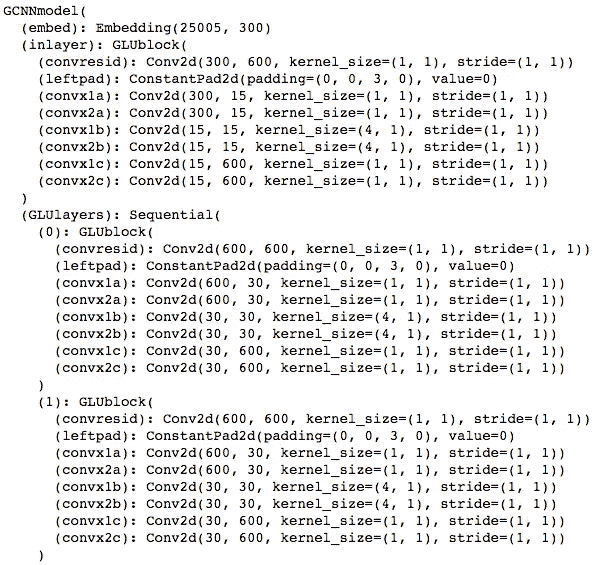
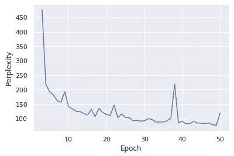

# 构建用于自然语言处理的卷积神经网络

> 原文：<https://towardsdatascience.com/how-to-build-a-gated-convolutional-neural-network-gcnn-for-natural-language-processing-nlp-5ba3ee730bfb?source=collection_archive---------2----------------------->

## 如何从零开始建立一个门控卷积神经网络(GCNN)，用 Pytorch 实现

具有 LSTM 或 GRU 单元的递归神经网络(RNNs)是 NLP 研究人员的首选工具，并在许多不同的 NLP 任务上提供最先进的结果，包括语言建模(LM)、神经机器翻译(NMT)、情感分析等。然而，RNNs 的一个主要缺点是众所周知的训练速度慢，所以过去几年的努力都集中在试图加快它们的速度上。有多种方法可以做到这一点，包括使用预训练模型的[，使用](https://thegradient.pub/nlp-imagenet/)[更快的 softmax](/speed-up-your-deep-learning-language-model-up-to-1000-with-the-adaptive-softmax-part-1-e7cc1f89fcc9) ，以及使用不同的架构，如卷积神经网络(CNN)，准递归神经网络([qrns](https://arxiv.org/abs/1611.01576)，或变压器架构。在这篇博文中，我将告诉你来自[脸书人工智能研究(FAIR)小组](https://research.fb.com/category/facebook-ai-research/)的最新研究，他们首次能够使用 CNN 获得语言建模任务的最先进结果。我将解释他们的方法，然后带您一步一步地完成我写的 Pytorch 实现。

RNNs are inherently sequential. Image from [https://vimeo.com/238222385](https://vimeo.com/238222385])

您可能知道，当给定一个单词序列作为输入时，语言建模包括预测序列中的下一个单词。rnn 较慢一个主要原因是输入字符串中的每个单词必须顺序处理:在句子“并行化很有趣”中，单词“并行化”和“是”必须在单词“有趣”之前处理。相比之下，CNN 中的所有元素都是同时处理的，这可以极大地加快处理速度。之前使用 CNN 进行语言建模的尝试明显不如 RNNs 的结果，但在最近一篇名为[“带门控卷积网络的语言建模”](https://arxiv.org/abs/1612.08083)的论文中，Dauphin 等人(2016)构建了一个卷积语言模型，其产生的结果与 RNNs 具有竞争力，并可以大幅降低计算成本。

CNNs can process information in parallel. Image from [https://vimeo.com/238222385](https://vimeo.com/238222385)

快速提醒一下信息如何通过 RNN 语言模型将会很有帮助。模型的输入是由大小为[ *seq_length，emb_sz* ]的单词嵌入 *X* 表示的单词序列，其中 *seq_length* 是序列长度， *emb_sz* 是你的嵌入的维度。在 *X* 通过多个 LSTM 层之后，最终层的输出是大小为[ *seq_length，c_out* ]的隐藏状态表示 *H* ，其中 *c_out* 是该最终层的维度。然后，softmax 步骤为序列中的每一步生成对整个词汇表的预测。

Dauphin 等人的 CNN 类似地将大小为[ *seq_length，emb_sz* ]的嵌入激活作为输入，但随后使用多层门控卷积来产生最终的隐藏状态输出 *H* (也是大小为[ *seq_length，c_out* )。每层包括 1)产生两个独立卷积输出的卷积块，以及 2)使用一个卷积输出来选通另一个卷积输出的选通块。

Figure 1 from Dauphin, et al. (2016), showing GCNN architecture.

卷积块对输入执行“因果卷积”(对于第一层，其大小为[ *seq_length，emb_sz* ])。正常卷积的窗口宽度为 *k* ，以当前时间步长为中心(因此包括来自未来和过去时间步长的输入)，而因果卷积的窗口仅与当前和先前时间步长重叠(见下图)。这可以通过简单地计算一个输入的正常卷积来实现，该输入已经用左边的 *k* -1 个元素进行了零填充。因果卷积是必要的，因为如果 CNN 能够从它试图预测的未来时间步长中“看到”信息，那就是欺骗。

TOP: Normal convolution. The convolutional window (width k=3) is centered on the current timestep. BOTTOM: Causal convolution. The input is zero-padded on the left with k-1=2 elements.

如上所述，卷积模块实际上会产生两个独立的卷积输出， *A* 和 *B* ，其中一个将通过逐元素乘法来选通另一个。第一卷积输出被计算为 *A* = *X*W+b* 。因为 *X* 是一个大小为[ *seq_length，emb_sz* ]的张量，所以在用零进行左填充之后，它的大小将为[ *seq_length+k-1，emb_sz* ]。w 是大小为[ *k，in_c，out_c* ]的卷积滤波器，其中 *in_c* 是输入通道数(这里等于第一层的 *emb_sz* )，而 *out_c* 是输出通道数。 *b* 是长度 *out_c* 的偏置向量。在应用卷积之后，输出 *A* 将是 size [ *seq_length，out_c* ]。最后，对 *B= X*V+c* …执行相同的步骤，即使用不同的卷积滤波器 *V* 和偏置向量 *c* 产生第二个输出 *B* 。

Gated Linear Unit (GLU), with residual skip connection. A convolutional block with window k=3 produces two convolutional outputs, A and B. A is element-wise multiplied with sigmoid(B), and the residual is added to the output. Image modified from [https://vimeo.com/238222385](https://vimeo.com/238222385)

卷积块的两个输出 *A* 和 *B* 然后被传递到门控块。在这一点上，提醒一下 CNN 在图像处理方面发生了什么是很有帮助的…卷积输出 A 可能会通过一个激活机制，如 ReLU:*、A . k . A .*【X * W+b】*。然而，对于 GCNN 的门控块，Dauphin 等人使用了一种他们称之为“门控线性单元”(GLU)的机制，这种机制涉及到将 *A* 乘以 *sigmoid(B* ):*

**甲* ⊗ *乙状窦**

*或者相当于，*

**(X*W+b)* ⊗ *乙状结肠(X*V+c)**

*这里， *B* 包含“门”,它控制着从 A 到下一层的信息传递。从概念上讲，门控机制很重要，因为它允许选择对预测下一个单词很重要的单词或特征，并提供了一种学习和传递相关信息的机制。类似于 ReLU，门控机制也为层提供非线性能力，同时在反向传播期间为梯度提供线性路径(从而减少消失梯度问题)。*

*Dauphin 等人还为每一层增加了一个残差 skip 连接(见上图)，类似于 [ResNet 架构](https://arxiv.org/abs/1512.03385)。剩余连接最小化了消失梯度问题，允许网络被[建得更深](https://www.coursera.org/learn/convolutional-neural-networks/lecture/XAKNO/why-resnets-work)(更多层)。该层的输入( *X* )在被卷积输出 *B.* 选通之后，被添加到卷积输出 *A**

**X + (A* ⊗ *乙状结肠(B) )**

*或者相当于，*

**X + ( (X*W+b)* ⊗ *乙状结肠(X*V+c) )**

**

*Bottleneck structure of a visual processing ResNet layer [Figure 5 from He, et al. (2016)]. A k=1 convolution reduces dimensionality from 256 to 64, then a k=3 convolution is performed in the lower dimensional space, then a k=1 convolution increases the dimensionality back to 256.*

*Dauphin 等人有时在层内使用瓶颈结构，也类似于 [ResNet 架构](https://arxiv.org/abs/1512.03385)。瓶颈结构的目的是通过首先降低数据的维度来降低卷积运算的计算成本。假设您想要对大小为[*seq _ length*= 70，*in _ c*= 600]的输入执行一次 *k* =4 卷积，输出通道有 600 个。这通常需要大小为[4，600，600]的卷积权重矩阵。相反，瓶颈层首先将数据的维度减少到例如[70，30]，然后在更低维度的空间中执行 *k* =4 卷积，然后最终将数据的维度增加回[70，600]。这种方法只需要[4，30，30]的卷积权重矩阵大小，这在计算上更有效。瓶颈通过使用 k=1 卷积来增加和减少维度(参见下面的 Pytorch 实现)。*

**

*Stacking multiple layers, and left-padding the output of each layer. Image from [https://vimeo.com/238222385](https://vimeo.com/238222385)*

*不管一个层中是否使用了瓶颈结构，GCNN 层都可以堆叠，确保在每一层都左填充前一层的输出。每个层的输入将是 size[*seq _ length+k-*1*，in_c* ]，每个层的输出将是 size [ *seq_length，out_c* ]。Dauphin 等人将这些层中的至少 5 层堆叠在一起，以产生最终的隐藏状态输出 h。然后，他们使用自适应 softmax 从语言模型的词汇表中的巨大单词列表中选择要选择的单词(查看我的[博客帖子](/speed-up-your-deep-learning-language-model-up-to-1000-with-the-adaptive-softmax-part-1-e7cc1f89fcc9)如何将耗时的 softmax 步骤加速高达 1000%)。*

# *Pytorch 实现*

*经过一番搜索，我没有找到一个可以工作的 Pytorch 实现，所以我决定从头构建一个。查看随附的 [Jupyter 笔记本](https://github.com/DavidWBressler/GCNN/blob/master/GCNN.ipynb)以便跟随。对于预处理，你将需要 [fastai](https://docs.fast.ai/) ，一个运行在 Pytorch 之上的深度学习库，它简化了神经网络的训练。【对于那些想学习最先进的深度学习技术的人，我强烈推荐杰瑞米·霍华德的 [fast.ai 课程](https://course.fast.ai/)，在线免费提供】。我决定使用 [Wikitext-2 数据集](https://einstein.ai/research/blog/the-wikitext-long-term-dependency-language-modeling-dataset)，这是一个相对较小的数据集，包含大约 200 万个标记和大约 3.3 万个词汇，是本文中使用的较大 Wikitext-103 数据集的子集。*

*如论文中所述，我将数据分成段落。为了有一个标准化的序列长度，我删除了少于 10 个单词或多于 300 个单词的段落。一旦数据被正确格式化为 csv 文件，fastai 就可以很容易地对其进行快速标记和数值化。我创建了定制的数据集、采样器和整理函数，它们可以将数据正确地格式化到数据加载器中。每个迷你批次随机采样序列长度大致相同的段落。我还下载了 [GloVe 预训练单词向量](https://nlp.stanford.edu/projects/glove/)，用于模型的单词嵌入。最后，我创建了一个处理训练的 modeler 类。在训练期间，梯度裁剪允许使用大的学习率(lr=1)，它与内斯特罗夫动量和权重归一化一起帮助训练快速收敛。*

**

*The first few layers of the architecture.*

*如上所述，迷你批次之间的序列长度不同，但在本文的其余部分，假设 seq_length 等于 70。在嵌入和调整大小之后，第一层的输入 x 是 size [ *bs=50，emb_sz=* 300 *，seq_length=* 70，1]，其中 *bs* 是批量大小， *emb_sz* 是嵌入维数。我使用一个卷积核大小为 4 的 *k* ，所以在用 *k* -1=3 个元素对输入进行左填充后，输入大小为[50，300，73，1]。*

*我在架构的每一层都使用了瓶颈结构。在第一层，(用 *self.inlayer = GLUblock(k，emb_sz，nh，downbot)* 调用)，我产生两个卷积输出， *x1* 和 *x2* 。为了产生 *x1* ，第一个 k=1 卷积将输入 *x* 的维数从[50，300，73，1]降低到[50，15，73，1]。然后，在这个低维空间中执行 *k* =4 卷积，以产生大小为[50，15，70，1]的输出。最后，一个 *k* =1 卷积将 *x1* 的维数增加到大小[50，600，70，1]。同样的三个步骤用于产生 *x2* ，然后通过一个 sigmoid 并用于通过逐元素乘法选通 *x1* ，以产生输出 *x* (大小也是[50，600，70，1])。通过使用 *k* =1 卷积，将*残差*(在块开始时设置为等于 *x* )从大小【50，300，70，1】转换为大小【50，600，70，1】，并添加到输出 *x* 。*

*接下来，我将数据 x 通过 4 个门控卷积层。每层都有一个大小为[50，600，70，1]的输入，并产生相同大小的输出。由于输入和输出的维数是相同的(即 *in_c==out_c* ，所以可以简单地复制*残差*并将其搁置，直到块结束。如上所述，输入被左填充为大小[50，600，73，1]，产生瓶颈卷积输出 *x1* 和 *x2* (大小均为[50，600，70，1])，并且在添加*残差*以产生该层的输出之前， *x1* 由 *sigmoid(x2)* 选通。经过 4 个卷积层后，最终输出通过自适应 softmax 产生模型预测。*

**

*Perplexity=76.6 on epoch 49.*

*我在 Wikitext-2 数据集上运行了这个网络 50 个时期，在第 49 个时期产生了 4.34 的最小损失(困惑=76.6)。这与 Dauphin 等人的结果相比相当不错，他们在更大的 Wikitext-103 数据集上实现了 37.2 的最终困惑度。通过增加模型容量(更多的层，每层更多的隐藏单元)，通过训练更长的时间，通过在瓶颈层中使用不太积极的维度减少，以及通过使用更大的数据集(例如 Wikitext-103)，我的模型的性能可能更接近于论文中发现的性能。*

* [## 用门控卷积网络进行语言建模

vimeo.com](https://vimeo.com/238222385) 

Dauphin 等人的结果与最先进的模型具有竞争力，要么接近匹配(Google 十亿字数据集)，要么超过(Wikitext-103)基于 LSTM 的模型的最佳发布结果。此外，他们的方法大大降低了计算成本。与配备完整 softmax 的 LSTM 模型相比，他们使用的[自适应 softmax](/speed-up-your-deep-learning-language-model-up-to-1000-with-the-adaptive-softmax-part-1-e7cc1f89fcc9) 将训练速度提高了约 500%,因此达到给定的困惑值所需的操作明显减少。由于卷积方法可在序列和序列内的标记上并行化，因此 GCNN 模型将处理单个句子的延迟降低了一个数量级*。

Dauphin 等人的论文是许多最近的出版物之一，这些出版物完全放弃了用于 NLP 任务的 rnn，而是依赖于纯粹的[注意力](https://arxiv.org/abs/1706.03762)或[卷积](https://arxiv.org/abs/1705.03122)结构。诸如准递归神经网络( [QRNN](https://arxiv.org/abs/1611.01576) )的其他方法部分地放弃了递归，并且将训练速度提高了一个数量级。看到这些新方法达到最先进的结果，同时大幅降低计算成本，真是令人兴奋！

*然而，作者指出，由于 cuDNN 的 GPU 加速功能针对 LSTM 进行了优化，而不是针对 GCNN 所需的卷积类型，因此处理文本语料库所需的总时间在 RNN 和 GCNN 方法之间仍然相似。对 cuDNN 卷积实现的改进可能会为 GCNN 带来更好的计算性能。

**参考文献:**

[布拉德伯里，詹姆斯，等。“准递归神经网络。”arXiv 预印本 arXiv:1611.01576 (2016)。](https://arxiv.org/abs/1611.01576)

[Dauphin，Yann .等人，《门控卷积网络的语言建模》arXiv 预印本 arXiv:1612.08083 (2016)。](https://arxiv.org/abs/1612.08083)

[盖林、乔纳斯等人《卷积序列到序列学习》arXiv 预印本 arXiv:1705.03122 (2017)。](https://arxiv.org/abs/1705.03122)

[何，，等.“深度残差学习在图像识别中的应用”IEEE 计算机视觉和模式识别会议录。2016.](https://arxiv.org/abs/1512.03385)

瓦斯瓦尼、阿希什等人，“你所需要的只是关注。”神经信息处理系统进展。2017.*