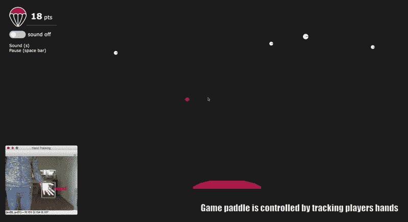
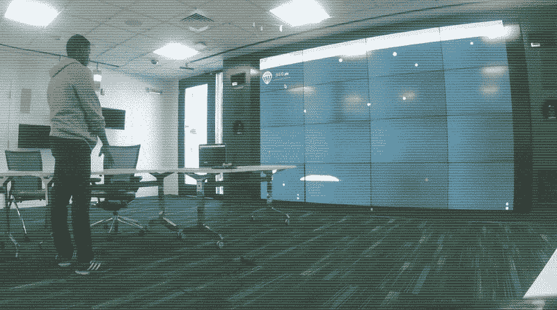
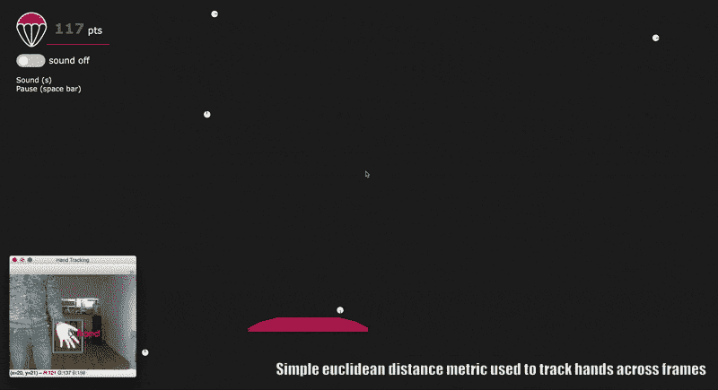
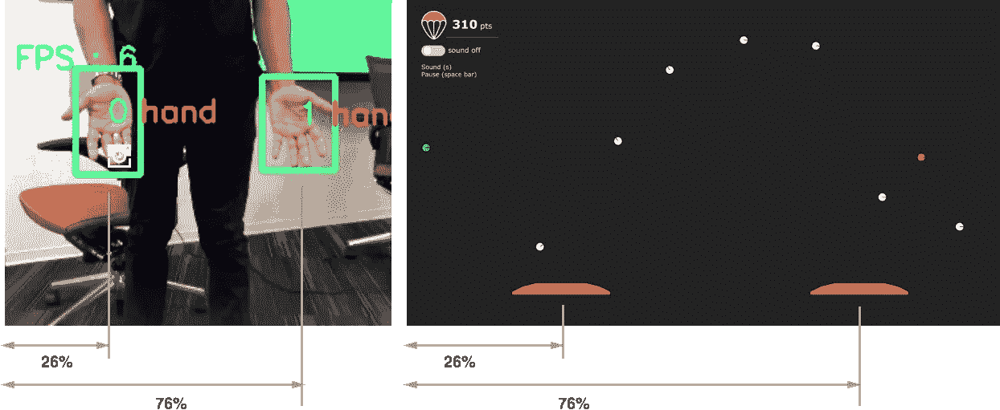
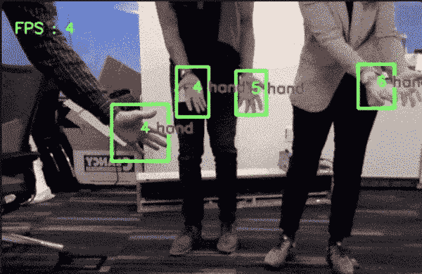

# 如何使用 Tensorflow 对象检测 Api 构建手势控制的网络游戏

> 原文：<https://towardsdatascience.com/how-to-build-a-gesture-controlled-web-based-game-using-tensorflow-object-detection-api-587fb7e0f907?source=collection_archive---------4----------------------->

通过在网络摄像头前挥动你的手来控制游戏手柄。

使用 [TensorFlow](https://medium.com/u/b1d410cb9700?source=post_page-----587fb7e0f907--------------------------------) 对象检测 api，我们已经看到了模型被训练来检测图像中的自定义对象的例子(例如，检测[手](/how-to-build-a-real-time-hand-detector-using-neural-networks-ssd-on-tensorflow-d6bac0e4b2ce)、[玩具](/building-a-toy-detector-with-tensorflow-object-detection-api-63c0fdf2ac95)、[浣熊](/how-to-train-your-own-object-detector-with-tensorflows-object-detector-api-bec72ecfe1d9)、 [mac n cheese](https://pythonprogramming.net/custom-objects-tracking-tensorflow-object-detection-api-tutorial/) )。自然，下一个有趣的步骤是探索如何在真实世界用例中部署这些模型——例如，*交互设计*。

在这篇文章中，我将介绍一个基本的*身体作为输入*交互示例，其中来自手部跟踪模型(作为输入的网络摄像头流)的实时结果被映射到基于网络的游戏(Skyfall)的控件上。该系统演示了如何集成一个相当精确的轻量级手部检测模型来跟踪玩家的手部，并实现实时的*身体作为输入*交互。

想试试吗？项目代码可在 [Github](https://github.com/victordibia/skyfall) 上获得。

 [## 维克托迪亚/天崩地裂

### skyfall -使用 Tensorflow 对象检测 Api 的手势控制网络游戏

github.com](https://github.com/victordibia/skyfall) 

# 始终可用(Body as)输入

使用人体部分作为输入的好处是*始终可用*，因为用户不需要携带任何辅助设备。重要的是，利用人体部分进行基于手势的交互已经被证明可以改善用户体验[2]和整体参与度[1]。虽然身体作为输入的想法并不是全新的，但利用计算机视觉、可穿戴设备和传感器(kinect、wii、[5])等的现有方法有时会遇到准确性挑战，不总是可移植的，并且与第三方软件集成也很困难。轻量级深度神经网络(DNNs)的进展，特别是对象检测(见[3])和关键点提取(见[4])的模型，有望解决这些问题，并进一步实现始终可用(身体作为)输入的目标。这些模型使我们能够使用 2D 图像以良好的精确度跟踪人体，并具有与一系列应用程序和设备(桌面、网络、移动设备)轻松集成的优势。虽然从 2D 图像中进行追踪并不能给我们提供太多的深度信息，但它在构建互动方面仍然有着惊人的价值，正如 Skyfall 游戏示例中所示。

Body as input on a large display. Results from a realtime object detection model (applied to webcam feed) are mapped to the controls of a game.

# 游戏机制

Skyfall 是一个简单的基于网络的游戏，使用 2D 的物理引擎 [planck.js](https://github.com/shakiba/planck.js) 创建。天崩地裂的玩法很简单。3 种类型的球从屏幕顶部随机落下——白色球(值 10 分)、绿色球(值 10 分)和红色球(值-10 分)。球员通过移动球拍抓住好球(白色和绿色球)并避开坏球(红色球)来得分。在下面的例子中，玩家可以通过移动鼠标或在移动设备上触摸(拖动)来控制球拍。

Try out a mouse controlled version of SkyFall: Catch good balls (white, green), avoid bad balls (red) by moving the mouse. Press space bar to pause game and key s to toggle sound. View on [Codepen](https://codepen.io/victordibia/full/aGpRZV/) here.

这是一个非常简单有趣的游戏。然而，我们可以让用户用他们的身体(手)来控制球拍，这样会更吸引人。目标是通过使用网络摄像头视频流检测手的位置来实现这一点——不需要额外的传感器或可穿戴设备。

# 添加基于手势的交互

为了增加手势交互，我们用一个将玩家手的运动映射到游戏手柄位置的系统来代替上面的鼠标控制。在当前的实现中，python 应用程序(app.py)使用 [TensorFlow](https://medium.com/u/b1d410cb9700?source=post_page-----587fb7e0f907--------------------------------) 对象检测 api 检测玩家的手，并通过 websockets 将手的坐标传输到游戏界面——一个使用 FLASK 服务的 web 应用程序。

## 手检测/跟踪

 [## 如何在 Tensorflow 上使用神经网络(SSD)构建实时手部检测器

### 这篇文章记录了使用 Tensorflow(对象检测 API)训练手部检测器的步骤和脚本。我在……

towardsdatascience.com](/how-to-build-a-real-time-hand-detector-using-neural-networks-ssd-on-tensorflow-d6bac0e4b2ce) 

在[之前的一篇文章](/how-to-build-a-real-time-hand-detector-using-neural-networks-ssd-on-tensorflow-d6bac0e4b2ce)中，我介绍了如何使用 Tensorflow 对象检测 api 构建一个实时手部检测器。请查看[的博文](/how-to-build-a-real-time-hand-detector-using-neural-networks-ssd-on-tensorflow-d6bac0e4b2ce)，了解更多关于手部跟踪模型是如何构建的。有关加载手模型的任何错误或问题，请参见手跟踪 [Github repo](https://github.com/victordibia/handtracking) 和[问题](https://github.com/victordibia/handtracking/issues?utf8=%E2%9C%93&q=)。本例采用了类似的方法，多线程 python 应用程序读取网络摄像头视频，并为检测到的每只手输出边界框。

注意，手检测是在逐帧的基础上完成的，并且系统不会跨帧自动跟踪手。然而，这种类型的帧间跟踪是有用的，因为它可以实现多用户交互，我们需要跨帧跟踪手(想象一群朋友挥舞着他们的手或其他一些共同的对象，每个人都控制着自己的球拍)。为此，当前的实现包括基于[朴素欧几里德距离的](https://github.com/victordibia/skyfall/blob/master/utils/object_id_utils.py)跟踪，其中在跨帧的相似位置看到的手被分配相同的 id。

一旦帧中的每只手都被检测到(并且分配了跟踪 id)，手的坐标就被发送到**网络套接字服务器**，该服务器将它发送到连接的客户端。

Additional hands, additional paddles … potential for some engaging multiplayer games with friends. A tracking id of 0 is assigned to one hand and 1 to the other. These are then mapped to the paddles on the game interface.

**游戏界面**

游戏接口连接到**网络套接字服务器**并监听手部检测数据。每个检测到的手用于生成一个球拍，并且手在视频帧中的坐标用于在游戏屏幕上相对定位球拍。

Realtime detected hand coordinates (center of bounding boxes) are mapped to paddle positions as controls.

## 后续步骤

当前的实现有一些限制——所以贡献，拉请求是最受欢迎的！

**手部检测器改进** 这需要收集额外的训练数据并利用数据增强策略来改进手部检测器。这很重要，因为整个交互(和用户体验)依赖于准确和鲁棒的手部跟踪(误报、漏报会导致糟糕的 UX)。

**帧间跟踪**

当前的实现使用简单的基于欧几里德的度量来跨帧跟踪手(当前帧中的手基于其与先前帧中的手的距离来识别)。如果有几只手重叠，事情会变得复杂——需要一种更鲁棒的跟踪算法。也许集成了 OpenCV 或其他来源的快速跟踪算法…

**Tensorflowjs 实现**
用一个 [TensorFlowjs](https://js.tensorflow.org/) 实现进行一些实验，它允许整个交互完全在浏览器中原型化！！！Tensorflowjs 带来了许多好处——易于部署(无需 python 或 Tensorflow 安装),无需 websocket 服务器和客户端，易于复制，更多潜在用户…

> **更新**..Tensorflow.js 浏览器实现如何可用。你可以在 [CodePen 上试试这里的](https://codepen.io/victordibia/full/aGpRZV)，完整源代码如下:

 [## victordibia/handtrack.js

### 一个用于直接在浏览器中原型化实时手部检测(边界框)的库。- victordibia/handtrack.js

github.com](https://github.com/victordibia/handtrack.js/) 

# 结论

## 一些相关的作品。

有一些现有的项目在设计交互时应用了机器学习模型。一个常见的例子是使用 LSTMs 自动完成文本并创建快速电子邮件回复(参见 Google 的[智能回复](http://www.kdd.org/kdd2016/papers/files/Paper_1069.pdf)论文)，以及最近的实验，其中图像分类模型被用作游戏控制(参见 Google Pair 的[可教机器](https://teachablemachine.withgoogle.com/)和其他 [Tensorflowjs](https://js.tensorflow.org/) 演示)。这项工作通过探索在创建交互中使用对象检测模型来建立这些趋势。

## 最后的想法

随着人工智能算法的不断成熟(准确性、速度)，有可能利用这些进步来建立更好的交互。这可以是为用户定制内容或预测其预期交互的生成界面、支持基于视觉的新型交互的模型、对话式 UI 等。在这些领域中，越来越重要的是研究这种交互的机制，严格测试这些交互，并创建设计模式，告知如何在交互设计中使用人工智能模型作为一等公民。

收到反馈、评论，想要合作吗？随时联系——Twitter， [linkedin](https://www.linkedin.com/in/dibiavictor) 。

注:Skyfall 的早期版本于 2018 年 1 月提交给英伟达杰特森挑战赛。

## 参考

[1]d . m . Shafer，c . p . Carbonara 和 Popova，L. 2011 年。作为基于运动的视频游戏享受的预测因素的空间存在和感知现实。*存在:遥操作者和虚拟环境***20**(6)591–619。

[2]m . Birk 和 r . l . mandrik，2013 年。控制你的游戏自我:游戏中控制者类型对快乐、动机和个性的影响。*关于计算系统中人的因素的 SIGCHI 会议记录—CHI ' 13*685–694。

[3]黄，j .，拉特霍德，v .，孙，c .，朱，m .，科拉迪卡拉，a .，法蒂，a .，菲舍尔，I .，沃伊纳，z .，宋，y .，s .，墨菲，K. 2017。现代卷积目标探测器的速度/精度权衡 *CVPR*

[4]曹，z .，西蒙，t .，魏，s-e，和谢赫，Y. 2016。使用局部相似场的实时多人 2D 姿态估计。

[5]c .哈里森、d .谭和 d .莫里斯，2010 年。Skinput:将身体作为输入表面。*第 28 届计算机系统中人的因素国际会议论文集—中国’10*453。