# 如何使用马尔可夫链和 Python 构建市场模拟器

> 原文：<https://towardsdatascience.com/how-to-build-a-market-simulator-using-markov-chains-and-python-7923256f8d29?source=collection_archive---------4----------------------->

## 建模客户行为，可视化 A/B 测试结果，预测用户指标…所有这些都使用一个简单的马尔可夫框架！

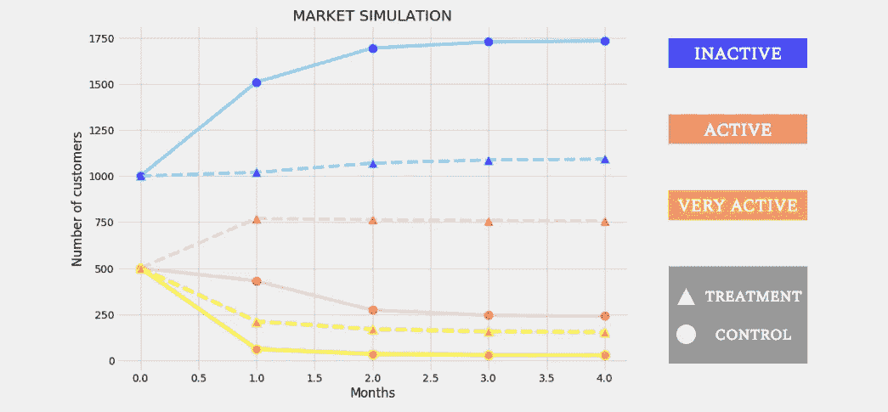

final product

在本文中，我的目标是向您介绍(不考虑您的技术能力)马尔可夫链，并使用它来模拟客户行为。

这不会是一个传统的每两行代码片段的“如何做”教程。我写这篇文章的主要目的是为您提供一个可以灵活使用的概念框架，这样您就不必为了学习新东西而编码了。技术细节会不时出现，但我会尽可能地为他们提供直觉。

# 数据处理

在这次分析中，我将使用我在一次数据马拉松中获得的 Credit Sesame 的分析数据。你可以使用任何你感兴趣的时间范围内的用户数据(例如一周/月/年的数据)。它应该遵循类似于下面的结构。

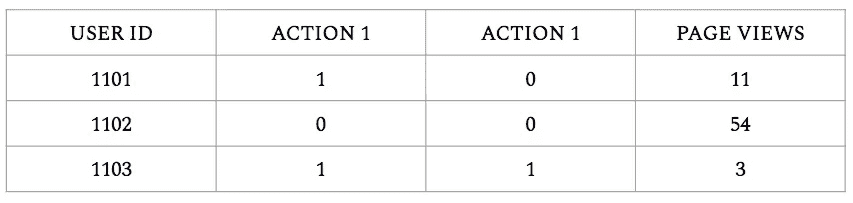

example data

动作的例子可以是“点击报价/广告”、“点击订阅”等。列也可以是其他指标，如页面浏览量或收入。包括任何你认为对你的建模计划有用的专栏——在我的例子中，就是用户参与。

# 客户细分

在您的数据集中选择一个特定的日期，并获取该特定日期的**的**新用户**数据。我正在模拟新用户在使用 Credit Sesame 网站 30 天内的行为。**

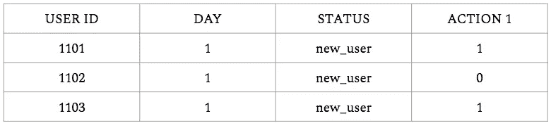

new user data on a particular day

接下来，我们将客户分为不同的类别或状态。有许多方法可以做到这一点。

1.  您可以应用一个**评分函数**:给每个用户一个分数，表示他们的整体参与度。您可以为您认为影响更高用户参与度的操作(如“会话长度”)赋予更高的权重。
    然后，您可以根据自己的经验将分布划分为 3 个部分(不活跃、活跃和非常活跃)。

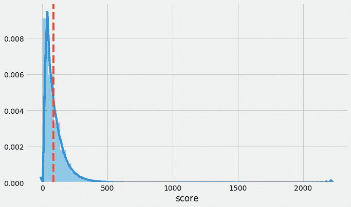

Distribution of applied score function

2.应用无监督的算法，比如 k-means:你可以使用聚类算法，比如 k-means，来对参与度相似的客户进行聚类。每个集群都有自己独特的属性，希望这些属性就是您想要建模的属性。您甚至可以将该算法应用于您之前计算的得分函数(单变量数据),使其更加简单。

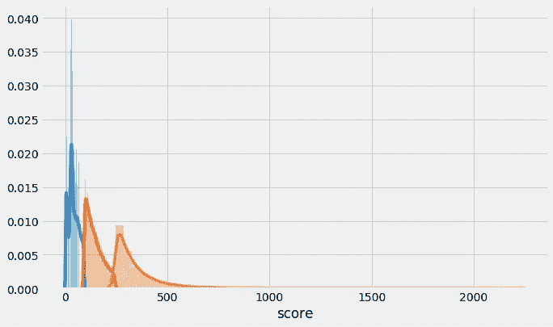

K-means segments visualized on the score function

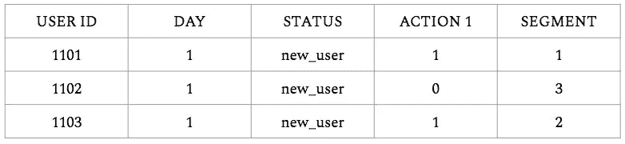

after segmentation on first-day data. 1 = inactive user, 2 = active user, 3 = very active user.

分割第一天的数据后，你选择一个时间框架。我选择了一个月，因为我相信 Credit Sesame 有很多回头客，一个月的数据可以捕捉到他们的数量。30 天后，用户将有机会在各个细分市场之间转换:非常活跃的用户可能会变得不活跃，中度活跃的用户可能会变得非常活跃，等等。

对此 30 天后的数据进行分段。确保您考虑了时间框架(例如，平均 30 天的参与度分数)。

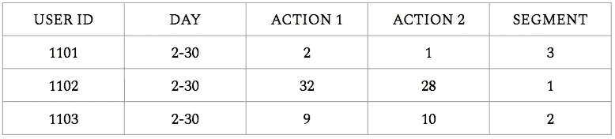

segmentation applied to 30-day data

让我们来看看结果:

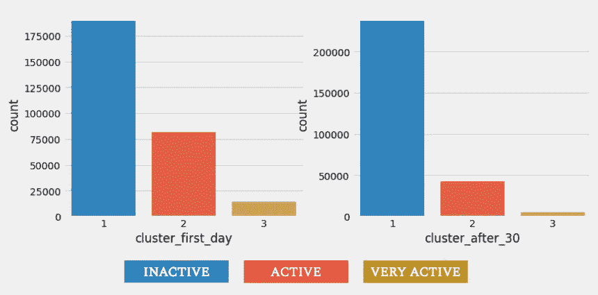

正如预期的那样，在 30 天内变得不活跃的用户数量上升，而保持活跃和非常活跃的用户数量下降。

应用马尔可夫框架

# 马尔可夫链基础

马尔可夫链是简单的数学系统，它使用一定的概率规则和固定的假设来模拟状态到状态的运动。

更简单地说，当您有一个具有固定状态(或段)的系统，并且代理/用户可以以一定的固定概率在这些状态之间移动时，您可以使用马尔可夫链对其进行建模。

但是让我们首先看看我们的系统是否满足马尔可夫模型的假设:

*   **假设 1:** 有一组有限的状态。在我们的系统中，只有 3 类客户可以进出。
*   **假设 2:** 状态间移动的概率是固定的。我承认，这是一个很强的假设。虽然我的系统确实考虑了成千上万的用户数据点，但很容易相信不同的 30 天时间框架的概率方差不应太大。但是，即使有大量的数据，正如我们将在本文后面看到的，我们也必须谨慎。
*   **假设三:**状态可达性。任何细分市场中的用户都可以移动到不同的细分市场，而不受任何外部限制。
*   **假设 4:** 非循环。在我们的系统中，片段到片段的移动决不是“自动的”,所以这个假设是成立的。

我们的系统对马尔可夫链的大多数假设表现良好。这给了我们对模型估计的一些信心，一旦我们建立了模型，我们就会得到这些。

# 构建马尔可夫链

马尔可夫链有三个部分，最好用矩阵向量乘法来表示。如果你对线性代数完全陌生，我建议你在阅读本文之前浏览一下这个[链接](https://mathinsight.org/matrix_vector_multiplication)。

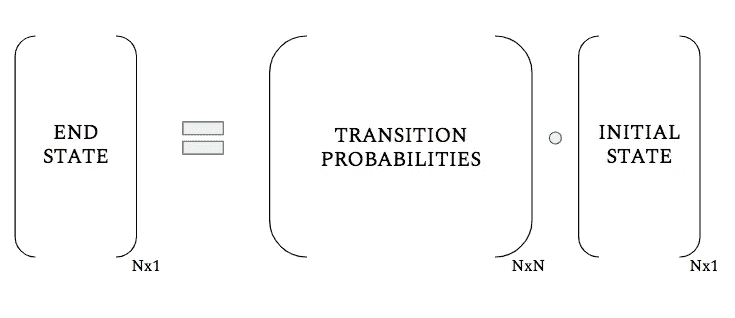

N represents the number of segments

我们系统中的初始状态是一个 3×1 向量，表示每个分段中的用户数量。结束状态也是一个 3x1 向量，显示第一个月之后每个细分市场中的用户数量(在我们将初始状态向量乘以概率矩阵之后)。转移概率矩阵是一个 3×3 的矩阵，代表了不同客户群之间的固定转移概率。

那么我们如何计算这些固定概率呢？

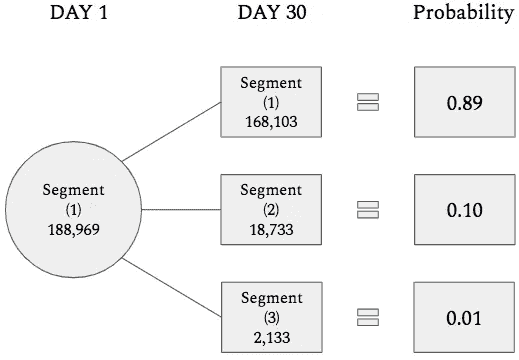

从我们记录的片段移动来看。我们观察第一天每个细分市场的用户在 30 天后如何移动到不同的细分市场，并相应地计算概率(相当于比例)。

0.89(图中)指的是第一天第一个细分市场中的某个人在 30 天后仍在同一细分市场中的概率，即不活跃用户在 30 天后仍不活跃的概率。请注意，每列中的概率总和必须为 1。我们对所有细分市场重复这一过程，并构建最终转换矩阵:

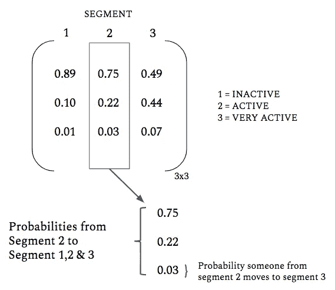

Deconstructing the transition matrix for a clearer understanding

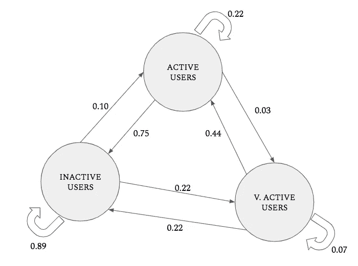

different way to visualize the transition matrix

最后，我们把它们组合成这个漂亮的形式:

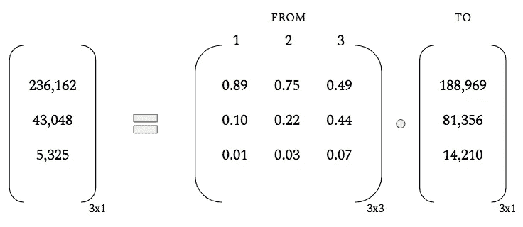

现在我们已经建模了，我们可以开始有趣的事情了。

# 绘图结果

给定马尔可夫链，让我们从绘制客户流动趋势开始。

```
a_val,b_val,c_val = [],[],[]# initial state
init_state = np.array([188969, 81356, 14210])# transition matrix
a = np.array([[ 0.89, 0.75 ,0.49], [ 0.10, 0.22 ,0.44], [ 0.01, 0.03 ,0.07]])for x in range(10):
    a_val.append(init_state[0])
    b_val.append(init_state[1])
    c_val.append(init_state[2])
    b = init_state
    init_state = a.dot(b)# plotting
plt.figure(figsize=(11,8))
plt.plot( [x for x in range(10)], a_val, marker='o', markerfacecolor='blue', markersize=12, color='skyblue', linewidth=4,label='Inactive users')
plt.plot( [x for x in range(10)], b_val, marker='o', markerfacecolor='red', markersize=12, color='pink', linewidth=4,label='Active users')
plt.plot( [x for x in range(10)], c_val, marker='o', markerfacecolor='orange', markersize=12, color='yellow', linewidth=4,label='Very active users')
plt.legend(loc='best')
plt.xlabel('Months')
plt.ylabel('Number of customers')
```

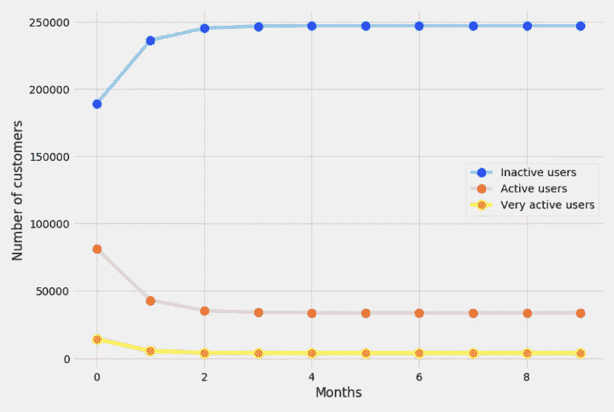

output

从中我们可以推断出什么？

我们看到，大约 2 个月后，所有三个细分市场都达到了平衡，也就是说，虽然有用户从一个细分市场转移到另一个细分市场，但每个细分市场的客户总数保持不变。

但是有一个条件。我们在这里做了一个非常强有力的假设——我们相信，无论我们预测用户行为的未来有多远，概率都将是固定的。这是非常不可信的。我举个例子:假设你拥有一个销售冬装的网站。在 12 月份购买了几件外套的活跃用户不太可能在 7 月份遵循同样的购物模式。模式可能是季节性的，而我们的马尔可夫模型没有捕捉到这一点！

那我们该怎么办？

我们可以为每个月计算不同的转换矩阵来捕捉这些趋势，也可以将我们的分析范围限制在一个月。由于我只有一个月的数据，我选择后者。如果您确实有更长时间的数据，我会鼓励您将真实数据结果与马尔可夫模型输出进行比较，看看转移概率是否在几个月内保持不变，并相应地进行调整。

我得到的结果如下所示:

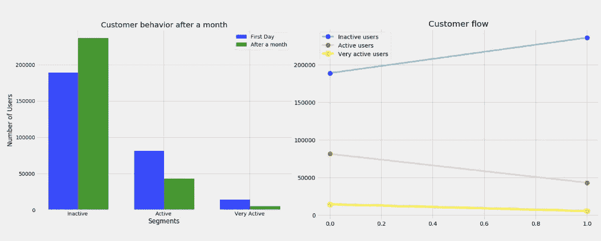

Single month analysis of customer flow

# 应用:

## A/B 测试

既然您已经有了一个描述客户行为的模型，我们如何引入“变化”或“干预”，并对它们的影响建模呢？我们的马尔可夫模型识别了两种类型的变化:

## **1。初始状态的改变**:

假设你拥有一家披萨店，你的网站在 12 月 1 日提供买二送一的优惠。你怀疑这种变化会带来更多的活跃用户访问你的网站。当你有 1000 个不同的新访客时，你的假设被证实了，其中有 300 人在同一天真的买了披萨(非常活跃的用户)。你又惊又喜，心想“嗯，我习惯了一天接到 100 个订单:一个月后会怎么样呢？”你只需要调整马尔可夫链的初始状态来解释这种变化。

```
# CHANGES TO INITIAL STATE - NUMBERS RECEIVED FROM MATRIX VECTOR PRODUCTbefore = (855,130,15) # Without any change
after = (509,389,102) # After placing deal# create plot
plt.figure(figsize=(11,8))
index = np.arange(3)
bar_width = 0.35
opacity = 0.8

rects1 = plt.bar(index, before, bar_width,
                 alpha=opacity,
                 color='b',
                 label='Without deal')

rects2 = plt.bar(index + bar_width, after, bar_width,
                 alpha=opacity,
                 color='g',
                 label='With deal')

plt.xlabel('Segments')
plt.ylabel('Number of Users')
plt.title('Customer behavior after a month')
plt.xticks(index + bar_width- 0.18, ('Inactive','Active','Very Active'))
plt.legend()

plt.tight_layout()
plt.show()
```

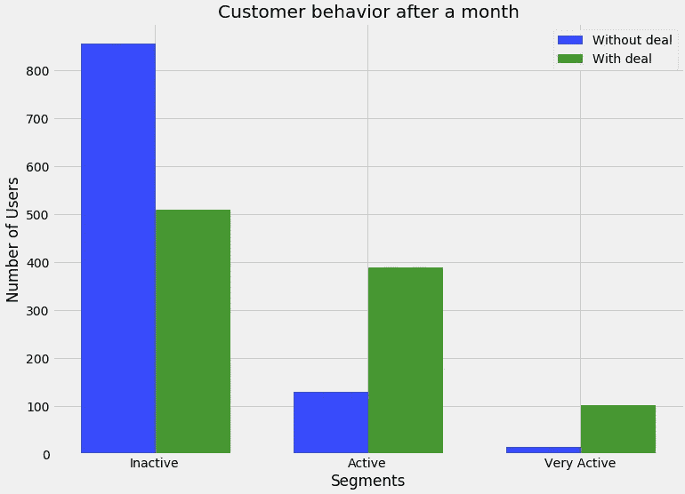

从初始状态由(不活跃=500，活跃=400，非常活跃=100)变为(100，600，300)，我们得到上面的结果。在月初有更多活跃和非常活跃的用户，你就增加了在这个月中拥有更多回头客的机会。

## 2.转移概率的变化:

你意识到这些交易很好，但它们只影响初始状态，这些交易的好处不会持续几个月，即它们是扩大参与用户的短期解决方案。为了有更持久的变化，我们必须引入改变概率的行动。假设你完全重新设计了你的披萨外卖网站，使结账速度提高了 10 倍。这是一种会持续影响每个细分市场**中用户数量的行动。**为了说明这种类型的变化，我们改变了转移矩阵中的概率。
你可以通过在用户子样本上对新网站进行 A/B 测试来计算改变的概率，或者，你可以使用你自己的试探法和假设来手动改变它们。

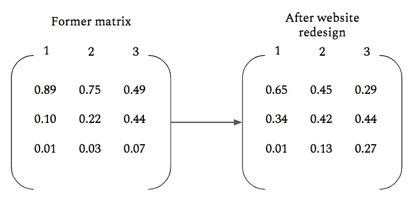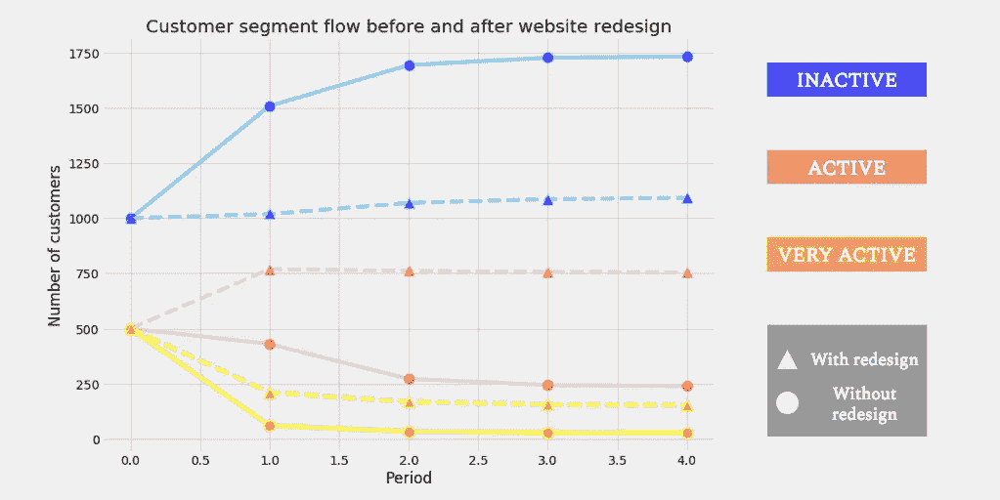

假设概率保持不变，我们可以看到客户流如何随着新的转移矩阵而变化。

## 预测其他指标

您可以预测其他几个用户指标，如客户终身价值、每用户收入等。使用我们上面描述的技术。例如，预测收入变化，计算每个细分市场的平均收入，计算输出状态，并将收入乘以各自细分市场中的用户数。

# 结论

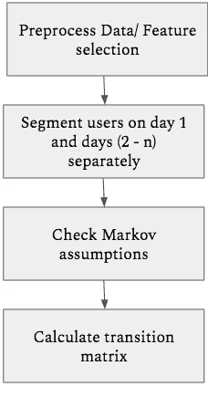

如果你已经走了这么远，我推荐你。至少，我希望我已经传达了马尔可夫链的美妙之处，以及尽管它们很简单却能提供关键见解的能力(假设关键假设得到满足)。我希望你找到自己的创造性的方法来应用这个模型！