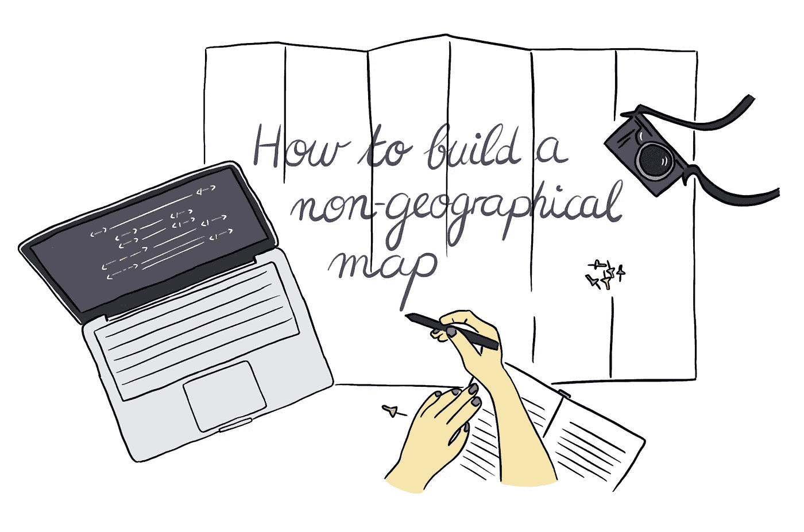
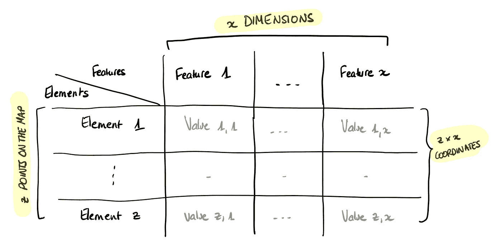
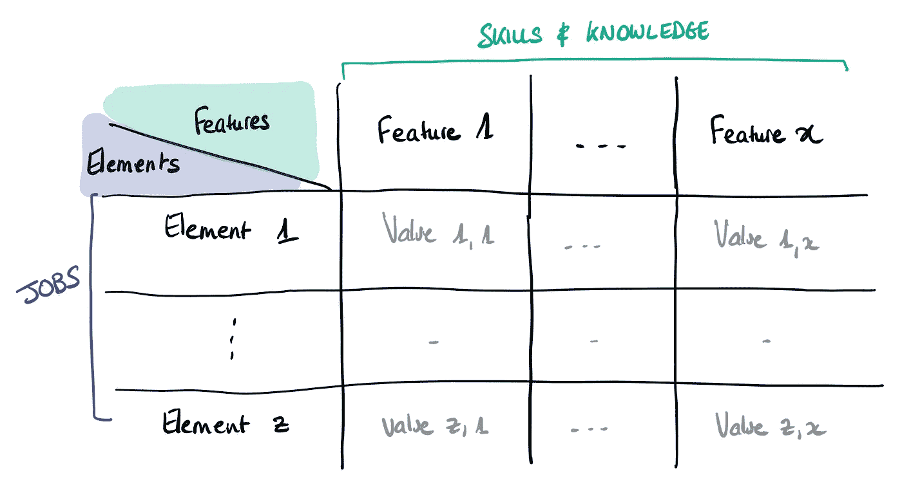
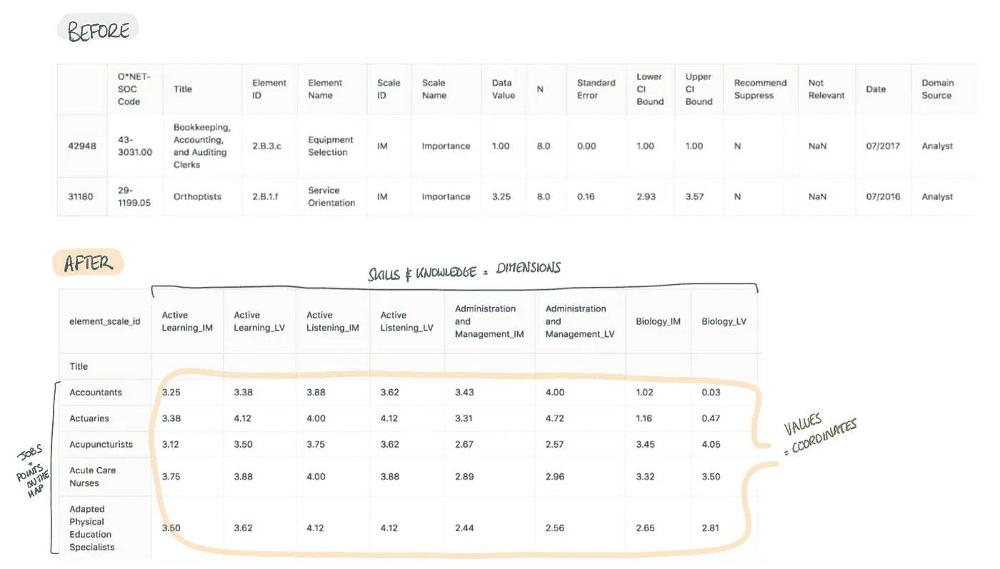
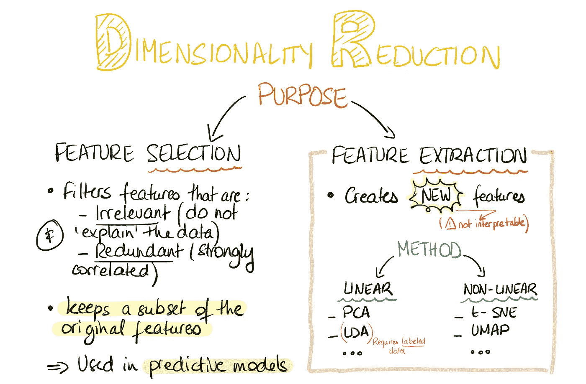
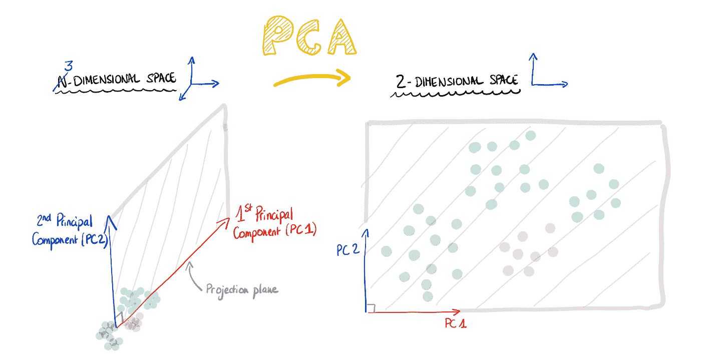
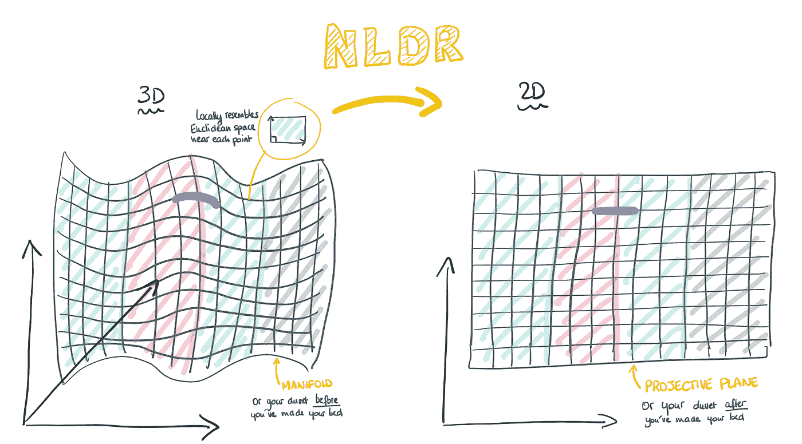

# 如何构建非地理地图#1

> 原文：<https://towardsdatascience.com/how-to-build-a-non-geographical-map-1-8d3373e83d6c?source=collection_archive---------7----------------------->

## 或者如何映射相似性以进行偶然的数据探索(使用 Python)



地图是数据可视化的强大设计对象。它们通常用于强调元素之间的空间关系和比较多个变量。在非地理数据的情况下，维度减少技术允许我们在二维空间中映射相似性，而不损害初始信息的丰富性。

*🔗链接到*[*#第二部分:如何将散点图变成交互式地图*](/how-to-build-a-non-geographical-map-2-340256ad9f16)

# #第 1 部分:降维和可视化

# ***第一步。设置特征和初始尺寸*和**


*In a geographical map, each element’s coordinates are inherently defined by its position. An element’s position is made of three parameters: latitude, longitude and elevation. To represent locations on Earth, the geographic coordinate system uses either a spherical coordinate system (globe) or a cartesian coordinate system (flat map). To transform the Earth’s three-dimensional space into a two-dimensional map, we use map projection techniques, the most common of which is the Mercator’s cylindrical projection.*

为了以类似地图的方式可视化您的非地理数据，您需要**将每个元素(或地图上的点)视为由一组特定的特征(或属性)定义的。**

这组要素在整个数据集中必须是**常量**。这意味着每个元素可以通过给相同的特征赋予不同的值来描述。



This is what your dataset should look like.

要确定哪些属性最能描述您的数据，您可以问自己:

***“是什么直观地让两个元素相似，又是什么把它们区分开来？”***

在地图上，越靠近的两个元素越相似。距离越远，差异越大。

## **示例-** 根据技能和知识相似性绘制职业图

在本例中，我想使用 [ONET 开放式数据库](https://www.onetcenter.org/database.html)，根据所需技能和知识的相似性来表示职位。

我非常幸运，因为这个数据集组织得非常好。所有的职业都由相同的一套技能(知识也是一样)来描述，并且每个职业都根据重要性(这项技能对完成工作有多重要)和级别(工作所需的专业知识水平)来细分。“数据值”栏指定各自的等级。


[ONET skills.xlsx](https://www.onetcenter.org/dictionary/23.0/excel/skills.html)

我将每个技能和知识项目定义为一个单独的特性:



This is what my dataset should look like after cleaning

由于原始数据集的质量，这一部分相当容易:



📝>> Check out the full notebooks [here](https://github.com/fannykassapian/python_dimensionality_reduction)

我现在只剩下一个矩阵，它的行向量是工作(n=640)，列是技能和知识参数(p=134)。

在机器学习中，“维度”只是指数据集中的特征(或属性，或变量)的数量。

***由于每个元素都是用 134 个参数来描述的，所以我们需要一个 134 维的空间来完整的表示它……很难描绘，不是吗？***

让我们看看如何因式分解这个矩阵，以便将其表示为一个二维空间。

# 第二步。降低维度

> 我们想要创建一个较低维度的表示，在这里我们保留一些来自较高维度空间的结构。

本能地，我们希望在原始空间中彼此靠近的点在 2D 中彼此靠近。这同样适用于远点。

手工完成这项任务是不可能的。所以我四处寻找降维算法。

## 没有免费的午餐

在我们讨论它们之前，请注意**没有一种算法适合所有问题。这个简单(但经常被遗忘)的事实被幽默地称为**“没有免费的午餐”定理**。每个模型都依赖于一些假设来简化现实。但是在某些情况下，这些假设会失效。因此，它们产生了不准确的现实版本。**

因此，您必须根据数据的约束和问题的性质选择一些合适的算法。然后，尝试一下，看看哪一个最适合你。



Dimensionality reduction — Purpose & method (far from exhaustive)

例如，在我的项目中，我使用降维的唯一目的是数据可视化，而不是作为应用模式识别算法之前的预备步骤。另外，我想制作一张地图。因此，我对作为相似性代理的点之间距离的准确性感兴趣，但我并不真正关心新轴集的可解释性。

这就引出了**特征提取算法**。

## ***a .线性变换***

*   ***主成分分析***

一种众所周知且常用的线性变换算法是主成分分析(PCA)。

在上面的矩阵中，每项工作由 134 个维度描述。很可能在某种程度上，列是线性相关的。当两列完全相关时，我只需要一列来描述另一列。为了在删除维度时降低新表示的不准确性，我最好保留描述数据集中大多数变化的维度。换句话说，去掉不必要的、嘈杂的维度，只保留最有信息量的维度。但是，降低 132 个维度已经很多了。

PCA 不是识别差异最大的维度，而是识别差异最大的**方向**，即数据最分散的地方。

这些方向被称为**主成分**(或特征向量)，由初始维度的“组合”组成。因此，它们比任何单独的维度提供的信息都多，但与初始维度不同，它们不能被标上特定的特征(因此很难解释)。

PCA 找到一个由一对具有最大方差的**正交(不相关)主分量构成的**新坐标系**，并为数据集中的每个点分配新值以相应地定位它们。**



Illustration of what PCA does

本质上， **PCA 保留了数据**的全局结构，因为它以一种“一刀切”的方式找到了将为整个数据集产生最高方差的坐标系。它不考虑点相对于彼此的初始位置。相反，考虑到维数减少，它关注于尽可能地传播数据。

如果你很难想象我刚才解释的内容，看一看[这个可怕的 PCA 互动可视化](http://setosa.io/ev/principal-component-analysis/)。

好吧，我们来试试:

**1/用 PCA 创建一组“新”特征**

首先，您需要从 [scikit-learn](http://scikit-learn.org/stable/) 库中导入 PCA。

```
from sklearn.decomposition import PCA
```

然后，设置`n_components`。如果你想建立一个二维坐标系统，你设置它，使 PCA 找到 2 个主成分。

```
pca = PCA(n_components=2)
```

使用`fit_transform`将模型与您的数据框架(X)相匹配，并应用维度缩减。

```
pc = pca.fit_transform(X)
```

PCA 分别沿着第一和第二主分量建立 640 对坐标的阵列。

**2/用 Plotly 可视化**

一旦你导入了 plotly…

```
from plotly.offline import download_plotlyjs, init_notebook_mode, plot, iplotinit_notebook_mode(connected=True)import plotly.graph_objs as go
```

…使用每对坐标的第一个和第二个元素分别作为 x 和 y，绘制散点图:

```
data = [go.Scatter(x=pc[:,0], y=pc[:,1], mode=’markers’)]
```

我的数据没有标记，所以检查其表示是否准确的唯一方法是将鼠标悬停在点上，并检查它们的邻居是否“有意义”。

>> [See notebook (Github)](https://github.com/fannykassapian/python_dimensionality_reduction/blob/master/PCA.ipynb) >> [See graph (Plotly)](https://plot.ly/~fanny_kassapian/3/#/)

如您所见，数据分布得很好，但似乎有很多“异常值”。请注意，我对该算法是否适用于该数据集的判断是高度主观的，取决于我自己对最终可视化的预期。

对于这个项目，我对保存数据的本地结构非常感兴趣。我希望数据集中相邻的聚类在降维后仍然是相邻的。但如上所述，这不是 PCA 的最佳资产。

## *b .非线性变换*

非线性降维(NLDR)方法假设在高维空间中，**数据具有一些位于嵌入式非线性流形上的底层低维结构。**

我不是数学家，拓扑学是个相当复杂的领域，我就试着打个比方解释一下。

**流形在每个点附近类似欧几里得空间。欧几里得空间是你在几何学中学习的最早的定理，如泰勒斯定理，适用的空间。二维流形包括曲面(它们类似于每个点附近的欧几里得平面)。**

NLDR 假设，**如果嵌入流形是二维的**(即使数据是三维或多维的)**，那么数据也可以在二维空间上表示。**

一个很好的方法是在你铺床之前看看你的羽绒被。想象你度过了一个糟糕的夜晚，你的床很乱。如果你要描述羽绒被上的每一点，你需要三个维度。但是羽绒被就像每个点附近的欧几里得平面。所以，可以展平成平面(二维)。



Illustration of non-linear dimensionality reduction, from 3D to 2D

**非线性算法擅长保持数据的局部结构**，因为它们适应底层数据，对流形的不同区域执行不同的变换。

*   ***T-分布随机邻居嵌入(t-SNE)***

TSNE 是最近流行的基于局部距离测量的非线性可视化方法，因此**保留了近邻**。然而，**它不一定保留全局结构**。这意味着它并不总是捕捉集群之间的距离。在我的项目中，这可能是一个问题。

如果你想更好地理解 t-SNE 是如何工作的:[这篇文章解释了如何正确阅读 t-SNE 的结果](https://distill.pub/2016/misread-tsne/)。

**1/创建嵌入**

就像对 PCA 所做的那样，从 scikit-learn 库中导入 SNE，将`n_components`设置为 2，并用`fit_transform`创建嵌入:

```
from sklearn.manifold import TSNEtsne = TSNE(n_components=2)embedding = tsne.fit_transform(X)
```

2/看看结果:

>> [See notebook (Github)](https://github.com/fannykassapian/python_dimensionality_reduction/blob/master/tSNE.ipynb) >> [See graph (Plotly)](https://plot.ly/~fanny_kassapian/5/)

看起来已经很不错了。让我们试试最后一种方法。

*   ***【均匀流形逼近与投影】(UMAP)***

新来的 UMAP 试图在保持本地和全球距离之间取得平衡，这正是我所需要的。

UMAP 是相当容易使用的，有几个参数你可以调整(默认是相当好的):

*   `n_neighbors`:当试图学习数据的流形结构时，限制局部邻域的大小
*   `n_components`:表示目标空间的维数
*   `min_dist`:设置低维表示中点之间的最小距离
*   `metric`:控制如何在输入数据的环境空间(特征空间)中计算距离

更多细节，你可以在这里找到文档[(链接到 UMAP)](https://umap-learn.readthedocs.io/en/latest/) 。

**1/创建嵌入**

一旦导入了 UMAP，就可以创建嵌入并使用`UMAP` 和`fit_transform` 函数来创建最终的坐标数组(完整的笔记本[在这里](https://github.com/fannykassapian/python_dimensionality_reduction/blob/master/UMAP.ipynb)):

```
import umapembedding = umap.UMAP(n_neighbors=15, n_components=2, min_dist=0.3, metric=’correlation’).fit_transform(X.values)
```

**2/可视化**

分数的分配对我来说似乎很合理。集群在逻辑上相对于彼此定位:

>> [See notebook (Github)](https://github.com/fannykassapian/python_dimensionality_reduction/blob/master/UMAP.ipynb) >> [See graph (Plotly)](https://plot.ly/~fanny_kassapian/1/)

# 包裹

## 谢谢你看完😃

到目前为止，我们已经构建了一个散点图，其坐标系本身并没有任何明显的意义，而是使用距离作为数据要素之间相似性的代理。可视化是非常基本的，但它展示了地图的前提。

接下来，我们将看到[如何给它一个在外观和使用上都类似于地图的格式(链接到#第 2 部分)](/how-to-build-a-non-geographical-map-2-340256ad9f16)。

与此同时，请随意分享您鼓舞人心的非地理地图和其他维度缩减方法。

## 🔗链接到[#第 2 部分:如何将散点图变成交互式地图](/how-to-build-a-non-geographical-map-2-340256ad9f16)

## 👉看看我是如何在实践中使用它的:[www.tailoredpath.com](http://www.tailoredpath.com)

## 📫让我知道你的想法:[tailoredpath@gmail.com](mailto:tailoredpath@gmail.com)