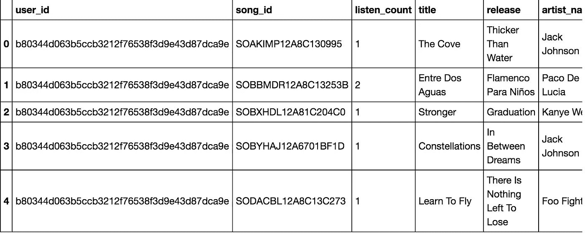
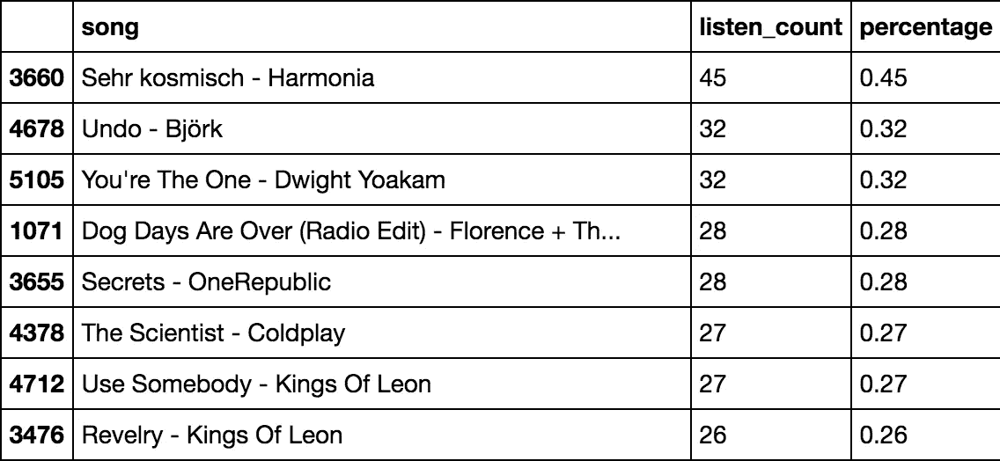
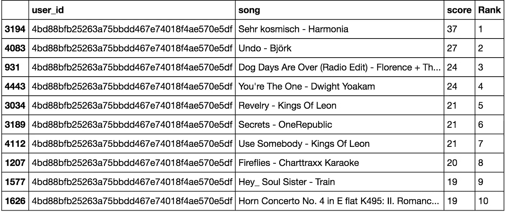
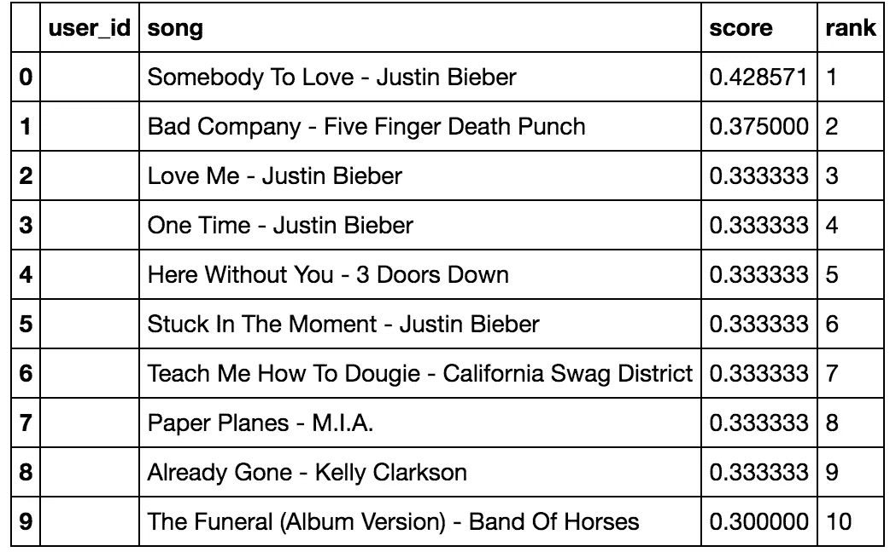
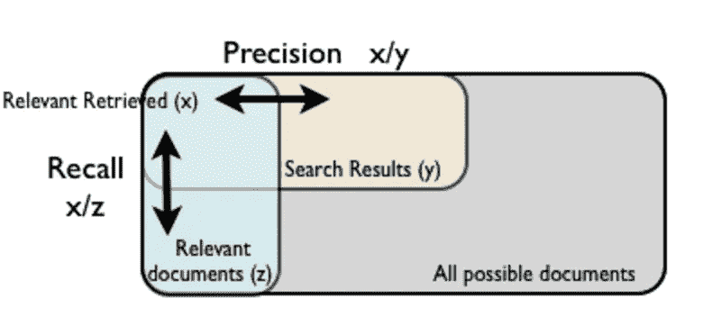

# 如何建立一个简单的歌曲推荐系统

> 原文：<https://towardsdatascience.com/how-to-build-a-simple-song-recommender-296fcbc8c85?source=collection_archive---------0----------------------->


这篇博客的灵感来自 Siraj Raval 在 Udacity 的[深度学习基金会纳米学位](https://www.udacity.com/course/deep-learning-nanodegree-foundation--nd101)。那么回购这种做法可以在[这里](https://github.com/llSourcell/recommender_live)找到。

建立推荐系统是亚马逊、网飞、Spotify 和谷歌面临的共同任务。推荐系统的基本目标是为我们的观众个性化内容和识别相关数据。这些内容可以是文章、电影、游戏等

有 3 种类型的推荐系统:基于内容的、协作的和流行的。

在本练习中，我们将学习如何使用真实数据构建音乐推荐系统。我们的[百万首歌曲数据集](http://labrosa.ee.columbia.edu/millionsong)包含两个文件:[三元组 _ 文件](https://static.turi.com/datasets/millionsong/10000.txt)和[元数据 _ 文件](https://static.turi.com/datasets/millionsong/song_data.csv)。三元组文件包含用户 id、歌曲 id 和收听时间。元数据文件包含歌曲 id、标题、发行人和艺术家姓名。百万歌曲数据集是来自不同网站的歌曲的混合，用户在听完歌曲后给出评级。例如 [Last.fm](http://labrosa.ee.columbia.edu/millionsong/lastfm) 、 [thisismyjam](https://labrosa.ee.columbia.edu/millionsong/thisismyjam) 、 [musixmatch](http://labrosa.ee.columbia.edu/millionsong/musixmatch) 等

我们的第一项工作是整合我们的数据集，这在每次我们想要构建数据处理管道时都非常重要。为了集成三元组文件和元数据文件，我们将使用一个流行的 Python 库，名为 [pandas](http://pandas.pydata.org/)

我们首先定义将要使用的两个文件:

```
triplets_file = 'https://static.turi.com/datasets/millionsong/10000.txt'songs_metadata_file = 'https://static.turi.com/datasets/millionsong/song_data.csv'
```

然后，我们使用 pandas 读取三元组文件表，并将这 3 列定义为 user_id、song_id 和 listen_count ( `df` 在这里表示数据帧)

```
song_df_1 = pandas.read_table(triplets_file,header=**None**)
song_df_1.columns = ['user_id', 'song_id', 'listen_count']
```

我们还读取了 metadat_file，并打算将 metadat _ file 与 triplets_file 合并。每当组合两个或更多数据集时，都会有重复的列。这里，我们使用 song_id 删除两个数据集之间的重复项

```
 song_df_2 =  pandas.read_csv(songs_metadata_file)

song_df = pandas.merge(song_df_1, song_df_2.drop_duplicates(['song_id']), on="song_id", how="left")
```

使用命令`song_df.head()`允许我们可视化组合数据集:



这里有歌曲索引、用户标识、歌曲标识、收听次数、标题、发行版本和艺术家名称。运行`len(song_df)`返回这个数据集按歌曲索引的总长度是 2，000，000。

本练习的第二步是数据转换，我们将选择该数据的一个子集(前 10，000 首歌曲)。然后，我们将歌曲和 artist_name 合并到一个列中，按照特定歌曲被所有用户收听的次数进行汇总。下面代码中的第一行按照 listen_count 的升序对 song_df 进行分组。第二行通过对每首歌曲的 listen_count 求和来计算 group_sum。第三行添加了一个名为`percentage`的新列，通过将 listen_count 除以所有歌曲的 listen_count 之和然后乘以 100 来计算这个百分比。最后一行按给定歌曲流行度的升序列出歌曲

```
song_grouped = song_df.groupby(['song']).agg({'listen_count': 'count'}).reset_index()
grouped_sum = song_grouped['listen_count'].sum()
song_grouped['percentage']  = song_grouped['listen_count'].div(grouped_sum)*100
song_grouped.sort_values(['listen_count', 'song'], ascending = [0,1])
```

以下是转换步骤后数据集的示例:



进行数据转换使我们能够进一步简化数据集，并使其易于理解。

下一步，在构建推荐系统时，我们将遵循一种简单的方法。我们将统计数据子集中独立用户和歌曲的数量

```
users = song_df['user_id'].unique()
len(users) ## return 365 unique userssongs = song_df['song'].unique()
len(songs) ## return 5151 unique songs
```

然后，我们通过将数据集分成训练和测试数据来创建歌曲推荐器。我们使用`scikit-learn`库的`train_test_split`功能。值得注意的是，每当我们构建机器学习系统时，在训练我们的模型之前，我们总是希望将我们的数据分成训练和测试数据集

```
train_data, test_data = train_test_split(song_df, test_size = 0.20, random_state=0)
```

我们任意选择 20%作为我们的测试规模。然后，我们使用基于流行度的[推荐器类](https://github.com/dvysardana/RecommenderSystems_PyData_2016/blob/master/Recommenders.py)作为黑盒来训练我们的模型。我们创建了一个基于流行度的推荐类的实例，并用我们的训练数据来填充它。下面的代码实现了以下目标:基于每首歌曲的流行度，创建一个推荐器，它接受一个`user_id`作为输入，并输出该用户的推荐歌曲列表

```
pm = Recommenders.popularity_recommender_py()
pm.create(train_data, 'user_id', 'song')#user the popularity model to make some prediction
user_id = users[5]
pm.recommend(user_id)
```



推荐系统模型的代码如下。这个系统是一个幼稚的方法，没有个性化。它首先获得每首歌曲的 user_id 的唯一计数(即该歌曲通常被所有用户收听的次数),并将其标记为推荐分数。然后，`recommend`函数接受一个 user_id，并为任何给定用户输出前十首推荐歌曲。因为这是幼稚的方法，所以推荐不是个性化的，对所有用户都是一样的。

```
#Class for Popularity based Recommender System modelclass popularity_recommender_py():    
    def __init__(self):        
    self.train_data = None        
    self.user_id = None        
    self.item_id = None        
    self.popularity_recommendations = None                #Create the popularity based recommender system model    
    def create(self, train_data, user_id, item_id): 
        self.train_data = train_data
        self.user_id = user_id        
        self.item_id = item_id         

        #Get a count of user_ids for each unique song as   recommendation score
        train_data_grouped = train_data.groupby([self.item_id]).agg({self.user_id: 'count'}).reset_index()        
        train_data_grouped.rename(columns = {'user_id': 'score'},inplace=True)                    #Sort the songs based upon recommendation score
        train_data_sort = train_data_grouped.sort_values(['score', self.item_id], ascending = [0,1])                    #Generate a recommendation rank based upon score
        train_data_sort['Rank'] = train_data_sort['score'].rank(ascending=0, method='first') #Get the top 10 recommendations
        self.popularity_recommendations = train_data_sort.head(10)        #Use the popularity based recommender system model to    
        #make recommendations        def recommend(self, user_id):                    user_recommendations = self.popularity_recommendations                         #Add user_id column for which the recommendations are being generated                user_recommendations['user_id'] = user_id                    #Bring user_id column to the front        
        cols = user_recommendations.columns.tolist()        
        cols = cols[-1:] + cols[:-1]        
        user_recommendations = user_recommendations[cols]
        return user_recommendations
```

本练习的第二部分是通过利用基于*项* *相似性的协同过滤模型来创建一个 ML 个性化歌曲推荐系统。*回想一下，推荐系统分为两种类型:*基于内容的*和*基于协作的*。基于内容的系统根据用户过去喜欢什么来预测用户喜欢什么。基于协作的系统基于其他相似用户的喜好来预测特定用户的喜好。像网飞和 Hulu 这样的大多数公司都使用混合方法，根据用户过去喜欢的内容以及其他类似用户喜欢的内容来提供推荐。

根据剑桥编码学院的 Agnes jóhannsdóttir(Twitter:[@ agnesjohanns](https://twitter.com/agnesjohanns))的说法，基于记忆的协同过滤可以分为两种主要方法:用户-项目过滤和项目-项目过滤。

项目-项目过滤方法包括基于用户喜欢的歌曲定义[一个共现矩阵](https://blogs.msdn.microsoft.com/carlnol/2012/06/23/co-occurrence-approach-to-an-item-based-recommender/)。我们试图回答一个问题，对于每首歌曲，已经听过该歌曲的用户还会听另一组其他歌曲多少次。为了进一步简化这一点，根据你过去喜欢什么，根据其他类似用户喜欢什么，你会喜欢什么其他类似的歌曲。让我们将它应用到我们的代码中。首先，我们创建一个基于实例项目相似性的推荐器类，并向它提供我们的训练数据。

```
is_model = Recommenders.item_similarity_recommender_py()
is_model.create(train_data, 'user_id', 'song')
```

请注意，在推荐系统的[源代码](https://github.com/dvysardana/RecommenderSystems_PyData_2016/blob/master/Recommenders.py)中，`generate_top_recommendations` [函数](https://github.com/dvysardana/RecommenderSystems_PyData_2016/blob/master/Recommenders.py#L125)计算了所有用户歌曲在同现矩阵中得分的加权平均值。这个共现矩阵将趋向于稀疏矩阵，因为不可能预测用户是否喜欢特定歌曲，他/她是否会喜欢一百万首其他歌曲。可能性是如此之大。使用我们的模型，我们将能够预测用户喜欢的歌曲列表

```
*#Print the songs for the user in training data*
user_id = users[5]
user_items = is_model.get_user_items(user_id)
*#*
print("------------------------------------------------------------------------------------")
print("Training data songs for the user userid: **%s**:" % user_id)
print("------------------------------------------------------------------------------------")

**for** user_item **in** user_items:
    print(user_item)

print("----------------------------------------------------------------------")
print("Recommendation process going on:")
print("----------------------------------------------------------------------")

*#Recommend songs for the user using personalized model*
is_model.recommend(user_id)
```

输出:

```
------------------------------------------------------------------------------------
Training data songs for the user userid: 4bd88bfb25263a75bbdd467e74018f4ae570e5df:
------------------------------------------------------------------------------------
Just Lose It - Eminem
Without Me - Eminem
16 Candles - The Crests
Speechless - Lady GaGa
Push It - Salt-N-Pepa
Ghosts 'n' Stuff (Original Instrumental Mix) - Deadmau5
Say My Name - Destiny's Child
My Dad's Gone Crazy - Eminem / Hailie Jade
The Real Slim Shady - Eminem
Somebody To Love - Justin Bieber
Forgive Me - Leona Lewis
Missing You - John Waite
Ya Nada Queda - Kudai
----------------------------------------------------------------------
Recommendation process going on:
----------------------------------------------------------------------
No. of unique songs for the user: 13
no. of unique songs in the training set: 4483
Non zero values in cooccurence_matrix :2097
```

我们还可以使用我们的*基于项目相似性的协作过滤模型*来查找与我们数据集中的任何歌曲相似的歌曲:

```
is_model.get_similar_items(['U Smile - Justin Bieber'])
```

这个输出

```
no. of unique songs in the training set: 4483
Non zero values in cooccurence_matrix :271
```



值得注意的是，这种方法不是深度学习，而是纯粹基于线性代数。

概括地说，在本练习中，我们讨论了两种模型。第一种模型是基于流行度的推荐器，这意味着它不会针对任何用户进行个性化，并且会输出相同的推荐歌曲列表。第二个模型是个性化推荐器，利用基于*项* *相似性的协同过滤模型(*即共现矩阵)来基于其他相似用户已经喜欢的歌曲找到用户可能喜欢的歌曲的个性化列表。

接下来我们将讨论如何使用*精确召回曲线*来量化比较基于流行度的模型和个性化协同过滤模型，从而衡量这两个模型的性能。

为了定量地衡量推荐系统的性能，我们使用了三种不同的指标:精确度、召回率和 F-1 分数



Source: [http://aimotion.blogspot.com/2011/05/evaluating-recommender-systems.html](http://aimotion.blogspot.com/2011/05/evaluating-recommender-systems.html)

根据 [Marcel Caraciolo](http://aimotion.blogspot.com/2011/05/evaluating-recommender-systems.html) 的说法， *Precision* 是“相关的顶级结果的比例，考虑到与您的问题领域相关的一些定义”。在我们的案例中，对于我们问题领域相关的定义是一首歌被听的时长，若干用户都喜欢过这首歌。*回忆*将“测量所有相关结果在顶部结果中所占的比例”。在我们的例子中，这意味着 *precision* 试图衡量歌曲与推荐歌曲前十名结果的相关性，而 *recall* 试图衡量歌曲与所有歌曲的相关性


观察我们的基于流行度的模型和个性化项目相似性模型的精确召回曲线，项目相似性模型在精确召回曲线的某个点上表现更好(即具有更高的召回数和精确度)。

最后一类推荐系统是*基于矩阵分解的推荐系统。*这种类型的推荐系统使用原始相似矩阵的所谓奇异值分解(SVD)分解矩阵来构建推荐系统。

为了计算 SVD 和建议，我们使用以下代码:

```
*#constants defining the dimensions of our User Rating Matrix (URM)* MAX_PID = 4 
MAX_UID = 5 *#Compute SVD of the user ratings matrix* **def** computeSVD(urm, K):     
    U, s, Vt = sparsesvd(urm, K)      
    dim = (len(s), len(s))     
    S = np.zeros(dim, dtype=np.float32)     
    **for** i **in** range(0, len(s)):         
        S[i,i] = mt.sqrt(s[i])      
        U = csc_matrix(np.transpose(U), dtype=np.float32)     
        S = csc_matrix(S, dtype=np.float32)     
        Vt = csc_matrix(Vt, dtype=np.float32)          
        **return** U, S, Vt
```

在这段代码中，U 代表用户向量，S 代表项目向量。Vt 将这两个向量的结合点表示为 2 维空间中的点的集合(即向量)。我们将使用这些向量来衡量一个用户的偏好与另一个用户的偏好之间的距离。

换句话说，我们对矩阵进行矢量化，以计算矩阵之间的距离。为了进一步阐明这一点，我们将通过一个例子来说明。假设我们有一个用户歌曲矩阵如下:

```
 Song0   Song1   Song2   Song3 
User0   3       1       2       3
User1   4       3       4       3
User2   3       2       1       5
User3   1       6       5       2
User4   0       0       5       0
```

一旦我们执行 SVD，输出将是向量，测量向量之间的距离给我们建议

```
#Compute estimated rating for the test user
def computeEstimatedRatings(urm, U, S, Vt, uTest, K, test):
    rightTerm = S*Vt estimatedRatings = np.zeros(shape=(MAX_UID, MAX_PID), dtype=np.float16)
    for userTest in uTest:
        prod = U[userTest, :]*rightTerm
        #we convert the vector to dense format in order to get the     #indices
        #of the movies with the best estimated ratings 
        estimatedRatings[userTest, :] = prod.todense()
        recom = (-estimatedRatings[userTest, :]).argsort()[:250]
    return recom #Used in SVD calculation (number of latent factors)
K=2#Initialize a sample user rating matrix
urm = np.array([[3, 1, 2, 3],[4, 3, 4, 3],[3, 2, 1, 5], [1, 6, 5, 2], [5, 0,0 , 0]])
urm = csc_matrix(urm, dtype=np.float32)#Compute SVD of the input user ratings matrix
U, S, Vt = computeSVD(urm, K)#Test user set as user_id 4 with ratings [0, 0, 5, 0]
uTest = [4]
print("User id for whom recommendations are needed: %d" % uTest[0])#Get estimated rating for test user
print("Predictied ratings:")
uTest_recommended_items = computeEstimatedRatings(urm, U, S, Vt, uTest, K, True)
print(uTest_recommended_items)
```

将输出:

```
User id for whom recommendations are needed: 4
Predictied ratings:
[0 3 2 1]
```

接下来，我们讨论真实世界的例子，Hulu 如何将深度学习应用于协同过滤，以建立其行业领先的推荐系统。在 Hulu，像个性化报头、观察列表和最佳选择等功能都是由协同过滤提供支持的。

Hulu 使用的方法是 CF-NADE。我们举个例子。假设我们有 4 部电影:《变形金刚》、《海绵宝宝》、《忍者神龟》、《星际穿越》，评分分别为 4、2、3、5。在 CF-NADE 中，向量(4，2，3，5)的联合概率通过链规则分解为条件的乘积，条件如下:

```
1/ The probability that the user gives “Transformers” 4-star conditioned on nothing;2/ The probability that the user gives “SpongeBob” 2-star conditioned on giving “Transformers” 4-star;3/ The probability that the user gives “Teenage Mutant Ninja Turtles” a 3-star conditioned on giving 4-star and 2-star to “Transformers” and “SpongeBob”, respectively;4/ The probability that the user gives “Interstellar” a 5-star conditioned on giving 4-star, 2-star and 3-star to “Transformers”, “SpongeBob” and “Teenage Mutant Ninja Turtles”, respectively;
```

总而言之，这是基于先前发生的事情的概率链。每个条件由其自己的神经网络建模，并且所有这些神经网络的参数在所有模型之间共享。

来源:

1/Siraj Raval 的深度学习基金会 nano degree([https://www . uda city . com/course/Deep-Learning-nano degree-Foundation-nd 101](https://www.udacity.com/course/deep-learning-nanodegree-foundation--nd101))

2/【https://www.youtube.com/watch?v=18adykNGhHU 

3/[https://github.com/llSourcell/recommender_live](https://github.com/llSourcell/recommender_live)

4/将深度学习应用于协同过滤:Hulu 如何建立其行业领先地位([http://tech.hulu.com/blog/2016/08/01/cfnade.html](http://tech.hulu.com/blog/2016/08/01/cfnade.html))

5/用 Python 实现自己的推荐系统([http://online-dev . Cambridge coding . com/notebooks/eWReNYcAfB/Implementing-your-own-recommender-systems-in-Python-2](http://online-dev.cambridgecoding.com/notebooks/eWReNYcAfB/implementing-your-own-recommender-systems-in-python-2))