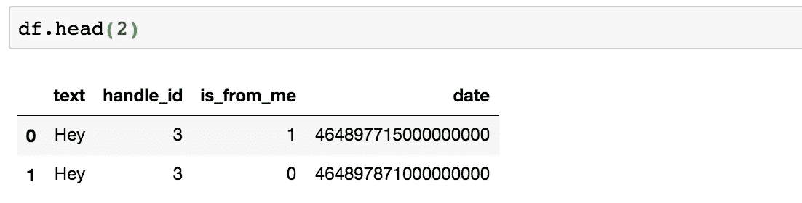
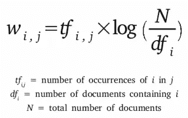
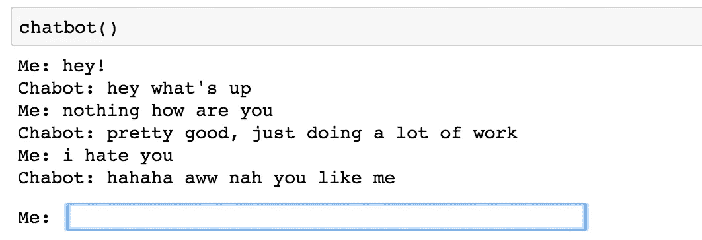
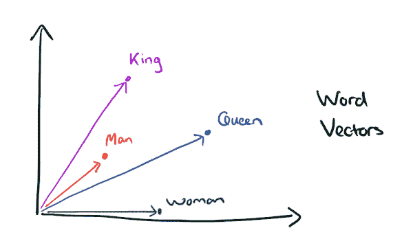
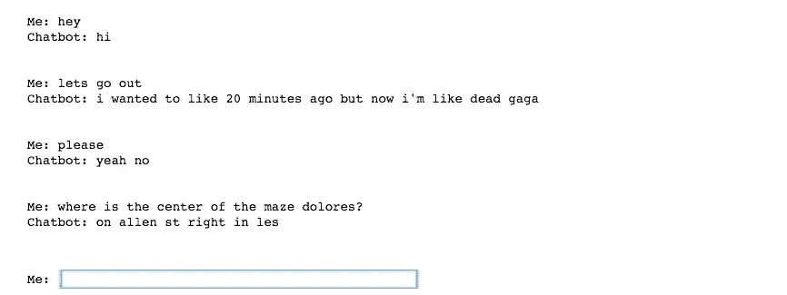

# 如何用你自己的短信建立一个简单、快速、基本上无用的聊天机器人

> 原文：<https://towardsdatascience.com/how-to-build-an-easy-quick-and-essentially-useless-chatbot-using-your-own-text-messages-f2cb8b84c11d?source=collection_archive---------7----------------------->

## 使用 elasticsearch 或 python 中的 Doc2Vec 模型来构建一个简单的、愚蠢的聊天机器人，你可以使用你的文本消息与之交谈(iPhone/macOS)


[Source](https://www.google.com/url?sa=i&rct=j&q=&esrc=s&source=images&cd=&cad=rja&uact=8&ved=2ahUKEwifrfPypvXbAhXuzVkKHZIxAtwQjRx6BAgBEAU&url=https%3A%2F%2Fnews.avclub.com%2Fsomebody-entered-rick-and-morty-s-pass-the-butter-rob-1798262493&psig=AOvVaw3GuiyWeHVTU0M9a3fHOzNv&ust=1530239069052435)

*目前特定于 iPhone 和 macOS

对于那些熟悉数据科学的人来说，该领域最大的挑战之一是获取不差的训练数据。拥有可靠的“基础事实”例子是好的机器学习的燃料。特别是对于像自然语言处理(NLP)这样的任务，机器需要大量数据来学习良好的单词上下文、标签或一般的“理解”。

嗯，作为人类，我们一直在生成训练数据——对于一个对话机器人来说，还有什么比你自己的短信更好的训练数据呢？在这篇文章中，我将向你展示如何使用 python 和你自己的文本消息来构建一个非常简单、容易并且不太成功的聊天机器人。

更复杂和先进的聊天机器人可能有一个架构，涉及实体识别，意图识别，某种定制的响应数据库，一些 LSTMs 撒在那里等等…但我不会去任何一个。如果你想从头开始构建一个面向商业的聊天机器人来提供好的信息和回答问题，试试类似[拉莎·NLU](https://github.com/RasaHQ/rasa_nlu)的东西。如果你只是想找点乐子，那就继续读吧！

***重要***——对你的文本进行分析很有趣，但要注意其中的信息。我们将使用的模型将永远可以访问来自您的朋友、醉酒之夜、爱人、杀手、父母、毒贩等的信息。不要将您的模型、数据或敏感结果发布到任何地方，以便有人可以访问您的信息。这不安全，而且对你的朋友来说这是一个愚蠢的举动。记住这一点，让我们开始深入研究。

# 这篇文章有两条途径

因此，有很多简单的方法来制作一个无用的聊天机器人，但你应该用哪种方法取决于你的数据。我将概述两种方法，并随时尝试这两种方法；然而，你选择哪一个取决于你拥有的短信数据的*量*。在一般的准备步骤之后，帖子将会被拆分。

1.  Elasticsearch(基本上是 TF-IDF)——如果你**没有太多数据**就选择这个选项。这种方法更加基于关键字，并且不需要机器学习上下文
2.  Doc2Vec —如果您**有很多数据**，请选择此选项。这个模型需要大量的数据来学习单词，所以如果没有很多文本，它就不能很好地工作。

作为参考，我有大约 100k 的短信，第二个选项仍然不起作用*太好了*，但请随意查看哪个最适合您。他们都很有趣，看看你能得到什么。

# 一般准备

首先，你应该已经安装了 python(并且肯定有一些使用它的经验)。如果你没有安装 anaconda ,我推荐你安装[,但是我不会介绍任何基础知识。我将在一个 jupyter 笔记本(一个让你运行代码块的 python 笔记本)中工作，但是你可以做任何你喜欢的事情。我将在 Python 2 中工作(但在 3 中应该也可以)。](https://www.anaconda.com/download/#macos)

在这篇文章的相应部分，我将详细介绍每个选项的包。您的 python 版本应该已经安装了我们一开始需要的`sqlite3`和`pandas`包。

在我们获取数据之前，只需将你的 iPhone 插入你的 Mac，这样就可以备份到最新的数据。你需要尽可能多的数据来改进机器人。完成所有这些后，让我们开始编码。首先让我们创建一个项目目录。我是这样做的:

```
mkdir -p ~/Documents/textbot
```

然后，我们接下来需要将数据放在一个更容易的地方。你电脑上的位置应该和我的一样。你所有备份的 iPhone 数据都应该在`~/Library/Application Support/MobileSync/Backup`。知道了这一点，让我们将数据库文件和我们的文本复制到一个不那么荒谬的位置，而不是你在下面看到的那条可怕的路径。在您的终端中键入:

```
cp ~/Library/Application\ Support/MobileSync/Backup/feda86be0cbd2b3150fc151e8b03289e3c117213/3d/3d0d7e5fb2ce288813306e4d4636395e047a3d28 ~/Documents/textbot
```

最后但同样重要的是，让我们进入我们的项目目录并启动 jupyter(或者 python shell，如果您愿意的话)。一旦 jupyter 出现，创建一个新的笔记本。

```
cd ~/Documents/textbot
jupyter notebook
```

# 准备数据

好极了，现在我们要开始学习 python 中有趣的部分了。让我们导入前两个包。`sqlite3`将让我们从数据库文件中读取数据，而`pandas`将让我们将其加载到一个数据帧中，以便于操作。

```
import pandas as pd
import sqlite3
```

这里是我们读入数据的地方。你必须指定绝对路径否则无法工作，所以不能使用`~`。在下面的代码中，将`kylegallatin`改为您的主目录的名称。如果你不知道它是什么，打开一个终端，输入`~`。

```
#replace kylegallatin with your home directory
path = '''/Users/kylegallatin/Documents/textbot/3d0d7e5fb2ce288813306e4d4636395e047a3d28'''db = sqlite3.connect(path)
```

现在，我们可以使用一些基本的 SQL 命令来获取我们需要的数据，并将其加载到 pandas 中进行处理。我们只需要几列，所以我已经指定了它们是什么。`text`是信息本身，`handle_id`是你用整数格式发短信的人，`is_from_me`是一个二进制标志——当它是 1 时，你发送了文本，如果是 0，那么那一行的`handle_id`发送了文本，最后`date`是文本发送的日期。如果你想对你的社交生活方式做更深入的分析，请查看你现有的其他专栏。

```
cursor = db.cursor()
result = cursor.execute('''SELECT text, handle_id, is_from_me, date FROM message''')#load results into a df
df = pd.DataFrame(result.fetchall())
df.columns = ['text','handle_id','is_from_me','date']
```

并检查您是否有:



您应该会看到已备份的最早文本。它应该已经按时间顺序排列了，这是下一部分所必需的。如果你不相信，只需运行`df = df.sort_values(by='date')`来确定。要查看您有多少条消息，您可以运行`len(df)`。

接下来，我们需要开始考虑训练数据。我们这里有大量的消息，但没有真正以对话训练数据的形式出现——它们只是按时间顺序排列的。我们这篇文章的目标是获得一个由两列组成的数据帧:`text`和`response`，这样我们的聊天机器人就有了可以“学习”的例子。

我们不仅需要按人(或`handle_id`)对对话进行分组，更仔细地观察数据会发现，我们可以连续收到同一个人的多条短信，这使得我们很难区分哪些应该是短信，哪些应该是回复。我们需要连接所有同时发生的文本，然后将每个`df['text'][i]`或`text`分配给它的`response`、`df['text'][i+1]`。

下面不是我写过的最晦涩的东西，但是它运行得够快了。请随时提出改进意见。

```
##remove the nulls
df.dropna(subset = ['text'], inplace=True)##helper function
def make_sentences(series):
    return '. '.join(series)##initiliaze empty df
train_data = pd.DataFrame(columns = ['text','response'])##iterate through each convo
for person in pd.unique(df['handle_id']):
    conversation = df[df['handle_id'] == person]
    grouped = (conversation.groupby(conversation.is_from_me.diff()
               .ne(0).cumsum(), as_index=False)
               .agg({'text':make_sentences,'is_from_me':'first',
               'handle_id':'first', 'date':'first'}))

    ##match up texts with responses
    tmp = pd.DataFrame({'text':list(conversation['text'][0:-1]),
                  'response':list(conversation['text'][1:])})

    ##append to our training df
    train_data = train_data.append(tmp[['text','response']], 
                                   ignore_index=True)
```

最后添加最简单的预处理:

```
train_data['text'] = train_data['text'].apply(lambda x: x.lower())
train_data['response'] = train_data['response'].apply(lambda x: x.lower())
```

现在你可能在想“伙计，你忽略了一大堆不同的情况”——你可能是对的。群聊呢？你如何定义一次谈话的开始和结束？这里有很多事情需要考虑，在本教程中我将忽略所有这些。这是一个快速而肮脏的聊天机器人教程，而不是“我必须编写 100 万条 if 语句来创建完美的训练数据”。如果有人想更深入地研究这个问题，我就不必说了，请说吧。

撇开这个障碍不谈，我们现在有了类似训练数据的东西。对于每个`handle_id`，我们现在将每个`text`映射到一个`response`，然后每个`response`成为下一个`text`。有了这种格式的数据，我们现在可以建立一种方法，将我们要对机器人说的话映射回半适当的响应。

# 选项 1:让 Elasticsearch 为您做所有事情

选项 1 在我们的`text`列中使用基于关键字的搜索，使用我们“发送”给机器人的任何内容。通过将我们的文本与其他文本进行比较，我们可以尝试发送适当的响应。

## 弹性搜索和 TF-IDF 只需…3 秒钟

Elasticsearch 是一个可扩展的搜索平台，它使用类似于 TF-IDF 的算法，该算法是词频逆文档频率的标准。


[Source](https://www.google.com/url?sa=i&rct=j&q=&esrc=s&source=images&cd=&cad=rja&uact=8&ved=2ahUKEwi3wLDO0vTbAhWBwVkKHVmiCsgQjRx6BAgBEAU&url=https%3A%2F%2Ftowardsdatascience.com%2Fgetting-started-with-elasticsearch-in-python-c3598e718380&psig=AOvVaw0ZOA6-YClhBdOpBVicklB7&ust=1530216375028069)

本质上，它是一个简单的函数，经常在搜索/相似性空间中使用，根据关键字定位文档。它也不太强调频繁出现的单词。例如，因为单词“the”出现在如此多的文本中，我们不希望它被认为是我们搜索查询的重要部分。TF-IDF 在将您的查询与文档进行比较时会考虑这一点。对于它的基本概述，只需查看维基百科。



[Source](https://www.google.com/url?sa=i&rct=j&q=&esrc=s&source=images&cd=&cad=rja&uact=8&ved=2ahUKEwic6L3k0vTbAhVOwFkKHZZKD7YQjRx6BAgBEAU&url=https%3A%2F%2Fdeeplearning4j.org%2Fbagofwords-tf-idf&psig=AOvVaw3AB8Lk_MHOxMWKOwoYSbRH&ust=1530216484519950\)

我们运行的实际比较将基于余弦相似性。由于 TF-IDF 将对我们的文本进行矢量化，因此我们将它与数据中的“最相似”`text`进行匹配的方式需要基于这一指标。它帮助我们找到在任何大小的向量空间中最接近的向量来表示我们的文档。

## 选项 1 准备

我们也可以使用类似于`sklearn`的包来实现 TF-IDF，但是对于我们的目的来说，elastic 在设置、使用和扩展方面更快/更容易。我们需要两样东西 elasticsearch 本身和它的客户。要安装前者，我们将使用软件包管理器自制软件。如果你还没有，从这里的[安装](https://brew.sh/)。

然后打开一个终端:

```
brew install elasticsearch
pip install elasticsearch
```

现在你已经安装了 elasticsearch，你只需要启动它。自制软件应该已经把它添加到你的路径中了。这个终端命令应该在端口 9200 上启动 elastic。

```
elasticsearch
```

应该就是这样！现在我们可以回到 python 笔记本了。

## 索引和搜索

为了索引并使我们的数据具有弹性，我们可以使用下面的代码。我们首先导入我们的包，然后创建我们的 python 客户机的一个实例。最后，我们用来将数据上传到 elastic 的函数需要字典格式，所以我们将数据帧转换成字典。

我不会深入讨论这个代码/客户端和 elasticsearch，但是在这里我们所做的只是对我们的数据进行了一点处理，并在我们的 elasticsearch 实例上创建了一个名为`textbot`的索引，我们现在可以查询它的信息。

```
from elasticsearch import Elasticsearch
from elasticsearch.helpers import bulkes = Elasticsearch(['localhost:9200'])texts_dict = train_data.to_dict(orient='records')
bulk(es, texts_dict, index='textbot', doc_type='clue', raise_on_error=True)
```

和 dddd 基本就是这样！现在唯一要做的就是创建一个函数来查询我们的数据。

## 选项 1 聊天机器人

下面就是了。我有一个简单的函数，运行一个连续的循环。每次，它都提示用户输入，在我们的数据中搜索最相关的`text`信息，然后从同一行返回`response`。如果响应为`quit()`，程序停止。我们从搜索中得到的`response`变量是由被称为[查询 DSL](https://www.elastic.co/guide/en/elasticsearch/reference/current/_introducing_the_query_language.html) 的语言生成的。你可以用它做很多可笑的事情，但是我还是会根据我们的需要坚持做最基本的事情。

`response`将是一个 json，包含一堆信息，但我们只想要一个值，所以我们只需要获取并打印它！我还引入了一个可以切换的`randomness`变量。这样做的目的是，你不必每次给你的机器人发送“文本”都得到相同的结果，因为结果是按顺序返回的。如果在索引`i`的`text`记录中没有与您发送的查询相匹配的相关内容，那么您将只得到“idk”。

```
from random import randint
randomness = 1def chatbot():
    quit=False
    while quit== False:
        text = str(raw_input('Me: '))
        ##an optional quit command
        if text == 'quit()':
            quit=True
        else:
            response = es.search(index='textbot', doc_type='clue', body={ "query": {
                "match": {
                    "text":text
                }
            }})
            try:
                ##introduce a bit of randomness into the response 
                i = randint(0,randomness)
                print("Chabot: %s" % response['hits']['hits'][i]['_source']['response'])
            except:
                print("Chatbot: idk")
```

Lit，现在你可以试一试了。

`chatbot()`

下面是我在我的机器人上输入一些东西的例子，所以你可以得到我所得到的东西，可以随意使用代码的随机性或其他部分来改进你的查询。



# 选项 2:训练您自己的上下文 Doc2Vec 模型

更有趣但不太可靠的选择基本上基于两种模型:word2vec 和 doc2vec。

## word2vec 和 doc2vec 只需…5 秒钟

要理解 doc2vec，首先需要看一下 word2vec。最初由谷歌的托马斯·米科洛夫领导的研究团队创建，这是一个试图学习单词上下文的模型。对于那些熟悉神经网络的人来说，其架构如下所示。


[Source](https://www.google.com/url?sa=i&rct=j&q=&esrc=s&source=images&cd=&cad=rja&uact=8&ved=2ahUKEwjqt8C90_TbAhUnw1kKHU2xCzoQjRx6BAgBEAU&url=https%3A%2F%2Ftowardsdatascience.com%2Fword2vec-skip-gram-model-part-1-intuition-78614e4d6e0b&psig=AOvVaw2DmHyP-jxAeBV8JivYx-Kn&ust=1530216676036317)

它是一个浅层神经网络，以文本作为训练数据。本质上，它通过迭代试图预测一个单词子集出现在给定单词附近的概率，或者一个单词出现在给定的一个相邻单词窗口中的概率(取决于您使用的架构)。每一次尝试，你都要更新隐藏层中每个单词的权重。最后，你丢弃预测*，但保留隐藏层*的权重。给定足够的文本输入，这些权重应该在某种程度上代表单词的上下文。相似的单词应该具有相似的权重向量，然后可以通过余弦相似度进行比较。想了解更多关于 word2vec [的信息，这位老兄有一篇很棒的文章](http://mccormickml.com/2016/04/19/word2vec-tutorial-the-skip-gram-model/)。

Doc2vec 非常类似，你只是有另一个输入，即句子或完整的文本块，而不是单词。此外，不像 word2vec 那样丢弃谓词，这里我们可以选择评估标签。在 word2vec 中，每个单词都已经是它自己的实体，所以不需要这样做。在 doc2vec 中，我们有包含多个实体的句子或段落，所以我们可以给这些组贴上标签进行分类。

就像选项 1 一样，我们这样做的方式是余弦相似性。由于 doc2vec 将为我们发送的 bot 文本提供权重，并对其进行矢量化，因此我们将它与数据中的“最相似”`text`进行匹配的方式需要基于这一度量。它帮助我们找到在任何大小的向量空间中最接近的向量来表示我们的文档。下图应该完美地解释了所有技术上的东西。



[Source](https://www.google.com/url?sa=i&rct=j&q=&esrc=s&source=images&cd=&cad=rja&uact=8&ved=2ahUKEwim66Gm0fTbAhUlwFkKHd-pB8MQjRx6BAgBEAU&url=https%3A%2F%2Fblog.acolyer.org%2F2016%2F04%2F21%2Fthe-amazing-power-of-word-vectors%2F&psig=AOvVaw2bMrmv66FULeilCJ0iBKuh&ust=1530216084081260)

要阅读更多关于 doc2vec 的内容，请查看本文。

## 选项 2 准备

让数学和理论见鬼去吧！让我们编码这个东西。

我们将使用`gensim`，这是一个很容易使用最初由 google 发布的 word2vec 和 doc2vec 包的包。它很容易通过命令行上的`pip`安装。

```
pip install gensim
```

## 训练你自己的 Doc2Vec 模型

首先，我们需要定义如何将数据输入到模型中。到目前为止，我甚至还没有意识到我正在使用的内存，因为我只有 10 万条文本，而且真的没有*那么多数据。然而，在这里，通过迭代器一次一句地将数据输入模型是一种很好的做法。*

```
import gensim
from gensim.models.doc2vec import Doc2Vec, TaggedDocument
from gensim.utils import simple_preprocess
import multiprocessing
import osclass MyTexts(object):
    def __iter__(self):
        for i in range(len(train_data)):
            yield TaggedDocument(words=simple_preprocess(train_data['text'][i]), tags=[i])
```

`simple_preprocess`函数只是做一些简单的事情，比如将文本小写以使其标准化。这里最关键的是标签——我将其设置为`[i]`,而不是实际的`response`。虽然你可以做后者，这也是更友好的内存，所以我们将继续这样做，并在稍后处理响应。

该训练模型了！

```
%%timeassert gensim.models.doc2vec.FAST_VERSION > -1print('Doin cool math stuff...')
cores = multiprocessing.cpu_count()texts = MyTexts()
doc2vec_model = Doc2Vec(size=200, workers=cores)
doc2vec_model.build_vocab(texts)
doc2vec_model.train(texts, total_examples=doc2vec_model.corpus_count, epochs=15)if not os.path.exists('models'):
    os.makedirs('models')
    doc2vec_model.save('models/doc2vec.model')
else:
    doc2vec_model.save('models/doc2vec.model')
print('And we did it!')
```

`%%time`jupyter 细胞只是时间，所以如果你在壳或其他东西里，就把它取出来。断言语句确保我们有 c 编译器，以便它快速训练，并且设置模型在所有内核上训练确保它甚至更快。然后，我们用大多数默认参数初始化我们的模型。200 只是我们将得到的单词向量的大小——您可以随意更改所有其他调优参数！我们用`build_vocab`函数让 doc2vec 访问我们的单词库，然后在我们的`texts`上训练模型 15 个时期或迭代。`os`包只是让我们创建一个目录来保存我们的模型供以后使用。

就是这样！鉴于我的数据/计算机的大小，我的只花了 2 分钟，我想你的也差不多。但是——我们怎么知道 doc2vec 做了它应该做的事情？

## 健全性检查

word2vec 和 doc2vec 都带有一个方便的余弦相似度函数，用于检查我们的 200 维空间中单词之间的“距离”。让我们检查一两个词。

```
doc2vec_model.most_similar(['hey'])[0:2]
```

我从*我的*短信中得到什么？

```
[(u'hi', 0.588394045829773), (u'yo', 0.5450516939163208)]
```

毒品。如果你的结果看起来不一样，不要气馁——没有足够的训练数据，你一定会看到一些奇怪的结果。老实说，看看你的模型从你和你朋友的对话中学到了什么，这很有趣。

```
doc2vec_model.most_similar(['drinks'])[0:2]
```

给了我:

```
[(u'beers', 0.8393490314483643), (u'lunch', 0.736896276473999)]
```

看起来我有在工作时间喝酒的倾向。更准确地说，看起来“饮料”、“啤酒”和“午餐”在我的对话中都是类似的用法。这是有道理的，考虑到我可能会说“让我们去喝杯啤酒”，就像我说“让我们去吃顿午饭”一样。你拥有的数据越多，这些词向量就越有可能彼此远离，更多的同义词就会取代它们的位置。

## 选项 2 聊天机器人

在这一点上，我们是在容易的部分。我们只需要创建一个简单的函数，它接受一个输入，将其标记化，得到最相似的`text`，并返回适当的`response`。由于我们的模型可能还没有看到我们可能扔给它的所有输入，我们将使用`infer_vector`函数向我们的聊天机器人矢量化我们的文本。

```
##quick and dirty chatbot function
def chatbot():
    quit=False
    while quit == False:
        text = str(raw_input('Me: '))
        ##an optional quit command
        if text == 'quit()':
            quit=True
        else:
            tokens = text.split()
            ##infer vector for text the model may not have seen
            new_vector = doc2vec_model.infer_vector(tokens)
            ##find the most similar [i] tags
            index = doc2vec_model.docvecs.most_similar([new_vector], topn = 10)
            print('Chatbot: ' + train_data.iloc[index[0][0],1])
            print('\n')
```

现在运行你的聊天机器人，和它说话！根据你的对话，看看你得到的所有奇怪的回答。

```
chatbot()
```



仅此而已！如果我错过了什么，或者你有什么意见，尽管讨厌。这是我的第一个帖子，还在琢磨。希望你喜欢。