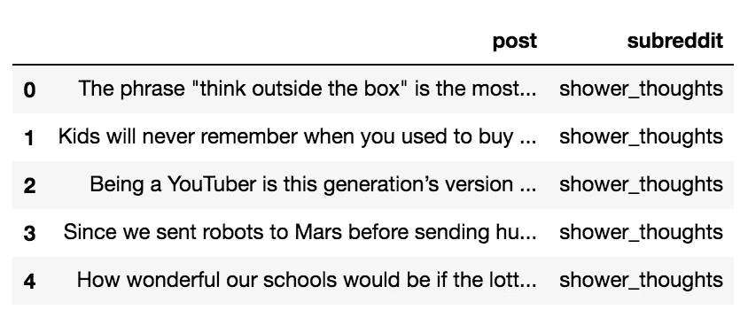
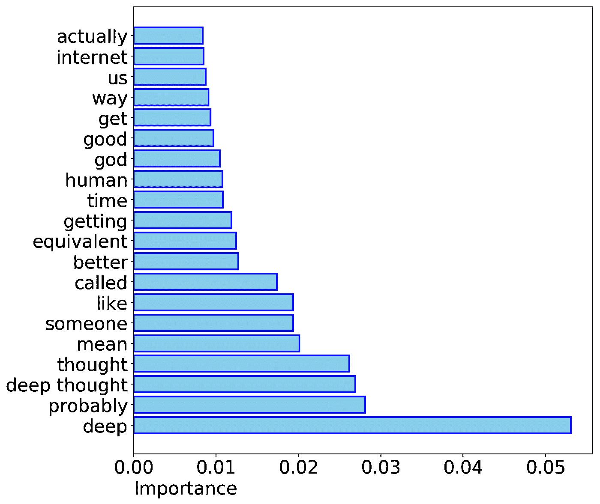

# 对 Reddit 帖子内容进行分类的引擎:自然语言处理的应用

> 原文：<https://towardsdatascience.com/how-to-build-an-engine-that-classifies-the-content-of-a-reddit-post-an-application-of-natural-6306cfe94742?source=collection_archive---------9----------------------->

“white text on black background” by [Lauren Peng](https://unsplash.com/@laurenpengg96?utm_source=medium&utm_medium=referral) on [Unsplash](https://unsplash.com?utm_source=medium&utm_medium=referral)

在我发表了关于[自然语言处理](/how-machines-understand-our-language-an-introduction-to-natural-language-processing-4ab4bcd47d05)和[决策树](/decision-tree-an-algorithm-that-works-like-the-human-brain-8bc0652f1fc6)的博文之后，我认为谈论 NLP 和随机森林的具体应用是个好主意，特别是关于我最近参与的一个项目。

# 1.定义问题

本主题的目的是从两个不同的子编辑中收集帖子，并且仅通过分析帖子的文本，建立一个能够对哪些帖子属于哪个子编辑进行分类的模型。我决定挑战自己，挑选两个彼此没有太大区别(但也很搞笑)的子主题:淋浴思想和深刻的哲学。想想看:如果你分析科学与艺术，这两个子主题的关键词可能会非常不同，模型将很容易识别哪个帖子属于哪个页面。然而，淋浴的想法和深刻的哲学之间有很多重叠。为了让你有个概念，这里有两个这样的帖子的例子:

> “你永远不会意识到你咀嚼食物用了多大的力量，直到你咬下嘴唇。”
> 
> “如果我克隆自己，它杀了我，这是谋杀还是自杀？我需要在周二之前知道。”

你能猜出哪个帖子属于哪个子编辑吗？

除了算法本身，这个项目还包含另一个对数据科学家来说常见的巨大挑战:收集数据！**没错，这次没有*。csv* 文件与**一起工作。

# 2.收集数据

定义问题后，我们数据科学流程的下一步是收集数据！足够幸运的是，一旦我们有了想要抓取的 Reddit 页面的 url，如果我们添加*。json* 在 url 的末尾，我们将可以访问到 [json 格式](http://www.json.org/)下的页面内容。对于那些不熟悉这种格式的人来说，它类似于 Python 字典。开始的时候可能会有点乱，但是经过一些尝试和错误，你可以找出关键，提取你需要的数据是相当容易的！

每次我们 ping Reddit 服务器，我们将可以访问 25 个帖子，但这当然远远不足以解决我们的问题，这意味着我们必须 ping 服务器几次，以便收集相关数量的帖子。我们还必须对代码进行一些更改，以便正确地执行此操作。我们必须改变我们的`User-agent`并改变一个名为`after`的参数，这样我们就不会每次尝试都刮到相同的 25 个帖子！这样，我们就可以在每次获取新数据时，向下移动页面，收集不同的 Reddit 帖子。的。Reddit 给我们的 json 文件包含了**很多关于页面的**信息，经过初步探索，我注意到实际的帖子包含在`[data][children]`键下，如下面代码的第 41 行所示。

上面的代码从 Reddit 页面返回一个子对象列表。然而，为了找到它，必须进行一些数据探索和清理，然后确保每个帖子的内容不会分成两个字段。下面的 Python 代码将查找并清理数据。

这是淋浴思想 subreddit 的前几行。

现在，我们将不得不对第二个子编辑页重新做一遍，并将这些观察结果附加到我们的数据帧中。一旦我们收集了足够的数据(就我而言，超过 2000 篇帖子)，就该进行下一步了！

# 3.清理和准备数据

幸运的是，我提取的数据非常干净。然而，我想最终将自然语言处理(NLP)技术应用于这些数据。在此之前，我通过删除标点符号、停用词和最有可能是网页中 unicode 残余的字符来清理数据。我利用 scikit-learn 的`feature_extraction`模块来帮助清理这些数据。还得定义我的 Y 变量，建模时要预测的变量。我选择“淋浴思想”的值为 1，选择“深层哲学”的值为 0。

当把文本转换成计算机可以解释的变量时，我们通常会做一些叫做“矢量化”的事情。一种简单的矢量器称为“计数矢量器”。这是一个频率计数器，计算一个单词在帖子中出现的次数。例如，如果一篇文章包含单词“thinking”三次，那么我的 CountVectorizer 将创建一个名为“thinking”的变量，这篇文章在该列中的值为 3。对于每一篇帖子，该算法会计算单词“thinking”被看到的次数，并将该数字放入该列。因此,“思考”列将是一个大的数字列表，它计算每个帖子中出现“思考”的次数。对于我的项目，我使用了一个不同的矢量器，叫做“TFIDFVectorizer”它以稍微复杂一点的方式统计我们的单词:在这种情况下，矢量器不仅统计一个单词在每个帖子中出现的次数，还考虑该单词在整个语料库(即帖子集合)中的重要性。实际上，我尝试了这两种方法，发现我的模型在 TFIDFVectorizer 和 CountVectorizer 上的表现大致相同。

现在我们有了训练和测试数据，是时候建模了！

# 4.建模

当完成一个二元分类问题时，有许多方法可以衡量它的表现。可视化这个模型性能的一种方法是通过混淆矩阵，它将显示我的模型生成了多少真阳性、真阴性、假阳性和假阴性。

在我的模型中:

*   一个真正的肯定是一个预测来自淋浴思想子编辑的帖子，并且确实来自淋浴思想子编辑。
*   一个真正的否定是一个预测来自深层哲学子编辑的帖子，并且确实来自深层哲学子编辑。
*   误报是一个预测来自我的淋浴思想子编辑的帖子，但实际上来自深层哲学子编辑。
*   假阴性是一个预测来自深层哲学子编辑的帖子，但实际上来自淋浴思想子编辑。

在这种情况下，假阳性和假阴性一样糟糕。因为它们同样糟糕，所以我想建立一个模型，使我的准确率尽可能高。

在训练和测试不同的模型之前，我定义了一个函数来打印我的测试集的分类矩阵，并将真/假阳性/阴性分配给变量。由于我计划尝试几个不同的模型，这个函数在评估每个模型的表现时就派上了用场！

我测试了逻辑回归模型、高斯朴素贝叶斯模型、多项式朴素贝叶斯模型和随机森林模型。当根据我的测试集进行测量时，随机森林模型显示出最少的过度拟合和最好的整体性能。然后，我决定在各种超参数上实现 GridSearch，看看能否提高基本随机森林模型的性能。

。有了这两个非常密切相关的子数据集，我的最佳随机森林模型在测试集上有 84%的准确率。(对于一个刚学了六周的人来说，这已经不错了！).是的，它花了**很多**的调整，这个模型仍然稍微超出了我的训练数据，但这与我开始的地方相比绝对是一个进步。

下面，您将看到一个功能重要性图。这个图直观地显示了每个术语在分类一篇文章所属的子主题中的重要性。“深刻的”和“深刻的思考”是两个最重要的术语，但是“可能”和“意思”在预测某件事是哲学的还是只是一个随机的想法方面出奇的好！

Top 20 most important features of the Random Forest Classifier

> 注意:作为一个随机森林分类器，`Importance`被定义为集合中所有树的平均节点杂质(通过到达该节点的概率加权)的总减少量。如果你想了解更多关于节点杂质的知识，可以看看[我关于决策树](/decision-tree-an-algorithm-that-works-like-the-human-brain-8bc0652f1fc6)的博文。

# 5.回答问题

任务完成了！我不确定为什么一家公司想要实现这种预测子数据集的特定模型，但是这种类型的模型在现实世界中有很多应用。例如，电子邮件服务想要检测垃圾邮件，或者公司可能想要尝试检测垃圾评论。这个问题可以用这种方法解决。如果我在一家试图检测垃圾邮件和合法评论的公司工作，我会和一个团队一起将这个模型投入生产并自动过滤评论。

请随意查看:

[我的其他中帖。](https://medium.com/@emmagrimaldi)

我的 LinkedIn 个人资料。