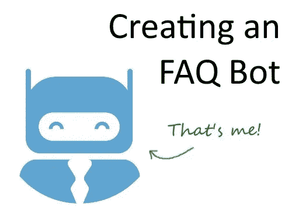

# 如何用 API 构建 FAQ 聊天机器人？使用 Node.js 和 PHP 的人工智能

> 原文：<https://towardsdatascience.com/how-to-build-an-faq-chatbot-with-api-ai-using-node-js-a802aff53e6a?source=collection_archive---------1----------------------->

在[通用聊天](https://universalchat.org)中，我们实现了一个聊天机器人，任何人都可以毫不费力地训练它。逻辑很简单；只要给它你的问题和答案，机器人就会回复任何提出类似问题的顾客。

在本文中，我将向您展示我们是如何做到这一点的，这样您也可以这样做。

# 框架的选择

首先，我测试了许多不同的机器学习框架——Wit。AI，微软认知服务，我瞄了一眼 Luis……对我来说，原来是 API。AI 是正确的选择。它是完全免费的，有很好的响应率，它有一个很好的开发用户界面，并且很容易设置、开始使用和扩展。

我不打算进行 Api.ai 开发，因为那里的文档已经很棒了。Node.js SDK 只有一个缺点；涉及开发人员令牌的方法都没有实现。所以，我创造了[我自己的叉子](https://github.com/davidniki02/apiai-nodejs-client)来解决这个问题。随意克隆和使用它。

## 独特的问题和解决方案

当您构建一个将被许多用户使用的服务时，您希望确保信息不会重叠。例如，一个用户可能会提出一个问题，比如“哪个 ML 框架是最好的？”并将答案设置为“Api.ai ”,而另一个用户可能会将“Wit.ai”作为答案。机器人应该理解哪个用户正在被询问，并返回相应的答案。

为了解决这个问题，我们使用了上下文变量——通过定义上下文，我们可以在一个单独的线程上为每个用户和她的客户端分离答案。

# 让用户创建他们自己的常见问题

Api.ai 非常聪明——将它变成一个对话代理只是添加新的意图并定义机器人的响应。您还可以通过从 Api.ai 库中导入现成的模板来丰富体验，这会让您在自己的领域中占得先机。

要创建新的意图，你需要我之前提到的 [github fork](https://github.com/davidniki02/apiai-nodejs-client) 。

在我们开始之前还有一个问题。聊天机器人不会一直准确无误。当这种情况发生时，我们需要一种后退的方法。

在[通用聊天中，](https://universalchat.org)我们用两种方式来处理这个问题:

1.  对于每个回答，我们允许访问者升级到一个实时操作员。当访问者这样做时，我们也会记录他们提出的问题，以便以后可以将正确答案添加到数据库中
2.  有时 Api.ai 找不到答案，在这种情况下，它会返回“input.unknown”结果。这是另一个需要注意和创造问题的地方

所以，现在我们有了所有的原料；

*   Api.ai 作为机器学习框架
*   可以正确创建新意图的 Node.js 分支
*   如何构建它的路线图

让我们开始吧。我不会详细讨论你在网上其他地方可以找到的问题，但是我会向你展示我们上面讨论的两个主要问题:使用上下文调用和创建意图。

## 在上下文中调用

我们将创建这个方法来查询 Api.ai:

> 函数 ask(text，options){
> let apiaiRequest = apiai . text request(text，options)；
> 
> apiaiRequest.on('response '，(response)= > { console . log(response)；})
> 
> apiaiRequest.on('error '，(error)= > { console . log(error)；});
> 
> apiairequest . end()；
> }

然后，您可以这样查询它:

> 询问('某个问题'，{
> sessionId:'某个会话的某个唯一 Id '，
> 上下文:[{名称:'用户 1' }]
> }

仅此而已。用更有用的代码替换 console.log 代码。在 github 中，我展示了如何使用 promises 来重写上述内容，以获得更干净的替代方案。

## 创造新的意图

要创建新的意图，请使用 POST 方法。同样，所有这些都是有据可查的，所以我们只讨论新的内容:

> 函数 create intent(options){
> return new Promise((resolve，reject)=>{
> let request = app . intentpostrequest(options)；
> 
> request.on('response '，(response)= > { return resolve(response)；});
> 
> request.on('error '，(error)= > { return reject(error)；});
> 
> request . end()；
> })
> }

现在，像这样调用它:

> var opts = {"name": " <the new="" question="">"，
> "auto": true，
> "templates": [" <新问题> " ]，
> "contexts": [' <上下文> ' ]，
> " user says ":[
> { " data ":[{ " text ":<新问题> "} ]，" isTemplate": false，" count": 0 }]，</the> 
> 
> 创建意图(opts)

需要注意的重要事项:

*   不要忘记**auto:true**——否则你将无法从机器学习的魔力中获益
*   你可能已经注意到我用了几次“新问题”——没关系，它很有效
*   您还注意到，我们在这里包含了上下文—保证问题和答案被保存起来，并分别提供给每个客户

## 奖金；用 PHP SDK 创建意图

如果你已经建立了一个网站来管理这些东西，你可以使用 PHP SDK。同样，最初的那个也不支持创建意图，所以我们在[这个分支](https://github.com/davidniki02/api-ai-php)中添加了它。Readme.md 中有一个不言自明的例子，所以我不会在这里打扰你。

# 结论

现代机器学习框架使得建立对话代理变得非常容易——你刚刚在不到 4 分钟的时间里见证了一个对话代理。只是一定要引入适当的回退，以便在遇到更难的查询时拯救机器人的皮肤。